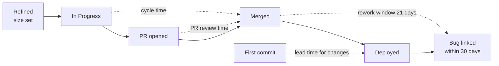

# 13.1 · Delivery metrics

## Why it matters

"Did the agents help?" has no answer until you say *help what*. Module 7 measured the agent system on a fixed task set that you controlled. From here on you measure an engineering organization: real tickets, real reviewers, real incidents, a task mix you do not control and work you cannot rerun. The first decision — which number, with which start and stop events — determines the story before any statistics happen.

Two numbers from the same survey show how much the choice matters. DORA's 2024 report found that a 25% increase in AI adoption was associated with a 7.5% increase in documentation quality and a 3.1% increase in code review speed, but also with a 1.5% decrease in delivery throughput and a 7.2% decrease in delivery stability. The report's leading hypothesis is batch size: AI makes it easy to produce more code per change, and larger changes fail more often. Measure review speed and you have a win; measure change failures and you have a loss. Both are true.

Your `NOTES.md` from [05.4](../module-05/lesson-04.md) already holds minutes, defects, rework and resets for a dozen tickets. This lesson turns those columns into definitions a team can agree on and a skeptic cannot reinterpret.

> [!NOTE]
> Content tags. **Concept** (stable): metric definitions, clock events, skewed distributions, the log scale, quality-adjusted throughput, cost per successful task. **Implementation**: `ImpactStats describe` and `import-gh`, the T-SQL example, the `gh` CLI export.

## How it works

### Four families, and why you need more than one

| Family | Metrics | What it tells you | What it hides |
|---|---|---|---|
| Flow | cycle time, lead time for changes, PR review time | how long work waits and moves | whether the result was any good |
| Quality | rework, escaped defects, change fail rate, deployment rework rate | what the speed cost later | when the cost appears (weeks after the merge) |
| Volume | throughput (tickets per week), deployment frequency | how much got done | ticket size and splitting |
| Economics | human effort, agent spend, cost per successful task | whether it pays | nothing, if the denominator is honest |

DORA's guide now lists **five** software delivery metrics in two groups. *Throughput*: change lead time (commit to production), deployment frequency, and failed deployment recovery time. *Instability*: change fail rate (deployments that need immediate intervention) and deployment rework rate (unplanned deployments caused by a production incident). The SPACE framework (Forsgren et al.) makes the same point from the developer side: productivity cannot be captured by one metric or one dimension, so pick several across satisfaction, performance, activity, communication and efficiency, and never let an activity count stand alone.

**Rule for this module:** every speed metric travels with at least one quality guardrail, and no metric may be one the treatment moves *without the work changing*. Lines changed, number of PRs and suggestions accepted all fail that test: an agent inflates them by construction.

### Clocks have start and stop events

A duration metric is only defined when both events are named.



- **Cycle time**: In Progress → merged. The clock starts when a person commits to the ticket, before the way of working can influence anything.
- **PR review time**: PR opened → merged. Useful for the review queue; dangerous for comparisons, because *when* a PR is opened depends on how the work was done.
- **Lead time for changes** (DORA): commit → running in production.
- **Rework**: fix commits on the same files within a window after merge (21 days here). **Escaped defect**: a bug traced to the ticket within 30 days of deployment. Both need the window to close before you count.

### Durations are skewed: medians, percentiles and the log scale

*Intuition.* Most tickets take a few hours; a few take days because someone waited on a DBA, a flaky test or a vacation. The mean is dragged by those few, so it describes no actual ticket.

*Equation.* The geometric mean is the mean on the log scale, transformed back:

$$\text{GM}(x) = \exp\Big(\frac{1}{n}\sum_i \ln x_i\Big) \qquad \text{ratio} = \frac{\text{GM}(\text{treatment})}{\text{GM}(\text{control})}$$

*Tiny example.* Four tickets of 2, 4, 8 and 50 hours: mean 16 h, median 6 h, geometric mean $\exp((0.69 + 1.39 + 2.08 + 3.91)/4) = \exp(2.02) = 7.5$ h. The 50-hour ticket triples the mean and barely moves the other two.

*Implementation.* `ImpactStats describe` prints median, p25, p75, p90, mean, geometric mean and max per group; `compare` works on the log scale and reports the ratio of geometric means.

*Interpretation.* On the log scale, "the agent multiplies cycle time by 0.85" is one number that means the same for a 5-hour and a 50-hour ticket. That is why Module 13 reports **ratios** ("−16%"), not hour differences. Report medians and p90 to people; analyze on the log scale.

### Quality-adjusted throughput and cost per successful task

*Intuition.* A ticket that ships fast and comes back as an incident was not a success. Count only work that met a quality bar, and divide total cost by that count — the same move as cost per *passing* trial in [07.5](../module-07/lesson-05.md) and expected cost per task in [10.3](../module-10/lesson-03.md).

*Equation.* With $h$ human hours, loaded rate $r$, agent and tooling spend $S$, and $k$ tickets meeting the bar:

$$\text{cost per successful task} = \frac{h \cdot r + S}{k}$$

*Tiny example.* One month, 40 tickets each way, $95/h. Without the agent: 40 × 14 h × 95 = $53,200; 34 tickets meet the bar ("merged, no rework commit in 21 days, no escaped defect in 30") → **$1,565** per successful task. With the agent: 40 × 12 h × 95 = $45,600 plus $1,800 agent spend = $47,400; 30 meet the bar → **$1,580**. Fourteen percent fewer hours, the same cost per successful task.

*Interpretation.* Speed that is paid back in rework is not a gain. Agent spend belongs in the numerator; if your organization routes model traffic through a gateway, that is where per-team spend comes from ([12.2](../module-12/lesson-02.md)).

## Show me

The illustrative Contoso data set `labs/module-13/data/contoso-randomized.csv` (96 tickets, arms randomized; simulated, not a measurement):

```text
$ dotnet run --project tools/ImpactStats -- describe data/contoso-randomized.csv --metric cycle_hours --by size
contoso-randomized.csv: 96 rows, metric cycle_hours, arm column assigned, by size
group                 n   median     p25     p75     p90     mean  geomean     max
L / ai                8     39.8    33.0    42.6    54.1     39.5     37.2    66.1
L / manual            8     47.0    43.3    58.3   109.7     64.8     56.3   170.0
M / ai               20     15.6    12.2    16.9    18.2     15.6     15.1    30.1
M / manual           20     16.2    15.2    18.8    22.1     17.1     16.7    28.1
S / ai               20      4.9     3.5     5.3     6.7      4.7      4.5     7.3
S / manual           20      5.0     4.2     6.1     8.2      5.5      5.2    11.2
```

Read the L/manual row: median 47 h, mean 64.8 h, max 170 h. One ticket blocked for five days on a DBA sign-off moves the mean by 15 hours; the median and geometric mean barely notice. Notice too that size explains far more of the variation (5 h vs 16 h vs 47 h) than the arm does — a fact that will matter in 13.3.

If your tracker's history lands in SQL Server (many Jira and Azure DevOps shops sync it for reporting), cycle time per size is one query. This one uses calendar hours; the illustrative data uses working hours — pick one and write it in the metric dictionary.

```sql
WITH starts AS (
    SELECT TicketKey, MIN(ChangedAt) AS StartedAt
    FROM dbo.TicketStatusHistory WHERE ToStatus = N'In Progress' GROUP BY TicketKey),
ends AS (
    SELECT TicketKey, MAX(ChangedAt) AS MergedAt
    FROM dbo.TicketStatusHistory WHERE ToStatus = N'Done' GROUP BY TicketKey)
SELECT DISTINCT t.Size,
    COUNT(*) OVER (PARTITION BY t.Size) AS Tickets,
    PERCENTILE_CONT(0.5) WITHIN GROUP (ORDER BY DATEDIFF(MINUTE, s.StartedAt, e.MergedAt) / 60.0)
        OVER (PARTITION BY t.Size) AS MedianHours,
    PERCENTILE_CONT(0.9) WITHIN GROUP (ORDER BY DATEDIFF(MINUTE, s.StartedAt, e.MergedAt) / 60.0)
        OVER (PARTITION BY t.Size) AS P90Hours
FROM starts s
JOIN ends e ON e.TicketKey = s.TicketKey
JOIN dbo.Ticket t ON t.TicketKey = s.TicketKey
WHERE e.MergedAt >= '2026-07-01';
```

## Try it

Budget: 90 minutes.

1. Copy the [metrics template](../../templates/metrics.md) to `method-notes/metrics.md`. Fill it for your team: at least cycle time, PR review time, rework, escaped defects and throughput, each with start event, stop event, source and the guardrail it travels with.
2. Run `describe` on both Contoso files (`--by size`). For each file, write one sentence on why the mean and the median disagree.
3. Export your own merged PRs with `gh pr list --state merged --limit 500 --json number,title,createdAt,mergedAt,additions,deletions,labels > prs.json`, then `import-gh prs.json > prs.csv`. Compute the median and p90 of `open_to_merge_hours` in a spreadsheet. Strip titles before committing anything.
4. From your Module 5 `NOTES.md` (6 tickets × 2 arms), compute cost per successful task for each arm with your own quality bar. Write down which tickets fail the bar and why.

<details>
<summary>Hint: step 4 with only six tickets</summary>

Do the arithmetic anyway and write the sample size next to it. With 6 tickets per arm, one reopened ticket moves "meets the bar" by 17 points, so this is practice with the formula, not a finding. The point is to see whether the conclusion changes when you divide by successful tickets instead of all tickets.
</details>

## Break it

The platform team's dashboard tile reads: **"AI-assisted PRs merge 54% faster (PR opened → merged)."** You can reproduce the same effect on the randomized Contoso data, where the true effect on cycle time is known to be a 15% reduction:

```text
$ dotnet run --project tools/ImpactStats -- compare data/contoso-randomized.csv --metric review_hours --strata size
...
stratified ratio of geometric means B/A: 0.512 (-49%), bootstrap 95% CI [0.449, 0.581] = [-55%, -42%]
permutation test (10000 shuffles within size, seed 14): two-sided p = 0.0001
```

A tight interval, a tiny p-value, randomized arms. Before reading on: is "49% faster" a fair description of what the agent did?

## Fix it

**Diagnose.** Look at the part of the ticket *before* the PR clock starts:

```text
$ dotnet run --project tools/ImpactStats -- compare data/contoso-randomized.csv --metric hours_to_pr --strata size
stratified ratio of geometric means B/A: 1.353 (+35%), bootstrap 95% CI [1.155, 1.575] = [+15%, +57%]
```

With the agent, developers spend 35% *longer* before opening the PR: they iterate locally with the agent and open the PR when the work is nearly done, while without it they open a draft early and keep pushing. The PR clock starts at a moment the treatment itself moves. It measures a shift of work across the start line, not a speed-up.

**Modify.** Redefine the primary speed metric as cycle time, In Progress → merged, which starts before the way of working can act. Keep PR review time as a *secondary* metric for the review queue, labelled "not comparable across ways of working". Add a line to `metrics.md`: *"A comparison metric's clock must start before the treatment can influence it."*

**Rerun.**

```text
$ dotnet run --project tools/ImpactStats -- compare data/contoso-randomized.csv --metric cycle_hours --strata size
stratified ratio of geometric means B/A: 0.844 (-16%), bootstrap 95% CI [0.748, 0.948] = [-25%, -5%]
```

Sixteen percent, not 49%. Still a real, useful effect, and one you can defend.

<details>
<summary>Solution notes: the same trap in other clothes</summary>

"Time from first commit to merge" (agents often commit once at the end), "time in code review" when agent PRs skip the draft stage, "time to first review comment" when an AI reviewer comments first. In each case ask: *can the treatment move the start event?* If yes, the metric is a description of workflow, not an outcome. The dashboard tile has a second problem too — the `ai-assisted` label is chosen by the author — which is the subject of 13.3.
</details>

## How do I know it works?

- [ ] `metrics.md` names a start and a stop event for every duration, and a guardrail for every speed metric.
- [ ] No metric in your dictionary is an activity count the agent inflates by construction (lines, PRs, accepted suggestions).
- [ ] Your summaries report median and p90, and your comparisons report a ratio of geometric means.
- [ ] You computed cost per successful task for both arms of your `NOTES.md` data, with the quality bar written down.
- [ ] You can explain in one sentence why the PR clock showed −49% while cycle time showed −16%.

## Use / don't use

**Use** cycle time from In Progress as the default speed metric; escaped defects and rework as guardrails; DORA's five metrics when the question is about delivery, not individual tickets; cost per successful task when anyone mentions money.

**Don't** use lines of code, PR counts, suggestions accepted or "AI-generated share of code" as outcomes: they measure the tool, not the work. **Don't** rank or compare individual developers: it destroys the trust your data depends on, and people will optimize the number instead of the work. **Don't** publish a duration metric without its start event.

**Limitations.**

- Escaped defects and rework need weeks to mature; a report written the day the experiment ends undercounts both, and more so for the most recent tickets.
- Size estimates are themselves noisy and can drift if people know which arm a ticket will be in; set size before assignment (13.3).
- Tracker data is only as good as the discipline of moving tickets; a ticket moved to In Progress two days late shortens cycle time by two days.

## Reflect

1. Which number does your organization currently quote about AI, and where does its clock start?
2. Which quality guardrail would have caught the worst AI-assisted change you have seen this year?
3. What is your team's cost per successful task today — and could you compute it without asking anyone for data?

## Sources

- [DORA — DORA's software delivery performance metrics](https://dora.dev/guides/dora-metrics/) — the five metrics: change lead time, deployment frequency, failed deployment recovery time (throughput); change fail rate, deployment rework rate (instability).
- [DORA — Accelerate State of DevOps Report 2024](https://dora.dev/research/2024/dora-report/) — AI adoption associated with gains in individual productivity, flow and job satisfaction, and with lower delivery stability and throughput.
- [Google Cloud blog — Announcing the 2024 DORA report](https://cloud.google.com/blog/products/devops-sre/announcing-the-2024-dora-report) — per 25% increase in AI adoption: documentation quality +7.5%, code quality +3.4%, code review speed +3.1%, delivery throughput −1.5%, delivery stability −7.2%.
- [Forsgren et al. (2021) — The SPACE of Developer Productivity](https://www.microsoft.com/en-us/research/publication/the-space-of-developer-productivity-theres-more-to-it-than-you-think/) — productivity cannot be reduced to a single metric or dimension; use several across satisfaction, performance, activity, communication and efficiency.
