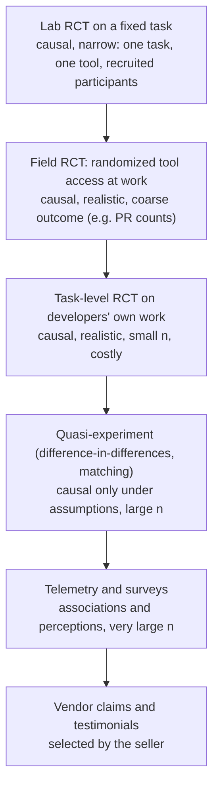

# 13.2 · The evidence base on AI productivity

## Why it matters

Every client meeting about AI eventually produces a number someone read: "55% faster", "26% more output", "19% slower". Your credibility as a trainer depends on two things at once: knowing where each number came from, and refusing to let any single one stand in for your client's situation. The course's principle is blunt — ROI claims may cite only your own measured numbers. This lesson is why: the published evidence is real, useful and **contradictory**, and the contradictions are the most informative part.

> [!NOTE]
> Content tags. **Implementation** (review annually): the specific studies and their numbers, current as of 2026-09; new studies appear every quarter. **Concept** (stable): the evidence ladder, the reasons studies disagree, the critique checklist.

## How it works

### The evidence ladder

Designs differ in what they can show. Higher rungs support causal claims; wider rungs support generalization. No design does both well.

### What the main studies found

| Study | Design | Who and what | Metric | Finding |
|---|---|---|---|---|
| Peng et al. (2023) | Lab RCT | 95 freelance developers recruited on Upwork; implement an HTTP server in JavaScript; code completion (2022) | time to complete | **55.8% faster** with the assistant (95% CI 21–89%); less experienced and older developers benefited most |
| Vaithilingam et al. (2022) | Within-subjects lab study | 24 participants, short programming tasks | completion time, success | no clear improvement in time or success; most participants still preferred the tool as a starting point |
| Cui et al. (field experiments) | 3 field RCTs | 4,867 developers at Microsoft, Accenture and a Fortune 100 company; code completion | completed tasks (PRs) | **+26.08% completed tasks** (SE 10.3%); less experienced developers adopted more and gained more |
| Paradis et al. (2024) | Lab RCT at Google | 96 Google engineers, one complex enterprise task, internal tools | time on task | **about 21% faster**, with a large confidence interval; authors warn against generalizing |
| METR, Becker et al. (2025) | Task-level RCT on real work | 16 experienced open-source maintainers, 246 issues in their own mature repositories (22k+ stars, 1M+ lines); early-2025 agentic tools | time per issue | **19% slower** with AI allowed (CI +2% to +39%); developers forecast 24% faster and afterwards believed 20% faster; experts predicted 38–39% faster |
| METR update (2026) | Same design, late 2025 | 10 returning + 47 new developers | time per issue | returning developers −18% time (CI −38% to +9%), new −4% (CI −15% to +9%); METR calls the data unreliable because developers declined to work without AI and 30–50% withheld tasks they did not want to do without it, so the true speed-up is likely larger |
| He et al. (Cursor adoption) | Difference-in-differences | 807 open-source repositories adopting Cursor vs 1,380 matched non-adopters | lines added, static-analysis warnings, complexity | lines added +281% in month 1 and +48% in month 2, then gone; static-analysis warnings **+29.7%** and code complexity **+40.7%**, persistent, and associated with later slowdown |
| Ziegler et al. (2022) | Survey + telemetry | Copilot users | perceived productivity | the **acceptance rate** of suggestions predicted perceived productivity better than whether the code persisted |
| Butler et al. (2024) | RCT + diary study | Developers at a multinational software company | perceptions, practices | perceived usefulness and enjoyment rose with use; trust in AI-generated code did not change |
| DORA 2024 and 2025 | Large surveys with modelled associations | ~5,000 respondents in 2025; 90% use AI at work | self-reported delivery performance | 2024: AI adoption associated with lower throughput and stability; 2025: now positively associated with throughput, still associated with **higher instability**; "AI is an amplifier" |
| Stack Overflow 2025 | Survey | 84% using or planning to use AI tools | trust, frustrations | 46% distrust AI accuracy vs 33% who trust it; 66% name "almost right, but not quite" as their biggest frustration |

### Why they disagree

1. **Task.** A well-specified greenfield task (an HTTP server) is where assistants shine. Issues in a million-line repository you maintain need context the tool does not have and you do. Your client's legacy .NET system is closer to METR's setting than to Peng's.
2. **Developer.** Novices gain most (Peng, Cui). Experts working in code they know intimately gained least — or lost time (METR 2025).
3. **Metric.** "Time to finish one task", "PRs completed per week", "lines added" and "felt more productive" are four different quantities. He et al.'s velocity measure is lines added — an activity count that 13.1 warned about — while their quality measures moved the other way.
4. **Tool generation.** Code completion in 2022, chat in 2023–24, agents from 2025. METR's own numbers moved from +19% to a likely speed-up within a year.
5. **Design.** Lab RCTs are causal but narrow; surveys are broad but measure associations and perceptions; difference-in-differences depends on the matched projects being a fair counterfactual.
6. **Perception vs measurement.** METR's developers believed they were 20% faster while measured 19% slower. Ziegler et al. found perceived productivity tracks how often suggestions are accepted. Self-reports are data about experience, not about throughput.
7. **Quality is usually missing.** Most speed studies do not follow code for weeks. The two that watch quality at scale — DORA's instability findings and He et al.'s warnings and complexity — both see a cost.
8. **Who ran it.** Several authors of the Copilot studies worked at Microsoft or GitHub; METR is an independent non-profit. Affiliation is not evidence of error, but it belongs in the critique, and so does publication of the full method.

### The critique checklist

For any claim, answer eight questions before repeating it:

1. **Who** was measured (experience, relationship to the code)?
2. **What task** (greenfield or brownfield, size, specification)?
3. **Which metric**, with which start and stop events (13.1)?
4. **Compared with what** — no tool, an older tool, the same people last quarter?
5. **How were arms assigned** — randomized, chosen by developers, chosen by managers?
6. **How many**, and what is the interval?
7. **What happened to quality** — defects, rework, stability?
8. **Does it transfer** to the audience in front of you?

## Show me

Claim A (`labs/module-13/claims/claim-a-vendor-slide.md`, fictional): a vendor slide says **"Nimbus Agent makes developers 55% faster"**, footnoted to "a controlled study" in which developers with an AI pair programmer finished a coding task 55% faster. A CTO running a 15-year-old .NET Framework and SQL Server billing system asks whether to expect 55%.

| Question | Answer from the source (Peng et al. 2023) |
|---|---|
| Who | 95 freelancers recruited on Upwork, not the CTO's developers |
| Task | implement an HTTP server in JavaScript: greenfield, small, well specified |
| Metric | time to complete one task |
| Compared with | no assistant, internet search allowed |
| Assignment | randomized: good |
| Size and interval | 95% CI 21–89%: the point estimate is one value in a wide range |
| Quality | a test suite checked correctness; no long-term quality |
| Transfer | different product (the slide's own), different tool generation, different code base; the study closest to a mature legacy code base (METR 2025) found experienced developers slower |

The honest answer to the CTO, in three sentences: *"That number comes from one lab task — building a small JavaScript server from scratch — with a 2022 code-completion tool and freelancers, and even there the interval ran from 21% to 89%. Studies closer to your situation range from a slowdown to roughly a 20–25% gain, and the ones that track quality show new costs. We can measure it on your code in four to six weeks, and that is the only number I would put in a business case."*

## Try it

Budget: 60 minutes.

1. Apply the eight questions to Claim B (`claims/claim-b-cto-post.md`) and Claim C (`claims/claim-c-dashboard.md`). For each, list the single most damaging answer and write a one-sentence replacement claim the evidence supports. (You will analyze Claim B's data properly in 13.4.)
2. Write `method-notes/evidence-base.md`: at least five studies from the table, one line each on design, finding and **transfer to your wedge** (for example "legacy .NET/SQL Server shops on Jira").
3. Open METR's 2026 update and write two sentences: what changed in their numbers, and why they no longer trust their own design.

Hint: the most damaging answers

Claim B: question 5 — the pilot team was chosen *because* it had the worst quarter, so its next quarter was likely to improve regardless. Claim C: questions 3 and 5 — the PR clock starts after the agent has shifted work (13.1), and the author decides which PRs get the `ai-assisted` label.

## Break it

You are preparing slide 3 of your workshop for a legacy .NET shop. The draft reads:

> **The research is clear: AI makes developers 26–55% faster** (GitHub/Microsoft studies, 2023–2025).

In the dry run, a senior engineer raises a hand: *"METR found experienced developers were 19% slower. Which is it?"* Before reading on: what exactly is wrong with the slide, and is the engineer's objection the whole story?

## Fix it

**Diagnose.**

1. *Cherry-picking:* the slide quotes the two favourable studies and omits those that found no gain (Vaithilingam), a slowdown (METR 2025) or quality costs (He et al., DORA).
2. *Metric conflation:* 26% is **more completed tasks** (Cui et al.), 55% is **less time on one lab task** (Peng et al.). "Faster" fits only one of them.
3. *Transfer:* neither population resembles experienced developers on a large legacy code base.
4. *And the objection is incomplete too:* METR's 2025 result was for early-2025 tools and 16 developers; its own 2026 update suggests a likely speed-up with later tools, while warning that its measurements have become unreliable. Replacing one cherry-picked number with another is the same error.

**Modify.** Replace the slide with the range and the reason for it:

> **Published effects range from 19% slower to 56% faster.** Gains are largest for newcomers on small, well-specified tasks; smallest — or negative — for experts in large code bases they know well. Studies that follow quality for weeks find new costs. **So we measure it on your code.**

Put the table from this lesson in the appendix, with links.

**Rerun.** Present the new slide to one colleague and ask them to restate it in one sentence. If they say "it depends on the task and the person, so they'll measure it here", the slide works. If they repeat a single percentage, it doesn't.

## How do I know it works?

- [ ] Your `evidence-base.md` lists at least five studies with design, finding and transfer, including at least one that found no gain or a loss, and one that measured quality.
- [ ] For each claim in `claims/`, you have the most damaging checklist answer and a supported rewrite.
- [ ] You can explain METR's 2025 and 2026 results in two sentences without overstating either.
- [ ] None of your slides contains a productivity percentage without its task, population and interval.

## Use / don't use

**Use** the evidence base to set expectations ("somewhere between a small loss and a large gain, depending on task and developer"), to choose metrics and guardrails for your own experiment, and to design it (METR's per-task randomization is the template for 13.3).

**Don't** forecast a client's effect from any published study. **Don't** cite surveys (DORA, Stack Overflow) as measurements of productivity: they are measurements of what people report and of associations. **Don't** slide into "nobody knows, so anything goes": the literature supports specific, conditional statements, and it supports measuring.

**Limitations.**

- This table will be stale within a year; agentic tools change faster than studies are published. Check the dates of everything you cite.
- Few published studies cover agentic tools on enterprise brownfield code, which is exactly the wedge of this course.
- Published studies are the ones that got published; internal studies with null results rarely are.

## Reflect

1. Which number about AI productivity had you been repeating before this lesson, and where did it come from?
2. Which study is closest to your own team's situation, and what does it predict?
3. What would your team's developers say if asked whether AI makes them faster — and why might that answer be unreliable?

## Sources

- [Peng et al. (2023) — The Impact of AI on Developer Productivity: Evidence from GitHub Copilot](https://arxiv.org/abs/2302.06590) — 95 Upwork developers randomized; HTTP server in JavaScript; 55.8% faster (95% CI 21–89%).
- [Cui et al. — The Effects of Generative AI on High-Skilled Work](https://www.microsoft.com/en-us/research/publication/the-effects-of-generative-ai-on-high-skilled-work-evidence-from-three-field-experiments-with-software-developers/) — three field RCTs, 4,867 developers, +26.08% completed tasks (SE 10.3%); larger gains for less experienced developers.
- [Paradis et al. (2024) — How much does AI impact development speed?](https://arxiv.org/abs/2410.12944) — 96 Google engineers, about 21% faster with a large interval; caution on generalizing.
- [Becker et al. (2025) — Measuring the Impact of Early-2025 AI on Experienced Open-Source Developer Productivity](https://arxiv.org/abs/2507.09089) — 16 developers, 246 tasks, 19% slower; forecast 24% and perceived 20% speed-up.
- [METR (2026) — We are Changing our Developer Productivity Experiment Design](https://metr.org/blog/2026-02-24-uplift-update/) — late-2025 estimates (−18% and −4% time, intervals crossing zero) and the selection effects that make them unreliable.
- [He et al. — Speed at the Cost of Quality (Cursor adoption)](https://arxiv.org/abs/2511.04427) — difference-in-differences on 807 vs 1,380 repositories: transient velocity gain, persistent +29.7% static-analysis warnings and +40.7% complexity.
- [Vaithilingam et al. (2022) — Expectation vs. Experience](https://dl.acm.org/doi/10.1145/3491101.3519665) — 24 participants; no clear improvement in completion time or success; participants preferred the tool.
- [Ziegler et al. (2022) — Productivity Assessment of Neural Code Completion](https://arxiv.org/abs/2205.06537) — acceptance rate drives perceived productivity.
- [Butler et al. (2024) — Dear Diary](https://arxiv.org/abs/2410.18334) — RCT and diary study; perceived usefulness and enjoyment up, trust unchanged.
- [Google Cloud blog — Announcing the 2025 DORA report](https://cloud.google.com/blog/products/ai-machine-learning/announcing-the-2025-dora-report) — ~5,000 respondents; 90% use AI; AI positively associated with throughput, negatively with stability; AI as amplifier.
- [Stack Overflow — 2025 Developer Survey, AI](https://survey.stackoverflow.co/2025/ai) — 84% use or plan to use AI; 46% distrust accuracy vs 33% trust; 66% frustrated by "almost right" output.
