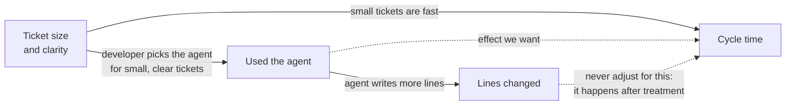
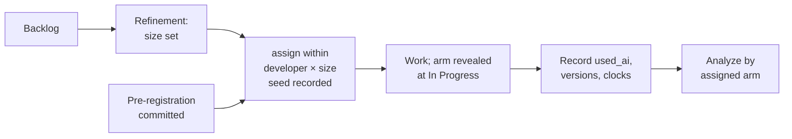

# 13.3 · Experiment design

## Why it matters

The most common "study" of AI productivity inside a company goes like this: *developers used the agent whenever they felt it would help; we compared those tickets with the rest.* It is cheap, it produces a large number, and it is almost always wrong — because the same thing that makes a developer reach for the agent (a small, clear, familiar ticket) also makes the ticket fast.

In [07.5](../module-07/lesson-05.md) you held everything fixed except the treatment and paired by task. You could do that because you owned the task set and could rerun it. Here you cannot run the same ticket twice, and you do not choose which tickets arrive. What you *can* control is **who decides which ticket gets the agent** — and the answer must be "a random number generator, within blocks you chose in advance".

> [!NOTE]
> Content tags. **Concept** (stable): control groups, randomization, blocking, units of randomization, power, pre-registration. **Implementation**: `ImpactStats assign`, `balance`, `power`.

## How it works

### Baseline, treatment, control

- **Baseline**: how things were before (last quarter's cycle time). Useful for context and for power estimates; useless as a comparison on its own, because everything else changed too — the team, the codebase, the season, the release pressure (13.4).
- **Treatment**: exactly what changes. "Claude Code with the Module 6 AI layer, pinned at version X", not "AI".
- **Control**: a concurrent comparison arm doing the same kind of work at the same time without the treatment. Write down what is allowed in it: IDE completion? Chat in a browser? If the rules are vague, the control arm drifts toward the treatment (contamination, 13.4).

### Why randomize

*Intuition.* If a coin decides which tickets get the agent, then small and large tickets, easy and hard modules, good weeks and bad weeks all end up spread across both arms in roughly equal measure — including the factors you never thought to record. Hernán and Robins call this **exchangeability**: the arms would have had the same outcomes had they been treated the same way, so any difference is the treatment's.

Self-selection breaks exchangeability. A **confounder** — here, ticket size — causes both the choice and the outcome:



Stratifying on a *measured* confounder (size) can repair part of the damage after the fact. It cannot repair unmeasured ones ("I felt this one would suit the agent"). Randomization repairs both.

### Unit of randomization

| Unit | Example | Strength | Weakness |
|---|---|---|---|
| **Ticket** (within developer) | METR: each issue randomly "AI allowed" or not | each developer is their own control; most power per ticket | spillover (what you learn with the agent helps on the next manual ticket); developers can re-scope tickets |
| **Developer** | Cui et al.: random subset of developers given access | no spillover within a person; realistic rollout | needs many developers; individual differences are large |
| **Team** | pilot teams vs comparison teams | realistic, captures team practices | needs many teams per arm; with 2–3 teams you have a case study, not an experiment |

For a single team of 4–10 developers, **ticket-level randomization within developer** is usually the only design with enough power. A solo student uses the same design on their own tickets: it shows the effect *for you*, and says so.

### Blocking: randomize within developer × size

*Intuition.* In 13.1, size explained far more variation than the arm (5 h vs 16 h vs 47 h). Pure randomization balances size *on average*; with 40 tickets, bad luck can still put most L tickets in one arm. Blocking removes that luck: within each developer × size block, half the tickets go to each arm.

*Equation.* Without blocking, the variance of the difference includes the spread *between* strata; with blocking and a stratified analysis, only the spread *within* strata remains:

$$\operatorname{Var}_{\text{unblocked}} \approx \frac{2}{n}\left(\sigma^2_{\text{within}} + \sigma^2_{\text{between}}\right) \qquad \operatorname{Var}_{\text{blocked}} \approx \frac{2}{n}\,\sigma^2_{\text{within}}$$

*Tiny example.* On log cycle time in the Contoso data, the within-size SD is about 0.3 while sizes differ by a factor of ~3 (ln 3 ≈ 1.1) from one to the next. Most of the variance is between sizes. 13.5 shows the result on the same 96 tickets: the unstratified interval is −40% to +19%; the stratified one is −25% to −5%.

*Implementation.* `ImpactStats assign backlog.csv --block developer,size --seed N` shuffles balanced arm labels inside every block; odd-sized blocks get a random extra ticket. Record the seed in the pre-registration.

*Interpretation.* **Size must be set in refinement, before assignment.** If the estimate is made after the developer knows the arm, it is a post-treatment variable and blocking on it is no longer valid.

### How many tickets?

*Equation.* To detect a reduction $r$ in the geometric mean with 80% power at $\alpha = 0.05$, where $\sigma$ is the within-stratum SD of $\ln(\text{hours})$:

$$n_{\text{per arm}} = \frac{2\,(z_{1-\alpha/2} + z_{1-\beta})^2\,\sigma^2}{\delta^2}, \qquad \delta = -\ln(1 - r)$$

*Tiny example.* $\sigma = 0.35$, $r = 15\%$: $\delta = 0.1625$, $n = 2 \times 7.85 \times 0.1225 / 0.0264 \approx 73$ tickets per arm. With the course's minimum of 20 per arm, the detectable reduction is about 27%.

*Implementation.* `describe --by size` prints `sd(log)` per group; `power --sd <value>` prints the table.

*Interpretation.* Most single teams cannot detect a 10% effect in a quarter. That is not a reason to skip the experiment; it changes what you will be able to say. With 20 per arm you can rule out "the agent doubled our speed" or "it made us much slower"; say so in the pre-registration.

### Pre-register

Write the question, arms, metrics, analysis and decision rule **before** the first ticket is assigned, and commit it. Nosek et al. describe why: once you have seen the data, every choice (which metric, which tickets to drop, which subgroup) can drift toward the result you hoped for, and a test of a prediction silently becomes a description of the data. Deviations are allowed — as dated entries, not edits. The [experiment design template](../../templates/experiment-design.md) is the form.



## Show me

A two-developer backlog of 24 refined tickets (`labs/module-13/data/backlog-example.csv`):

```text
$ dotnet run --project tools/ImpactStats -- assign data/backlog-example.csv --block developer,size --seed 2026 > assignment.csv
$ dotnet run --project tools/ImpactStats -- balance assignment.csv --arm arm --by size
Balance of arm across size (24 rows)
size              ai    manual  share manual
L                  2         2           50%
M                  6         4           40%
S                  5         5           50%
chi-square 0.23 on 2 df, p = 0.8892 -> no evidence of imbalance on size.
```

Each developer had five M tickets; each odd block gave its extra ticket to one arm at random — here both to the agent. That is the most imbalance blocking allows: one ticket per block.

And the sample size for the Contoso team, from a within-size spread of about 0.35:

```text
$ dotnet run --project tools/ImpactStats -- power --sd 0.35
  reduction  10%  ->    174 tickets per arm (347 total)
  reduction  15%  ->     73 tickets per arm (146 total)
  reduction  20%  ->     39 tickets per arm (78 total)
  reduction  30%  ->     16 tickets per arm (31 total)
```

## Try it

Budget: 75 minutes.

1. Choose your unit of randomization and write two sentences on why, including the spillover or contamination risk you accept.
2. Take your next 30–60 refined tickets (or `data/backlog-example.csv`), run `assign` with a seed, and check `balance`. Agree with the team when the arm is revealed (at In Progress, not earlier).
3. Estimate $\sigma$: run `describe --by size` on your baseline data (your `prs.csv` from 13.1 gives a rough value for the review clock; your tracker for cycle time). Run `power` and write down the detectable effect at the sample size you can actually reach in 3–6 weeks.
4. Fill sections 1–5 of the [experiment design template](../../templates/experiment-design.md) as `method-notes/experiment-01-prereg.md`. Commit it before any ticket starts.

<details>
<summary>Hint: "we can't randomize, the team won't accept it"</summary>

Offer the version developers usually accept: randomize only within each person's own tickets, keep it to 3–6 weeks, let anyone skip the experiment for a ticket with a written reason (and count those), and publish the results to the team first. If randomization is still refused, say plainly in the pre-registration that the design is observational, stratify on size and developer, and limit the claim to an association.
</details>

## Break it

The Contoso team lead sends a summary of the last 12 weeks (`labs/module-13/data/contoso-selfselected.csv`, illustrative): *"Developers used the agent whenever they felt it would help. 120 tickets. Median cycle time 14.1 h without the agent, 8.2 h with it."*

```text
$ dotnet run --project tools/ImpactStats -- compare data/contoso-selfselected.csv --metric cycle_hours
stratum    nA   nB  median A  median B   geo A   geo B     B/A  Cliff d
(all)      51   69      14.1       8.2    14.9     8.7    0.58    -0.32
ratio of geometric means B/A: 0.584 (-42%), bootstrap 95% CI [0.421, 0.807] = [-58%, -19%]
permutation test (10000 shuffles, seed 14): two-sided p = 0.0017
```

A 42% reduction, an interval nowhere near zero, p = 0.002. Before reading on: which single command would you run next, and what do you expect it to show?

## Fix it

**Diagnose.** Check whether the arms are comparable on something that was fixed before the choice:

```text
$ dotnet run --project tools/ImpactStats -- balance data/contoso-selfselected.csv --arm assigned --by size
size              ai    manual  share manual
L                  7        14           67%
M                 19        22           54%
S                 43        15           26%
mix of ai: L 10%, M 28%, S 62%
mix of manual: L 27%, M 43%, S 29%
chi-square 13.68 on 2 df, p = 0.0011 -> arms are NOT balanced on size: compare within strata or randomize.
```

Developers chose the agent for 74% of small tickets and 33% of large ones. The agent arm is mostly small tickets; the manual arm carries most of the large ones. Now compare like with like:

```text
$ dotnet run --project tools/ImpactStats -- compare data/contoso-selfselected.csv --metric cycle_hours --strata size
stratum    nA   nB  median A  median B   geo A   geo B     B/A  Cliff d
L          14    7      45.4      46.1    44.9    44.2    0.99     0.04
M          22   19      14.5      14.2    15.8    15.2    0.96    -0.02
S          15   43       4.9       5.5     4.9     5.2    1.07     0.09
stratified ratio of geometric means B/A: 1.016 (+2%), bootstrap 95% CI [0.856, 1.199] = [-14%, +20%]
permutation test (10000 shuffles within size, seed 14): two-sided p = 0.8681
```

Within every size, the two arms take about the same time. The 42% was the size mix. (In this simulation the true effect is exactly zero; see `data/README.md`.)

Two things **not** to do. Do not "control for" `lines_changed`: the agent inflates it (+24% within size), so it is an outcome of the treatment, and adjusting for it can create differences that are not there. And do not stop at stratification: it fixed the confounder you measured, not the ones you didn't.

**Modify.** Replace "use it when you feel like it" with the design in this lesson: size set in refinement, `assign` within developer × size, arm revealed at In Progress, `used_ai` recorded, analysis by assigned arm, pre-registered.

**Rerun.** You cannot rerun the past 12 weeks; you run the next 6 with the new design. `contoso-randomized.csv` is what such a run looks like: balanced by construction (`balance` gives 20/20, 20/20, 8/8), and a real effect of −16% that survives the stratified analysis (13.5).

[Simulation: Measurement — difficulty mix and self-selection](../../simulations/measurement/index.html?preset=difficulty-mix)

## How do I know it works?

- [ ] Your pre-registration names the unit, the blocks, the seed, the primary metric and guardrails, the analysis command and the decision rule — committed before the first ticket.
- [ ] `balance` on your assignment shows no block with more than one ticket of imbalance.
- [ ] Size (or points) for every ticket was recorded before its arm was known.
- [ ] You wrote down the smallest effect your sample can detect, and what you will say if the true effect is smaller.
- [ ] You can explain the 42% → +2% result without using the word "outlier".

## Use / don't use

**Use** ticket-level randomization within developer for a single team; developer-level when you have dozens of developers and fear spillover; team-level only with many teams. **Use** blocking on anything fixed before assignment that strongly predicts the outcome (size, developer, component).

**Don't** let developers choose, and don't let managers choose "suitable tickets for the agent". **Don't** block or adjust on anything measured after the work started. **Don't** run a two-team pilot and call it an experiment; call it a case study.

**Limitations.**

- Developers know their arm; there is no blinding. Effort can shift between arms (for example, doing the manual tickets more carefully because they are being watched).
- Ticket-level randomization measures the effect of the agent *on a ticket*, not of an organization that has fully adopted agents (changed processes, different ticket slicing, new reviewers' habits).
- Spillover makes within-developer designs underestimate effects that build skills; METR and others discuss this trade-off openly.

## Reflect

1. Who currently decides, in your team, which work gets the agent — and what do they select on?
2. What is the smallest effect you could detect in six weeks, and would that answer the question your manager is asking?
3. Which variable would you most like to block on that your tracker does not record before work starts?

## Sources

- [Becker et al. (2025) — METR randomized controlled trial](https://arxiv.org/abs/2507.09089) — per-issue randomization of "AI allowed" on developers' own work; the within-developer design this lesson adapts.
- [Cui et al. — The Effects of Generative AI on High-Skilled Work](https://www.microsoft.com/en-us/research/publication/the-effects-of-generative-ai-on-high-skilled-work-evidence-from-three-field-experiments-with-software-developers/) — developer-level randomization of tool access across three companies.
- [Hernán and Robins — Causal Inference: What If](https://miguelhernan.org/whatifbook) — exchangeability, confounding, why randomization identifies causal effects, and why adjusting for post-treatment variables is an error.
- [Nosek et al. (2018) — The preregistration revolution](https://www.pnas.org/doi/10.1073/pnas.1708274114) — defining questions and analysis before seeing outcomes separates prediction from postdiction.
