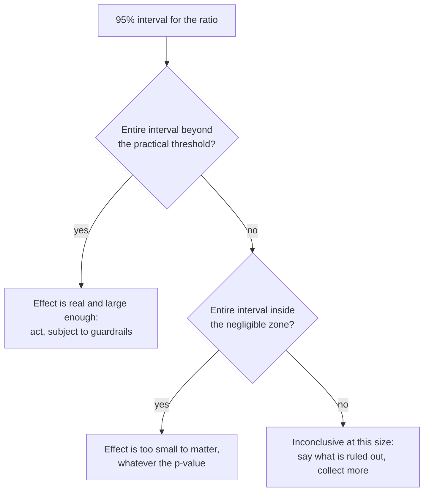

# 13.5 · Statistics for engineering comparisons

## Why it matters

In [07.4](../module-07/lesson-04.md) every outcome was pass or fail, and the Wilson interval did the work. Engineering metrics are different: durations are continuous, heavily skewed, occasionally absurd (a ticket blocked for a week), and grouped by size and developer. The textbook tools — compare the means, run a t-test, check p < 0.05 — fail on exactly this kind of data, in both directions: they announce effects that are one outlier, and they miss effects that a better analysis finds easily.

This lesson gives you four tools that make almost no assumptions about the shape of the data — the log scale, the bootstrap, the permutation test and effect sizes — and one discipline that no tool supplies: deciding in advance how large an effect has to be to matter.

> [!NOTE]
> Content tags. **Concept** (stable): bootstrap, permutation tests, effect sizes, practical vs statistical significance, blocking, correlation vs causation. **Implementation**: `ImpactStats compare` options.

## How it works

### The estimand

Before any method, name the number you are estimating. For a speed metric in this module it is the **ratio of geometric means, agent ÷ control, stratified by the blocks you randomized within** (13.3): the mean of $\ln(\text{hours})$ difference within each stratum, weighted by stratum size, then exponentiated. `0.84` reads "tickets take 84% as long", or −16%.

### Bootstrap confidence interval

*Intuition.* You have one sample. If you could draw more samples from the same process, the estimate would wobble; the interval is the range of that wobble. The bootstrap (Efron, 1979) approximates "drawing more samples" by drawing *from your sample*, with replacement, many times.

*Equation.* For $b = 1 \dots B$: resample each stratum × arm cell with replacement to its original size, compute $\hat\theta^{*}_b$. The 95% percentile interval is

$$\big[\,\hat\theta^{*}_{(0.025)},\ \hat\theta^{*}_{(0.975)}\,\big]$$

*Tiny example.* Five manual tickets: 3, 4, 6, 8, 20 hours. One resample might be {4, 4, 8, 20, 6} (median 6), another {3, 3, 4, 6, 8} (median 4), another {8, 20, 20, 6, 4} (median 8). Ten thousand of those medians form a distribution; its 2.5th and 97.5th percentiles bracket the median. Do it for both arms inside each stratum, compute the stratified ratio each time, and you have the interval for the ratio.

*Implementation.* `compare --boot 10000 --seed 13` (defaults). Resampling within stratum × arm keeps the design: every resample has the same number of S, M and L tickets in each arm as the real data.

*Interpretation and limits.* The bootstrap needs enough data per cell to represent the spread — with fewer than about 8–10 tickets in a cell, intervals come out too narrow. It also assumes tickets are independent; if one developer's tickets are all slow, the right unit to resample is the developer (the same clustering lesson as 07.4's tasks).

### Permutation test

*Intuition.* If the agent did nothing, the labels "agent" and "manual" are arbitrary: any shuffle of them is as likely as the real one. Shuffle many times, compute the statistic each time, and see how often a shuffled difference is at least as extreme as the real one.

*Equation.* With $P$ shuffles and $c$ of them at least as extreme:

$$p = \frac{c + 1}{P + 1}$$

*Tiny example.* Manual tickets took 10 and 12 hours; agent tickets 6 and 7. The observed difference in means is −4.5 h. There are only $\binom{4}{2} = 6$ ways to label two of the four tickets "agent": differences −4.5, −1.5, −0.5, +0.5, +1.5, +4.5. Two are at least as extreme as |−4.5|, so $p = 2/6 = 0.33$. With two tickets per arm, **no result can ever reach p < 0.33** — the same floor as the placebo test's $1/(k+1)$ in 13.4.

*Implementation.* `compare --perm 10000` shuffles labels *within* each stratum, which matches blocked randomization. The statistic is the same stratified log ratio as the estimate.

*Interpretation.* The ASA statement on p-values is the guide: a p-value measures how incompatible the data are with "no effect"; it does not measure the probability that the effect is real, it does not measure the size or importance of the effect, and conclusions should not rest on whether it crosses 0.05. Report it; decide with the interval.

### Effect sizes

| Measure | Definition | Why report it |
|---|---|---|
| **Ratio of geometric means** | $\exp(\bar d_{\log})$ | the one a manager can use: "−16% time per ticket" |
| **Hedges g** | $\bar d_{\log} / s_{\text{pooled within}}$, small-sample corrected by $J = 1 - 3/(4\,df - 1)$ | comparable across teams whose tickets have different spreads |
| **Cliff's delta** | $P(B > A) - P(B < A)$ over all pairs | assumption-free: "how often is a random agent ticket slower than a random manual one?" (Cliff, 1993) |

Cliff's delta pooled across sizes mixes an S ticket with an L ticket; read it per stratum (the `compare` table prints it per row).

### Practical vs statistical significance

Write down, before the data, the **minimum effect worth acting on** — for example "−10% cycle time; less than that is not worth the licence and the change". Then read the interval against it:



A huge sample can make a 2% effect "highly significant" and still worthless; a small one can leave a 25% effect "not significant" and still likely. Both mistakes come from reading p instead of the interval.

### Blocking narrows the interval

The same 96 randomized Contoso tickets, analyzed two ways:

| Analysis | Ratio | 95% bootstrap CI | Permutation p |
|---|---|---|---|
| Not stratified | 0.844 (−16%) | [−40%, +19%] | 0.35 |
| Stratified by size | 0.844 (−16%) | [−25%, −5%] | 0.010 |

Same estimate — randomization made it unbiased either way — but ignoring the blocks leaves the between-size variance in the noise. The design paid for precision; the analysis must collect it.

### Correlation is not causation, even with a lot of data

"Developers who use the agent most have the shortest cycle times" is a correlation across people who chose their usage. DORA's findings are associations of this kind, across organizations. They are valuable for hypotheses; they are not effects. Only a comparison in which something other than the developer decided the treatment — randomization, or a defensible natural experiment (13.4) — supports "the agent caused it" (Hernán and Robins).

## Show me

The primary analysis of `contoso-randomized.csv` (illustrative), as pre-registered:

```text
$ dotnet run --project tools/ImpactStats -- compare data/contoso-randomized.csv --metric cycle_hours --strata size
contoso-randomized.csv: cycle_hours, assigned ai (B) vs manual (A), 96 rows, stratified by size
stratum    nA   nB  median A  median B   geo A   geo B     B/A  Cliff d
L           8    8      47.0      39.8    56.3    37.2    0.66    -0.56
M          20   20      16.2      15.6    16.7    15.1    0.90    -0.25
S          20   20       5.0       4.9     5.2     4.5    0.87    -0.23
stratified ratio of geometric means B/A: 0.844 (-16%), bootstrap 95% CI [0.748, 0.948] = [-25%, -5%] (10000 resamples, seed 13)
effect size: Hedges g on log cycle_hours = -0.54 (within-stratum SD); Cliff's delta (pooled, raw) = -0.11
permutation test (10000 shuffles within size, seed 14): two-sided p = 0.0099
```

Reading, in the order a report uses it: tickets took about 16% less time with the agent (95% CI 5% to 25%); within every size the agent arm was faster, most in L (where only 8 tickets per arm make the per-stratum ratio noisy); the effect is about half a within-size standard deviation; a difference this large would be rare if the agent did nothing. Against a pre-stated threshold of −10%, the interval straddles it: the effect is real, and may or may not be large enough to matter.

And the guardrail, with Module 7's Wilson intervals:

```text
$ dotnet run --project tools/ImpactStats -- compare data/contoso-randomized.csv --metric escaped_defects --binary --strata size
A manual: 4/48 = 8%  Wilson 95% [3%, 20%]
B ai: 10/48 = 21%  Wilson 95% [12%, 34%]
stratified difference B-A: 12.5 pt, bootstrap 95% CI [0.0, 25.0] pt
permutation test (10000 shuffles within size, seed 14): two-sided p = 0.1307
```

"Not significant" (p = 0.13) is **not** "no increase": the interval runs from none to 25 points. For a guardrail, the question is whether you can rule out a harmful increase — and you cannot.

## Try it

Budget: 75 minutes.

1. Reproduce the Show me outputs. Then rerun with `--seed 1` and `--seed 2`. How much do the interval ends move? (That is Monte Carlo error; with 10,000 resamples it should be in the second decimal.)
2. Do five bootstrap resamples by hand (spreadsheet `RANDBETWEEN`) of the eight L/manual tickets and compute each resample's median. Which resamples contain BILL-503 (170 h) twice?
3. Run the unstratified comparison and fill the "blocking" table yourself. Write one sentence explaining the difference to a manager.
4. Write the minimum effect worth acting on into your pre-registration, and classify the Show me result with the decision diagram.

<details>
<summary>Hint: step 2 and the outlier</summary>

Roughly a quarter of resamples of 8 contain a given ticket at least twice (1 − (7/8)^8 − 8·(1/8)·(7/8)^7 ≈ 0.26). Medians barely notice; means jump by 15–20 hours. That is why the tool bootstraps the log ratio, not the raw mean.
</details>

## Break it

An analyst sends two slides about the same randomized experiment:

> **Slide 1.** Average cycle time fell from **20.2 h to 15.0 h**: the agent makes us **26% faster**.
>
> **Slide 2.** However, a t-test gives **p = 0.24**, so the difference is **not statistically significant**: the agent has **no measurable effect**.

```text
$ dotnet run --project tools/ImpactStats -- compare data/contoso-randomized.csv --metric cycle_hours --strata size --mean
[naive] raw means (unstratified): A 20.2 h, B 15.0 h, B/A 0.744 (-26%); Welch t = -1.17, df = 69.1, p = 0.2442
[naive] largest single value 170.0 h is 13.9x the pooled median
```

Before reading on: both slides are wrong. Why, and in which direction is each one wrong?

## Fix it

**Diagnose.**

1. *Slide 1 is too high.* One manual ticket, BILL-503, took 170 h because it waited five days for a DBA sign-off. It adds more than 3 hours to the manual mean on its own. Without it, the raw means are 17.0 h vs 15.0 h, −12%:

   ```text
   $ dotnet run --project tools/ImpactStats -- compare data/contoso-randomized.csv --metric cycle_hours --strata size --exclude ticket=BILL-503 --mean
   [naive] raw means (unstratified): A 17.0 h, B 15.0 h, B/A 0.884 (-12%); Welch t = -0.65, df = 89.7, p = 0.5206
   ```

   A headline that one ticket can move from −12% to −26% is not a finding.
2. *Slide 2 is too pessimistic.* The t-test on raw hours ignores the blocks (so size variation swamps the signal) and squares the outlier into the variance. And "not significant" was read as "no effect" — the error the ASA statement warns against.
3. *The pre-registered analysis* — log scale, stratified by size, bootstrap and permutation — gives −16% [−25%, −5%], p = 0.010, and −13% [−22%, −3%] without BILL-503. The effect is real and moderate; neither slide says so.

**Modify.** Replace both slides with one:

> Cycle time **−16% (95% CI −25% to −5%)**, stratified by size, 48 tickets per arm; −13% without the one ticket blocked on an external team. Escaped defects: 8% vs 21% of tickets, difference 0 to +25 points — **not ruled out**.

Add to the pre-registration: *"Primary analysis on log hours, stratified by the randomization blocks; raw means reported only as a sensitivity check; every exclusion listed with its reason."*

**Rerun.** Run the primary command from Show me and the `--exclude` sensitivity check; paste both into the report (13.6).

[Simulation: Measurement — outliers and sample size](../../simulations/measurement/index.html?preset=outliers)

## How do I know it works?

- [ ] Your analysis script produces the stratified ratio, bootstrap interval, permutation p, Hedges g and per-stratum Cliff's delta from one command, with the seed recorded.
- [ ] You can compute a permutation p-value by hand for a four-ticket example, and state the minimum achievable p for a given design.
- [ ] Your pre-registration states the minimum effect worth acting on, and your conclusion reads the interval against it.
- [ ] Every guardrail is reported with an interval, and no guardrail is described as "no change" because p > 0.05.

## Use / don't use

**Use** the log scale for durations, stratified by your randomization blocks; the bootstrap for intervals; the permutation test for p-values; ratios for managers and Hedges g for comparisons across teams. **Use** Wilson intervals (07.4) and bootstrap differences for rates such as defects.

**Don't** compare raw means of durations. **Don't** read p > 0.05 as "no effect", or p < 0.05 as "large effect". **Don't** run twelve metrics and report the one that crossed 0.05: that is why the primary metric is fixed in the pre-registration.

**Limitations.**

- Percentile bootstrap intervals are slightly too narrow for small cells; with fewer than ~10 tickets per stratum × arm, widen your caution, not your claims.
- Tickets of the same developer are correlated; with several developers and uneven workloads, resample developers (clustered bootstrap) as a sensitivity check.
- None of these methods fixes a biased design. A perfect bootstrap of self-selected data (13.3) gives a precise interval around the wrong number.

## Reflect

1. Which number in your organization's reporting is a raw mean of a skewed duration?
2. What minimum effect would make adopting (or dropping) the agent worth it for your team — and who should agree to that number before the data exists?
3. When did you last read "not significant" as "no effect"?

## Sources

- [Efron (1979) — Bootstrap Methods: Another Look at the Jackknife](https://projecteuclid.org/journals/annals-of-statistics/volume-7/issue-1/Bootstrap-Methods-Another-Look-at-the-Jackknife/10.1214/aos/1176344552.full) — introduces the bootstrap: resampling the observed data to estimate the sampling distribution of a statistic.
- [Wasserstein and Lazar (2016) — The ASA Statement on p-Values](https://www.tandfonline.com/doi/abs/10.1080/00031305.2016.1154108) — p-values do not measure the probability that a hypothesis is true or the size of an effect; decisions should not rest on a threshold alone.
- [Cliff (1993) — Dominance statistics](https://psycnet.apa.org/record/1994-08169-001) — the ordinal effect size d: how often one group's value exceeds the other's, minus the reverse; robust alternative to mean comparisons.
- [Miller (2024) — Adding Error Bars to Evals](https://arxiv.org/abs/2411.00640) — clustered standard errors and paired differences; the same logic applies to developers and tickets.
- [Hernán and Robins — Causal Inference: What If](https://miguelhernan.org/whatifbook) — association vs causation; what randomization identifies.
