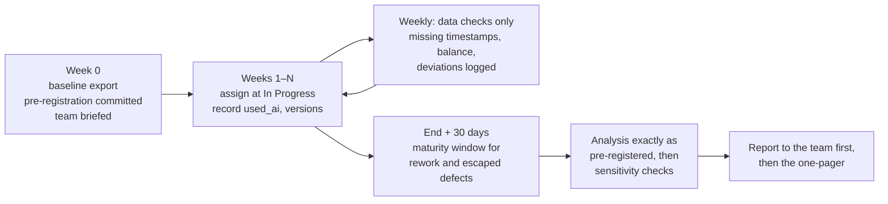

# 13.6 · Running and reporting the comparison

## Why it matters

This is the module's project and the source of the only productivity number you will ever be allowed to put in a proposal. Module 14 mines it for the concepts of your method; Module 20 turns its interval into a price range; your workshop's hard-questions bank (Module 17) quotes it when someone asks "does this actually work?". If the report overclaims, all three inherit the error — in front of the people who pay you.

A good report is short, dull and hard to argue with. It says what was planned, what happened, the estimate with its interval, what happened to quality, and — in a section most reports leave out — what the result does **not** show. METR's 2025 paper is a model of that last habit: next to a surprising headline, it lists explicitly the conclusions its data does not support.

> [!NOTE]
> Content tags. **Concept** (stable): running an experiment without peeking, reporting flow and exclusions, the claims ladder, money as a range. **Implementation**: the `ImpactStats` commands and the report template's layout.

## How it works

### The run

Three rules keep the run honest:

1. **Fixed duration, no peeking at the result.** Checking the effect every week and stopping when it looks good inflates false positives, because a noisy estimate crosses any line eventually. Weekly checks are about data quality — missing timestamps, balance, tickets stuck In Progress — never "is it working yet?".
2. **Every ticket accounted for.** CONSORT, the reporting standard for clinical trials, asks for a flow of participants from assignment to analysis, with every exclusion and its reason. Do the same for tickets: assigned → started → merged → analyzed, with counts per arm.
3. **Wait for the guardrails.** Escaped defects need their 30-day window. A report written the day the last ticket merges undercounts defects most for the most recent tickets — and if one arm finished later, unequally.

### The claims ladder

| Rung | Example | What supports it |
|---|---|---|
| 1. Observation | "Agent tickets had a median cycle time of 11.9 h" | the data |
| 2. Effect in this study | "In a randomized comparison of 96 tickets, the agent reduced cycle time by 16% (95% CI 5% to 25%)" | the design + the interval |
| 3. Effect for this team's work | "For this team's kind of tickets, expect roughly 5–25% shorter cycle time" | rung 2 + no major threat unaddressed |
| 4. Effect elsewhere | "Other .NET teams can expect…" | replication in other teams — not this study |
| 5. Money | "Saves $X per month" | rung 3 + cost data + quality costs, **as a range** |

Unsupported at any rung: "AI makes developers X% faster" (no population, no interval), "no downsides" (absence of evidence for a guardrail), and any point-estimate ROI.

### Money as a range, including quality

*Intuition.* The interval for the effect becomes an interval for the saving. Quality costs come off the top.

*Equation.* With baseline median $m$ hours, ratio interval $[\rho_{lo}, \rho_{hi}]$, $N$ tickets per month, loaded rate $r$, agent spend $S$, extra escaped-defect rate $\Delta_d$ and hours per escaped defect $h_d$:

$$\text{net saving} = N \cdot m\,(1 - \rho) \cdot r \;-\; S \;-\; N \cdot \Delta_d \cdot h_d \cdot r$$

evaluated at both ends of each interval.

*Tiny example.* Contoso worked example: $m = 13.8$ h, ratio 0.75–0.95, $N = 40$, $r = \$95$. Hours saved: 0.7–3.5 h per ticket → $2,600–$13,100 per month. Escaped defects +0 to +25 points; at 6 hours per escaped defect, that is 0 to 60 hours → $0–$5,700 per month. Before agent spend, the net ranges from about **−$3,100 to +$13,100** per month.

*Interpretation.* The honest money statement for this experiment includes the possibility of losing money. That is not a failure of the report; it is the reason the next experiment should target defects. Module 20 builds offers on ranges like this one.

### The one-pager

For the people who will not read the report: the question (one line), the design (two lines), the result sentence from rung 2 or 3, the guardrails, the decision under the pre-registered rule, what happens next. Link the full report.

## Show me

The worked example (`labs/module-13/reports/worked-example-experiment-01.md`, built from the illustrative randomized data and the [experiment report template](../../templates/experiment-report.md)) opens:

> On 96 tickets over 12 weeks (4 developers, arms randomized within developer × size), using the coding agent changed cycle time by **−16% (95% CI −25% to −5%)** compared with working without it. Tickets with an escaped defect were 10 of 48 with the agent vs 4 of 48 without (difference +12.5 points, 95% CI 0 to +25 points). This meets the pre-registered speed criterion but **fails the quality guardrail**, so the pre-registered decision is: do not roll out yet; run a follow-up focused on defects.

and, further down:

> **What this does not show.** Four developers on one repository and one ticket mix… Developers knew their arm… 48 tickets per arm cannot rule out a defect increase of up to 25 points… Long-term effects were not measured.

Notice what is absent: no adjectives ("dramatic", "clear"), no extrapolation to the organization, no single money figure. Notice also that the report recommends *against* rolling out despite a real speed-up — because the pre-registered rule said so. That is the moment a sponsor learns to trust your numbers.

## Try it

Budget: 4 hours of active work spread over 3–6 weeks, plus a 30-day wait for guardrails.

> [!WARNING]
> This is a study of real people's work. Get your manager's agreement, brief the team on what is measured and why, measure tickets not individuals, anonymize developer names before anything leaves your machine, and keep employer data in a **private** `method-notes` repository.

1. **Week 0.** Finish and commit `method-notes/experiment-01-prereg.md` (13.3, 13.4). Export baseline data. Brief the team.
2. **Weeks 1–N.** Target at least 20 tickets per arm where feasible. Assign at In Progress with `ImpactStats assign`; record `used_ai`, `agent_version` and both clocks in a copy of `data/ticket-log-template.csv`. Each week, check completeness and balance only; log deviations.
3. **End + 30 days.** Fill rework and escaped defects. Run the pre-registered commands, then the sensitivity checks (13.4, 13.5).
4. Write `method-notes/experiment-01.md` from the [experiment report template](../../templates/experiment-report.md) and a one-page write-up. Share with the team before anyone else.

**Solo (reduced design).** If you have no team, randomize your own tickets within size for 3–6 weeks. Your report's first "does not show" line is: *"One developer: the result describes my work with this agent, not a team's."* Learning effects are larger for one person; report early vs late halves.

Hint: you only reached 12 tickets per arm

Report it anyway, as pre-registered. With 12 per arm and a within-size SD near 0.35, your interval will span roughly ±30%. State what it rules out (for example "a reduction larger than 40% or a slowdown larger than 20%") and use it to size the next run with `power`. An underpowered, honest report is worth more to your method than a well-powered story.

## Break it

Open `labs/module-13/reports/draft-experiment-01.md`. It reports the self-selected Contoso data with correct arithmetic: "AI agents made the team 42% faster", "escaped defects cut in half", "PRs reviewed 61% faster", "$13.5 million a year, ROI 34x", "no significant downsides", "roll out to all 400 developers immediately".

Before reading on, count the claims the data does not support. There are at least eight.

## Fix it

**Diagnose.** Walk the draft against the claims ladder and Modules 13.1–13.5:

| # | Claim in the draft | Problem | Lesson |
|---|---|---|---|
| 1 | "42% faster" | self-selected arms; within size +2% (CI −14% to +20%) | 13.3 |
| 2 | "highly significant (p = 0.0017)" | significance of a confounded difference; p is not evidence of cause | 13.5 |
| 3 | "escaped defects cut in half" | also size mix: stratified −0.5 points (CI −10 to +9) | 13.3 |
| 4 | "PRs reviewed 61% faster" | PR clock starts after the agent shifts work | 13.1 |
| 5 | "more lines changed (more productive)" | activity metric inflated by the tool | 13.1 |
| 6 | "$13.5 million, ROI 34x" | point estimate of a non-effect, extrapolated from 6 to 400 developers | 13.6 |
| 7 | "no significant downsides" | absence of evidence; guardrails without intervals | 13.5 |
| 8 | "roll out immediately" | recommendation beyond rung 3; no replication | 13.6 |
| 9 | (missing) | no design as planned vs run, no exclusions, no "what this does not show" | 13.6 |

**Modify.** Rewrite the summary to what the data supports:

> Over 12 weeks, developers chose when to use the agent, and chose it mostly for small tickets (74% of S vs 33% of L). Agent tickets were faster overall (median 8.2 h vs 14.1 h), but within each ticket size there was no detectable difference (+2%, 95% CI −14% to +20%), and no difference in escaped defects. This data cannot tell whether the agent helps. We propose a six-week randomized comparison within developer and size, pre-registered, with escaped defects as a guardrail.

**Rerun.** Run the commands behind every number in the rewrite (`balance`, `compare --strata size` for cycle time and `--binary` for defects), paste them under "Commands", and check each sentence against the ladder: all at rung 1 or 2, none above.

[Simulation: Measurement — sample size and apparent improvement](../../simulations/measurement/index.html?preset=sample-size)

## How do I know it works?

- [ ] Your pre-registration was committed before the first ticket; your report lists every deviation with a date.
- [ ] The report has a ticket flow (assigned, started, merged, analyzed, excluded with reasons) per arm.
- [ ] Every number has an interval; every guardrail waited for its maturity window.
- [ ] "What this does not show" has at least three concrete items.
- [ ] Every sentence in the one-pager is at rung 3 or below, and any money figure is a range that includes quality costs.
- [ ] A colleague who did not see the data can restate your result in one sentence without inflating it.

## Use / don't use

**Use** this report format for every claim you will later make in public, to a sponsor or in a proposal. **Use** the pre-registered decision rule even when you dislike the answer; that is what makes the next report credible.

**Don't** publish before the team has seen it. **Don't** quote rung-2 results as rung-4 claims ("teams like yours will see…"). **Don't** drop the report because the result was null: a well-run null result is the most credible thing in a trainer's portfolio, and the most useful to your method (Module 14).

**Limitations.**

- One team, one repository, one tool version: the report will age with the tool (review it when the agent or model changes materially).
- Organizational effects — changed processes, hiring, review culture — take longer than 3–6 weeks and are outside this design.
- Money ranges depend on cost assumptions (loaded rate, hours per defect) that deserve their own sources; state them.

## Reflect

1. Which sentence of your report would you be most tempted to strengthen when presenting it, and why?
2. What would a null result change in your method or your offer?
3. Who in your organization should see the report before your manager does?

## Sources

- [Schulz, Altman and Moher (2010) — CONSORT 2010 Statement](https://www.ncbi.nlm.nih.gov/pmc/articles/PMC2857832/) — reporting randomized trials: participant flow from assignment to analysis, exclusions with reasons, estimates with precision.
- [Wasserstein and Lazar (2016) — The ASA Statement on p-Values](https://www.tandfonline.com/doi/abs/10.1080/00031305.2016.1154108) — full reporting and transparency; p-values alone do not support conclusions.
- [Nosek et al. (2018) — The preregistration revolution](https://www.pnas.org/doi/10.1073/pnas.1708274114) — preregistered analyses vs postdiction; reporting deviations transparently.
- [Becker et al. (2025) — METR randomized controlled trial](https://arxiv.org/abs/2507.09089) — an example of reporting a surprising result together with the conclusions the data does not support.
