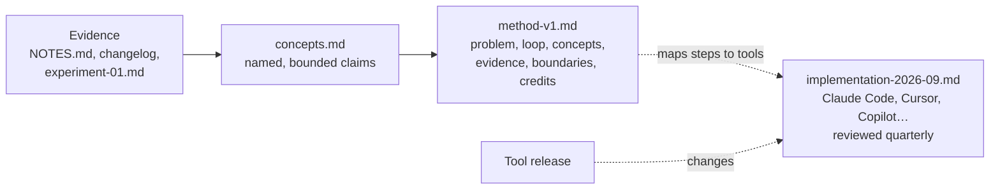

# 14.1 · Why vocabulary is the IP

## Why it matters

You now have what most people who teach AI-assisted development do not: months of diagnosed incidents in `NOTES.md` (Module 5), an AI-layer changelog with regression tasks (Module 11), and one controlled comparison with an interval and a failed guardrail (Module 13). None of it is teachable yet. A client cannot buy your `NOTES.md`, and a workshop cannot be "here are fourteen things that went wrong".

What turns evidence into something teachable is a small vocabulary. The career path this course grew from says it directly: the workshop it studied was valuable not for its rules-file syntax but for its words — "AI layer", a research-plan-implement-validate loop, "productivity mirage", "system evolution". Names are what an attendee repeats to their manager the next morning, what a team says in code review ("that's a shadow rule"), and what makes a method quotable and therefore findable.

Two traps sit on either side. The first is **reselling**: teaching the words you learned — including this course's own working names — as if they were yours. [05.1](../module-05/lesson-01.md) warned you that research → plan → implement → validate were working names, and that you would name your own loop from your own evidence. That is this module. The second trap is the **tool tutorial**: writing your method as a list of clicks in today's agent. It feels concrete, and it expires with the next release.

> [!NOTE]
> Content tags. **Concept** (stable): the seven parts of a methodology, names as handles, semantic diffusion, the concept/implementation split and the tool-change test. **Implementation**: the `MethodCheck tooldep` command and its word list (as of 2026-09).

## How it works

### What a methodology is

A methodology is not a list of tips. It is a claim about how a kind of work goes wrong, a repeatable way of doing it better, and the evidence that the way works — packaged so that someone else can apply it without you in the room. Seven parts, each with a test:

| Part | Question it answers | Test |
|---|---|---|
| 1. Problem and audience | Whose problem, in what setting? | Names a setting narrow enough to exclude someone |
| 2. Loop | What do you do, in what order? | Every step has an **output** you can point at |
| 3. Concepts | What goes wrong, and what is it called? | Each is a bounded claim, traced to dated evidence |
| 4. Evidence | Why believe it? | Every claim sits on a rung of the [claims ladder](../module-13/lesson-06.md) |
| 5. Boundaries | When not to use it? | At least one situation where you would say "don't" |
| 6. Artifacts | What do people take away? | Templates, checks, examples someone else can reuse |
| 7. Evolution | How does it change when it is wrong? | A version, a changelog and a policy (14.3) |

Plus one section that is not a part but a duty: **credits** (14.4).

Most things called "a method" fail on two or three rows. A **tips list** has no loop and no evidence. A **tool tutorial** has a loop but its outputs are clicks, not artifacts, and it has no boundaries. A **copied framework** has all seven parts — somebody else's.

### Why names carry the value

A name is a handle on a recurring pattern. Martin Fowler's advice for pattern writers applies directly: names should be short (two or three words), noun phrases so they fit into conversation ("you need a ___ here"), and they matter because they enter a profession's vocabulary. That last point is the business case. Once a team says "that's a shadow rule" in review, your method is running without you, and the name points back to where it came from.

Names are also where methods decay. Fowler calls it **semantic diffusion**: a term spreads to people who never read its definition and its meaning weakens, "a succession of the telephone game". His examples are "agile" and "Web 2.0"; desirable-sounding, broad terms diffuse fastest. Two defenses follow, and both are parts of the table above: a precise definition with a **boundary** (a concept that applies everywhere cannot be misapplied, because it says nothing), and an owner who keeps restating it (your versioned `concepts.md`).

What a name is *not* is legal protection. Copyright does not cover ideas, methods or short phrases (14.4). The value is the combination only you have: the name, the evidence behind it, and your ability to say where it stops working.

### Concept vs implementation: the tool-change test

Every lesson in this course tags its content as concept or implementation. Your method needs the same split, as two files:



The method describes what each step must produce and why. The implementation file says how to produce it in today's tools. When a tool renames a feature, only the implementation file changes.

The **tool-change test** makes this measurable. Count the method's sentences that only make sense for one tool or one release:

$$\text{tool dependence} = \frac{\text{sentences naming a tool, command, file format or model}}{\text{all sentences}}$$

*Tiny example.* A 19-sentence method in which 16 sentences mention plan mode, `/clear`, `CLAUDE.md` or a model name scores $16/19 = 84\%$. After the rewrite below, one sentence in 34 mentions a tool — in the credits: $1/34 = 3\%$.

*Interpretation.* Above about 20%, a tool change breaks the method, and a student using a different agent cannot follow it at all. Near zero is not the goal either: a method with no mapping to any tool is hard to start. The mapping just belongs in its own file.

## Show me

The Contoso student in the lab (illustrative: `labs/module-14/evidence/`) started with a vocabulary inventory — every term they used in their last three explanations of their work (two weekly summaries and the experiment report's summary), tagged by origin:

| Term | Where I use it | Origin | Evidence of my own | Action |
|---|---|---|---|---|
| research → plan → implement → validate | every explanation | this course; HumanLayer's RPI; Anthropic's explore → plan → implement → commit | 14 incidents, EXP-01 | rename from my evidence, credit the shape |
| AI layer | intro slide | this course, from the career path | layer v0.3 → v1.0 changelog | keep, credit |
| paste-and-go | "why the loop" | this course | INC-01, INC-08, INC-12 | replace with my concept |
| "the agent makes up its own overdue logic" | weekly summary 2026-02-27 | **mine** | INC-01, 05, 08, 12 | candidate concept (14.2) |
| "green but wrong" | retro notes | **mine** | INC-02, 07, 10 | candidate concept (14.2) |
| PR review 49% faster | report, secondary | **mine** (EXP-01) | EXP-01 | candidate: a measurement trap |
| plan mode, `/clear`, Explore subagent | everywhere | Claude Code | — | move to implementation file |
| context engineering | intro | industry term | — | keep as generic |

Three things stand out. The loop — the thing they were proudest of — is the least original part. The candidate concepts are the ugly phrases from their own notes, not the polished course words. And the tool vocabulary was in every explanation, which is why their first method draft was a tutorial.

The skeleton they wrote next (`method-notes/method-v1.md`) has the seven headings from the table, a `Version: 0.1.0` line, the problem statement ("teams maintaining a legacy .NET and SQL Server system who already use a coding agent every day") and one explicit non-audience ("not for greenfield prototypes, one-line fixes, or teams without a test suite they trust"). The concept section stays empty until 14.2.

## Try it

Budget: 60 minutes.

1. **Inventory (20 min).** Collect three recent explanations of your agent work: a `NOTES.md` weekly summary, your `experiment-01.md` summary, and one message or talk where you explained it to someone. List every term you used (expect 20–40). Tag each: *this course*, *public framework* (which one), *tool*, *generic*, or *mine*. For *mine*, write the incident or experiment IDs behind it.
2. **Skeleton (25 min).** Create `method-notes/method-v1.md` with the seven parts as headings, a `Version: 0.1.0` line, a problem statement that excludes someone, and at least one boundary. Leave Concepts empty. Put every tool-specific instruction into `method-notes/implementation-2026-09.md` as a table: step × tool.
3. **Tool-change test (15 min).** Copy `labs/module-14/data/tool-terms.txt` into `method-notes/`, add the tools your team uses, and run:

```bash
cd labs/module-14
dotnet run --project tools/MethodCheck -- tooldep ~/method-notes/method-v1.md --tools ~/method-notes/tool-terms.txt
```

<details>
<summary>Hint: almost every term in your inventory is tagged "this course" or "tool"</summary>

That is normal after thirteen modules of working names, and it is the point of the exercise. Go back to your failure-diagnosis log and your retro notes, not your polished summaries: the phrases you used when something had just gone wrong ("it wrote its own version again") are where your own concepts are. If you have fewer than ten diagnosed incidents, keep logging for two more weeks before 14.2.
</details>

## Break it

Open `labs/module-14/break/14.1-tool-tutorial/method-v0.md`, the student's first attempt, written in March. It is ten steps ("Start every ticket in Claude Code with plan mode on (press Shift+Tab twice)", "After two failed corrections, run /clear…", "Use Opus for planning and Sonnet for implementation…"), a "Why it works" section and tips for Cursor and Copilot users. Every step is good advice — much of it is straight from the Claude Code best-practices page.

Before running anything: estimate what share of its sentences would be wrong or meaningless if the team switched agents, or if the next release renamed plan mode. Then run:

```bash
dotnet run --project tools/MethodCheck -- tooldep break/14.1-tool-tutorial/method-v0.md --tools data/tool-terms.txt
```

## Fix it

**Diagnose.** `tooldep` reports 16 of 19 sentences (84%) tool-dependent. Against the seven parts, v0 has a loop whose outputs are keystrokes, no problem statement, no concepts, no boundaries and an evidence section that is all opinion ("Claude Code is much better when plan mode is on", "my tickets go faster"). It is a tool tutorial, and a borrowed one: its advice is the vendor's, so a client could get it for free from the docs.

**Modify.** For each sentence, ask two questions: *what problem does this solve?* and *what is my evidence?* Then write the answer as a step output, and move the keystrokes to the implementation file:

| v0 sentence | What problem? | Method sentence | Implementation file |
|---|---|---|---|
| "Start every ticket in plan mode" | changes nobody asked for (INC-03) | "Write the plan with an explicit list of what will not change." | plan mode, Plan agent in Copilot |
| "Ask the Explore subagent to find the files" | re-invented rules (INC-01, 08, 12) | "Before any plan, name what already exists, with a source per line." | Explore subagent, `/prime` skill |
| "Run /clear after two failed corrections" | lost decisions (INC-05) | "Each step reads its inputs from files, not from the conversation." | `/clear`, new chat |
| "Use Opus for planning…" | cost | (dropped: no evidence either way) | model routing, if measured |
| "Review the diff before committing" | agent-graded work (INC-02, 07, 10) | "Prove with checks the agent did not write and cannot edit." | hooks, `LoopGate`, CI |

The "Why it works" section becomes an Evidence section at rung 2 of the claims ladder: 14 diagnosed incidents and EXP-01, with its interval and its failed guardrail.

**Rerun.** `tooldep solution/method-v1.0.0.md` reports 1 of 34 sentences (3%): the credits line that names the vendor's workflow — which is where a tool name belongs. Compare your result with `labs/module-14/solution/method-v1.0.0.md` and `implementation-2026-09.md`; compare structure, not names.

## How do I know it works?

- [ ] Your inventory has every term tagged by origin, and each *mine* term has at least one incident or experiment ID.
- [ ] `method-v1.md` has the seven parts; each loop step names an output; the problem statement excludes someone; at least one boundary.
- [ ] `tooldep` on `method-v1.md` is at or below 20%, and every tool-specific instruction lives in `implementation-YYYY-MM.md`.
- [ ] A colleague using a different agent can read `method-v1.md` and say what they would do at each step.

## Use / don't use

**Use** this split for anything you will teach, sell or publish: the method page states claims and outputs; the implementation page changes every quarter without touching the method.

**Don't** write a method before you have evidence — as a rough floor, ten or more diagnosed incidents across several weeks and one comparison, even a small one. Before that you can only write a tips list, and it will be mostly other people's tips. **Don't** coin names for generic things ("the Review Step"): a name must earn its place by pointing at something your audience does not already have a word for.

**Limitations.**

- `tooldep` is a word list. It misses tool dependence without tool names ("press the green button") and flags harmless mentions. Read the sentences it lists; do not optimize the number.
- The seven parts are this course's working structure, drawn from pattern writing and the methods you have used; they are a checklist, not a standard.
- A vocabulary inventory from three explanations is a sample. Your most important concept may be in a conversation you did not write down.

## Reflect

1. Which term in your inventory did you think was yours and turned out to be borrowed?
2. Which ugly phrase from your own notes deserves a proper name?
3. What would your method lose if your team switched agents tomorrow?

## Sources

- [Martin Fowler (2006) — Semantic Diffusion](https://martinfowler.com/bliki/SemanticDiffusion.html) — how a term's meaning weakens as it spreads beyond people who know its definition; "agile" and "Web 2.0" as examples; recovery by restating the definition.
- [Martin Fowler (2006) — Writing Software Patterns](https://martinfowler.com/articles/writingPatterns.html) — pattern names as short noun phrases that enter a profession's vocabulary; describing when (and when not) to apply a solution.
- [Claude Code docs — Best practices](https://code.claude.com/docs/en/best-practices) — the vendor's explore → plan → implement → commit workflow and tool-specific advice (plan mode, `/clear`, subagents) that the break's v0 repeats as if it were a method.
