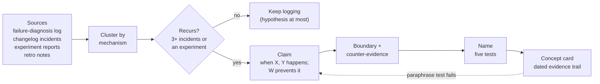

# 14.2 · Incident to principle to name

## Why it matters

The rule from the career path this course grew from is blunt: "If you can't name something you didn't discover yourself, leave it generic." Every concept you teach must trace to a dated incident or experiment in your own notes. That is what lets you answer the hardest question in any workshop — "how do you know?" — with a date, a ticket and a diff instead of an opinion.

It is also what separates a concept from a slogan. "Agents need context" is true, generic and unteachable: nobody can disagree with it, so nobody learns anything from it. "When the agent cannot see a business rule that already exists, it writes a second copy with a slightly different meaning" can be wrong — and because it can be wrong, a team can check it on their own code next week. That is the kind of sentence a workshop is built on.

This lesson is the mining step. You have been collecting the ore since Module 5: the failure-diagnosis log, the AI-layer changelog's incidents (Module 11), the experiment report (Module 13). Most of it will not become a concept. Two or three things will, and they will carry your method.

> [!NOTE]
> Content tags. **Concept** (stable): clustering by mechanism, falsifiable bounded claims, evidence strength and status, name tests, the paraphrase test. **Implementation**: the concept card format and `MethodCheck trace` (as of 2026-09).

## How it works

### The pipeline



The order matters. The name comes **last**. A name chosen first becomes a lens: you start noticing incidents that fit it and stop noticing the ones that do not. `MethodCheck trace` enforces this crudely: a card whose `Named` date is earlier than all of its evidence fails.

### Cluster by mechanism, not by symptom

Symptoms are what the reviewer saw; the mechanism is why it happened. Four incidents in the lab notes look unrelated — an overdue check, a redefined word, a balance calculation, a rounding rule — until you read the failure-diagnosis columns you filled in Module 5: origin phase R, primary class *insufficient context* (class 5 of the [failure taxonomy](../../templates/agent-failure-taxonomy.md)), and in every case *something correct already existed and was not in the agent's context*. Same mechanism, four symptoms.

Useful cluster keys, all of which your log already has: origin phase (R/P/I/V), primary and escape class, what was missing, and the fix that worked at the origin. Incidents that share origin, class and fix are almost always one pattern.

### From pattern to claim

A claim has four parts, and each can be checked:

- **When** — the condition ("on tickets that touch an existing business term").
- **What happens** — the observable result ("a run without a reuse search produces a second implementation").
- **What prevents it** — the intervention ("a research step that must name the existing implementation").
- **Where it stops** — the boundary ("terms with one implementation already in context; greenfield code").

Then write down what would count as **counter-evidence** — for this claim, a shadow rule created even though the brief named the existing rule. A claim with no possible counter-evidence is not a claim.

### Evidence strength and status

| Status | Evidence | What you may say |
|---|---|---|
| hypothesis | 1–2 incidents | "I have seen this twice; watch for it" |
| supported | 3+ incidents on 2+ dates, or an experiment with an interval | "This happens; here is how often and what prevents it" |
| retired | kept, with date and reason | "I used to teach this; here is why I stopped" |

"Happens a lot" deserves a number, and you already have the tool from [07.4](../module-07/lesson-04.md).

*Intuition.* The rate at which a failure recurs is a proportion, and with a handful of tickets its uncertainty is large.

*Equation.* With $k$ occurrences in $n$ eligible runs, $\hat p = k/n$ and $z = 1.96$, the Wilson interval is

$$\frac{\hat p + \frac{z^2}{2n} \pm z\sqrt{\frac{\hat p(1-\hat p)}{n} + \frac{z^2}{4n^2}}}{1 + \frac{z^2}{n}}$$

*Tiny example.* In the lab notes, 7 runs touched an existing business term without a brief that named the existing implementation; 4 produced a shadow rule: $\hat p = 57\%$, 95% interval 25% to 84%. Five runs had a brief that named it; none did: 0 of 5, interval 0% to 43%.

*Implementation.* `ImpactStats compare --binary` from [Module 13](../../labs/module-13/README.md) computes it, or three lines of C#.

*Interpretation.* The first interval supports "this happens in at least one in four such runs" — enough to name the pattern. The two intervals overlap between 25% and 43%, so "a reuse search prevents it" is suggestive, not shown. The card says so in its counter-evidence line, and the next experiment knows what to test.

### Five name tests

Fowler's advice for pattern names — short noun phrases that fit into conversation — plus three from teaching:

1. **Mechanism, not mood.** It points at what happens ("Shadow rule"), not at a feeling ("The Phoenix Effect").
2. **Two to four words, usable in a sentence:** "that's a ___".
3. **Not taken.** Search the web and the frameworks your audience knows (14.4). "Duplicate logic" fails: it already means something broader.
4. **Blameless.** The SRE postmortem standard applies to names too: focus on the system, not on a culprit. "Lazy agent" and "Green lie" blame; they also misdiagnose, because the evidence shows a missing gate, not intent.
5. **Recognizable.** A teammate who lived through the incidents recognizes it from the name alone.

## Show me

The lab's illustrative student (`labs/module-14/evidence/NOTES-contoso.md`, 14 incidents, January to April) clustered their failure-diagnosis log:

| Cluster | Incidents | Shared mechanism | Status |
|---|---|---|---|
| A | INC-01, 05, 08, 12 | an existing rule or term was not in context; the agent wrote its own | supported (4 incidents, 4 dates) |
| B | INC-02, 07, 10 | the only checks were written or edited by the agent in the same run | supported (3, 3 dates) |
| C | INC-09, 13 | a rule added after an incident, with no task, deleted in a tidy-up | hypothesis (2) |
| — | INC-03, 04, 06, 11 | one each: scope creep, architecture, silent product decision, stale tool | not concepts; they justify loop steps |
| — | INC-14 | not a defect: the loop cost more than it saved on a one-line ticket | counter-evidence → a boundary of the loop |
| D | EXP-01 | review time −49%, time to PR +35%, cycle time −16% | supported (experiment) |

Cluster A's claim went through three drafts. "Agents duplicate code" (true, generic, untestable). "Agents ignore existing code" (blames, and wrong: the code was never in context). Final: the four-part claim above. Name candidates: *Agent amnesia* (wrong mechanism: nothing was forgotten), *Duplicate logic* (taken, too broad), *Rogue rule* (blames), **Shadow rule** — a second, unofficial version living beside the real one, like shadow IT. It passed all five tests; the student's team lead recognized it from the name.

The finished card (`labs/module-14/solution/concepts.md`, format from the [concept card template](../../templates/concept-card.md)):

```markdown
## C1 · Shadow rule
- Status: supported
- Named: 2026-03-01
- Plain words: When the agent cannot see a business rule that already exists, it writes a
  second copy with a slightly different meaning, and both stay in the code.
- Claim: On tickets that touch an existing business term (overdue, balance, issued, VAT), a run
  without a reuse search produces a second implementation of the term; a research step that must
  name the existing implementation prevents it.
- Boundary: Terms with exactly one implementation that the agent's context already contains;
  greenfield code with no existing rules.
- Counter-evidence: none yet. Watch for a shadow rule created even though the brief named the
  existing rule.
- Evidence:
  - 2026-01-12 · INC-01 · own overdue check next to InvoiceService.IsOverdue (NOTES link)
  - 2026-02-04 · INC-05 · plan redefined "issued" after the brief was lost (NOTES link)
  - 2026-02-25 · INC-08 · C# balance calculation next to usp_GetCustomerBalance (NOTES link)
  - 2026-03-25 · INC-12 · VAT rounding re-implemented with a different midpoint rule (NOTES link)
```

Cluster D became *Late-PR illusion*: a measurement trap, not an agent failure, and the only concept with numbers — each with its interval from EXP-01.

## Try it

Budget: 90 minutes, plus 20 minutes with a non-engineer.

1. **Gather (15 min).** Copy into one file: your `NOTES.md` failure-diagnosis rows, the incident entries from your `AI-LAYER-CHANGELOG.md` (11.5), and the results table and "does not show" list from `experiment-01.md`. Give every item an ID (`INC-nn`, `EXP-nn`) and a date if it lacks one.
2. **Cluster (20 min).** Sort by origin phase, then primary class, then fix at origin. Mark clusters of three or more, and single incidents that contradict something you believe (they become boundaries).
3. **Claims and names (30 min).** For your two or three strongest clusters, write the four-part claim, the counter-evidence line and the boundary, then five name candidates each, scored against the five tests. Where a cluster has an eligible denominator, compute its Wilson interval.
4. **Cards (15 min).** Write `method-notes/concepts.md` from the [concept card template](../../templates/concept-card.md), then run:

```bash
cd labs/module-14
dotnet run --project tools/MethodCheck -- trace ~/method-notes/concepts.md
```

5. **Paraphrase test (20 min).** Give a non-engineer — a PM, your manager, a designer — the loop from your `method-v1.md` skeleton and `concepts.md`. Ten minutes to read, then the two questions and the scoring table from the template. Write down their words verbatim.

<details>
<summary>Hint: none of my clusters reaches three incidents</summary>

Either your log is too short or your clusters are too narrow. Check the second: are you clustering by symptom ("wrong rounding", "wrong date") rather than by what was missing? If the log really is short, keep your best cluster as a **hypothesis** card and keep logging. A method with one supported concept and two honest hypotheses is stronger than three inflated ones.
</details>

## Break it

Open `labs/module-14/break/14.2-anecdote/concepts.md`, written by the same student the evening after a good week. Card C2, *The Research Brief Speed Multiplier*, says "Writing a research brief first makes tickets 3x faster", status supported, with one evidence line: BILL-157, loop 35 minutes vs paste-and-go 110 minutes. C3, *Agent amnesia*, cites INC-05.

Before running anything, list what is wrong with C2. Then:

```bash
dotnet run --project tools/MethodCheck -- trace break/14.2-anecdote/concepts.md
```

## Fix it

**Diagnose.** `trace` reports six errors and two warnings. C2 was named on 5 January, six weeks before its only evidence (the name came first); "3x" has no interval and no experiment; one ticket cannot support "supported"; the boundary is "none"; the plain words need "subagent", "context window" and "LLM"; the name is five words. Worse, the notes contain the answer: the paste-and-go run of BILL-157 had two resets, so the 3x is mostly one bad run, and INC-14 shows the loop *losing* on a one-line ticket. The one experiment, EXP-01, measured −16% for the whole way of working, with an interval of −25% to −5%. C3 links its evidence to a file that does not contain INC-05.

**Modify.** Delete C2. Its honest remainder — "on a one-line ticket, skip the research" — is a boundary of the loop (INC-14), not a concept. For C3, fix the link, then notice that INC-05 is already evidence for C1 and for the loop's rule that each step reads its inputs from files; a one-incident concept that overlaps another one is not worth a name. Fold it in.

**Rerun.** `trace solution/concepts.md` reports no errors on four cards: two supported from incidents, one supported from an experiment, one hypothesis. Compare structure, not names.

## How do I know it works?

- [ ] `trace` passes on your `concepts.md` with no errors; you have read and decided on every warning.
- [ ] Every card's claim has a condition, a result, an intervention and a boundary, and its counter-evidence line says what would falsify it.
- [ ] Every number in a card has an interval from an experiment; recurrence rates have Wilson intervals with the eligible denominator stated.
- [ ] The paraphrase test passed: every loop step and concept correct or at most one partial, recorded in the asker's own words.
- [ ] You have two or three concepts, not ten.

## Use / don't use

**Use** this pipeline for every concept you teach, and rerun it whenever the log grows by ten incidents: clusters move.

**Don't** name a pattern from one memorable incident, however vivid. **Don't** promote a concept because it would make a good slide. **Don't** keep a concept that failed the paraphrase test by adding a longer definition: rename it or rewrite the plain words, then test with someone new.

**Limitations.**

- Your incidents come from one codebase and your own way of logging. A concept supported in your notes is a claim about your setting until someone else's evidence agrees (claims ladder rung 3 at best).
- Clustering is judgment. Two honest people will cluster the same log differently; the evidence trail makes the judgment inspectable, not objective.
- Incidents are what got noticed. Failures nobody caught are missing from every log, which biases concepts toward failures that are easy to see.

## Reflect

1. Which of your clusters surprised you, and what had you been calling it before?
2. Which name did you like most and reject, and which test did it fail?
3. What did the non-engineer say back that you did not expect?

## Sources

- [Martin Fowler (2006) — Writing Software Patterns](https://martinfowler.com/articles/writingPatterns.html) — patterns describe recurring solutions with the problem and when not to use them; names as short noun phrases usable in conversation.
- [Google SRE book — Postmortem Culture](https://sre.google/sre-book/postmortem-culture/) — blameless write-ups focused on contributing causes and preventive actions rather than individuals; the standard behind the "blameless" name test.
- [Brown, Cai and DasGupta (2001) — Interval Estimation for a Binomial Proportion](https://projecteuclid.org/journals/statistical-science/volume-16/issue-2/Interval-Estimation-for-a-Binomial-Proportion/10.1214/ss/1009213286.full) — the Wilson interval's good coverage at small n, used here for recurrence rates.
