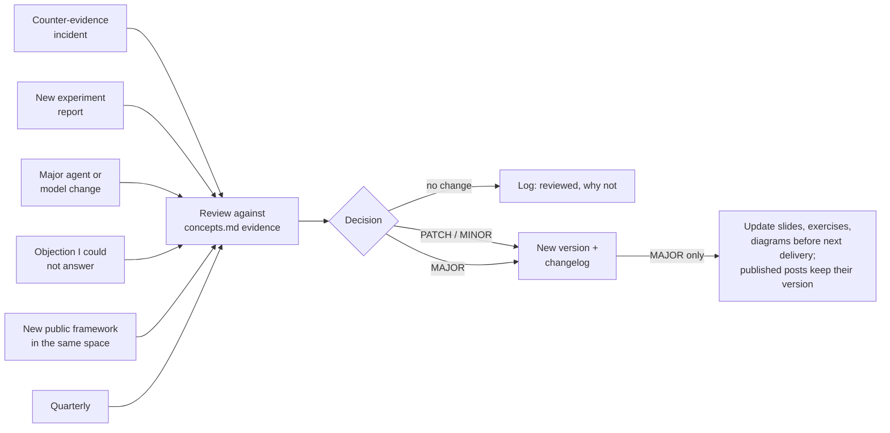
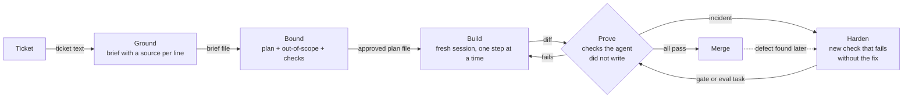

# 14.3 · Diagrams, versioning and the evolution policy

## Why it matters

Your method will be wrong somewhere. EXP-01's defect guardrail already failed; the next model release will change which failures are common; a workshop attendee will ask a question your evidence cannot answer. A method that cannot change becomes a liability, and one that changes silently is worse: the posts you published, the slides you taught and the colleague who now teaches your loop all describe a version that no longer exists — semantic diffusion that you caused yourself.

The career path this course grew from asks for two artifacts here: your own diagram, "redrawn from your own repo's actual before/after", not traced from someone else's slide; and an honest FAQ for the hardest objections you have heard. This lesson adds what makes both last: a version number that means something, and a one-page policy for when and how the method changes.

The diagram is the part people remember. In a workshop, the loop diagram stays on screen for two hours and ends up photographed on phones. It is worth drawing as carefully as the concepts are written.

> [!NOTE]
> Content tags. **Concept** (stable): diagram rules, semantic versioning applied to a method, retire-never-delete, evolution triggers, the objections FAQ. **Implementation**: Mermaid syntax and `MethodCheck diff` (as of 2026-09).

## How it works

### Diagrams that explain

Most method diagrams are four rounded boxes in a circle with arrows between them. They decorate; they do not explain, because nothing in them can be checked. Six rules, the first four adapted from the C4 model's notation guidance for architecture diagrams:

1. **Every box is something you can point at**: an artifact (brief, plan, diff), a check or a decision — with a short description of what it contains.
2. **Every arrow is labelled** with what is handed over, and goes one way.
3. **Title and key.** Say which version of the method the diagram shows and what the shapes mean.
4. **No unexplained jargon**, including your own concept names: a diagram is often seen without the page.
5. **Show failure paths.** Where does work go back when a check fails, and what happens after a defect escapes? A loop with no back-edge is a brochure.
6. **One idea per diagram**, passing the whiteboard test: someone who has seen it twice can redraw it from memory in a minute.

The **before/after diagram** follows the same rules and one more: it is drawn from your own repository's actual before and after, and the "after" carries every number from your report that a sponsor would want — including the guardrail. A before/after that shows only the good number is an advertisement.

Keep diagrams as text. Mermaid renders diagrams from Markdown-like definitions precisely to fight "doc rot"; a diagram in `diagrams/loop.md` is diffed, reviewed and versioned with the method, while an image exported from a drawing tool drifts from the method it illustrates.

### Versioning a method

Semantic Versioning defines `MAJOR.MINOR.PATCH` for software with a public API: MAJOR for incompatible changes, MINOR for backward-compatible additions, PATCH for backward-compatible fixes. A method has a public API too: **what people learned and now repeat** — the loop steps and the concept names and meanings. Anyone who taught or wrote about version 1 is a consumer of that API.

| Change | Bump | Why |
|---|---|---|
| Loop step added, removed, renamed or reordered | MAJOR | every slide, diagram and exercise changes |
| Concept retired or removed | MAJOR | people were taught to look for it |
| Concept renamed with no alias | MAJOR | old posts and notes point at nothing |
| Concept added, promoted, or renamed keeping `formerly "…"` | MINOR | old material stays true |
| Wording, examples, new evidence without a status change | PATCH | nothing anyone learned is wrong |

Three rules sit on top. **Retire, never delete**: a retired concept stays in the list with its date and where the idea went, so old material still resolves. **Never reuse a name** for a different meaning. **Every version has a changelog entry**, written for humans in the Keep a Changelog spirit, naming the evidence (INC-, EXP-, FAQ- ids) that caused it and the teaching materials it breaks. `MethodCheck diff` checks the bump, the entry and name reuse between two versions.

The tool mapping (`implementation-YYYY-MM.md`, 14.1) is outside this version. It changes every quarter; the method should not.

### The evolution policy

[11.5](../module-11/lesson-05.md) gave your team a system-evolution loop for the **AI layer** of one repository: incident → regression task → smallest fix → changelog. That loop keeps rules files honest. The method needs its own, one level up, because its inputs are different:



The one-page policy ([method evolution policy template](../../templates/method-evolution-policy.md)) states what is versioned, the bump rules, the triggers with deadlines, who owns and who reviews a MAJOR change, and how teaching materials follow. Its most important line is often the materials rule: published posts are not rewritten, but the method page says which version each post describes.

### The objections FAQ

Collect objections verbatim from wherever you hear them — the discovery interviews of Module 1, the lunch-and-learn, a retro. For each: the objection in the asker's words, who asked (role, anonymized), your answer, the evidence ID behind it, and what you do **not** know. The last column is what makes the FAQ trustworthy, and it is where your next experiment comes from. An objection you cannot answer from evidence is a trigger in the policy, not a sales problem.

## Show me

The lab student's loop for version 2.0.0 (`labs/module-14/solution/diagrams.md`):



Every box names its output, every arrow its hand-over, and two paths go backwards. The before/after diagram in the same file ends with "cycle time −16% (CI −25% to −5%); escaped defects: not yet shown to be lower".

How 2.0.0 came about: two C4 *Unguarded rule* incidents (INC-09, INC-13) were both fixed by a check, not a rule. The student concluded that turning incidents into checks was a loop step, not a concept, added **Harden**, retired C4 into it, and ran:

```text
$ dotnet run --project tools/MethodCheck -- diff solution/method-v1.0.0.md solution/method-v2.0.0.md
  MAJOR  loop changed: Ground → Bound → Build → Prove  ⇒  Ground → Bound → Build → Prove → Harden
  MAJOR  C4 status hypothesis → retired
  MINOR  C5 'Unread rule' added (hypothesis)
required bump: MAJOR   actual bump: MAJOR
0 error(s), 0 warning(s)
```

The changelog entry names the evidence and the materials: "Workshop slides 3, 7 and 12 and the loop diagram change." Their FAQ's first entry is the objection they hear most — "Isn't this just research-plan-implement with new names?" — answered "Yes, the shape is common and credited…", with "not tested separately" in the what-we-do-not-know column.

## Try it

Budget: 60 minutes.

1. **Diagrams (20 min).** In `method-notes/diagrams/`, write `loop.md` and `before-after.md` in Mermaid, following the six rules. Draw the before/after from your own repository and your own report, guardrails included. Show the loop to a colleague twice, then ask them to redraw it on a whiteboard.
2. **Version (5 min).** Now that `concepts.md` exists, set `Version: 1.0.0` in `method-v1.md`, list the concepts as `- **C1 · Name** (status) — one line`, and add `## Changelog` with a `### 1.0.0 — date` entry.
3. **Policy (15 min).** Write `method-notes/evolution-policy.md` from the template. One page. Name a real reviewer.
4. **FAQ (15 min).** Write `method-notes/faq.md` with at least the two hardest objections you have heard. If you have not heard any yet, ask two colleagues "what would stop you using this?" and write down their words.
5. **One real change (5 min).** Make a change your evidence already justifies (a status, a boundary, a wording fix), release it, and run `MethodCheck diff` on the two versions.

<details>
<summary>Hint: my before/after diagram has no numbers I trust</summary>

Then it should say so. Use the counts you do trust (incidents by origin phase before and after the loop, from your failure-diagnosis log) and write "not measured" where a sponsor would expect a number. A before/after with "not measured" in one box is more persuasive to an engineering audience than one with an unsupported percentage.
</details>

## Break it

Six weeks after 1.0.0, before a workshop, the student "tidies up" the method and releases `labs/module-14/break/14.3-silent-rename/method-v1.0.1.md`, changelog entry: "Wording tidy-up before the October workshop." Open it next to `solution/method-v1.0.0.md`.

Predict: what bump do the changes require, and is anything worse than a wrong version number? Then:

```bash
dotnet run --project tools/MethodCheck -- diff solution/method-v1.0.0.md break/14.3-silent-rename/method-v1.0.1.md
```

## Fix it

**Diagnose.** `diff` lists a new loop step (Harden), C2 renamed from *Self-graded green* to *Green lie* without an alias, C4 *Unguarded rule* deleted, and a new C5 that reuses the name *Unguarded rule* for a different idea (rules the agent stops reading in a long file). Required bump MAJOR; actual PATCH. The name reuse is the worst of it: every attendee of the June lunch-and-learn now has a term that means two things, and nothing on the page tells them.

**Modify.** Release the change honestly as 2.0.0 (`solution/method-v2.0.0.md`):

- Keep Harden, and say in the changelog which evidence justified it (INC-09, INC-13).
- Keep C2's name. The rename was cosmetic, and "Green lie" fails the blameless test from 14.2: the evidence shows a missing gate, not an agent lying. The changelog records that it was considered and rejected.
- Retire C4 instead of deleting it: status retired, "merged into the Harden step in 2.0.0".
- Give the new idea a new name, *Unread rule*, as a hypothesis.
- List the slides and diagrams that change, and update `diagrams/loop.md` to 2.0.0.

**Rerun.** `diff solution/method-v1.0.0.md solution/method-v2.0.0.md`: required MAJOR, actual MAJOR, no errors.

## How do I know it works?

- [ ] Both diagrams follow the six rules; the loop has at least one failure path; the before/after includes your guardrail result.
- [ ] A colleague redrew the loop from memory after seeing it twice.
- [ ] `method-v1.md` has a `Version:` line and a changelog; `MethodCheck diff` passes on your last change.
- [ ] `evolution-policy.md` fits on one page, names a reviewer, and has a materials rule.
- [ ] `faq.md` answers at least two real objections, each with an evidence ID or an explicit "we do not know".

## Use / don't use

**Use** versioning from the first time anyone other than you uses the method — a colleague, a lunch-and-learn, a post. **Use** the FAQ as your workshop's hard-questions bank (Module 17).

**Don't** bump MAJOR for every idea: frequent breaking changes tell your audience the method is not ready. Batch them, and use hypotheses to try ideas without changing the loop. **Don't** redraw someone else's diagram with your labels; that is the copied framework from 14.1 in picture form (14.4 covers attribution).

**Limitations.**

- Semantic Versioning was designed for software APIs. Its mapping onto "what people learned" is a judgment; the table above is this course's convention, not a standard.
- `MethodCheck diff` compares structure (loop steps, concept ids, names, statuses). A claim whose meaning changed under the same name passes as a PATCH; the review has to catch that.
- A policy is only as good as its triggers being noticed. Counter-evidence you did not log cannot trigger anything.

## Reflect

1. Which box or arrow in your loop diagram could not be pointed at before you applied the rules?
2. Which objection in your FAQ has "we do not know" in it, and what would it take to know?
3. Who, besides you, is already using your method's words?

## Sources

- [Semantic Versioning 2.0.0](https://semver.org/) — MAJOR.MINOR.PATCH for incompatible changes, backward-compatible additions and fixes to a public API.
- [Keep a Changelog 1.1.0](https://keepachangelog.com/en/1.1.0/) — changelogs written for humans, one entry per version, with dates.
- [C4 model — Notation](https://c4model.com/diagrams/notation) — diagram titles, a key or legend, labelled one-directional relationships, short element descriptions, explained acronyms.
- [Mermaid — About Mermaid](https://mermaid.js.org/intro/) — diagrams defined as Markdown-inspired text, to keep documentation diagrams from going out of date.
