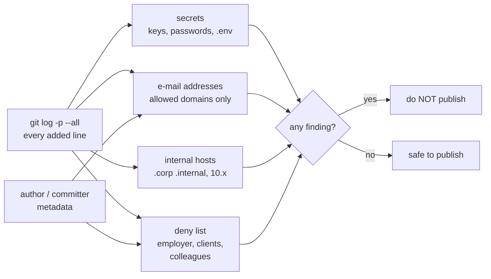

# 15.1 · Designing a credible brownfield demo

## Why it matters

Everything you have built since Module 3 lives in a private repository on code you cannot show. Your employer's codebase cannot appear in a public workshop, a video or a sales call, and neither can its ticket text, its people or its numbers ([14.4](../module-14/lesson-04.md)). So the most convincing thing you have — the AI layer working on real legacy code — is exactly what you cannot put on a screen.

The usual answer is a toy: a to-do API generated last night, one commit, an agent that sails through it. Engineers who maintain ten-year-old systems with three data-access patterns and a wiki page that lies see through it in a minute. It tells them nothing about their Monday.

The career path this course grew from puts it in one line: build an app with "enough history, mess, and undocumented conventions that a 'make it AI-native' demo is credible, not staged." This lesson is about what *credible* means in checkable terms, how to pick the one ticket you will run in front of people, and how to make sure the repository is safe to publish — in every commit, not only the last one.

> [!NOTE]
> Content tags. **Concept** (stable): the six properties, choosing a demo ticket on evidence, confidentiality as a property of the whole history. **Implementation**: `assemble-demo.sh` and `DemoCheck credibility` (as of 2026-09).

## How it works

### Six properties of a credible demo

| Property | What the audience must be able to see | Evidence in the repository |
|---|---|---|
| 1. Real mess | Years of history, several authors, two eras of code side by side | `git log` spans years; a `Legacy/` folder next to an ADR that replaced it |
| 2. Hidden conventions | Rules that exist in code and review but not in the docs — or that the docs contradict | Convention tests; a stale architecture page |
| 3. A recognizable ticket | Pain the room has felt: the "annoying" ticket, not the hard one | A backlog ticket with acceptance criteria, traced to a PRD |
| 4. Real stakes | Something that matters could go wrong: a number, a customer, a migration | A constraint someone outside engineering cares about |
| 5. Repeatable | The run works most of the time, and you know how often | Measured runs with an interval, not "it worked on Tuesday" |
| 6. Safe to show | Nothing from an employer or client, in any commit | A clean confidentiality scan of the whole history |

The first four make the demo *worth* watching, the fifth *survivable* live, the sixth *legal* to show.

Contoso Billing already has properties 1–4, because Module 3 built it that way on purpose: `SqlHelper` from 2016 next to ADR 0007's Dapper repositories, `docs/ARCHITECTURE.md` from 2021 telling you to use `SqlHelper` and `DateTime.Now`, `ConventionTests` that fail when an agent obeys the stale page, and migrations with an undo-script convention that starts halfway through. What it lacked was a real git history (Module 3 shipped it as a text excerpt), a company around it, and a demo ticket.

### Port the idea, never the artifacts

The career path suggests rebuilding "a simplified version of a feature you shipped years ago at a job you've since left — familiar enough to demo fluently, distant enough to be safely public." That works for the *idea*. It fails when a config file, a customer's quirk, a colleague's name or a share path comes along with it. Retype, rename and re-invent every detail; the lab's break is what happens when you copy instead.

### Choosing the demo ticket on evidence

The demo ticket is a measurement problem. You will run it live once, so you need to know its success rate before you stand up. Treat each candidate like an eval task from [Module 7](../module-07/lesson-02.md): at least ten runs with the layer in fresh worktrees, graded by checks the agent did not write (tests, `LoopGate`, the acceptance criteria), timed; and five runs *without* the layer, to see the gap you will be showing.

*Intuition.* Nine clean runs out of ten sounds safe. With ten runs, the uncertainty is wide.

*Equation.* The Wilson interval from [07.4](../module-07/lesson-04.md), with $k$ clean runs of $n$ and $z = 1.96$:

$$\frac{\hat p + \frac{z^2}{2n} \pm z\sqrt{\frac{\hat p(1-\hat p)}{n} + \frac{z^2}{4n^2}}}{1 + \frac{z^2}{n}}, \qquad \hat p = k/n$$

*Tiny example.* 9 of 10 gives 60% to 98%. 7 of 10 gives 40% to 89%. 5 of 10 gives 24% to 76%.

*Implementation.* `DemoCheck runsheet` prints it per segment (15.4); `ImpactStats compare --binary` from Module 13 does the same.

*Interpretation.* Ten runs cannot tell 9/10 from 7/10 with confidence, but they can rule out a ticket that fails half the time. Use the lower bound as the pessimistic planning number, and never pick the ticket whose *point* estimate you like best.

Four selection criteria, in order:

1. **Repeatable:** ≥ 8 of 10 clean runs with the layer, and the 90th-percentile duration fits the live slot (about 20 minutes for the full loop).
2. **A visible gap:** without the layer, ≤ 1 of 5 runs passes, and it fails in a way a developer recognizes in one sentence.
3. **Recognizable:** at least four of five colleagues, shown only the title, say "we have one of those".
4. **Few moving parts:** every live dependency (a database, a tracker, a second MCP server) is another way to fail in front of the room.

### Confidentiality is a property of the history

A public repository publishes every commit. A password added on Monday and deleted on Tuesday is public on Wednesday; so is the work e-mail in `git config user.email`. `DemoCheck credibility` therefore scans every line ever added on every ref, plus author and committer metadata:



Two design choices matter. Fictional addresses use domains reserved for documentation: RFC 2606 reserves `.example`, `.test`, `.invalid` and `.localhost`, and `example.com/.net/.org`, so `dana.katz@contoso.example` can never reach a real person. And the **deny list lives outside the repository**: a file named `deny-terms.txt` listing your employer's and clients' names, committed to a public demo, publishes exactly what it was meant to protect. `credibility` fails if you point it at a list inside the repo.

## Show me

Six candidate tickets, measured (`labs/module-15/samples/ticket-selection.csv`, **illustrative**):

| Ticket | With layer | 95% interval | p90 min | Without layer | Recognized | Verdict |
|---|---|---|---|---|---|---|
| BILL-97 move revenue report off `SqlHelper` | 9/10 | 60–98% | 18 | 0/5 (`SqlHelper` + `DataSet`, convention test red) | 5/5 | **pick** |
| BILL-142 overdue invoices | 9/10 | 60–98% | 16 | 1/5 | 3/5 | good, but Module 3 already showed it |
| BILL-151 collections summary | 7/10 | 40–89% | 22 | 2/5 | 4/5 | great story, too fragile live |
| BILL-153 PO number, NOT NULL | 5/10 | 24–76% | 34 | 0/5 | 4/5 | fails half the time, overruns |
| BILL-161 latest note | 6/10 | 31–83% | 29 | 1/5 | 3/5 | needs the live schema server |
| BILL-180 can void | 10/10 | 72–100% | 8 | 4/5 | 2/5 | nothing to see: before passes too |

BILL-97 is the ticket every legacy team has: the last caller of the obsolete helper, two years old, "Low" priority, avoided because Finance reconciles the report every month. Without the layer, the agent follows `docs/ARCHITECTURE.md` and writes more `SqlHelper`. With it, the research brief finds ADR 0007, and the plan keeps Finance's filter and writes the void-invoice question down instead of "fixing" the number. That second behaviour is the teaching moment of the whole demo — the [Shadow rule](../module-14/lesson-02.md) avoided on screen.

The assembled repository (`bash scripts/assemble-demo.sh --out ../../../brownfield-demo`) replays 19 dated commits by five fictional people from 2016 to 2026, then the student's seven AI-layer commits. Seven files enter history in an early form and change later (`SqlHelper` gains `[Obsolete]` with ADR 0007 in 2024; `InvoiceService` gains `OutstandingAsync` with BILL-131), so `git log -p` shows code evolving rather than arriving finished. Git lets you set these dates explicitly with `GIT_AUTHOR_DATE` and `GIT_COMMITTER_DATE`; the history is reconstructed and the README says so.

```text
$ dotnet run --project tools/DemoCheck -- credibility ../../../brownfield-demo --deny ~/private/deny-terms.txt
Credibility
History      PASS  27 commits, 2016-03-02 to 2026-09-28 (10.6 years), 6 authors
Two eras     PASS  legacy code: src/Contoso.Billing/Legacy/MonthlyRevenueReport.cs (+1); decision record: docs/adr/0007-dapper-repositories.md
Stale docs   PASS  docs/ARCHITECTURE.md names Billing.sln (not in the repo) -- real mess
Tests        PASS  2 test files, 1 convention/architecture test file(s)
Tickets      PASS  10 tickets, 10 with acceptance criteria; demo ticket BILL-97 open on this branch
PRD          PASS  2: prd/PRD-collections-q4.md, prd/PRD-finance-close-q4.md

Confidentiality (every commit, not only HEAD)
Secrets      PASS  0 findings in 27 commits
E-mail       PASS  only allowed domains (contoso.example, users.noreply.github.com)
Hosts/IPs    PASS  no internal host names or private addresses
Deny terms   PASS  0 of 4 terms found

Result: safe to publish (0 errors, 0 warnings)
```

Notice what "Stale docs: PASS" means: a wrong document is *required*. A demo repository whose docs are all correct is not a brownfield.

## Try it

Budget: about 2.5 hours, most of it runs you do not watch.

1. **Score the sample (15 min).** Apply the four criteria to `samples/ticket-selection.csv` without reading the verdict column. Where do you disagree with the table, and why?
2. **Assemble (10 min).** From `labs/module-15`, with a public address for your commits:

```bash
export DEMO_AUTHOR_NAME="Your Name" DEMO_AUTHOR_EMAIL="you@users.noreply.github.com"
bash scripts/assemble-demo.sh --out ../../../brownfield-demo
cd ../../../brownfield-demo && dotnet test Contoso.Billing.sln        # 6 passed
```

3. **Measure two candidates (about 2 h unattended).** Pick BILL-97 and one other. For each: ten runs of your loop with the layer, each in a fresh worktree at `ai-layer-v1`, headless with the Module 11 run contract if your skills load in headless mode (Module 6's trigger tests did); five runs at `before-ai-layer`. Grade with `dotnet test`, `LoopGate` and the ticket's acceptance criteria — never with the agent's summary. Record passes, minutes and the one-sentence failure.
4. **Deny list (10 min).** Write `~/private/deny-terms.txt` — outside the demo folder — with your employer's and clients' names, product code names, internal domains and share names, and the colleagues whose names you might type from habit.
5. **Scan (5 min).**

```bash
cd <course>/labs/module-15
dotnet run --project tools/DemoCheck -- credibility ../../../brownfield-demo --deny ~/private/deny-terms.txt
```

<details>
<summary>Hint: my own ticket beats BILL-97 on every criterion</summary>

Good — use it, but only if it is in *this* repository and needs nothing from your employer's code to make sense. If it only makes sense with your company's domain, rebuild the domain first: a fictional company with the same shape of problem is the job of lesson 15.2.
</details>

## Break it

Build the variant a student produced after "porting the revenue export I built at my last job":

```bash
bash scripts/assemble-demo.sh --out /tmp/demo-151 --break 15.1
ls /tmp/demo-151/src/Contoso.Billing        # no appsettings file: it was deleted in the next commit
dotnet run --project tools/DemoCheck -- credibility /tmp/demo-151 --deny samples/deny-terms.example.txt
```

The working tree looks clean. Predict how many findings the scan reports before you run it.

## Fix it

**Diagnose.** Four errors. *Secrets:* a connection string with a password in `appsettings.Development.json`, added and deleted a minute later — still in commit history. *E-mail:* the two commits were authored with a work address (`demo.trainer@northwindpayments.test` here), and the notes name a former colleague's address. *Hosts/IPs:* `sql-billing01.northwind.corp` and a `10.x` file share. *Deny terms:* the previous employer and its client are named in the notes, the config and both commit records. None of it is visible at HEAD.

**Modify.** On a real leak, order matters: **revoke or rotate the secret first**, because GitHub's own guidance is that rewriting history does not remove copies in clones and forks. Then rewrite history (`git filter-repo` is the tool GitHub recommends), force-push, and ask anyone with a clone to re-clone. For a demo repository that was never pushed, the cheaper fix is to rebuild: drop the two commits from the manifest (here: build without `--break`), set `DEMO_AUTHOR_EMAIL` to your noreply address, and add `git config user.email` to the checklist you run before every commit in this repository. Then retype the idea you wanted to port, with Contoso names.

**Rerun.** `credibility` on the rebuilt repository: 0 errors. Keep the deny list; you will rerun the scan before every push.

## How do I know it works?

- [ ] `credibility` passes with your private deny list: 0 errors, and every warning read and either fixed or written down.
- [ ] The demo ticket has ≥ 8/10 clean runs with the layer, ≤ 1/5 without, p90 duration inside the live slot — from your runs, recorded in `demo/ticket-selection.csv`.
- [ ] A colleague shown only the ticket title says "we have one of those".
- [ ] You can point to the file or commit that shows each of the six properties.
- [ ] No commit in the repository was authored with your work address.

## Use / don't use

**Use** a purpose-built brownfield demo for every public talk, video, workshop and sales call, and for internal talks where the audience includes people who should not see the code you are demoing.

**Don't** demo on employer or client code in public, even "just the structure". **Don't** choose the demo ticket by how impressive the best run was. **Don't** clean up the mess to make the repository look professional: the stale doc and the legacy helper are the demo.

**Limitations.**

- A reconstructed history is realistic in shape, not in every diff. Say so in the README; a sharp attendee will check `git log`.
- Ten runs give a wide interval: they protect you from a bad ticket, not from a bad day (15.4).
- Pattern scans miss what they do not know: a customer's name spelled differently, a screenshot, a proprietary algorithm retyped from memory. The deny list and a human read of every file are still needed.

## Reflect

1. Which of the six properties was your own first demo idea missing?
2. What did your measured runs show that your memory of "it usually works" did not?
3. Which name or detail from your real work came closest to slipping into the demo?

## Sources

- [RFC 2606 — Reserved Top Level DNS Names](https://www.rfc-editor.org/rfc/rfc2606) — `.test`, `.example`, `.invalid`, `.localhost` and `example.com/.net/.org` are reserved for testing and documentation, so fictional addresses cannot reach real people.
- [GitHub Docs — Removing sensitive data from a repository](https://docs.github.com/en/authentication/keeping-your-account-and-data-secure/removing-sensitive-data-from-a-repository) — revoke or rotate the secret first; rewrite with `git filter-repo`; clones and forks keep the data.
- [Git — git-commit](https://git-scm.com/docs/git-commit) — `GIT_AUTHOR_DATE` / `GIT_COMMITTER_DATE` and the accepted date formats used to replay a dated history.
- [Brown, Cai and DasGupta (2001) — Interval Estimation for a Binomial Proportion](https://projecteuclid.org/journals/statistical-science/volume-16/issue-2/Interval-Estimation-for-a-Binomial-Proportion/10.1214/ss/1009213286.full) — the Wilson interval's coverage at small n, used for demo-ticket success rates.
