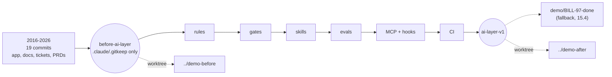

# 15.2 · Company scaffolding and the before state

## Why it matters

A repository is not a company. What makes a demo "feel like a real company, not a toy", in the words of the career path, is everything around the code: a product manager who wrote a PRD, a ticket with a reporter and acceptance criteria, a Finance controller who will notice if a number moves, a wiki page nobody updated. That is also exactly the material the AI layer is supposed to make usable — tickets, PRDs and conventions are the inputs of `/prime` and `/plan-feature` since [Module 6](../module-06/lesson-02.md).

The second half of the lesson is the argument the demo makes. Every AI-native demo is a before/after: here is the agent without the layer, here it is with. That is a comparison, and [Module 13](../module-13/lesson-04.md) taught you what happens to comparisons with confounds. If the "after" also has a fixed doc, a better model or a rehearsed branch, the audience is watching a difference you did not claim — and the sharpest person in the room will find it in `git log`.

> [!NOTE]
> Content tags. **Concept** (stable): company scaffolding, the before/after as a controlled comparison, what one run shows. **Implementation**: tags, worktrees, `gh`, `DemoCheck before` (as of 2026-09).

## How it works

### The company scaffold

| Artifact | Where it lives | Why the demo needs it | Contoso example |
|---|---|---|---|
| Handbook | `company/README.md` | who uses the system, how work flows, definition of done | Collections and Finance; month-end freeze |
| Team | `company/team.md` | names in `git log` belong to someone; who owns the AI layer | six fictional people, one who left in 2023 |
| Glossary | `company/glossary.md` | business terms the agent must not redefine | "monthly revenue" includes every status |
| PRDs | `prd/` | tickets trace to a *why*; non-goals constrain the agent | *Finance close Q4*: do not change what counts as revenue |
| Tickets | `tickets/` + a tracker | the demo's input, with reporter and acceptance criteria | BILL-97, BILL-180 and eight from earlier modules |
| One stale page | `company/docs/onboarding.md` | real companies have one; it tempts the agent | "open `Billing.sln` in VS 2019, use `SqlHelper`" |

Three rules keep the scaffold honest. Every ticket traces to a PRD requirement or is tech debt with a reason. Every person and address is fictional, on a reserved domain ([15.1](lesson-01.md)). And at least one constraint comes from **outside engineering** — here, Finance reconciles the revenue report every month — because that is what gives a demo stakes.

Tickets live in the repository for the agent and in a tracker for the audience. Module 8's `integration/import-tickets.sh` creates one GitHub issue per ticket with `gh issue create --title … --body-file … --label …`; a free Jira or Linear site works the same way. Showing the ticket in a real tracker, then showing the agent read it, is ten seconds of credibility.

### The before/after is an experiment with n = 1



Treat the two tags as the two arms of a comparison and hold everything else constant:

1. **The before is really before.** At `before-ai-layer` there is no `AGENTS.md`, no `CLAUDE.md`, nothing under `.claude/` but a placeholder, no `.mcp.json`. Claude Code loads `CLAUDE.md` files and `.claude/` settings from the project automatically, so any of them left in place quietly turns the "before" into a partial "after".
2. **Only the layer changes.** Between the tags, every changed path is an AI-layer path (`demo/demo.json` lists them: rules, `.claude/`, `.github/`, gates, tools, evals, templates, `docs/ai/`). A "while I was there" fix to app code or docs is a second treatment.
3. **The ticket is still open at both tags.** No commit mentions it, and the code it changes is unchanged (for BILL-97: `Legacy/MonthlyRevenueReport.cs` still calls `SqlHelper.ExecuteDataSet`).
4. **Same everything else.** Same agent version and model, same prompt text, a fresh session on each side, same machine. Watch for memory that crosses the line: Claude Code's auto memory is stored per repository and **shared across its worktrees**, so notes saved during an after run can reach the before run. Turn it off for demo sessions (`CLAUDE_CODE_DISABLE_AUTO_MEMORY=1`) and write all of this in the run sheet.

`DemoCheck before` checks rules 1–3 mechanically; rule 4 is on you.

### What one run can show

One live before/after run is **rung 1** on the [claims ladder](../module-13/lesson-06.md): an observation. It shows *how* the two differ — the before writes `SqlHelper` code because the 2021 page says so; the after cites ADR 0007 — and that is valuable teaching. It does not show *how often*. The numbers from your ticket selection (0/5 without, 9/10 with) are what you say out loud next to it, with the interval, and with the sentence "measured on this repository, not on yours".

## Show me

One run on each side, in two worktrees, same prompt ("Implement BILL-97"), same agent and model, fresh sessions (illustrative, consistent with the 15.1 sample):

| | `../demo-before` | `../demo-after` |
|---|---|---|
| Reads first | `tickets/BILL-97.md`, `docs/ARCHITECTURE.md` | ticket, `AGENTS.md`, ADR 0007, `InvoiceRepository`, the PRD non-goal (via `/prime`) |
| Data access | new `RevenueReportService` calling `SqlHelper.ExecuteDataSet` outside `Legacy/` | `IRevenueReportRepository` + Dapper, token on every async method |
| Finance's number | unchanged by luck | unchanged by design: filter pinned by a characterization test |
| Open questions | none written | two, carried into the PR: void invoices; UTC month boundary |
| `dotnet test` | 1 failed (`Only_the_Legacy_folder_may_call_SqlHelper`) | 9 passed (was 6) |
| Minutes | 7 | 16 |

The after is *slower*. Say so: the time went into research and a plan a reviewer can approve in five minutes, and the before's seven minutes produced a red build. That honesty is worth more than a faster-looking run.

The mechanical check on the assembled repository:

```text
$ dotnet run --project tools/DemoCheck -- before ../../../brownfield-demo
Tags         PASS  before-ai-layer: 2026-09-21; ai-layer-v1: 2026-09-28
Empty layer  PASS  at before-ai-layer: no AI-layer files (placeholder: .claude/.gitkeep)
Layer-only   PASS  79 files changed between the tags, all under layer paths
Ticket open  PASS  BILL-97 is not in any commit message up to ai-layer-v1
Ticket file  PASS  tickets/BILL-97.md at before-ai-layer with acceptance criteria
Still open   PASS  before-ai-layer: src/Contoso.Billing/Legacy/MonthlyRevenueReport.cs still contains "SqlHelper.ExecuteDataSet"
Still open   PASS  ai-layer-v1: src/Contoso.Billing/Legacy/MonthlyRevenueReport.cs still contains "SqlHelper.ExecuteDataSet"

Result: a fair before/after (0 errors, 0 warnings)
```

## Try it

Budget: about 2 hours.

1. **Read the scaffold (15 min).** Read `company/`, both PRDs and three tickets in the assembled repository as if you were new. Write down one thing that made it feel like a company and one that did not; fix the second in your copy of `labs/module-15/company/` and rebuild.
2. **Tracker (15 min).** In a **throwaway** GitHub repository you own (or the demo repository once it is public), import the tickets with your own `gh` login:

```bash
bash <course>/labs/module-08/integration/import-tickets.sh <you>/brownfield-demo tickets/*.md
```

3. **Two worktrees (5 min).**

```bash
cd brownfield-demo
git worktree add ../demo-before before-ai-layer
git worktree add ../demo-after ai-layer-v1
```

4. **One run each side (60 min).** Same prompt, fresh sessions, agent version and model written down. In the after worktree use your loop (`/prime`, `/plan-feature`, implement, `/validate`). Fill the comparison table above with your own observations. Reset each worktree afterwards with `git reset --hard <tag>` and `git clean -fdx`.
5. **Check (5 min).** `dotnet run --project tools/DemoCheck -- before <path to brownfield-demo>` from `labs/module-15`.
6. **The sentence (10 min).** Write the one sentence you will say next to the live comparison, with your measured numbers and their intervals.

<details>
<summary>Hint: my before run passed</summary>

Then either the ticket does not need the layer (pick another, 15.1) or the before is not really before. Check for a `CLAUDE.md` in a parent folder or in `~/.claude/` (Claude Code loads user-level and ancestor memory files too), and for auto memory saved during an earlier after run: it is shared across worktrees of the same repository. For the before run, use a machine account or temporarily move your user-level `CLAUDE.md` aside, and note it in the run sheet.
</details>

## Break it

A student rehearsed BILL-97 on `main` a few times before tagging, and while adding the layer "also fixed" the stale architecture page:

```bash
bash scripts/assemble-demo.sh --out /tmp/demo-152 --break 15.2
dotnet run --project tools/DemoCheck -- before /tmp/demo-152
```

Before running it: what would the audience see differently in the before run, and why would that be worse than a failed demo?

## Fix it

**Diagnose.** Four errors. *Ticket open* and *Still open ×2:* commit "BILL-97 rehearsal 3 (keep for reference)" sits before the before tag, so both worktrees already contain the finished report — the audience would watch the agent "solve" a ticket whose solution is in the tree. *Layer-only:* `docs/ARCHITECTURE.md` changed between the tags. It looks harmless, even helpful, but it removes the exact thing the before agent follows. The after now differs by the layer **and** a corrected doc, so the demo can no longer say which one made the difference, and the before run gets better for reasons unrelated to the layer.

**Modify.** Rehearse only in worktrees you reset (`git reset --hard <tag>`), or on `rehearsal/*` branches that never merge; keep the finished version on the fallback branch, which starts *after* the after tag. The doc fix is real work: give it its own ticket and commit it after the demo, or show it as a separate step with its own before/after. Rebuild without `--break`.

**Rerun.** `before` reports 0 errors. Compare `git diff --stat before-ai-layer ai-layer-v1`: every path is part of the layer.

## How do I know it works?

- [ ] `DemoCheck before` passes: empty layer at the before tag, layer-only diff, ticket open at both tags.
- [ ] Every ticket traces to a PRD requirement or states why it is tech debt; at least one constraint comes from outside engineering.
- [ ] The tickets are visible in a tracker, and you can show the agent reading the same text.
- [ ] Your comparison table was filled from two fresh sessions with the same agent version, model and prompt.
- [ ] You have one sentence with your measured numbers and intervals to say next to the live comparison.

## Use / don't use

**Use** tagged before/after states for every demo that claims the AI layer makes a difference, and keep the layer's history as separate commits: the commits themselves become a tour of the layer.

**Don't** stage a straw-man before: a weaker model, no tests, a deliberately vague prompt or an older agent version. The audience will run the before themselves one day. **Don't** present one live run as evidence of a rate. **Don't** keep a rehearsal on `main`.

**Limitations.**

- The before/after holds the code constant but not the model: a new model release can shrink the gap overnight. Re-measure before every public talk and date the numbers.
- A fictional company is thinner than a real one. Attendees from large organizations may find the politics missing; that is a trade for being able to show it at all.
- The layer-only rule is about paths. A layer file can still smuggle in app knowledge (a rule that spells out the solution); review what the layer says, not only where it lives.

## Reflect

1. What in your real team's context would you most like to show, and how did you make a fictional version of it?
2. Where was your before run closest to accidentally being an after?
3. What sentence will you say to stop the audience from reading the live comparison as a productivity claim?

## Sources

- [Git — git-worktree](https://git-scm.com/docs/git-worktree) — `git worktree add <path> <commit-ish>` checks out a second working tree of the same repository, used for the before and after sides.
- [GitHub CLI — gh issue create](https://cli.github.com/manual/gh_issue_create) — `--title`, `--body-file` and `--label`, used by the Module 8 import script to load tickets into a tracker.
- [Claude Code docs — memory](https://code.claude.com/docs/en/memory) — how `CLAUDE.md` files are loaded from the project, parent directories and the user's home, which is why a "before" needs an empty layer and a clean user profile; auto memory is per repository and shared across worktrees.
