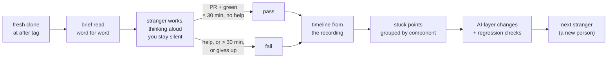

# 15.3 · The unedited recording and the stranger test

## Why it matters

Two homework items from the career path carry this lesson. The first: "Record yourself, screen and voice, running your full loop against one ticket end-to-end, unedited, 15–20 minutes. Watch it back before you show anyone." The second: get a developer who has never seen your work to run your skills against a ticket they pick, "with zero help from you. Where they get stuck is your skills' actual weak points." The module's exit test is the second one: a stranger gets a working PR from your skills in 30 minutes, unaided.

Both are about the same gap: between what you *know* your layer does and what it does when you are not steering. In your own hands the layer works because you fill its holes without noticing — a nudge here, a re-prompt there, the setup command you ran months ago. An edited video hides those nudges from the audience; your presence hides them from you. The unedited recording shows you your nudges. The stranger shows you the holes.

> [!NOTE]
> Content tags. **Concept** (stable): unedited runs as data, the watch-back rubric, think-aloud testing, what counts as help, how many testers. **Implementation**: the timeline format, `DemoCheck timeline`, recording tools (as of 2026-09).

## How it works

### The unedited recording

One take, one file, screen and voice, one ticket from ticket to draft PR, 15–20 minutes. "Unedited" is strict: no pause button, no cuts, no speed-up, no re-take of a segment. If the agent fails, the failure stays in the file, and so does what you did about it.

Why so strict? Because the recording has three jobs, and editing breaks all of them:

1. **Rehearsal data.** It is the only honest record of how long each segment takes and where you intervened.
2. **Fallback material.** In 15.4 you will cut to it live when something breaks; a recording with hidden cuts can hide a failure at exactly that spot.
3. **Public evidence.** Viewers who later run the layer themselves will hit whatever you cut out.

Recordings are large. GitHub warns above 50 MiB and blocks files over 100 MiB, so keep the video in a release (or any file host) and commit only the timeline and a link.

### The timeline: a video you can grep

While watching back — at normal speed, with a notepad — log each event as `mm:ss<TAB>kind<TAB>note`. The kinds: `start`, `say` (you start explaining a point), `prompt` (you type to the agent), `wait` (the agent is working), `output`, `error`, `recover` / `fallback`, `green` (tests pass), `pr`, `cut`, `end`. `DemoCheck timeline` reads it and applies the watch-back rubric:

| Check | Rule | Why |
|---|---|---|
| Unedited | no `cut`; time only moves forward; the last event matches the file's duration | a trimmed file hides failures |
| Duration | 15–20 min | longer loses the room; shorter usually means a skipped step |
| Outcome | `green` and `pr` both present | the run ends in something a reviewer could merge |
| Recoveries | every `error` has a later `recover` or `fallback` | an unrecovered error means the file was cut there, or the run failed |
| Silent gaps | no stretch over 45 s after a non-`say` event | dead air; in the workshop (Module 17) this is where questions go |
| Off-script prompts | none tagged `[off-script]` | every prompt you improvised is a step your layer or run sheet is missing |

The last check is the most valuable. "No, use Dapper like `InvoiceRepository`" typed mid-run means the plan ignored ADR 0007, and the fix belongs in the layer ([06.4](../module-06/lesson-04.md)), not in your fingers.

### The stranger test



The protocol is in the [stranger test template](../../templates/stranger-test.md). Three rules carry it.

**Think aloud.** The stranger says what they are looking for and what they expect. Usability research uses this as its main tool because it shows *why* someone is stuck, not just *where*; the facilitator's job is to stay out of the way, since prompts and clarifying questions easily change behaviour.

**Help ends the test.** A hint, a pointed finger, "you want the plan file" — each is help. Log it as `help`; the 30-minute clock for the exit test stops counting there. People under-count help because it feels small. Every help event is a stuck point you fixed with your mouth instead of your repository.

**Tag the component.** Every `stuck` and `help` note starts with the part of the layer that failed them — `[readme]`, `[prime]`, `[plan-feature]`, `[validate]`, `[hooks]` — so `DemoCheck timeline --mode stranger` can group them. Each group becomes an entry in `AI-LAYER-CHANGELOG.md` under the evolution policy of [11.5](../module-11/lesson-05.md): what changed, which stranger event caused it, and the check that would catch a regression (a trigger-test line, an eval task, a README smoke step).

### How many strangers?

*Intuition.* One stranger only shows you the problems that happen to hit them.

*Equation.* If a stuck point affects a fraction $L$ of people, the probability that at least one of $n$ independent testers hits it is

$$P(\text{seen}) = 1 - (1 - L)^n$$

Nielsen and Landauer's usability data put the average share of problems found by one tester at $L \approx 31\%$, which is why five testers find about 85% of them.

*Tiny example.* A stuck point that bites one person in three ($L = 1/3$): one stranger sees it with probability 33%, three strangers 70%, five 87%.

*Implementation.* Test one stranger, fix what they hit, then test a **new** stranger on the fixed version. Someone who saw version 1 is no longer a stranger.

*Interpretation.* A failed stranger test is strong evidence: the problem exists. A passed one is weak evidence: the next person may hit something this one did not. Those usability numbers come from interface testing, not AI layers — use them for intuition about sample size, not as a promise.

## Show me

The reference run (`labs/module-15/samples/run-01-timeline.tsv`, illustrative):

```text
$ dotnet run --project tools/DemoCheck -- timeline samples/run-01-timeline.tsv --file-duration 17:40
Duration     PASS  17:40 (target 15:00-20:00)
Unedited     PASS  no cuts, time only moves forward, covers the whole file (17:40)
Outcome      PASS  tests green: 14:10; PR: 16:10
Recoveries   PASS  1 error(s), 1 recovered, slowest in 31 s
Silent gaps  PASS  none over 45 s; longest unnarrated stretch 45 s at 16:10
Prompts      PASS  6 typed, 0 off-script
```

At 09:00 the API returned an overload error and the session retried. The presenter kept talking — what an overload is, why nothing needed redoing — and the retry succeeded 31 seconds later. That minute stays in the file, and it is one of the better minutes of the talk.

The first stranger, Omer, picked BILL-180 on a fresh clone. His timeline, logged from the screen recording:

```text
$ dotnet run --project tools/DemoCheck -- timeline break/15.3-edited-run/stranger-01.tsv --mode stranger
Unaided      FAIL  2 time(s) the owner helped -- the test stops counting at the first one
Working PR   FAIL  PR with green tests at 29:00 (limit 30:00), but only after help

Weak points (6 stuck/help events, by component)
  readme          2     .claude/hooks/bin/AgentHooks.dll not found; owner points at the setup commands
  plan-feature    2     does not know the plan needs an approve; owner says "it wants you to approve"
  prime           1     looks for the brief in the chat; misses the file path in the 3-line reply
  validate        1     LoopGate scope fails on research/ and plans/; unsure whether to commit them
```

Four changes followed, each with a changelog entry: a three-command quick start at the top of the README, checked by a CI step on a fresh clone; `prime` 1.2.0 prints the brief's path as its first line; `plan-feature` 1.2.0 ends with "Reply approve, or edit `plans/<id>.md`"; the `validate` failure message says which folders to commit. A second stranger, Lior, on the fixed version: PR with green tests at 24:40, no help, two minor stuck points (`samples/stranger-02.tsv`).

## Try it

Budget: about 3 hours, including one stranger session.

1. **Record (30 min).** In the after worktree, reset to `ai-layer-v1`, auto memory off, notifications off, font large. One take of BILL-97 with your loop, talking throughout. Do not pause.
2. **Timeline (40 min).** Watch it back at normal speed and write `recordings/run-01-timeline.tsv`. Then:

```bash
dotnet run --project tools/DemoCheck -- timeline <demo>/recordings/run-01-timeline.tsv --file-duration <mm:ss of the file>
```

3. **Act on it (20 min).** Every off-script prompt becomes a layer change or a run-sheet line; every silent gap gets a sentence you will say there next time.
4. **Stranger (60 min).** Find a developer who has never seen the repository. Follow the template: fresh clone, brief read aloud, record, stay silent. Afterwards, write their timeline from the recording, run `--mode stranger`, and fill `recordings/stranger-test-notes.md`.
5. **Fix (30 min).** One changelog entry per weak-point group, each with its regression check. Book the next stranger.

<details>
<summary>Hint: I can't find a stranger</summary>

Ask in a meetup's chat, a former colleague, a developer friend in another stack, or trade: run their demo in exchange. A colleague on another team counts if they have not seen your layer. Your manager does not: they will try too hard to succeed.
</details>

## Break it

Open `labs/module-15/break/15.3-edited-run/`. The student's first "unedited" run, their stranger notes, and the stranger session logged from the screen recording. Before running anything, read `stranger-notes.md`: is the verdict "passed" right? Then:

```bash
dotnet run --project tools/DemoCheck -- timeline break/15.3-edited-run/run-01-timeline.tsv --file-duration 14:05
dotnet run --project tools/DemoCheck -- timeline break/15.3-edited-run/stranger-01.tsv --mode stranger
```

## Fix it

**Diagnose the recording.** Two errors, three warnings. The student paused the recording for "about 3 minutes" at 06:50 while the API retried, and the file (14:05) is longer than the timeline (13:10), so parts were trimmed. The overload error at 06:45 has no recovery: whatever happened in those minutes is not in the video, which makes this take useless as a fallback. Seven silent gaps add up to almost eight minutes of dead air. And two off-script prompts — "use Dapper like `InvoiceRepository`" and "don't touch the SQL" — show the plan ignored ADR 0007 and the Finance constraint: the layer did not carry the run; the presenter did.

**Diagnose the stranger test.** "Just a hint, not help" at 0:04 was help. By the protocol the test stopped counting there; the honest verdict is FAIL, and the weak points are the four groups in Show me.

**Modify.** Rewrite the notes with the honest verdict and the component table. Fix the layer (the plan must cite the brief's constraints; the Finance filter goes in the brief's constraints section), not your narration. Re-record in one take; if the API fails, keep talking and keep recording.

**Rerun.** The new take passes `timeline` with no off-script prompts. The next stranger — a new person — gets a timeline you can run in `--mode stranger` before you write a verdict.

## How do I know it works?

- [ ] `DemoCheck timeline` passes on your recording with `--file-duration` set from the file itself.
- [ ] Your recording has zero off-script prompts, or each one became a layer change you can point to.
- [ ] A stranger reached a PR with green tests in under 30 minutes with no `help` events — the module's exit test.
- [ ] Every stuck-point group has a changelog entry with a regression check.
- [ ] The video is in a release or on a file host; the repository holds the timeline and a link.

## Use / don't use

**Use** an unedited recording before every new version of the demo, and a stranger test after every change a new user would notice (setup, skills, prompts).

**Don't** publish an edited video as "a real run". **Don't** run the stranger test with someone who watched your talk, or on a machine you set up for them. **Don't** fix a stranger's stuck point by adding a paragraph to the README they did not read; change the tool's output where they were looking.

**Limitations.**

- One stranger is one person on one day; a pass is weak evidence (see the math).
- Think-aloud slows people down; the 30-minute limit is generous for that reason, not a productivity number.
- Strangers pick easy tickets. Note which ticket; a pass on BILL-180 says less than a pass on BILL-153.

## Reflect

1. Which of your own nudges did the recording show that you had not noticed giving?
2. What did the stranger expect to find, and where did they look for it?
3. Which fix changed the layer, and which only changed how you talk?

## Sources

- [Nielsen Norman Group — Why You Only Need to Test with 5 Users](https://www.nngroup.com/articles/why-you-only-need-to-test-with-5-users/) — problems found with $n$ users follow $N(1-(1-L)^n)$ with $L \approx 31\%$ averaged over many projects; several small iterative tests beat one large test.
- [Nielsen Norman Group — Thinking Aloud: The #1 Usability Tool](https://www.nngroup.com/articles/thinking-aloud-the-1-usability-tool/) — participants verbalize their thoughts; the facilitator stays largely passive because prompts can change behaviour.
- [GitHub Docs — About large files on GitHub](https://docs.github.com/en/repositories/working-with-files/managing-large-files/about-large-files-on-github) — warning above 50 MiB, files over 100 MiB blocked, releases recommended for large binaries.
