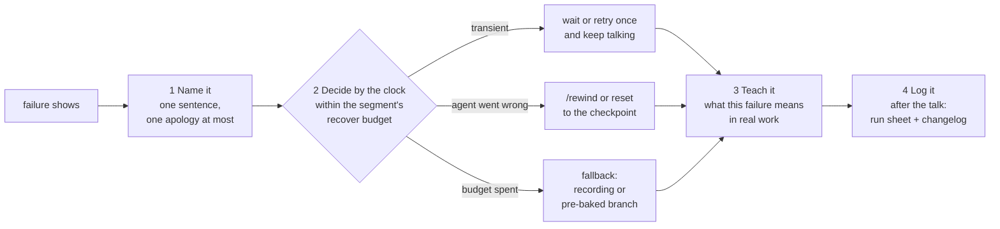

# 15.4 · When the demo breaks

## Why it matters

A live agent demo is a stochastic, multi-step system running on shared infrastructure, over conference Wi-Fi, in front of people. [Lesson 02.2](../module-02/lesson-02.md) gave you the arithmetic: if every step succeeds with probability $p$, all $k$ steps succeed with $p^k$. Your demo has five or six steps. It will break — not every time, but often enough that a demo which has never broken in front of an audience has simply not been given enough times.

What the room remembers is not whether it broke but what you did next. A presenter who freezes, apologizes for a minute and retries the same thing three times teaches the room that agents are fragile and that you do not know why. A presenter who says what happened, switches to a prepared fallback inside a minute and uses the failure to explain something true about agents in real work often gives the most useful minute of the talk. That difference is preparation, and this lesson is the preparation. The outline's lab asks you to cause a failure on purpose during a recorded run and recover on camera — so that the first time it happens is not in front of a client.

> [!NOTE]
> Content tags. **Concept** (stable): failure classes, $P(\text{clean})$ as a product, live vs recorded vs pre-baked, the recovery pattern, failure as teaching. **Implementation**: API error codes, `/rewind`, `DemoCheck runsheet` and `drill` (as of 2026-09).

## How it works

### How live agent demos break

| Class | Examples | What the room sees | Typical recovery |
|---|---|---|---|
| Model API | rate limit (HTTP 429), overload (529), 5xx, network drop | retries, then an error; nothing wrong with your code | wait up to the budget, then the recording |
| Agent behaviour | wrong plan, loop, edit outside scope, runs three times longer | a plausible-looking wrong turn | name it, `/rewind` or reset, or the pre-baked branch |
| Environment | stale snapshot, missing build output, expired token, Docker down, package restore offline | a tool error unrelated to the ticket | the T−30 checklist prevents most; otherwise pre-baked |
| Presenter | wrong worktree, leftover rehearsal state, secret on screen | confusion, or worse | reset command; a clean second terminal |
| Time | everything works, slowly | you are at minute 12 of an 8-minute segment | act at the budget, not after it |

Two of these deserve a detail. The Claude API distinguishes a 429 rate-limit error (your organization hit a limit) from a 529 overload (high traffic across all users); both are outside your control during a talk, and the official SDKs retry transient errors with backoff. And in building this module's lab, the schema MCP server's snapshot turned out to be 27 hours old the day after it was captured — past the server's 24-hour limit, so it refused every answer. A dependency that **ages** will break a demo that worked perfectly at rehearsal. The demo configuration now runs it with `--on-stale warn`, and the T−30 checklist refreshes it.

### The chance of a clean run

*Intuition.* Each live segment is a small bet. The demo is clean only if every bet pays.

*Equation.* With segment $i$ clean in $k_i$ of $n_i$ rehearsals, $\hat p_i = k_i / n_i$ and, assuming segments fail independently,

$$P(\text{clean}) = \prod_i \hat p_i \qquad E[\text{minutes lost}] = \sum_i (1 - \hat p_i)\, r_i$$

where $r_i$ is the time it takes you to switch to that segment's fallback. Replace $\hat p_i$ by each segment's Wilson lower bound ([07.4](../module-07/lesson-04.md)) for a pessimistic figure.

*Tiny example.* Five live segments rehearsed 10 times: 9, 10, 8, 10 and 9 clean. $P(\text{clean}) = 0.9 \times 1 \times 0.8 \times 1 \times 0.9 = 0.65$. With 1–2 minutes to switch per segment, the expected loss is 0.8 minutes. The product of the lower bounds is 0.09: ten rehearsals per segment cannot rule out a much worse demo.

*Implementation.* `DemoCheck runsheet` computes both from the table in your run sheet.

*Interpretation.* Roughly one talk in three will need a recovery; plan the slot for it (the 10% buffer) and rehearse the recovery, not only the run. Every segment you move from live to pre-baked multiplies the probability up. Real failures are correlated — a bad network breaks every segment at once — so treat the number as a planning tool, as 02.2 did.

### Live, recorded or pre-baked

Keep a segment **live** when watching the agent is the lesson: the research brief finding ADR 0007, the plan's "Do not touch" list, the checks running. Make it **recorded** when the content is fixed and the risk is not worth it: the before run, which is the same every time. Make it **pre-baked** when the result matters and the typing does not: implementation on the `demo/BILL-97-done` branch, whose tests you can run live in ten seconds. A segment that fails in more than one rehearsal in five is not "more exciting live"; it is recorded, pre-baked or cut.

### The recovery pattern



**Name it.** "The model API is overloaded; you can see it retrying." Saying it removes the audience's anxiety and yours. **Decide** by the budget you wrote down, not by hope: incident management in SRE teaches the same thing — declare early, one person holds the state, communicate what happens next. **Teach it.** Learning research finds that errors followed by corrective feedback help learning, especially when people were confident they would not happen (Metcalfe calls this hypercorrection). The room expected a smooth run; a failure explained well is remembered. That evidence comes from learners correcting their own errors, so treat it as a reason to explain, not a promise. **Log it**, like any incident.

Two tools help the "decide" step. Claude Code's `/rewind` restores code and conversation to the checkpoint before a prompt — but only edits made through its file-editing tools, not changes made by shell commands or by most sub-agents. Your reset command (`git reset --hard <tag>` plus `git clean`) covers everything else.

### Rehearse the failure: a drill

Chaos engineering tests confidence in a system by stating its steady state, introducing real-world disruptions and comparing. Do the same to your demo: during one rehearsal in three, cause a failure you did not choose. `DemoCheck drill` picks a live segment and a failure card (network drop, wrong plan, missing MCP server, stale snapshot, guard hook, slow run) and prints how to induce it and what your run sheet says you will do.

## Show me

The reference run sheet (`labs/module-15/solution/runsheet.md`, template: [demo run sheet](../../templates/demo-runbook.md)):

```text
$ dotnet run --project tools/DemoCheck -- runsheet solution/runsheet.md
#   Segment                           Mode      Budget  Rehearsed  p     95% interval  Fallback
3   `/prime BILL-97` and the two ope… live      05:00   9/10       0.90  0.60-0.98     rec:recordings/run-01-unedited.mp4@02:00
4   `/plan-feature` and the HUMAN ch… live      06:00   10/10      1.00  0.72-1.00     plans/BILL-97.md from branch:demo/BILL…
5   Implement: tests first, then the… live      08:00   8/10       0.80  0.49-0.94     branch:demo/BILL-97-done
6   `/validate` and `dotnet test`     live      04:00   10/10      1.00  0.72-1.00     branch:demo/BILL-97-done
7   `/pr-review` and the draft PR     live      04:00   9/10       0.90  0.60-0.98     rec:recordings/run-01-unedited.mp4@14:20
Fallbacks    PASS  all 5 live segments have one
Say line     PASS  every live segment says what you tell the room when it breaks
Budget       PASS  42:00 planned in a 50:00 slot, buffer 08:00
P(clean)     PASS  0.65 from rehearsals (pessimistic, product of lower bounds: 0.09); expected time lost to recoveries 0.8 min
```

A drill during rehearsal three:

```text
$ dotnet run --project tools/DemoCheck -- drill solution/runsheet.md --seed 11
Segment   #5 Implement: tests first, then the repository (budget 08:00)
When      about 4 min into the segment
Failure   API unreachable (stands in for a rate limit or an overload)  [api-down]
Induce    Turn off Wi-Fi or disable the network adapter for 60 seconds, then turn it back on.
```

The recovery, as logged in the rehearsal's timeline (illustrative):

```text
04:10  error     requests failing, session retrying
04:15  say       "The agent just lost the model API. Same thing a rate limit looks like. It will retry;
                  I'll give it two minutes, which is my budget for this step."
05:40  say       explains retries and why CI jobs cap them (Module 11's budget guard)
06:10  fallback  "Here is the finished change from rehearsal": git switch demo/BILL-97-done, dotnet test, 9 passed
07:00  say       back on the run sheet at segment 6, one minute behind, inside the buffer
```

A **wrong plan** drill (seed 5: `AGENTS.md` renamed before segment 4) is the better teaching moment: the plan comes back with `SqlHelper` and `DataSet` — exactly the before behaviour. "You are looking at what this repository did before it had a layer. Let me put the rules back and rewind to before the plan." Restore `AGENTS.md`, `/rewind` to the prompt before the plan, run it again. The failure becomes a live before/after.

## Try it

Budget: about 2.5 hours.

1. **Run sheet (30 min).** Write `demo/runsheet.md` from the [template](../../templates/demo-runbook.md): segments, modes, budgets, fallbacks, recover budgets and the sentence you will say for each live segment, in your own words.
2. **Fallback material (20 min).** Record the 90-second before clip; make sure `demo/BILL-97-done` (or your own pre-baked branch) passes `dotnet test`; note timestamps in your unedited recording from 15.3.
3. **Check (5 min).**

```bash
dotnet run --project tools/DemoCheck -- runsheet <demo>/demo/runsheet.md --repo <demo>
```

4. **Three rehearsals (75 min).** Full runs, reset between them, counts updated in the table and the rehearsal log.
5. **Drill on camera (20 min).** On the third rehearsal, record; run `drill` with a seed you did not pick in advance; induce the failure at the minute it says; recover with the pattern; log `error` and `recover` or `fallback` in the timeline and run `timeline` on it.

> [!CAUTION]
> Drills change your machine's state (network off, files renamed). Do them only in the demo worktree, never with a client's repository or a real API key on screen, and run your reset command before the next rehearsal.

## Break it

Open `labs/module-15/break/15.4-no-fallback/runsheet.md`, a student's first draft, and predict the result before running it:

```bash
dotnet run --project tools/DemoCheck -- runsheet break/15.4-no-fallback/runsheet.md
dotnet run --project tools/DemoCheck -- drill break/15.4-no-fallback/runsheet.md --seed 3
```

## Fix it

**Diagnose.** Three errors, two warnings. Three live segments have no fallback and three have nothing to say when they break; "Give it a second" is not a plan. The budget is 49 minutes in a 45-minute slot before anything fails. Two segments were rehearsed twice. $P(\text{clean}) = 0.27$: the demo is more likely to break than not, mostly because of segment 6, a live check against SQL Server in Docker that worked once in three rehearsals, whose "fallback" is "restart docker" — a hope, not a fallback. The drill makes it concrete: a guard hook fires during `/prime`, and the run sheet offers nothing.

**Modify.** The before run becomes a recorded clip (the same every time). "Implement the whole ticket in one prompt" becomes tests-first plus a pre-baked branch. The live database segment is cut: the schema server in snapshot mode shows the same point with no moving parts. Every live segment gets a fallback you have opened and a sentence in your own words. Rehearse until every live segment has at least three counted runs.

**Rerun.** The reference run sheet: 0 errors, $P(\text{clean}) = 0.65$, 8 minutes of buffer. With `--repo`, it fails until you have recorded the two clips it names — which is the point.

## How do I know it works?

- [ ] `DemoCheck runsheet --repo` passes: every fallback exists, every live segment has a say line and at least three rehearsals, the budget leaves 10%.
- [ ] You can state your demo's $P(\text{clean})$ and which segment dominates it.
- [ ] One recorded drill shows an `error` followed by `recover` or `fallback` within the segment's recover budget, and `timeline` passes on it.
- [ ] Your say lines are in your words, and you said one out loud during the drill without reading it.
- [ ] Your reset command returns the worktree to the tag in under 30 seconds.

## Use / don't use

**Use** a run sheet for every live demo, including a five-minute one in a team meeting, and a drill in every third rehearsal.

**Don't** retry the same failing step more than once in front of a room. **Don't** switch silently to a recording as if it were live: say "this is the run from Tuesday". **Don't** blame the tool or the model in a way you would not want quoted; describe what happened.

**Limitations.**

- The product assumes independent segments. The venue's network, a model update or a provider incident can break everything at once; that is what the recording of the whole run is for.
- Rehearsals at your desk are easier than the room: a projector, a slow network, nerves. Rehearse once in conditions like the venue.
- A fallback that is never used rots. Open every fallback during rehearsals, not only on the day.

## Reflect

1. Which of your segments dominates $P(\text{clean})$, and what did you decide to do about it?
2. What did you say in the first ten seconds of your drill, and would you say it again?
3. What does your recovery teach the audience about agents that a clean run could not?

## Sources

- [Claude API docs — Errors](https://platform.claude.com/docs/en/api/errors) — 429 `rate_limit_error` vs 529 `overloaded_error` (high traffic across all users); SDKs retry transient errors with exponential backoff.
- [Claude Code docs — Checkpointing](https://code.claude.com/docs/en/checkpointing) — `/rewind` restores code and/or conversation to a checkpoint; changes made by shell commands and most sub-agents are not tracked.
- [Principles of Chaos Engineering](https://principlesofchaos.org/) — define steady state, introduce real-world disruptions, compare; the model for the rehearsal drill.
- [Metcalfe (2017) — Learning from Errors](https://www.annualreviews.org/content/journals/10.1146/annurev-psych-010416-044022) — errorful learning followed by corrective feedback helps; high-confidence errors are corrected more readily (hypercorrection).
- [Google SRE book — Managing Incidents](https://sre.google/sre-book/managing-incidents/) — declare early, one person holds the state, clear communication; applied to a failure on stage.
