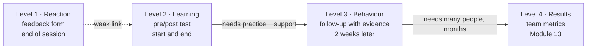

# 16.1 · How adults and engineers learn

## Why it matters

The first time most engineers teach, they measure success by the room. People laughed at the story, asked good questions, two asked for the slides, the feedback form said 4.8 out of 5. Then someone gives them a short test afterwards, and the scores barely moved.

That is not bad luck; it is one of the best-replicated findings in education research. In a randomized study in introductory physics, students taught with active methods learned more than students taught by highly rated lecturers, yet *felt* they had learned less (Deslauriers et al., 2019). A meta-analysis of multi-section studies found student ratings of teaching essentially unrelated to how much students learned (Uttl et al., 2017). Enjoyment and learning are different variables. A trainer who optimizes the first will be invited back and will change nothing.

This matters more for you than for a school teacher, because your whole business rests on one claim: *people who spend time with me get better at something that matters to their company*. Module 13 taught you not to trust a productivity claim without a controlled comparison. This module applies the same discipline to your own teaching. It starts with how learning works, so that the design choices in 16.2–16.4 are mechanisms, not tips.

> [!NOTE]
> Content tags. **Concept** (stable): Kirkpatrick's levels, reaction vs learning, working memory and prior knowledge, ICAP, retrieval, the fluency illusion, learning claims. **Implementation**: `LearnCheck gain` and `feedback` (as of 2026-09).

## How it works

### Four things you could measure

Kirkpatrick's model separates four levels of a training's effect: **reaction** (did they find it favourable, engaging, relevant), **learning** (did they acquire the intended knowledge and skills), **behaviour** (do they apply it on the job) and **results** (did the targeted organizational outcomes occur). Each level is a different question with a different instrument, and a high score on one says little about the next.



The feedback form is level 1. Everything your clients pay for is at levels 2–4. This module builds instruments for levels 1–3; level 4 is Module 13's controlled comparison and is rarely in reach for one session.

### Why a good demo can teach nothing

Cognitive load theory rests on a few uncontroversial facts about human memory (Sweller et al., 2019). New information is processed in **working memory**, which holds only a handful of new elements at once and loses them within seconds unless they are rehearsed. **Long-term memory** is effectively unlimited and holds **schemas**: organized knowledge that lets an expert treat a whole pattern ("that's a repository with a service layer and stored procedures") as one element. Learning is building and changing schemas in long-term memory. Nothing else counts.

Now watch a live demo from the audience's seat. The presenter's screen changes every few seconds: a terminal, a diff, a stored procedure, the agent's plan. For the presenter each is one familiar element; for the audience each is five new ones. Working memory saturates, and what survives is the story and the feeling of following along. That feeling has a name: the **fluency illusion**. Watching an expert do something smoothly feels like understanding it, because nothing went wrong *for you*. The Deslauriers study found exactly this: the passive group rated its learning higher because the lecture felt fluent, while the active group's struggle felt like confusion.

### Activity, not attention

If watching does not build schemas, what does? The **ICAP** framework (Chi & Wylie, 2014) sorts activities by what the learner's mind does, predicting learning in the order Interactive > Constructive > Active > Passive:

| Mode | The learner… | Example in an agent workshop |
|---|---|---|
| Passive | receives | watches the live demo |
| Active | manipulates what is given | reruns the demo's command, highlights the diff |
| Constructive | generates something new | decides whether a *different* diff is a shadow rule and says why |
| Interactive | co-constructs with a peer | argues with a partner about a borderline diff until they agree |

The broad evidence points the same way: across 225 studies in science, engineering and mathematics, active learning raised exam and concept-inventory scores by about half a standard deviation over lecturing, and students in lectures were 1.5 times as likely to fail (Freeman et al., 2014).

Two more mechanisms you will design for:

- **Retrieval strengthens memory.** Recalling something is not only a measurement; it changes what you remember. Students who were tested on a passage retained more a week later than students who reread it, although rereading won on a test five minutes later (Roediger & Karpicke, 2006). A session that ends with learners retrieving and applying beats one that ends with a recap slide.
- **Prior knowledge decides what is hard.** What a learner already knows determines which elements are new and which misconceptions are waiting. A senior engineer and a QA analyst in the same room face different loads from the same slide. You learn this before the session, not during it.

### What is different about adults, and about engineers

Knowles' andragogy is usually summarized as: adults want to know why they are learning something, bring experience, are ready to learn what helps them now, and learn around problems rather than subjects. Treat it as a design checklist, not a law; its assumptions are widely taught but thinly tested. For engineers in particular, four things hold up in practice:

1. **They will test your claim.** An engineer's first question is "how do you know?". Your concept cards from 14.2, with dated incidents and intervals, are your answer.
2. **They learn from failure.** A broken build teaches more than a green one. The course's break-it/fix-it loop exists for this reason; your session should include one.
3. **They are expert elsewhere.** Their schemas for C#, SQL and review are rich; their schema for your concept may be empty or wrong. Worked examples help them on the new part and bore them on the old (16.2).
4. **Time is the price.** Thirty minutes of six engineers is three engineer-hours. The session has to be worth that, measured, or you lose the room next time.

## Show me

The lab's illustrative student taught *Shadow rule* (C1 from the Module 14 reference [`concepts.md`](../../labs/module-14/solution/concepts.md)) to seven platform developers. They did everything the career path suggests for a first talk: a tight story, a live demo that worked first time, questions at the end. Pre- and post-tests used the same eight items as the later reference session. The notes written that evening: "Great energy, people laughed at the INC-08 story, lots of questions."

```bash
cd labs/module-16
dotnet run --project tools/LearnCheck -- feedback break/16.1-enjoyed/feedback.csv --responses break/16.1-enjoyed/responses.csv
```

```text
Reaction (Kirkpatrick level 1)
  rating mean 4.86 / 5, top-two-box 100%
Learning (Kirkpatrick level 2)
  <g> = 0.11
  self-rated confidence 89% vs actual post-test 43% (gap +46 points)
WARN  learners feel 46 points more able than the post-test shows: a fluency illusion
ERROR reaction without learning: rating 4.9/5 but <g> = 0.11. The session was enjoyed, not learned from
```

`<g>` is the normalized gain you will meet properly in 16.5: the share of the possible improvement that happened. 0.11 means learners closed about a tenth of the gap between where they started and a perfect score. The only item that moved much was I1, "which description matches a shadow rule" (57% → 100%). They could name the concept. They could not spot one in a diff they had not seen (I3 stayed at 14%), find it in SQL (I4 flat) or write the brief line that prevents it (I6 stayed at 0%).

Three weeks later the same student redesigned the session so that learners spent 13 of 22 teaching minutes deciding, searching and writing. Same concept, similar audience, same items: rating 4.0, `<g>` 0.67. The lower rating is not a bug. It is the Deslauriers pattern on a small scale.

## Try it

Budget: 60 minutes, including three conversations of five minutes each.

1. **Pick the concept (10 min).** From your `method-notes/concepts.md`, choose one card with status *supported* that a colleague could use on a real ticket this month. Not your favourite; the one with the clearest boundary.
2. **Three prior-knowledge chats (20 min).** With three people like your future audience, reuse the discipline of [01.4](../module-01/lesson-04.md): ask about the past, not opinions. "Last time an agent's PR surprised you in review, what was it?" "How would you check whether that rule already existed?" Write their words verbatim. Look for what they already know, what they believe that is wrong, and which words they use.
3. **Write the learning claim (15 min).** Start `talks/mini-workshop/session.md` from the [lesson template](../../templates/lesson-template.md). One sentence: *After this session, a ⟨role⟩ who ⟨situation⟩ can ⟨observable performance⟩.* Then list each misconception you heard, verbatim, under "Prior knowledge".
4. **Classify your instinct (15 min).** Before reading 16.2, sketch the session you would naturally give: five lines, one per segment. Label each segment P, A, C or I. Keep the sketch; you will compare it with your final plan.

<details>
<summary>Hint: my learning claim is "they will understand shadow rules"</summary>

"Understand" cannot be observed. Ask: if they understood it, what would they *do* differently on Monday, in which situation? "A developer reviewing an agent's PR can tell whether it duplicated an existing business rule and name the rule it should have reused" can be checked with a diff and a pen.
</details>

## Break it

Run both checks on the first delivery:

```bash
dotnet run --project tools/LearnCheck -- gain break/16.1-enjoyed/responses.csv --plan break/16.1-enjoyed/session.md
dotnet run --project tools/LearnCheck -- feedback break/16.1-enjoyed/feedback.csv --responses break/16.1-enjoyed/responses.csv
```

Then open `break/16.1-enjoyed/session.md` and, before running `align`, predict what it will say about the activities table.

## Fix it

**Diagnose.** Per objective, `gain` shows O1 at 0.19, O2 at 0.00, O3 at 0.07. The plan shows why: 21 of 21 teaching minutes were *show* (slides with six new terms, a 12-minute demo, Q&A). Every minute was passive in ICAP terms. Learners built a schema for the story and the name, which is exactly what I1 tests, and nothing for decide, search or write. Item I8 even went *down* (29% → 14%): after a demo that was all C#, one of the two people who had spotted the T-SQL duplicate before now answered "no". Meanwhile confidence ran 46 points ahead of performance: the demo was fluent, so it felt learned. The comments ("great demo", "very clear", "would like the slides") are all about the presenter.

**Modify.** Do not polish the demo. Move time from watching to doing: a two-minute story, a three-minute worked example, then pairs deciding on three diffs, a short live step, a solo exercise on the learner's own ticket, a two-minute reflection. That is the reference plan in `solution/mini-workshop/session.md`, built in 16.2 and 16.3.

**Rerun.** `gain` on `solution/mini-workshop/responses.csv` gives `<g>` 0.67 (0.55 to 0.85) and every objective at 0.67; `feedback` shows a rating of 4.0 and a confidence gap of −8. Enjoyment went down a little, learning went up a lot, and the learners' sense of their own ability now matches the test.

## How do I know it works?

- [ ] You can name, for any number from a training, which Kirkpatrick level it measures.
- [ ] Your `session.md` has a learning claim with an observable performance and a situation, and at least two misconceptions quoted from real people.
- [ ] Your instinctive sketch is labelled P/A/C/I, and you can say how many minutes of it are passive.
- [ ] You can explain the 16.1 break to a colleague in two sentences without the words "engagement" or "energy".

## Use / don't use

**Use** the four levels every time someone, including you, reports a training's success: ask which level the number is from. **Use** prior-knowledge chats for every new audience; ten minutes of listening saves thirty of teaching the wrong thing.

**Don't** treat feedback scores as a learning measure, and don't drop them either: relevance and the muddiest point tell you what to fix (16.5). **Don't** conclude that demos are bad. A short worked demonstration is often the best way to start; the problem is a session that is *only* demonstration.

**Limitations.**

- The research here comes mostly from university STEM courses. The mechanisms (working memory, retrieval, activity) are general; the effect sizes will not transfer one-to-one to a 30-minute session with professionals.
- ICAP classifies what learners are asked to do, not what their minds actually do; a badly designed "constructive" task can be as empty as a lecture.
- Andragogy's claims are plausible and widely taught but have little direct experimental support. Use them to check a design, not to justify one.

## Reflect

1. When did you last feel you had learned something from a talk, and could you do it a week later?
2. Which misconception from your three chats surprised you?
3. How many minutes of your instinctive sketch were passive, and what did you feel about that number?

## Sources

- [Deslauriers et al. (2019) — Measuring actual learning versus feeling of learning](https://www.pnas.org/doi/10.1073/pnas.1821936116) — randomized comparison in introductory physics: active instruction produced more learning but lower perceived learning than lectures by highly rated instructors.
- [Uttl, White and Wong Gonzalez (2017) — SET ratings and student learning are not related](https://www.sciencedirect.com/science/article/abs/pii/S0191491X16300323) — meta-analysis of multi-section studies; student ratings explain little to none of the variation in learning.
- [Kirkpatrick Partners — The Kirkpatrick Model](https://www.kirkpatrickpartners.com/the-kirkpatrick-model/) — definitions of reaction, learning, behaviour and results.
- [Freeman et al. (2014) — Active learning increases student performance in science, engineering, and mathematics](https://www.pnas.org/doi/10.1073/pnas.1319030111) — meta-analysis of 225 studies: about 0.47 standard deviations higher scores and a failure-rate odds ratio of 1.95 under lecturing.
- [Chi and Wylie (2014) — The ICAP Framework](https://www.tandfonline.com/doi/abs/10.1080/00461520.2014.965823) — passive, active, constructive and interactive engagement and the predicted ordering of learning.
- [Roediger and Karpicke (2006) — Test-Enhanced Learning](https://journals.sagepub.com/doi/10.1111/j.1467-9280.2006.01693.x) — testing beats restudying on delayed retention, though not on an immediate test.
- [Sweller, van Merriënboer and Paas (2019) — Cognitive Architecture and Instructional Design: 20 Years Later](https://doi.org/10.1007/s10648-019-09465-5) — working memory limits, long-term memory and schemas as the basis of cognitive load theory.
- [McGrath (2009) — Reviewing the evidence on how adult students learn: an examination of Knowles' model of andragogy](https://eric.ed.gov/?id=EJ860562) — secondary review of Knowles' assumptions about adult learners.
