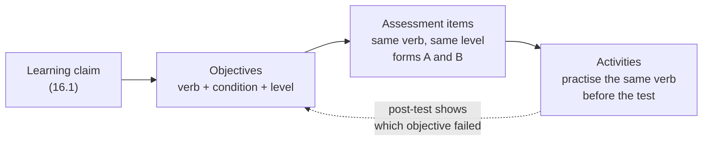

# 16.2 · Objectives, alignment and cognitive load

## Why it matters

After the demo-only session in 16.1, the lab's student fixed the obvious problem: they added pair work and a reflection. Then they wrote the objectives and the test questions from memory, the evening before. The new plan had 61% active time and still would not have worked, because the parts no longer pointed at the same thing. One objective said *decide whether a diff adds a shadow rule*; its test items asked for the definition of DRY and "why are shadow rules bad?". A perfect post-test score would have proved only that people can recite. A zero would not have told the student which step failed.

This is the mistake engineers recognize fastest once it is named: it is a test suite that does not test the requirement. Objectives are the requirement, assessment items are the tests, activities are the implementation. Write them in that order and check that they trace to each other, and the post-test in 16.5 becomes evidence. Skip it, and you are grading your own homework with a rubric that cannot fail.

The second half of this lesson is about load. Even an aligned session fails if the step that teaches the hardest objective also introduces nine new terms, three windows and a stored procedure nobody has seen.

> [!NOTE]
> Content tags. **Concept** (stable): backward design, constructive alignment, observable objectives and levels, cognitive load, worked and faded examples, expertise reversal, misconception items. **Implementation**: the session-plan format and `LearnCheck align` (as of 2026-09).

## How it works

### Backward design

Wiggins and McTighe's *Understanding by Design* plans in three stages, in this order: **desired results** (what should learners be able to do?), **assessment evidence** (what will we accept as proof?), **learning plan** (what activities get them there?). Biggs' **constructive alignment** says the same from the other side: the verb in the objective should be the verb the learner performs in the activity and in the assessment. If the objective says *decide*, learners decide during the session and decide on the test.



You write left to right. The session runs right to left. The check runs both ways: every objective has items at its level and a practice step; every item and step points at an objective.

### Objectives you can observe

A usable objective has three parts: a **condition** ("given an agent's diff"), an **observable performance** ("decide whether it added a shadow rule") and a **criterion** ("and name the existing implementation it duplicates"). Verbs such as *understand*, *know*, *learn*, *appreciate* or *be aware of* fail because nobody can watch them happen.

Each objective also has a **level** from the revised Bloom taxonomy (Krathwohl, 2002). The levels are not a ladder of worthiness; they tell you what the item must make the learner do:

| Level | The learner… | Engineering verbs | Item shape |
|---|---|---|---|
| remember | retrieves | name, list, recognize | "Which description matches…" |
| understand | explains | explain, classify, summarize | "Why does this fail…" |
| apply | carries out a procedure | run, search, configure | "Which command finds…" |
| analyze | breaks down, distinguishes | decide, diagnose, trace | "Is this diff a shadow rule? Name what it duplicates." |
| evaluate | judges against criteria | choose, justify, review | "Which of two briefs is better, and why?" |
| create | produces something new | write, design, plan | "Write the brief line for this ticket." |

The rule `LearnCheck align` enforces: every objective has at least one item **at or above its level**. An *analyze* objective tested only with *remember* items is the 16.1 failure in disguise.

Two or three objectives are the ceiling for 30 minutes. Each needs practice time and at least one (better two) items; a single item cannot tell a slip from a misconception.

### Cognitive load: what makes a step hard

Sweller's original argument (1988) was that conventional problem solving is a poor way to *learn*, because searching for a solution uses the working memory that schema building needs. Three sources of load follow:

- **Intrinsic load** comes from the material: how many elements must be held together to make sense of it. "Is this diff a shadow rule?" needs the diff, the existing rule, the term's meaning and the rule's location: four interacting elements. You cannot remove intrinsic load; you can sequence it.
- **Extraneous load** comes from your design: switching between terminal and slides, reading code that is not relevant, a diagram on one slide and its key on the next (split attention), saying aloud exactly what the slide already says (redundancy), and every new term. You can and should remove it.
- The remaining capacity is what goes into building the schema. Cut extraneous load to give it room.

Practical limits that follow: at most three new terms per step, one window at a time, and code on the screen trimmed to the lines that matter.

### Worked examples, fading and expertise reversal

For novices, studying a worked example beats solving the same problem cold, because the example removes the search. Kirschner, Sweller and Clark (2006) review the evidence that minimally guided instruction ("just try it and see") is less effective and efficient for novices than strong guidance. But the advantage reverses as expertise grows: guidance that helps novices becomes redundant load for experts. This is the **expertise reversal effect** (Kalyuga et al., 2003), and it is the reason the staff engineer at the back sighs through your walkthrough.

The answer is **progressive difficulty** with **fading**:

1. Worked example: you decide on one diff, thinking aloud.
2. Completion problem: learners get a half-solved diff (the search is done; they decide).
3. Full problem: a new diff, nothing given.
4. Transfer: their own ticket.

Experts can start at step 3; novices need steps 1 and 2. The same four steps serve a mixed room when learners choose their entry point (16.4).

### Misconceptions: find them, then test for them

A misconception is a stable wrong schema, not a gap. It survives explanation unless the learner is made to use it and see it fail. Peer Instruction (Crouch & Mazur, 2001) builds whole courses around this: a conceptual multiple-choice question whose wrong answers are the common misconceptions, individual vote, discussion with a neighbour, revote.

For your items, that means:

- **Distractors come from your prior-knowledge chats** (16.1), in the learners' words, not from your imagination.
- **Include a correct-looking non-example.** A diff that *extends* the existing rule is not a shadow rule; learners who believe "any agent change to business logic is a shadow rule" will say it is. Item I3 in the reference forms does exactly this.

## Show me

The reference plan (`labs/module-16/solution/mini-workshop/session.md`) has three objectives and eight items:

| ID | Objective | Level | Items (level) |
|---|---|---|---|
| O1 | Given an agent's diff, decide whether it added a shadow rule and name the existing implementation it duplicates. | analyze | I1 (remember), I2, I3, I8 (analyze) |
| O2 | Find every existing implementation of a business term across C# and T-SQL with one repository search before the agent plans. | apply | I4, I5 (apply) |
| O3 | Write a research-brief line that makes the agent name the existing implementation it will reuse. | create | I6, I7 (create) |

Two parallel forms (`forms.md`) carry the same items on different surfaces: form A uses *overdue* and *balance*, form B *disputed* and *VAT*. Distractors come from the student's three chats: "search the `.cs` files" (nobody searched SQL), "ask the agent whether a rule exists", "the test file is a third implementation". I3 is the non-example; on the pre-test only 1 of 6 got it right, on the post-test 5 of 6.

Load, step by step. The old opening slide introduced nine terms: the loop, research brief, shadow rule, self-graded green, late-PR illusion, unguarded rule, boundary, counter-evidence, status. Only two of them are needed to reach the objectives. The reference plan introduces three terms in the whole session: *shadow rule* in the story, *existing implementation* in the worked example, *research brief* in the live step. The other concepts from the method are not mentioned at all. That is not dumbing down; it is choosing what this session is for.

## Try it

Budget: 75 minutes.

1. **Objectives (20 min).** Under the learning claim in your `session.md`, write two or three objectives in the table format of the [lesson template](../../templates/lesson-template.md): condition, observable verb, criterion, level. Read each aloud and ask "could I watch someone do this?"
2. **Items (30 min).** Write two items per objective at the objective's level, then a second, parallel version of each on a different surface (a different business term, file or ticket). Put the misconceptions from your chats into distractors. Add one non-example. Write the rubric for every open item now, with 0/1 criteria. Item rules are in the [pre/post assessment template](../../templates/pre-post-assessment.md).
3. **Load budget (15 min).** List every term, tool and file your session will show. Cross out whatever no objective needs. Count what remains per step.
4. **Check (10 min).** Add a provisional activities table (16.3 finishes it), then:

```bash
cd labs/module-16
dotnet run --project tools/LearnCheck -- align ~/talks/mini-workshop/session.md
```

<details>
<summary>Hint: I cannot write an item at "create" level that is quick to score</summary>

Keep the product short and the rubric binary. "Write the one line you would add to the research brief" takes 90 seconds to answer and 10 seconds to score against three yes/no criteria. You do not need an essay to test *create*; you need the learner to produce something that did not exist on the page.
</details>

## Break it

```bash
dotnet run --project tools/LearnCheck -- align break/16.2-misaligned/session.md
```

Before you run it, read the objectives and items in `break/16.2-misaligned/session.md` and mark each objective as observable or not, and each item as testing the objective's level or not. Compare your marks with the tool.

## Fix it

**Diagnose.** Twelve errors and four warnings. Three objectives use unobservable verbs (*understand*, *know*, *appreciate*). Four objectives are assessed below their level: O2 asks learners to *decide* but its items ask for the definition of DRY and "why are shadow rules bad?"; O5 asks them to *write* a brief line and its only item asks them to list the four parts of a brief. O4 has no item at all; I7 points at an O6 that does not exist; O1, O4 and O5 are never practised. Five objectives in 30 minutes is too many. The opening slide introduces nine terms in six minutes.

**Modify.** Rewrite from the learning claim, not from the draft. O1 ("understand what a shadow rule is") and O2 merge into the reference O1, *decide and name*. O3 becomes *find* with a condition (C# and T-SQL, before the agent plans). O4 goes: appreciating the research brief is not something anyone can do on a test, and O3's brief line already requires it. Replace every recall item with a decide, find or write item, keep one recall item, add the non-example, and cut the opening slide to one term.

**Rerun.** `align` on `solution/mini-workshop/session.md` is clean: three objectives, each with items at level and a practice step, three new terms in the session.

## How do I know it works?

- [ ] Every objective in your `session.md` has a condition, an observable verb and a level, and you have two or three of them.
- [ ] Every objective has items at or above its level, preferably two, on both forms; `align` reports no errors in the objectives section.
- [ ] At least one item is a non-example and at least two distractors are misconceptions quoted from your chats.
- [ ] Every open item has a 0/1 rubric written before the session.
- [ ] No step introduces more than three new terms.

## Use / don't use

**Use** backward design for every session longer than ten minutes, including internal talks and client workshops. **Use** the level column as a test of your items, not as decoration.

**Don't** start from slides; they encode the activities before the objectives exist. **Don't** write objectives for things you want learners to feel (motivation, excitement, trust in agents). Those may be good outcomes, but they belong in the feedback form, not in the objectives table. **Don't** give experts the full worked walkthrough; let them start at the faded or full problem.

**Limitations.**

- Revised Bloom levels are a useful classification, not a validated difficulty scale; two reasonable people will sometimes label the same item differently. Agree on the label by asking what the learner must do to answer it.
- The load limits used here (three new terms per step, one window at a time) are design heuristics derived from cognitive load theory, not measured thresholds.
- Parallel forms are only parallel if they are equally hard. With a handful of learners you cannot verify that statistically; counterbalancing (half A first, half B first) keeps a harder form from faking a gain or a loss.

## Reflect

1. Which of your objectives changed most between the first draft and the version that passed `align`?
2. Which term did you cut that you most wanted to keep, and why was it not needed?
3. Which misconception from your chats became a distractor, and what do you expect the pre-test to show on it?

## Sources

- [McTighe and Wiggins — Understanding by Design framework](https://files.ascd.org/staticfiles/ascd/pdf/siteASCD/publications/UbD_WhitePaper0312.pdf) — the three stages of backward design: desired results, assessment evidence, learning plan.
- [Biggs (1996) — Enhancing teaching through constructive alignment](https://link.springer.com/article/10.1007/BF00138871) — objectives, teaching activities and assessment aligned on the same performance.
- [Krathwohl (2002) — A Revision of Bloom's Taxonomy](https://www.tandfonline.com/doi/abs/10.1207/s15430421tip4104_2) — the six cognitive process levels used in the level column.
- [Sweller (1988) — Cognitive Load During Problem Solving](https://onlinelibrary.wiley.com/doi/abs/10.1207/s15516709cog1202_4) — problem-solving search competes with schema acquisition for working memory.
- [Kalyuga, Ayres, Chandler and Sweller (2003) — The Expertise Reversal Effect](https://www.tandfonline.com/doi/abs/10.1207/S15326985EP3801_4) — guidance that helps novices becomes redundant load for more experienced learners.
- [Kirschner, Sweller and Clark (2006) — Why Minimal Guidance During Instruction Does Not Work](https://www.tandfonline.com/doi/abs/10.1207/s15326985ep4102_1) — evidence for strong guidance for novices, receding as prior knowledge grows.
- [Crouch and Mazur (2001) — Peer Instruction: Ten years of experience and results](https://pubs.aip.org/aapt/ajp/article/69/9/970/310529/Peer-Instruction-Ten-years-of-experience-and) — conceptual questions built on misconceptions, peer discussion, measured conceptual gains.
