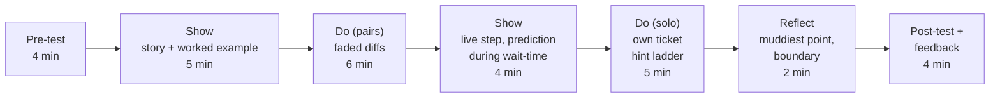

# 16.3 · Show, do, reflect

## Why it matters

The lab's student now had aligned objectives and good items. Then they worried: the live agent run takes nearly three minutes, what if it fails, what if people get bored? So they "front-loaded the good stuff": a story, a worked example of *three* diffs, then eleven minutes of live coding that ran the agent all the way to a reviewed pull request. Pair work shrank to three minutes at the end, on one diff. The search and the brief line, two of the three objectives, were shown and never practised.

That plan would have repeated the 16.1 result with better slides. The objectives and the test say what learners must do; this lesson is about the minutes in between, where they do it. The recipe is old and well supported: show a little, let them do it with support, then without, then make them say what they learned. The craft is in the details engineers get wrong when they teach: live coding that shows keystrokes instead of decisions, agent wait-time filled with talk, exercises without a finish line, and reflections that are really a recap slide.

> [!NOTE]
> Content tags. **Concept** (stable): the show-do-reflect sequence, modelling and guided practice, fading, desirable difficulties, retrieval at the end, pacing limits. **Implementation**: the live agent step, checkpoints with git tags, `LearnCheck align` time checks (as of 2026-09).

## How it works

### The skeleton

Rosenshine's principles of instruction, distilled from cognitive science and from observing effective teachers, describe a sequence you will recognize from 16.2: begin with a short review, present new material in small steps, **model** (think aloud through a worked example), provide **guided practice** with frequent checks for understanding, give scaffolds for difficult tasks, then **independent practice**, with regular review. Show-do-reflect is the same sequence in three words.



Two rules keep it honest, and `LearnCheck align` checks both: learners are **active for at least 40%** of teaching time (assessment minutes excluded), and **no run of showing lasts more than ten minutes**. Both numbers are design heuristics, not laws of memory; they exist because a plan that breaks them is almost always a lecture with a pair exercise stapled to the end.

### Show: model decisions, not keystrokes

A worked example on screen is useful only if learners can see *why* each step happens. Think aloud: "I have a new overdue check in the diff. Before I judge it, I want to know whether overdue already means something here, so I search the term in C# **and** SQL." The keystrokes are the least important part.

Rules for live coding with an agent, learned the hard way:

- **Checkpoints.** Tag the repository at every step (`shadow-start`, `shadow-brief`, `shadow-after`). If anything goes wrong, `git checkout` the next tag and keep teaching. Module 15 covers the recovery patterns in depth ([15.4](../module-15/lesson-04.md)); build them in before the session, not during.
- **Type what matters, paste what doesn't.** Type the search command slowly and leave it on screen; paste boilerplate.
- **One window, big font.** Terminal output scrolls away. Put the key command on the handout too.
- **Use the wait.** An agent run of two or three minutes is dead air or a gift. Ask a prediction question before it finishes: "Will its plan mention `usp_GetCustomerBalance`? Write yes or no." Now every learner is committed to an answer, which turns watching into generating (ICAP's constructive mode), and the result is a check for understanding.
- **Have the fallback ready.** A recording of the same step, cued to the right second.

### Do: exercises with a finish line

An exercise is a small spec. It needs:

| Part | Reference example |
|---|---|
| Starting state | Handout with three diffs; the first half-solved (search output given) |
| Task, with the objective's verb | "Decide: shadow rule or not? If yes, name what it duplicates." |
| Done-criteria | A yes/no and a name for each diff, agreed in the pair |
| Time box | 6 minutes, with a warning at 5 |
| Hint ladder | Hint 1: "What does the term already mean in this repo?" Hint 2: "Search both `*.cs` and `*.sql`." Hint 3: the search output |
| Extension | "Find the shadow rule that already exists in the lab repo" (for pairs who finish early) |

Two design choices do most of the work. **Fading**: the first diff is half-solved, the second is not, the third is a non-example (16.2). **Desirable difficulty**: Bjork and Bjork (2011) show that some conditions that slow apparent progress, such as generating an answer before seeing it or mixing problem types, improve long-term retention. Let learners struggle for a minute before giving hint 1. Struggle that ends in success is learning; struggle that ends in confusion is not, which is why the ladder exists.

During *do*, the instructor's job is to walk the room and **collect**: which diff caused arguments, which wrong answer came up twice. The debrief uses what learners produced ("two pairs said the third diff was a shadow rule; why?"), not your slide.

A full hands-on lab on laptops is the right format for a two-hour workshop (Module 17). In a 30-minute session, setup time eats the exercise; paper or on-screen diffs and a repository search on the learner's own laptop are enough.

### Reflect: retrieve, and state the boundary

Recalling what you learned strengthens it more than hearing it summarized (Roediger & Karpicke, 2006). The last two minutes before the post-test are for learners, not for your recap slide:

- **Muddiest point:** "On the card, write the one thing that is still unclear." You read them during the post-test and answer the top one in the follow-up.
- **The boundary question:** "When would you *not* bother checking for a shadow rule?" This is retrieval plus transfer, and it teaches the concept card's boundary (greenfield code, a term with one implementation already in context), which no slide can.

### Pacing: what to cut when you run late

You will run late. Decide in advance, in this order: cut *show* (the story can be one sentence), shorten the extension, never cut the *do* steps, the reflection or the post-test. A session that loses its post-test has lost its evidence (16.5).

## Show me

The reference activities table (`labs/module-16/solution/mini-workshop/session.md`):

| Step | Minutes | Mode | Objective | New terms |
|---|---|---|---|---|
| Pre-assessment (form A or B), no discussion | 4 | assess | - | 0 |
| Story: INC-08, the balance calculated twice | 2 | show | O1 | 1 |
| Worked example: read the diff, search the term, find `usp_GetCustomerBalance` | 3 | show | O1, O2 | 1 |
| Pairs: three diffs, first half-solved, one a correct extension | 6 | do | O1 | 0 |
| Live: search `overdue` in C# and SQL, write the brief line, start the agent; prediction question while it runs | 4 | show | O2, O3 | 1 |
| Solo: search and write the brief line for your own ticket | 5 | do | O2, O3 | 0 |
| Reflect: muddiest point, then "when would you not bother?" | 2 | reflect | O1 | 0 |
| Post-assessment (other form) and feedback form | 4 | assess | - | 0 |

```text
Time
  total 30 min (budget 30); assess 8, show 9, do 11, reflect 2
  learners active (do + reflect): 59% of teaching time
  new terms introduced: 3
0 error(s), 0 warning(s)
```

The live step's script, as the student wrote it on a card:

```text
1. "Ticket BILL-240: skip reminders for invoices overdue by more than 90 days."
2. Type:  git grep -n -i -E "overdue|DueUtc" -- "*.cs" "*.sql"      (slowly; leave on screen)
3. Point at the two hits. "Two implementations already. Which one should the agent reuse?"
4. Type the brief line: "Before planning, name the existing overdue implementations
   (InvoiceService.IsOverdue, usp_GetOverdueInvoices) and reuse one; no new overdue check."
5. Start the agent. Ask: "Will its plan name usp_GetOverdueInvoices? Write yes or no."
6. Read the plan aloud when it lands. Show of hands. If the run fails: checkout tag shadow-brief,
   play the recording from 02:10.
```

## Try it

Budget: 75 minutes.

1. **Activities (25 min).** Complete the activities table in your `session.md`. Start from the objectives: for each, one *do* step with the objective's verb. Then add the *show* steps each *do* step needs, the reflection, and the two assessments. Check the budget.
2. **Handout (25 min).** Write `handout.md`: every exercise with starting state, task, done-criteria, time box, a three-rung hint ladder, and an extension. Put the key commands on it.
3. **Live step (10 min).** Write the script card for your live step, including the prediction question and the fallback. Tag your repository at each checkpoint and record the step once.
4. **Check and rehearse (15 min).**

```bash
dotnet run --project tools/LearnCheck -- align ~/talks/mini-workshop/session.md
```

Then rehearse the whole session alone with a timer, speaking aloud. Note the real minutes of each step next to the planned ones.

<details>
<summary>Hint: my concept has no live step that fits in four minutes</summary>

Not every concept needs a live agent run. If yours is about review or measurement, the "live" step can be you doing the task on a fresh example, thinking aloud, for three minutes. If it genuinely needs a run longer than the wait-time you can fill with one prediction question, record it and show the key 60 seconds.
</details>

## Break it

```bash
dotnet run --project tools/LearnCheck -- align break/16.3-show-heavy/session.md
```

The objectives and items are the reference ones. Before running `align`, compute by hand the share of active teaching minutes and the longest passive stretch.

## Fix it

**Diagnose.** Four errors, one warning. Nineteen minutes of showing in a row (story, worked example of three diffs, eleven minutes of live coding) before learners do anything; learners active for 3 of 22 teaching minutes (14%); O2 (find) and O3 (write the brief line) are never practised; no reflection. The student protected the demo from failure by making it longer, which moved the risk from the demo to the learning.

**Modify.** Split the worked example: model *one* diff, then hand the other two to pairs (the first half-solved). Cut the live step to the search, the brief line and the start of the run, with a prediction question during the wait; nobody needs to watch the agent finish the PR. Give the solo step to O2 and O3 on the learner's own ticket. Add the two-minute reflection. That is the reference plan.

**Rerun.** `align solution/mini-workshop/session.md`: 59% active, longest passive stretch 5 minutes, every objective practised, 0 errors.

## How do I know it works?

- [ ] `align` reports no errors on your `session.md`, and the active share is at least 40%.
- [ ] Every *do* step on your handout has a starting state, done-criteria, a time box, a hint ladder and an extension.
- [ ] Your live step has checkpoints, a prediction question for the wait-time and a recorded fallback you have tested.
- [ ] Your rehearsal timings are within two minutes of the plan in total, and you have written down what you cut first if you run late.

## Use / don't use

**Use** show-do-reflect for any session where people should leave able to do something. **Use** the prediction question every time an agent, a build or a test run makes the room wait.

**Don't** let the live demo become the session. **Don't** debrief from your slide when you can debrief from what the pairs wrote. **Don't** replace the reflection with a recap; you retrieving it does nothing for their memory.

**Limitations.**

- Rosenshine's principles come largely from school classrooms and from teachers of novices. They fit a new concept for professionals well; they fit less well for an expert audience on its own stack, where a short problem-first format may do better (16.4).
- The 40% and ten-minute limits are heuristics. A brilliant eight-minute story can be worth it; the checks exist to make you justify it, not to forbid it.
- Desirable difficulty is desirable only when learners have the knowledge to overcome it. Without the hint ladder, struggle becomes guessing.

## Reflect

1. Which step of your instinctive sketch from 16.1 survived into the final plan, and which disappeared?
2. What did the rehearsal timer show that you had not expected?
3. What is your prediction question, and what answer do you expect most learners to give?

## Sources

- [Rosenshine (2012) — Principles of Instruction](https://www.aft.org/ae/spring2012/rosenshine) — review, small steps, modelling, guided practice with checks for understanding, scaffolds, independent practice.
- [Bjork and Bjork (2011) — Creating desirable difficulties to enhance learning](https://bjorklab.psych.ucla.edu/wp-content/uploads/sites/13/2016/04/EBjork_RBjork_2011.pdf) — conditions that slow apparent performance, such as generation and interleaving, can improve long-term retention.
- [Roediger and Karpicke (2006) — Test-Enhanced Learning](https://journals.sagepub.com/doi/10.1111/j.1467-9280.2006.01693.x) — retrieval produces better delayed retention than restudy.
- [Chi and Wylie (2014) — The ICAP Framework](https://www.tandfonline.com/doi/abs/10.1080/00461520.2014.965823) — why a prediction question turns watching into constructive engagement.
