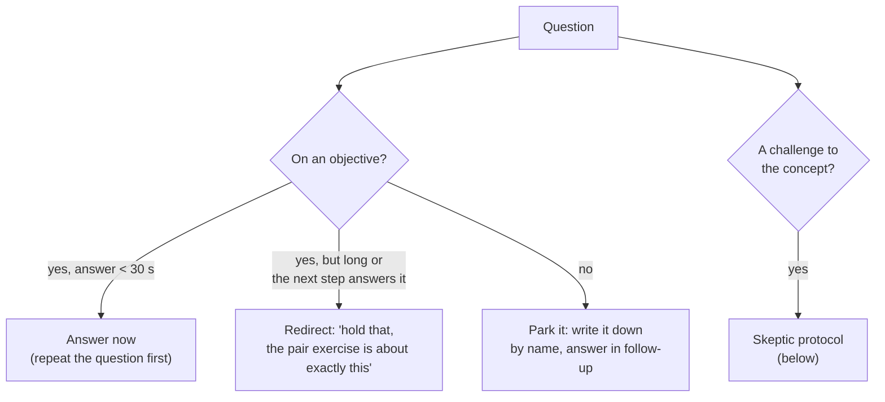

# 16.4 · Managing the room

## Why it matters

The lab's student delivered the reference plan, the one that produced a normalized gain of 0.67 in person, to eight people on a video call. The plan was unchanged. The result was 0.31, and the two QA engineers in the group scored zero on two of the three objectives, before and after. The recording shows why: a question in chat nobody saw for eight minutes, four minutes spent defending the concept against "isn't this just DRY?", breakout rooms opened before the exercise link was pasted, and "any questions?" followed by two seconds of silence and "OK, moving on".

A session plan is a program; the room is the runtime. Engineers who teach tend to prepare the content carefully and improvise the people, which is backwards: the content is the part you already know. This lesson turns the room into something you prepare for, with a few protocols you can rehearse. None of them are about charisma.

> [!NOTE]
> Content tags. **Concept** (stable): question triage, wait time, psychological safety, mixed levels and expertise reversal, handling skeptics with evidence and boundaries, think-pair-share. **Implementation**: remote-room mechanics (breakouts, chat, polls, co-host), which change with the video tool (as of 2026-09).

## How it works

### Questions: triage, then wait

Every question interrupts the plan, so decide quickly what kind it is:



Repeat or rephrase every question before answering; half the room did not hear it, and on a call nobody did. Keep a visible **parking lot** (a flipchart, a pinned chat message) and answer every parked question in the follow-up message: that is what makes parking feel like respect rather than dismissal.

When *you* ask, wait. Rowe's classroom studies found teachers typically wait less than a second after a question before answering it themselves or moving on; with three seconds or more, answers become longer, better reasoned and come from more students. "Any questions?" plus two seconds is a statement that you do not want any. Better:

- **Write first.** "Write one sentence: what would you search for first?" Then ask two people to read theirs. Everyone thinks; nobody is ambushed.
- **Ask the specific question.** "What is still unclear about the SQL part?" gets answers; "any questions?" gets silence.
- **Count to five** in your head. It will feel far longer than it is.

Underneath all of this is **psychological safety**: Edmondson (1999) found that a team's shared belief that it is safe to take interpersonal risks predicted learning behaviour (asking for help, admitting errors, seeking feedback) in 51 work teams. A workshop is a temporary team. You build safety on purpose: the pre-test framed as "this tells me what to teach, not what you know", "I don't know" welcomed on the form, muddiest points collected anonymously, and your own "I don't know; here is how I would find out" said without flinching, followed by actually finding out.

### Mixed levels

The pre-test is your first look at the room. In the reference session, pre-test scores ranged from 12.5% (P5) to 75% (P4). A single pace fails both: the worked example that P5 needs is redundant load for P4 (the expertise reversal effect, Kalyuga et al., 2003), and P4's pace loses P5.

Three moves, all prepared in advance:

1. **Entry points.** The fading sequence from 16.2 (worked → half-solved → full → own ticket) doubles as a menu. Experienced learners may skip to the full problem; say so out loud.
2. **Floor and ceiling.** Every exercise has a floor everyone can reach (decide on the half-solved diff) and a ceiling that stretches the fastest (the extension: find the shadow rule that already exists in the lab repo).
3. **Role-based pairs.** Pair the least and most experienced, and give the less experienced person the keyboard or the pen. The expert explains; the novice does. Explaining is constructive work for the expert, and the novice cannot be steamrolled if they are the one writing.

Peer discussion is the engine of Peer Instruction (Crouch & Mazur, 2001): individual answer, discussion with a neighbour, revote. It works in mixed rooms precisely because the neighbour who just understood can explain in words the instructor has forgotten.

### Skeptics

The skeptic is often the most valuable person in the room. They say out loud what three others are thinking, and their objection usually points at a real **boundary** of your concept. The protocol:

1. **Concede what is true, specifically.** "Yes, duplication is old; DRY is from 1999."
2. **Ask for their case.** "Have you seen an agent do this, or the opposite?" Their incident is better material than yours.
3. **Answer with evidence, not authority.** Your concept card has it: the claim, the dated incidents, the interval. "In our notes, 4 of 7 eligible runs without a reuse search produced a shadow rule; the 95% interval is 25% to 84%. Wide, but not rare."
4. **State the boundary.** "It does not apply to greenfield code, or when the rule's one implementation is already in the agent's context."
5. **Offer the test.** "Run the search on your repo this week. If you find nothing, tell me; that is counter-evidence I want."

Never answer "Great question!" and deliver four minutes of the same story again. That defends your ego and spends everyone else's time. The objections FAQ from [14.3](../module-14/lesson-03.md) is your preparation: every likely objection with an honest answer, rehearsed before the session.

### Remote and in-person rooms

| | In person | Remote |
|---|---|---|
| Signals you get | faces, posture, laptop screens as you walk past | chat, reactions, the few cameras that are on |
| Your blind spot | the quiet person at the back | everything off camera; the chat while you share your screen |
| Questions | hands, the parking-lot flipchart | chat; a co-host who reads it to you |
| Pairs | turn to your neighbour | breakout rooms: task and link pasted in the chat *before* opening, timer announced, 1-minute warning |
| Prediction questions | show of hands, cards | a poll or "type yes or no in chat, do not press enter until I say" |
| Passive tolerance | about 10 minutes | shorter; plan show segments of about 5 minutes |
| Demo risk | projector, font | bandwidth, screen-share resolution; send the key command in chat |

The single most effective remote change is a **co-host**: someone who watches chat, admits latecomers, opens the rooms and tells you "two questions in chat" while you share your screen. If you cannot get one, schedule a chat check at the end of every step.

## Show me

The student's rewritten answer to the DRY objection, now an objection card next to the session plan:

```markdown
### "Isn't this just DRY?"
- Concede: Duplication is an old problem, and DRY names it.
- Ask: "Have you seen an agent do this on your code?"
- Evidence: 4 of 7 eligible runs without a reuse search produced a shadow rule
  (Wilson 95% interval 25%–84%); 0 of 5 with one (0%–43%). INC-01, 05, 08, 12.
- What is new: the cause is the agent's context, not the author's discipline, and the costliest
  case (INC-08) crossed C# and T-SQL, which a C#-only search misses. The fix is a research step,
  not a code-review reminder.
- Boundary: greenfield code; terms with one implementation already in context.
- Offer: "Search your repo for one business term in *.cs and *.sql this week."
- Time: 60 seconds. Then back to the plan.
```

Delivered in 60 seconds instead of four minutes, it also turned the staff engineer into the person who ran the search on his own repository during the solo step, and found a second VAT calculation.

## Try it

Budget: 60 minutes.

1. **Room plan (15 min).** Add the "Room plan" section of the [lesson template](../../templates/lesson-template.md) to your `session.md`: the spread you expect, entry points, the extension for each exercise, the pairing rule, and, if remote, who co-hosts and what gets pasted into chat before each breakout.
2. **Objection cards (20 min).** From your objections FAQ (14.3), pick the three objections most likely from *this* audience. Write each as a card in the format above: concede, ask, evidence, what is new, boundary, offer, time limit.
3. **Question prompts (10 min).** Replace every "any questions?" in your plan with a write-first or specific question.
4. **Skeptic rehearsal (15 min).** Ask a colleague to play the skeptic for ten minutes, using objections you did not give them. Record it. Count how long each answer takes and whether you conceded something specific.

<details>
<summary>Hint: I cannot think of a concession for an objection that is simply wrong</summary>

Look for the true part inside it. "Agents are just autocomplete" is wrong as a description, but the person usually means "I have seen them produce confident nonsense", which is true and is the reason your concept exists. Concede that, then show the mechanism.
</details>

## Break it

Open `labs/module-16/break/16.4-room/room-log.md`: eight incidents from a remote delivery of the reference plan, each with what the student did. For every row, write down (a) what went wrong, (b) which protocol from this lesson applies, and (c) what you would have said or done, in one sentence. There is no tool for this one; compare with the table below.

## Fix it

**Diagnose and modify.**

| # | What went wrong | Protocol | Better move |
|---|---|---|---|
| R1 | Chat unseen for eight minutes; a non-C# learner felt out of place before minute two | Remote: co-host; safety | Co-host answers in chat: "Yes, answer what you can; 'I don't know' is useful to me." Plan a non-code route for QA (spot the rule in the search output) |
| R2 | Four-minute defence, story repeated | Skeptic protocol | The 60-second card above; invite Ravi to run the search in the solo step |
| R3 | Rooms opened without the link; hard close | Remote breakouts | Paste the diff link and task into chat, then open; 1-minute warning; rooms close on a timer the room can see |
| R4 | Key command scrolled away; "everyone see that?" | Live coding, 16.3 | Type slowly, leave it on screen, paste it into chat |
| R5 | Wait-time filled with history; cameras off | Prediction question, 16.3 | "Type yes or no: will the plan name `usp_GetOverdueInvoices`? Don't press enter yet." |
| R6 | Two-second wait after "any questions?" | Wait time, write-first | "In chat: the one thing still unclear about the SQL part." Count to five |
| R7 | Fast learner told to wait | Mixed levels | Extension ready on the handout: find the existing shadow rule in the lab repo |
| R8 | "A lot, in my experience" | Skeptic protocol, evidence | "4 of 7 runs in my notes, interval 25% to 84%. Wide. Try it on your repo this week and tell me." |

**Rerun.** You cannot rerun a room, but you can rerun the plan: the student added a co-host, the objection cards, pasted-link breakouts and a QA entry point, and delivered it to the next remote group. That delivery's numbers are in the 16.5 break, with problems of their own.

## How do I know it works?

- [ ] Your `session.md` has a room plan with entry points, an extension for every exercise, a pairing rule and, if remote, a co-host and pre-pasted breakout material.
- [ ] You have three objection cards, each with a specific concession, evidence with a number and interval where one exists, a boundary and an offer.
- [ ] In your recorded skeptic rehearsal, every answer is under 90 seconds and returns to the plan.
- [ ] No "any questions?" is left in your plan.

## Use / don't use

**Use** the triage and the skeptic protocol in every session, including internal meetings where you present your method. **Use** a co-host for every remote session with more than four people.

**Don't** argue a skeptic into silence; a silent skeptic is still a skeptic, and now the room is uneasy too. **Don't** let the most senior person answer every question for the room; ask pairs, not individuals. **Don't** promise to follow up on a parked question and then forget: that single broken promise costs more trust than not parking it.

**Limitations.**

- Wait-time and peer-instruction findings come from school and university classrooms; with small groups of professionals the direction holds, the exact numbers do not.
- Psychological safety is a team property built over time. A 30-minute session can avoid destroying it and can model it; it cannot create it in a team that does not have it.
- Remote mechanics depend on the video tool and change with its releases; check the breakout, poll and co-host features before each delivery.

## Reflect

1. Which incident in the room log would you most likely have made yourself, and why?
2. What did you concede in your skeptic rehearsal that you had not expected to?
3. Who in your planned audience is most likely to be lost, and what is their entry point?

## Sources

- [Rowe (1986) — Wait Time: Slowing Down May Be A Way of Speeding Up!](https://journals.sagepub.com/doi/10.1177/002248718603700110) — teachers typically wait under a second after a question; longer wait time improves the quality and spread of answers.
- [Edmondson (1999) — Psychological Safety and Learning Behavior in Work Teams](https://journals.sagepub.com/doi/10.2307/2666999) — team psychological safety predicted learning behaviour in 51 work teams.
- [Crouch and Mazur (2001) — Peer Instruction](https://pubs.aip.org/aapt/ajp/article/69/9/970/310529/Peer-Instruction-Ten-years-of-experience-and) — individual answers followed by peer discussion; gains in conceptual understanding across ten years.
- [Kalyuga, Ayres, Chandler and Sweller (2003) — The Expertise Reversal Effect](https://www.tandfonline.com/doi/abs/10.1207/S15326985EP3801_4) — why one pace and one level of guidance cannot serve a mixed room.
