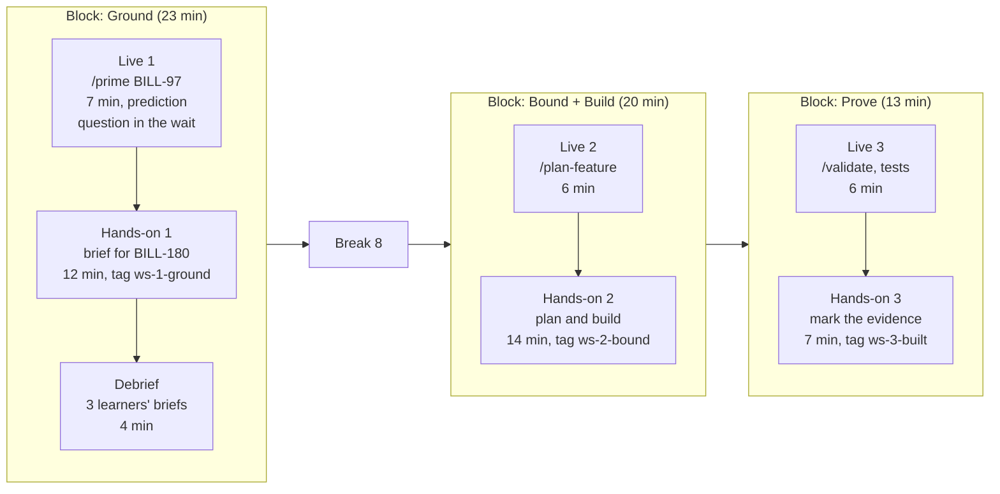

# 17.1 · The workshop agenda

## Why it matters

The career path this course grew from gives a recipe for the 2-hour workshop in one line: credibility (10 minutes), problem framing with a stat you verified yourself (10), a live before/after demo (60–70), Q&A built into the agent's wait-time, and a close with an offer (15). It is a good recipe for what it was built for, a public workshop that doubles as a sales funnel, and it contains two ideas you should keep: every minute has a job, and the agent's thinking time is not dead air.

The lab's student followed it to the letter. They took the 50-minute demo block from their Module 15 run sheet, stretched it to 65 minutes by building the AI layer live before running the ticket, put their bio and "industry numbers" in front of it, and added a 5-minute "try it yourself" before a 15-minute close. It is `labs/module-17/break/17.1-demo-marathon/agenda.md`. `LearnCheck align` from Module 16 finds learners active for 4% of the time and 95 passive minutes before anyone does anything. `KitCheck` finds the clock ending at 2:01 in a 2-hour slot, two live segments with no fallback, no buffer, and a first hands-on step at 1:41, which is when every laptop problem in the room will surface.

Module 16 showed that a 30-minute session can teach (a normalized gain of 0.67 with the redesigned plan). Two hours is not that session four times over, and it is not the demo stretched. This lesson is about the shape in between: an arc that keeps the recipe's jobs, built from blocks in which you show one step live and the room immediately does the same step on its own copy of the repository.

> [!NOTE]
> Content tags. **Concept** (stable): the workshop arc, show-do blocks, wait-time plans, buffers and cut order, cue-card notes. **Implementation**: the `KitCheck agenda` rules and thresholds, the slash commands in the example (as of 2026-09).

## How it works

### The arc: six jobs

Each part of the arc owes the room something specific. If a part does not deliver it, it is decoration.

| Part | Its job | Reference minutes | How it fails |
|---|---|---|---|
| Credibility | Show you have done this on real legacy code, with the numbers that went against you too | 4 + 3 write-first | A career bio; logos; "I've trained 500 engineers" |
| Problem | Make the room's own pain concrete, with a number you can defend | 6 | Industry averages you cannot source; a promise of speed |
| Live before/after | Show the same ticket without and with the AI layer, so the difference is the layer | 4 recorded + 3 × 6–7 live | 60 minutes of watching; a before run you rigged to fail |
| Exercise | Learners do each step on their own laptop, on a sibling ticket | 6 + 12 + 14 + 7 | One exercise at the end, when there is no time left |
| Q&A | Answer the hard questions with evidence (17.3) | wait-time + 7 | "Any questions?" at 1:55 |
| Close | Say what happens next: follow-up, where the kit lives, how to reach you | 3 | A 15-minute pitch to a room that came to learn |

Credibility is not biography: open with one incident from your notes in three sentences, with a number that hurt ([14.2](../module-14/lesson-02.md)), one sentence on what you measured, then have the room write one line about their own worst agent change this month. You now have their words to point back to all morning.

The problem framing uses **your** number, with its interval and its failed guardrail, and at most two public studies, each in one sentence with the source on the slide. If you cannot say where a number comes from and what it does not show, it does not go in the problem part (Module 13).

### Blocks, not a demo

The unit of a workshop is a block: a short live segment, then the same step done by the learners, then a debrief from what they produced.



Three design choices do most of the work.

**The demo ticket and the hands-on ticket are siblings.** You run BILL-97 live; learners run BILL-180 in the starter pack. Same repository, same layer, same step, different ticket. Watching you do BILL-97 is the worked example; doing BILL-180 is guided practice, and the transfer from one to the other is the learning ([16.3](../module-16/lesson-03.md)). If learners run the *same* ticket, they copy your screen.

**No live segment runs longer than ten minutes.** Not because attention collapses at ten minutes: Bradbury (2016) reviewed the evidence behind that claim and found few primary studies and no support for a fixed 10–15-minute limit; the variation between teachers mattered more than the format. The reason is practice. Freeman et al.'s meta-analysis of 225 studies found higher exam scores under active learning and a failure rate about 1.5 times higher under traditional lecturing. A 25-minute live segment is 25 minutes in which nobody practises, and the first hands-on step moves to where setup problems will ambush you.

**The before run is recorded.** It exists to show the problem, not to be exciting, and a before run that happens to succeed live destroys your comparison. Ninety seconds of an unedited take from the `before-ai-layer` worktree ([15.2](../module-15/lesson-02.md)), paused on the diff, and the pairs find what went wrong.

### Wait-time: plan it per segment

The recipe's best idea is to answer questions while the agent thinks. Module 16 added the prediction question. Plan both for every live segment, in this order: first the prediction question, because everyone answers it ("Will the brief name `SqlHelper.ExecuteDataSet`? Hands up."); then one question from the parking lot, because it rewards the person who asked and fills the rest of the wait. Write both on the segment's cue card. `KitCheck agenda` warns about any live step whose description mentions neither.

### Timestamps are a contract

Each row starts where the previous one ended; the last one ends inside the slot. It sounds trivial, and the break file gets it wrong: its steps add up to 115 minutes, but one row starts six minutes late, so the clock ends at 2:01. When the agenda's arithmetic is off, your sense of whether you are late is off too.

Three things protect the clock:

- **A buffer of at least 5% of the slot**, as its own row (7 minutes in the reference, at 1:44). If unused, it goes to Q&A. You never start new content in it.
- **A break** in anything of 90 minutes or more. In a hands-on workshop it is also your reset window: reset the demo worktree, cue the next clip, fix the laptop that failed.
- **A cut order written in advance.** When you run late, cut from the *show* steps first (the story shrinks to one sentence, a live segment becomes its recording), then the extensions. Never cut a hands-on step, the reflection or the post-test. Put **stop times** into hands-on steps ("stop at green or at 1:19") and a **catch-up tag** for anyone who is not done: learners who fall behind check out the tag and join the next step with everyone else ([17.2](lesson-02.md)).

### The close

In a room a company paid for, or at an internal guild, the close is three minutes: the two-week follow-up, where the kit lives, how to reach you. An offer belongs there only if the host asked, in one sentence. A 15-minute pitch turns every earlier minute into marketing in hindsight. Public workshops that exist to sell are a separate business decision (Module 20); even there, the offer does not come out of teaching time.

### Instructor notes: cue cards, not a script

You will not read paragraphs in front of a room. Notes are one short section per agenda row, headed by the start time, so that one glance at the clock and one at the page tell you where you are:

```markdown
## 0:29 · Live 1, Ground

- Do: run-sheet segment 3. Type `/prime BILL-97`, slowly.
- Say while it runs: "Will the brief name `SqlHelper.ExecuteDataSet` as the thing to replace?
  Hands up for yes." Then take one parked question.
- If it breaks: name it, then `02-ground.mp4` from 00:40. Say line from the run sheet.
```

**Say** is a cue, not a script. **Do** is what your hands do. **Watch** is what to look for in the room. Every live and hands-on section says what happens if it breaks or the room falls behind. Keep each under about 150 words: a section you cannot glance at is a section you will not use, and 17.4's exit test counts how often you look.

## Show me

The reference agenda is `labs/module-17/solution/workshop-kit/agenda.md`: 19 rows in 120 minutes. Read it next to the diagram above. Before the first block: pre-test (6), INC-08 (4), write-first (3), EXP-01 (6), the recorded before clip (4) and pairs on the before-diff (6), so that learners have done something twice by 0:29. After the last block: Q&A (7), reflection (4), buffer (7), close (3), post-test and feedback (6).

```text
$ dotnet run --project tools/KitCheck -- agenda solution/workshop-kit/agenda.md
Clock
  19 steps, 120 minutes, ends at 2:00; timestamps add up
Arc
  demo           23 min   19%
  exercise       43 min   36%
  ...
0 error(s), 0 warning(s)

$ dotnet run --project ../module-16/tools/LearnCheck -- align solution/workshop-kit/agenda.md
  O1 [analyze] items: 2 (highest analyze), practice steps: 2
  ...
  total 120 min (budget 120); assess 12, show 43, do 42, reflect 8
  learners active (do + reflect): 46% of teaching time
0 error(s), 0 warning(s)
```

The demo is still there: 23 minutes of it, plus the Q&A that rides on its wait-time. What changed is that each piece is followed by the room doing it.

## Try it

Budget: 150 minutes.

1. **Start from what you have (20 min).** Put your Module 16 `session.md` and your Module 15 run sheet side by side. List the objectives the workshop adds (two hours carries three or four, not ten) and pick the hands-on ticket: a sibling of your demo ticket, finishable in about 15 minutes by someone who has never seen the repository ([15.3](../module-15/lesson-03.md) stranger test).
2. **Arc and blocks (40 min).** Copy the agenda format from the [workshop template](../../templates/workshop-template.md) into `workshop-kit/agenda.md`. Write the claim, objectives and items first, then the blocks: for each objective, one live segment of at most ten minutes followed by the same step as hands-on. Add credibility, problem, before clip, Q&A, reflect, buffer, close and the two assessments.
3. **Clock (15 min).** Fill in every start time by hand. Mark the stop time of every hands-on step and write the cut order under the table.
4. **Check (15 min).**

```bash
cd labs/module-17
dotnet run --project tools/KitCheck -- agenda ~/workshop-kit/agenda.md
dotnet run --project ../module-16/tools/LearnCheck -- align ~/workshop-kit/agenda.md
```

5. **Notes (60 min).** Write `instructor-notes.md`: one `## h:mm · step` section per row, Say / Do / Watch / If it breaks, under 150 words each. Then read the whole file aloud once against a timer and mark every section where you had to look twice.

<details>
<summary>Hint: my demo ticket takes 18 minutes live and cannot be split</summary>

Split it by the agent's own phases (research, plan, implement, validate), not by the clock. Each phase leaves a file (brief, plan, diff, test output) that the next phase reads, which is also what makes a catch-up tag possible. If one phase alone runs longer than ten minutes, show its start live and its result from the fallback branch ([15.4](../module-15/lesson-04.md)).
</details>

## Break it

```bash
cd labs/module-17
dotnet run --project tools/KitCheck -- agenda break/17.1-demo-marathon/agenda.md
dotnet run --project ../module-16/tools/LearnCheck -- align break/17.1-demo-marathon/agenda.md
```

Before you run them, read the agenda and write down, by hand: when the workshop actually ends, how many minutes learners do something, and what happens at 0:40 if the model API has a bad minute.

## Fix it

**Diagnose.** `KitCheck`: 8 errors, 10 warnings. The Q&A row starts at 1:31 while the previous step ends at 1:25, and the clock ends at 2:01 even though the steps add up to 115 minutes. Hands-on is 5 of 120 minutes (4%), the demo 65 (54%). Two of the three live segments have no fallback, and all three run 12 to 28 minutes. No buffer, no break, no assessment, a 15-minute close. `LearnCheck`: 11 errors: "understand", "learn" and "know" as objectives, no items, 95 passive minutes before the first *do*. The recipe's two good ideas (every minute has a job, use the wait) survived; its proportions came from a funnel, not from a room that must leave able to do something.

**Modify.** Keep the arc, change the proportions. The bio becomes INC-08 in three sentences plus a write-first line. "Industry numbers" become EXP-01 with its intervals and two sourced studies. Building the AI layer live is cut: the layer already exists at `ai-layer-v1`, and the room will use it, not watch it being written. The before run becomes a 90-second clip. The after run becomes three segments of 6–7 minutes, each with a prediction question, a fallback and a hands-on step with a catch-up tag. Add the break, the buffer, the reflection and both assessments; the close shrinks to three minutes, no offer. That is the reference agenda.

**Rerun.** Both checks on `solution/workshop-kit/agenda.md`: 0 errors, 46% active, clock ends at 2:00.

## How do I know it works?

- [ ] `KitCheck agenda` and `LearnCheck align` both report 0 errors on your agenda.
- [ ] Every live segment is at most ten minutes, names its fallback, and has a prediction question and a parked question on its cue card.
- [ ] The first hands-on step starts before 0:45, and every hands-on step has a stop time and a catch-up tag.
- [ ] The cut order is written under the agenda, and it never cuts hands-on, the reflection or the post-test.
- [ ] Read aloud against a timer, `instructor-notes.md` needed a second look in at most two sections.

## Use / don't use

**Use** the block structure for any hands-on workshop where people should leave able to do something: internal enablement sessions, client workshops, meetup workshops with laptops. **Use** the timestamped agenda even for a talk: the arithmetic alone catches plans that cannot fit.

**Don't** use it for a keynote or a conference talk without laptops; there, a longer demo with prediction questions is the honest format, and you should not claim learning you did not measure. **Don't** build the AI layer live in a workshop about using it. **Don't** let the offer take teaching time.

**Limitations.**

- The thresholds (a quarter hands-on, 40% demo at most, ten-minute segments, 5% buffer) are design heuristics that make you justify exceptions, not findings. Bradbury's review is a warning against treating any such number as a law of attention.
- Freeman et al.'s evidence comes from undergraduate science courses. Engineers learning a method on their own stack are a different population; the direction is well supported, the size of the effect in a 2-hour workshop is not known.
- Hands-on workshops depend on laptops, access and setup far more than talks do. The agenda assumes the kit from 17.2 exists; without it, the blocks fail at the first `dotnet restore`.

## Reflect

1. Which part of your first-draft agenda was really there for you (to look credible, to show off the demo) rather than for the room?
2. What is your hands-on ticket, and why is it a sibling of the demo ticket and not the same one?
3. Where in the agenda will you be when you first know you are running late, and what do you cut?

## Sources

- [Freeman et al. (2014) — Active learning increases student performance in science, engineering, and mathematics](https://www.pnas.org/doi/10.1073/pnas.1319030111) — meta-analysis of 225 studies: higher exam scores under active learning; students in traditional lectures about 1.5 times more likely to fail.
- [Bradbury (2016) — Attention span during lectures: 8 seconds, 10 minutes, or more?](https://journals.physiology.org/doi/full/10.1152/advan.00109.2016) — review finding little primary evidence for a fixed 10–15-minute attention limit; variation between teachers matters more than format.
- [Rosenshine (2012) — Principles of Instruction](https://www.aft.org/ae/spring2012/rosenshine) — modelling followed by guided and independent practice, the sequence each block follows.
