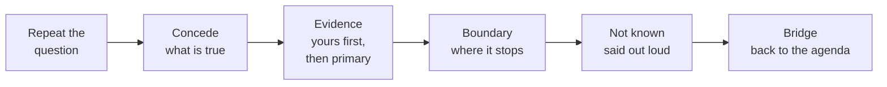

# 17.3 · The hard-questions bank

## Why it matters

At the trial run, forty minutes in, an engineering manager asked the question every paid room asks: "You said 16% faster. Will we get 16%?" The student said "probably more, because we didn't have the full method yet", and watched a staff engineer in the second row write something down. Twenty minutes later a security lead asked whether a ticket could make the agent do something bad. The answer took three minutes and ended with "honestly, security teams worry about this too much". Both answers came from the student's first-draft question bank, `labs/module-17/break/17.3-hype-bank/question-bank.md`, written the evening before in the voice of their favourite conference talks.

Those two minutes did more damage than any failed demo. A demo that breaks and is recovered honestly builds trust (15.4); an answer that promises the room a number, or dismisses its security lead, spends trust you cannot get back in the same session. The people who ask hard questions are often the ones who decide whether there is a second engagement.

Hard questions are predictable. The same five categories come up in almost every room that pays for a workshop on AI in engineering, and you already have most of the evidence to answer them: your notes, your experiment, your security lab, your objections FAQ from [14.3](../module-14/lesson-03.md). This lesson turns that into a bank of rehearsed, one-minute answers.

> [!NOTE]
> Content tags. **Concept** (stable): categories, the answer shape, the evidence order, the claims ladder in Q&A, wait-time triage. **Implementation**: the specific studies and OWASP entries cited, which will be superseded (as of 2026-09); the `KitCheck questions` rules.

## How it works

### Where the questions come from

Collect, do not invent. Four sources, in order of value:

1. **Your objections FAQ** (14.3): the objections people actually raised to your method, with the asker's role.
2. **Discovery calls** ([01.4](../module-01/lesson-04.md)): what buyers worry about before they buy is what their teams ask in the room.
3. **Parking lots** from every rehearsal and mini-workshop (16.4): write each parked question down verbatim.
4. **The five categories** below, to find the gaps. If a category has no question yet, someone in a paid room will supply one.

| Category | Typical form | What the asker needs |
|---|---|---|
| Replacement | "Is AI going to replace us?" "What happens to juniors?" | Honesty about uncertainty, and what the work looks like now |
| Security | "Can a ticket make it do something bad?" "Can it push to production?" | Mechanisms outside the model, and your tested evidence |
| Confidentiality | "Does our code go to the vendor?" | A straight yes, and who decides the rest |
| ROI | "Will we get your 16%?" "What's the ROI of this workshop?" | No promise; a way to find out on their team |
| Skeptic | "Isn't this just DRY?" "Didn't a study find devs were slower?" | A concession, evidence and a boundary |

Add tools ("we use Copilot"), cost and limits ("when doesn't this work?") as the bank grows. Aim for at least twelve questions before a paid room.

### The answer shape

The Module 16 skeptic protocol (concede, ask, evidence, boundary, offer) was built for one objection in a 30-minute session. A workshop needs a card you can deliver to any question in about a minute:



- **Concede** something specific and true. "Duplication is old, and DRY names it." Not "great question".
- **Evidence**, in this order: your own data (an incident ID, an experiment with its interval), then primary sources (a study, OWASP, the provider's documentation), then opinion, labelled as opinion.
- **Boundary**: where the claim stops. This is where most of your credibility comes from, because it is what hype never says.
- **Not known**: one sentence. "Anything about your team until it is measured there."
- **Bridge**: one sentence that connects the answer to what the room does next. "Watch whether the agent finds BILL-155 on its own in Hands-on 1."

About a minute is roughly 130 spoken words. Longer answers are almost always a story told again (16.4); cut to the concession, the evidence and the boundary.

### Numbers on the claims ladder

Every number you say in Q&A sits on the claims ladder from [13.6](../module-13/lesson-06.md): an observation, an effect in your study, an effect for your team's kind of work, an effect elsewhere, money. A question from the room almost always asks you to climb a rung your evidence does not reach. "Will we get 16%?" asks for rung 4 (an effect elsewhere) from rung 2 (one randomized comparison, 96 tickets, interval 5% to 25%, defect guardrail failed). The honest answer stays on rung 2 and offers the route to rung 3 on their team: the same comparison, on their tickets.

The subtle failure is a real ID attached to the wrong number. The hype bank's ROI answer says "55% faster delivery overall" with EXP-01 as its evidence. EXP-01 found 16%; 55.8% is Peng et al.'s 2023 lab result for writing a small HTTP server with code completion, a different task, tool generation and metric (13.2). A checker can see that a number has a source; only you can see whether the source says that number.

### What the public evidence says, one sentence each

For the questions the room asks about "the studies", have one sentence per source, with the design, not just the headline:

- **METR 2025**: a randomized study of 16 experienced open-source maintainers on their own mature repositories found them 19% slower with early-2025 AI tools, while they believed they had been faster.
- **METR 2026 update**: later data points to a speed-up, but METR says its design became unreliable because developers declined to work without AI.
- **DORA 2025**: in a survey of about 5,000 respondents, AI use was associated with higher throughput and with more instability; DORA calls AI an amplifier.
- **Stack Overflow 2025**: more developers distrust AI output accuracy (46%) than trust it (33%).
- **OWASP LLM01:2025**: prompt injection is the first-ranked risk for LLM applications, and OWASP says techniques such as RAG and fine-tuning do not fully mitigate it.
- **OWASP LLM06:2025**: excessive agency (too many tools, permissions or autonomy) is mitigated by minimizing them and requiring human approval.

Notice what these do in an answer: they concede that the room's worry is reasonable, they show that you read the studies that cut against you, and they end on a boundary. None of them tells the room what will happen on its team.

### Category notes

**Replacement.** Nobody knows, and saying so is the only credible start. Neither "absolutely not" nor "learn AI or be replaced" survives a thoughtful listener. What you can offer is what the work looked like in your notes: which steps the agent did badly without a human who knew the business, and what today's exercises practise.

**Security.** Answer with mechanisms outside the model, because the model cannot be relied on to refuse injected instructions: the permission deny list, hooks, sandboxing, a human approving the plan, and the attack you ran in your own lab and what stopped it ([09.5](../module-09/lesson-05.md)). Never answer "completely safe"; name the residual risks you know about.

**Confidentiality.** "Yes, whatever the agent reads is sent to the model provider or the platform hosting the model." Then: retention, training use and region depend on the contract and hosting ([12.4](../module-12/lesson-04.md)), which their legal and security teams decide, and today's starter pack is a fictional company. Deflecting this question ("let's take it offline") is heard as hiding something.

**ROI.** Refuse to promise. Separate the workshop's evidence (pre/post gain, two-week follow-up) from delivery evidence (a controlled comparison over weeks). Offer the measurement, not the number.

### Wait-time or Q&A block?

Agent wait-time (17.1) is good for short, on-topic questions: ones you can answer in about a minute, that most of the room cares about, and that do not need a slide. Long, hostile, or narrow questions go to the parking lot and the Q&A block, and you say so by name: "Dana, that deserves more than the agent's two minutes; it's first in the Q&A at 1:33." Then keep the promise. Parked questions you do not reach go into the follow-up message, answered in writing (16.4).

## Show me

The reference bank's answer to the manager, `labs/module-17/solution/workshop-kit/question-bank.md`:

```markdown
### Q06 · "You measured 16% faster. Will we get 16%?"
- Category: roi
- Answer: No promise. That number is one team, one repository, ninety-six tickets, and the
  interval runs from 5% to 25% faster. Escaped defects may also have gone up; that guardrail
  failed. What I would promise is a way to measure it on your team: the same comparison, on
  your tickets, in about six weeks.
- Evidence: EXP-01 (experiments.md); FAQ-03
- Not known: anything about your team until it is measured there.
- Bridge: "The defect part is why we spend twenty minutes on Prove."
```

Fifty-three words, about 25 seconds. It concedes by volunteering the failed guardrail, stays on rung 2, and bridges to the part of the agenda that addresses the weakness.

```text
$ dotnet run --project tools/KitCheck -- questions solution/workshop-kit/question-bank.md
question-bank.md: 13 questions
  id    category          words  evidence  not-known
  Q01   replace              74  yes       yes
  ...
Categories: replace 2, security 2, roi 2, skeptic 3, confidentiality 1
0 error(s), 0 warning(s)
```

## Try it

Budget: 120 minutes.

1. **Collect (30 min).** Pull every objection from your FAQ, every question from your discovery-call notes and every parked question from your Module 16 session into one list, verbatim, with who asked. Tag each with a category. Fill empty categories from the table above.
2. **Write (50 min).** At least twelve cards in the [workshop template](../../templates/workshop-template.md#question-bank) format. For every number, write down its rung on the claims ladder next to the card.
3. **Check (5 min).**

```bash
cd labs/module-17
dotnet run --project tools/KitCheck -- questions ~/workshop-kit/question-bank.md
```

4. **Say them (35 min).** Ask a colleague to read the questions to you in random order, with at least three you have not seen written down in their own words. Record it. Time every answer, and mark each one where you left the card's shape (no concession, no boundary, a new number).

<details>
<summary>Hint: I have no evidence for a category, for example security</summary>

Then that is the answer, said plainly: "I have not tested that; here is what I would check first." A card whose evidence is "opinion" is allowed if you say it is an opinion out loud. Then decide whether the gap matters for this room: if the host's security lead is coming, run the Module 9 attack suite against your demo layer before the day.
</details>

## Break it

```bash
cd labs/module-17
dotnet run --project tools/KitCheck -- questions break/17.3-hype-bank/question-bank.md
```

Then read Q04 aloud with a timer. Before looking at the output, mark every sentence in the bank that you could not defend to the staff engineer who was taking notes.

## Fix it

**Diagnose.** 5 errors, 14 warnings. Q02 calls the agent "completely safe" and dismisses the security lead's worry; Q03 promises "10x" and "guaranteed". Q01 and Q05 have no evidence at all; Q05 deflects the confidentiality question and files it under "tools", so the bank has no confidentiality question. Q02's evidence is "my experience", which nobody can check. Q04 runs 166 words, about 75 seconds, and tells the INC-08 story again. Absolutes throughout ("everyone", "never"), no "not known" lines, few bridges. And one error the checker cannot find: Q03's "55% faster delivery" cites EXP-01, which measured 16%.

**Modify.** Rewrite each card in the shape: concede, evidence (own first), boundary, not known, bridge. Q02 becomes two cards on mechanisms outside the model, with OWASP and the security-lab result. Q03 becomes Q06 (above) and a separate card on the workshop's own evidence. Q05 becomes a straight yes with the contract questions. Q04 drops to 66 words with the story cut to a clause. Add replacement, tools, cost and limits cards until the bank has thirteen. That is the reference bank.

**Rerun.** `questions solution/workshop-kit/question-bank.md`: 0 errors, 0 warnings; the longest answer is 74 words.

## How do I know it works?

- [ ] `KitCheck questions` reports 0 errors, all five required categories are covered, and there are at least twelve questions.
- [ ] Every number in every answer has a source that says that number, and you have written its rung on the claims ladder.
- [ ] In the recorded run with unseen questions, every answer was under about 75 seconds and at least four in five kept the shape.
- [ ] You can say, for each card, whether it goes in agent wait-time or the Q&A block.

## Use / don't use

**Use** the bank for workshops, talks, discovery and sales calls: the questions are the same, and so should the answers be. **Use** it to find gaps in your evidence; an empty category is a research task, not a writing task.

**Don't** memorize answers word for word; memorize the shape and the evidence. **Don't** cite a study you have only read the headline of. **Don't** win an argument with a skeptic in front of the room; state the boundary and offer the test.

**Limitations.**

- The five categories fit engineering audiences in 2026. Other audiences (executives, regulators, non-engineers) ask different questions first; collect theirs.
- The public studies will be superseded, some within a year. The cards need a review date, like the method (14.3).
- A one-minute answer is a design target; some questions deserve a longer conversation after the session, and the bridge can offer one.

## Reflect

1. Which question in your bank would you most like not to be asked, and what does your answer to it concede?
2. Where did you catch yourself climbing a rung of the claims ladder while speaking?
3. Which category had the least evidence, and what will you do about it before the workshop?

## Sources

- [OWASP — LLM01:2025 Prompt Injection](https://genai.owasp.org/llmrisk/llm01-prompt-injection/) — direct and indirect injection; RAG and fine-tuning do not fully mitigate it.
- [OWASP — LLM06:2025 Excessive Agency](https://genai.owasp.org/llmrisk/llm062025-excessive-agency/) — excessive functionality, permissions and autonomy; minimize and require human approval.
- [Becker et al. (2025) — METR randomized study of experienced open-source developers](https://arxiv.org/abs/2507.09089) — 19% slower with early-2025 tools; developers believed they were faster.
- [METR (2026) — We are Changing our Developer Productivity Experiment Design](https://metr.org/blog/2026-02-24-uplift-update/) — later data suggest a speed-up; the design became unreliable.
- [Google Cloud blog — Announcing the 2025 DORA report](https://cloud.google.com/blog/products/ai-machine-learning/announcing-the-2025-dora-report) — about 5,000 respondents; AI associated with higher throughput and more instability; AI as an amplifier.
- [Stack Overflow — 2025 Developer Survey, AI section](https://survey.stackoverflow.co/2025/ai) — 46% distrust AI accuracy, 33% trust it.
