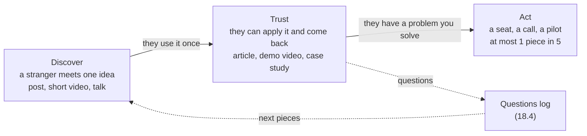

# 18.1 · Content as a funnel

## Why it matters

Nobody pays a stranger to change how their engineering team works. Before anyone books a workshop, they need to have seen you explain something useful, more than once, in a way they could check. The engineer-turned-trainer whose business this course reverse-engineers gave his whole method away in free videos, and it took months of that before the teaching paid for itself. Public teaching is the top of the funnel. It is not the product.

Engineers get this wrong in two opposite ways. Some never publish, because nothing feels finished and every sentence could be criticized. Others publish like marketers: an announcement, a hot take, a discount, a burst of four posts in a week and then silence. The first builds no credibility. The second builds attention, which is not the same thing, and spends it on asking for money before anyone has learned anything.

This lesson treats your content as an engineering system with a purpose, inputs and a measured output. The input is your method from Module 14: concepts with dated evidence. The output you measure is not likes. It is the moment someone who did not know you reads a piece, uses the idea and comes back with a follow-up question on their own. That is the module's exit test, and it is the first honest sign that the funnel works.

> [!NOTE]
> Content tags. **Concept** (stable): the funnel stages, audience research, credibility as a track record, participation inequality, signal vs attention, $1-(1-p)^n$. **Implementation**: `PostCheck calendar`, platform names and what they count (as of 2026-09).

## How it works

### Three stages, three jobs



- **Discover.** Someone who has never heard of you meets one idea, in a form small enough to take in while scrolling. The job is to be recognizably useful in thirty seconds. A post about a shadow rule, with a diff everyone has seen, does this.
- **Trust.** The same person meets you again and can *do* something with what you teach: find the second clock on their dashboard, add a reuse row to their brief. Trust pieces are longer, carry the evidence and say where the idea stops working.
- **Act.** A piece that asks for something: a workshop seat, a call, a pilot. Necessary, and corrosive in excess. If more than one piece in five asks, your audience learns that your content is advertising.

The questions arrow is the part most calendars miss. Readers who are trying to apply an idea ask questions, and those questions tell you what to publish next (18.4).

### Audience research is discovery, again

You already did the hard part in Module 1. Your wedge ([01.3](../module-01/lesson-03.md)) names the stack, the audience and the pain; your discovery interviews ([01.4](../module-01/lesson-04.md)) recorded that pain in their words. Audience research for content adds three questions:

1. **Who exactly, in which situation?** "Developers" is not an audience. "Developers and tech leads on ten-year-old .NET and SQL Server systems who already use a coding agent and have been surprised by it in review" is.
2. **Where do they already read and ask?** A professional network, a meetup, a forum, a newsletter, an internal channel. Pick two or three places you can keep up. The best evidence is where the people you interviewed said they found their last useful technical article.
3. **What do they ask?** Every question from a talk, a comment or a message is data about what they do not yet know. Until your own log exists, reuse the misconceptions you collected for your mini-workshop (Module 16).

Google's guidance on "people-first" content asks the same things of any page: is it self-evident *who* wrote it, *how* the work was done, and *why* it exists, and does it show first-hand experience. For a trainer, first-hand experience is the whole asset. Your dated incidents are what no one else can write.

### Credibility is a track record

In a classic 1951 experiment, Hovland and Weiss gave people the same articles attributed either to a trustworthy or to an untrustworthy source. The trustworthy attribution changed more opinions at first, although readers learned the facts equally well either way; after four weeks the difference had largely faded. Two lessons follow for you. First, who says it matters, and at the start nobody knows who you are. Second, the only credibility that lasts is built from content that holds up when separated from your name: claims people can check, examples they can rerun.

That is why the calendar is a long game. Each checkable piece is a small deposit. One piece that overclaims can cost more than ten careful ones earned, because the people most likely to notice are exactly the senior engineers you want in your workshop.

### Attention is not the signal

Most readers never react. Nielsen's summary of participation inequality in online communities, the "90-9-1 rule", estimates that about 90% of users only read, 9% contribute occasionally and 1% account for most contributions, and that for blogs the split is even steeper. So reach and likes will always dwarf everything else, and they are the numbers platforms show you first.

Treat them like lines of code: easy to count, loosely related to value. The signal you want is rarer and harder to fake:

| Metric | What it measures | Use it for |
|---|---|---|
| Reach, impressions | how many screens showed it | nothing much; format tuning at best |
| Likes, reactions | mild approval from the 9% | nothing |
| Replies | someone had something to say | reading, not counting |
| **Outside questions** | someone who did not know you tried to use the idea and got stuck | the funnel's health |
| Conversations | a question turned into a call or a message thread | the path to act |

"Outside" means the person did not know you before. "Unprompted" means you did not ask for questions. A colleague asking something after your lunch-and-learn when you said "any questions?" is welcome, and it is not the signal.

### How many pieces until a stranger asks?

*Intuition.* Each piece has some small chance of producing a question from outside your network. Pieces are like repeated trials: many small chances add up, but slowly.

*Equation.* If each piece independently has probability $p$ of producing at least one outside question, the chance that $n$ pieces produce at least one is

$$P(\text{at least one}) = 1 - (1 - p)^n$$

This is the same formula you used in [15.3](../module-15/lesson-03.md) to size the stranger test.

*Tiny example.* With $p = 0.05$ (one piece in twenty reaches the right stranger), twelve pieces give $1 - 0.95^{12} = 1 - 0.54 = 0.46$. A year of pieces every two weeks, $n = 26$, gives $1 - 0.95^{26} = 0.74$. With $p = 0.15$, twelve pieces give $1 - 0.85^{12} = 0.86$.

*Implementation.* `PostCheck calendar` counts the pieces with at least one outside question, puts a Wilson interval on that share ([07.4](../module-07/lesson-04.md)), and evaluates $1-(1-p)^6$ at the point estimate and at the lower bound.

*Interpretation.* With a low $p$, the exit signal is a matter of months, not weeks, and the lever is not posting more often but raising $p$: a sharper audience, one concept per piece, a question at the end, publishing where your audience already asks things. Independence is an approximation; one strong piece often produces several questions at once.

## Show me

The reference student (the Ground-Bound-Build-Prove method from Module 14) planned the calendar in [`solution/talks/content-calendar.md`](../../labs/module-18/solution/talks/content-calendar.md): a post a fortnight, alternating discover and trust, the internal lunch-and-learn in week two, the pilot write-up in week eleven, and no ask until week fifteen.

```bash
cd labs/module-18
dotnet run --project tools/PostCheck -- calendar solution/talks/content-calendar.md --concepts ../module-14/solution/concepts.md
```

```text
content-calendar.md: 10 pieces
  out: 7 (6 published, 1 delivered in a room); planned or drafted: 3
Mix
  stages (out): discover 2, trust 5, act 0
  formats (out): post, lunch-and-learn, article, video, case-study
  from a question: 2 of 7
Cadence (target: a piece every 14 days or less)
  7 pieces over 77 days, mean gap 12.8 days
Funnel
  7 measured pieces: reach 8751, replies 71, outside questions 5, conversations 5
  replies per 1,000 reach: 8.1
  pieces with at least one outside question: 4 of 7 (57%, 95% CI 25% to 84%)
  P(at least one in the next 6 pieces) = 1 - (1 - p)^6: 99% at p = 0.57; 82% at the lower bound
  exit signal: seen, first on 2026-08-12 (P-04); confirm it in the questions log
0 error(s), 0 warning(s)
```

Read the funnel section before the numbers feel good. 8.1 replies per 1,000 people reached is participation inequality at work. The first outside question came from the article (P-04), not from the post with the largest reach (P-06, 2,310). The article was a trust piece with an experiment, an interval and a question at the end; a stranger could use it and got stuck on something specific. The interval on "4 of 7" runs from 25% to 84%: seven pieces are too few to know $p$, which is why the tool warns below six and why the plan does not change on one good month.

## Try it

Budget: 60 minutes.

1. **Audience sentence (10 min).** Start `talks/content-calendar.md` from the [content calendar template](../../templates/content-calendar.md). Write one audience sentence from your wedge and your discovery notes: role, situation, what they already use.
2. **Places (10 min).** Choose two or three places to publish. For each, write one line of evidence that your audience is there (an interviewee's answer, a meetup you attend, a forum where you have seen their questions).
3. **Cadence (5 min).** Choose a gap you can keep for six months, not the one you can keep this month. Fourteen days is a sensible start.
4. **Six pieces (25 min).** Plan six pieces, each naming one concept from your `concepts.md` with status *supported* and its evidence IDs, alternating discover and trust. No act piece in the first six.
5. **Check (10 min).** Run `calendar` with `--concepts` pointing at your own `concepts.md`. Fix every error.

<details>
<summary>Hint: I only have two supported concepts, and six pieces feel like a stretch</summary>

Two concepts are plenty. One concept makes several pieces: the incident story (post), the evidence and its limits (article), the fix on the demo repository (video), the objection you hear most (a post answering FAQ-style). Repetition in different forms is how an idea sticks for readers; it only feels repetitive to you.
</details>

## Break it

Run the check on a first attempt at teaching in public that is really a promotion plan:

```bash
dotnet run --project tools/PostCheck -- calendar break/18.1-promo-calendar/content-calendar.md --concepts ../module-14/solution/concepts.md
```

Before reading the output, open the file and predict which rows will fail and why. The owner's goal line reads "10,000 followers by December, then sell the workshop".

## Fix it

**Diagnose.** Nine errors and three warnings, in four groups:

- **Nothing to teach.** P-02 (ten prompts) and P-03 (a hot take on juniors being replaced) teach no concept from the method and rest on no evidence. They produced the largest reach in the file (5,400 and 9,800) and will attract an audience that wants hot takes, not the tech leads who buy workshops. P-06 names C3 but cites no evidence for "42% faster" (18.2 takes that post apart).
- **Too many asks.** Three of six pieces ask for something (announcement, early-bird price, discount): 50%, against a ceiling of 20%. P-04, the booking post, has no link, so nobody can check what was promised.
- **Burst, then silence.** Three posts in the first week, then 42 days of nothing. Nobody's trust survives a six-week gap; the discount post that ends it is an apology plus an ask.
- **Wrong instrument.** The only columns are reach and likes. There is no way to see whether a single stranger tried to use anything.

**Modify.** Keep P-06 but give it EXP-01 and its interval. Replace P-02 and P-03 with pieces on supported concepts (C1 and C2). Move all asks after the sixth teaching piece and merge them into one. Spread the pieces at a fortnight each. Replace "Likes" with "Replies", "Outside questions" and "Conversations", and start the questions log. The reference calendar is one version of the result.

**Rerun.** `calendar` on the fixed file: no errors. The mix line should read zero or one act piece, and the funnel section should now print the outside-question share, even if it is 0 of 3 for now.

## How do I know it works?

- [ ] Your audience sentence names a role and a situation, and a stranger could tell whether they are in it.
- [ ] Every non-ask piece names one concept from your `concepts.md` and its evidence; `calendar --concepts` has no errors.
- [ ] Asks are at most one piece in five, and none are in your first six.
- [ ] Your calendar records outside questions, and you can explain to a colleague why reach is not the funnel's output.
- [ ] You can compute, for your own guess of $p$, how many pieces it will probably take to hear from a stranger, and you have planned that many.

## Use / don't use

**Use** the calendar as a plan you review monthly, not a promise to an algorithm. **Use** one concept per piece, and let the questions log (18.4) reorder the plan. **Use** your internal channels as the first audience; if a piece does not land with colleagues, it will not land with strangers.

**Don't** chase reach with content outside your method: it attracts the wrong audience and costs you credibility with the right one. **Don't** start with the ask. **Don't** judge the funnel on fewer than six measured pieces.

**Limitations.**

- The 90-9-1 figures are an observed pattern across communities, not a law with fixed numbers; your ratios will differ by platform and topic.
- Hovland and Weiss studied opinion change from printed articles in 1951; the direction (credibility helps at first, content must stand on its own) is well replicated, but the sizes do not transfer to social feeds.
- $1-(1-p)^n$ assumes pieces are independent trials with the same $p$. They are not: audiences grow, and one strong piece can bring several questions. Use it to set expectations, not to forecast a date.
- Platforms change what they count and show; the concept (attention vs signal) survives the changes, the column names may not.

## Reflect

1. Which piece in your plan would you most like to see go viral, and does it teach a concept from your method?
2. What $p$ did you guess for your own pieces, and what would make it higher?
3. Where did the last useful technical article you read come from, and why did you trust it?

## Sources

- [Hovland and Weiss (1951) — The Influence of Source Credibility on Communication Effectiveness](https://academic.oup.com/poq/article-abstract/15/4/635/1923117) — same content attributed to trustworthy vs untrustworthy sources: more opinion change for the trustworthy source at first, equal learning of facts, difference fading after four weeks.
- [Nielsen (2006) — The 90-9-1 Rule for Participation Inequality](https://www.nngroup.com/articles/participation-inequality/) — about 90% of community users only read, 9% contribute occasionally, 1% contribute most; steeper for blogs.
- [Google Search Central — Creating helpful, reliable, people-first content](https://developers.google.com/search/docs/fundamentals/creating-helpful-content) — who, how and why; first-hand experience; content made for people rather than for ranking.
