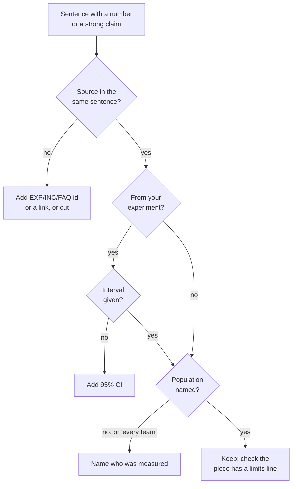

# 18.2 · Evidence-based technical writing

## Why it matters

Module 13 taught you to write an experiment report that is "short, dull and hard to argue with". Now you have to write for people who will not read the report: a post that someone scrolls past in four seconds, an article read on a phone. The temptation is to make the numbers louder. "16% (95% CI 5% to 25%) on one team" becomes "AI made us faster", which becomes "40% faster", which becomes someone else's slide.

That chain is not hypothetical. A study of 462 university press releases about health research, and the news stories written from them, found that much of the exaggeration in the news was already in the press release: 40% of releases contained more direct advice than the paper, 33% more causal claims, 36% inferred results in humans from animal studies. When the release exaggerated, the news was far more likely to exaggerate too (Sumner et al., 2014). Your posts are the press release for your method. Whatever you inflate, others will inflate further, under your name.

There is also a floor below which honesty is not optional. In US advertising, an objective claim needs a "reasonable basis" before it is made, and a claim like "studies show" needs at least the level of support it names (FTC substantiation policy). Once you sell workshops, your posts are part of how you sell them. Write every one as if a skeptical staff engineer and a regulator were both reading it.

> [!NOTE]
> Content tags. **Concept** (stable): the claims ladder for public writing, source-in-sentence, intervals, hype propagation, substantiation, disclosure, plain language. **Implementation**: `PostCheck claims` and its word lists (as of 2026-09). This lesson is not legal advice; for your jurisdiction's rules, ask a lawyer.

## How it works

### The ladder, applied to a post

The claims ladder from [13.6](../module-13/lesson-06.md) decides what a sentence may say:

| Rung | In a post it sounds like | Allowed in public? |
|---|---|---|
| 1 Observation | "I logged four shadow rules in twelve weeks on one system (INC-01, INC-05, INC-08, INC-12)." | yes |
| 2 Effect in this study | "Cycle time fell by 16% (95% CI 5% to 25%) in one randomized comparison (EXP-01)." | yes, with the interval |
| 3 Effect for this team's work | "For our kind of tickets, expect something like 5–25% shorter cycle time." | yes, with the population named |
| 4 Effect elsewhere | "Teams like yours will see 16%." | no, unless you have replications |
| 5 Money | "Saves $13.5 million a year." | only as a range with quality costs, rarely in a post |

A short piece has room for one or two rung-1 or rung-2 sentences, a limit and a question. That is enough.

### Seven rules for every sentence with a claim



1. **Source in the same sentence.** A reader who stops at this sentence should be able to follow it to the evidence. An ID from your notes (`EXP-01`, `INC-08`, `FAQ-04`) that your public method notes resolve, or a link.
2. **Interval with every experimental effect.** "16% (95% CI 5% to 25%)". Without it, 16% reads as a fact about the world.
3. **"Studies show" only with the study.** The FTC policy says that an express claim of support ("tests prove", "studies show") requires at least that level of support. If you cannot link the study in the same sentence, you do not have it.
4. **No hype words.** Guaranteed, 10x, game-changing, revolutionary, zero risk, effortless. None of them can be supported by the evidence a trainer has. They also mark you, to exactly the readers you want, as someone who has not measured anything.
5. **No generalizing past the people you measured.** "Every team", "teams like yours will see". Rung 4 needs replications you do not have.
6. **A limits line.** Where it does not apply, what you did not test, the size of the study. In 13.6 it was "what this does not show"; in a post it can be one sentence. It is the line that makes the others believable.
7. **A disclosure line.** Material connections to the things you write about: your employer, a vendor that gave you free access, a tool you are paid to promote. The FTC's endorsement guidance expects such connections to be disclosed clearly in the post itself, not buried in a profile. Even when the answer is "none", say so in your piece's header.

Vendor numbers deserve one more rule: cite the primary source and its population, not the headline. A controlled experiment on one small task with freelancers is evidence about that task ([13.2](../module-13/lesson-02.md)), not about your readers' legacy codebase.

### Plain language is part of honesty

Plain-language guidance for government writing (Digital.gov) and developer style guides (Google's "voice and tone") give the same advice: write for a specific reader, short sentences, active voice, concrete words, no buzzwords, no exclamation marks, no "it's easy". Hype and jargon share a function: they make a claim sound bigger than the evidence behind it. Plain language takes that cover away.

A shape that works for most short pieces:

1. **The reader's problem**, in one line they recognize.
2. **One claim**, at the lowest rung that is still useful.
3. **The evidence**, with its ID or link and, if it is an effect, its interval.
4. **The limit.**
5. **A question** that invites the replies you want (18.4).

## Show me

The reference article [P-04 · Why PR review time lies](../../labs/module-18/solution/talks/pieces/P-04-late-pr-article.md) teaches C3, the late-PR illusion, from EXP-01. It has three numbers, and each carries its source and its interval in the same sentence.

```bash
cd labs/module-18
EV="--evidence ../module-14/evidence/experiments.md ../module-14/evidence/NOTES-contoso.md ../module-14/solution/concepts.md ../module-14/solution/faq.md"
dotnet run --project tools/PostCheck -- claims solution/talks/pieces/P-04-late-pr-article.md $EV --deny ../module-15/samples/deny-terms.example.txt
```

```text
P-04-late-pr-article.md: article, concept C3, 35 sentences
Sentences with a number or a strong claim
  ok   With the agent, PR review time fell by 49% (95% CI 42% to 55%) in EXP...
  ok   Time to open the PR rose by 35% (95% CI 15% to 57%) in the same compa...
  ok   The whole ticket, cycle time, fell by 16% (95% CI 5% to 25%) in EXP-01.
Numbers: 3 effect claim(s), 3 sourced, 3 with an interval
Readability: mean sentence 13.1 words, longest 28
0 error(s), 0 warning(s)
```

Notice what the article does with the most tempting number. "49% faster reviews" is the sentence that would travel. The article puts it first and then takes it apart with the other two, because the point of C3 is that review time alone overstates the gain. Its "What this does not show" section names the failed defect guardrail from EXP-01. That section is what a skeptical tech lead forwards to their manager.

## Try it

Budget: 90 minutes for your first real piece.

1. **Pick the concept (5 min)** from your calendar's first discover piece.
2. **Write the claim at the lowest useful rung (10 min).** One sentence, with its evidence ID. If it is an effect from your experiment, add the interval now.
3. **Draft (40 min)** in `talks/pieces/P-01-<slug>.md` from the [content piece template](../../templates/content-piece.md), using the five-part shape. Fill in the header, including `Disclosure:`.
4. **Check (15 min).** Run `claims` with `--evidence` pointing at your own `NOTES.md`, experiment report, `concepts.md` and FAQ, and `--deny` pointing at your private deny list from 15.1. Fix every error; read every warning.
5. **Read it aloud to one colleague (15 min)** and ask: "What exactly am I claiming, and how do you know it's true?" If their answer is bigger than your claim, the piece overclaims somewhere.
6. **Publish (5 min)**, then put the link and the date in the calendar.

<details>
<summary>Hint: my best evidence is anecdotes, not an experiment</summary>

Then write at rung 1 and say so. "Four times in twelve weeks on one system, the agent re-implemented a rule it could not see" is an honest, specific and useful sentence. What you may not do is turn it into a rate ("agents duplicate rules 30% of the time") or a promise ("this stops duplicated rules"). Your concept card's status (hypothesis or supported) belongs in the piece when the concept is a hypothesis.
</details>

## Break it

A draft post written the evening after a good week:

```bash
dotnet run --project tools/PostCheck -- claims break/18.2-hype-post/draft-post.md $EV --deny ../module-15/samples/deny-terms.example.txt
```

Before you run it, read [the draft](../../labs/module-18/break/18.2-hype-post/draft-post.md) and count the claims its author cannot support. Some of its numbers will look familiar from the flawed report you fixed in 13.6.

## Fix it

**Diagnose.** Eleven errors and four warnings. Grouped:

| Sentence | Problem | Rule |
|---|---|---|
| "made our team 42% faster" | no source; the self-selected number from 13.6, which vanished within ticket size | 1 |
| "At Northwind … game-changing" | employer name on the deny list; hype | 4, deny list |
| "PR review time dropped 49% (EXP-01)" | sourced but no interval; and it is the late-PR illusion itself | 2 |
| "Studies show developers complete tasks 55% faster" | no study linked; a vendor-style headline without population | 1, 3 |
| "Every team … will ship faster" | generalizes past four developers on one system | 5 |
| "basically zero risk … always writes tests" | hype; the defect guardrail in EXP-01 failed | 4 |
| "$13.5 million a year … 400 developers" | no source; point-estimate money extrapolated to people never measured | 1, ladder rung 5 |
| "will 10x your team's output (see INC-31)" | hype; INC-31 does not exist in the notes | 4 |
| (missing) | no limits line; no disclosure line | 6, 7 |

**Modify.** Rewrite to what EXP-01 supports, in plain words:

> On one legacy .NET billing system, four developers worked 96 tickets, each randomly assigned to "with the agent" or "without" (EXP-01). With the agent, whole-ticket cycle time fell by 16% (95% CI 5% to 25%) in EXP-01. PR review time fell much further, but mostly because PRs opened later with more done. That is a clock effect, not extra speed. Escaped defects may have gone up: the interval runs from 0 to +25 points (EXP-01), so we did not roll out further. What this does not show: anything about your team, your tickets or your agent. Which clock does your dashboard start?

with the header lines `Audience: tech leads on legacy .NET teams who report delivery metrics` and `Disclosure: none; my own team's tickets, no vendor connection`, and no employer name.

**Rerun.** `claims` on the rewrite: one effect claim, sourced, with an interval; no errors, no warnings. It is less exciting than the draft. It is also the only version a tech lead could forward to their manager without embarrassment, and the only one you could defend in a workshop's Q&A ([17.3](../module-17/lesson-03.md)).

## How do I know it works?

- [ ] Every sentence with a percentage, multiplier or money figure has its source in the same sentence.
- [ ] Every effect from your own experiment has its interval next to it.
- [ ] No sentence is above rung 3; you can name the rung of each claim.
- [ ] The piece has a limits line and a `Disclosure:` line.
- [ ] `claims` passes with your own evidence files and your private deny list.
- [ ] A colleague restates your claim without making it bigger.

## Use / don't use

**Use** these rules on everything public: posts, slides, abstracts, your profile's headline, replies in threads. Replies are where people overclaim most, because they are written fast. **Use** evidence IDs that resolve in your public method notes, so that the source is one click away.

**Don't** hedge everything into mush: "might possibly help some teams" is as useless as "10x". State the claim at its rung, plainly, and put the limits in their own line. **Don't** repeat a vendor's headline number because it supports your point; cite the primary source with its population, or leave it out.

**Limitations.**

- `PostCheck claims` checks form, not truth: a sentence can cite EXP-01 and still misstate what EXP-01 found. Reading your own report against the piece is still your job.
- The Sumner study is about health news and university press releases; the mechanism (exaggeration in the source propagates downstream) is what transfers, not the percentages.
- FTC policy is US law about advertising. Other jurisdictions have their own rules, and whether a given post counts as advertising is a legal question. The rules here are stricter than most laws require, on purpose.

## Reflect

1. Which sentence in your first piece did you most want to make stronger than the evidence allows?
2. What did your colleague think you were claiming?
3. Which number from someone else's content have you repeated without reading its source?

## Sources

- [Sumner et al. (2014) — Exaggeration in health related science news and academic press releases (BMJ)](https://www.bmj.com/content/349/bmj.g7015) — 462 press releases and their news coverage: 40% of releases had more direct advice, 33% more causal claims, 36% human inference from animal research; news exaggeration strongly associated with release exaggeration.
- [FTC — Policy Statement Regarding Advertising Substantiation](https://www.ftc.gov/legal-library/browse/ftc-policy-statement-regarding-advertising-substantiation) — objective claims need a reasonable basis; express claims such as "studies show" need at least the stated level of support.
- [FTC — Endorsement Guides: What People Are Asking](https://www.ftc.gov/business-guidance/resources/ftcs-endorsement-guides-what-people-are-asking) — disclose material connections (free products, payment, employment) clearly in the post itself; 2023 revision.
- [Digital.gov — Plain language guide series](https://digital.gov/guides/plain-language) — principles of plain language for public writing, including writing for a specific audience and testing for understanding.
- [Google developer documentation style guide — Voice and tone](https://developers.google.com/style/tone) — conversational, precise, no buzzwords, exclamation marks or "it's easy".
