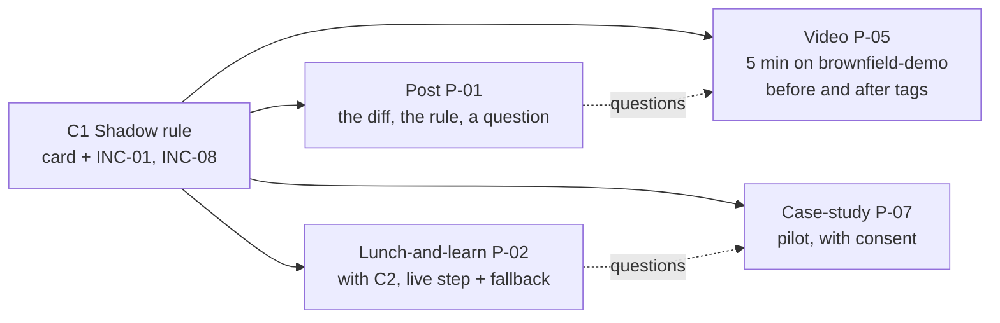

# 18.3 · Content formats

## Why it matters

The career path this course grew from says it simply: publish one piece every one to two weeks, a short video, a post or a write-up, each teaching exactly one concept from your `concepts.md`. The format is not decoration. A shadow rule is best *seen* in a diff; the late-PR illusion needs three numbers and a paragraph to read slowly; a skeptic's objection is best answered in a room where they can push back. Pick the wrong format and a good concept lands as noise.

Formats also differ in what they cost you and what they prove about you. A post costs an hour and proves you can explain one idea. An unedited video on your public demo repository costs a day and proves you can do it, live, on code a stranger can clone. A case-study piece costs weeks of real work and someone else's consent, and proves that the method helped someone who was not you. Your calendar needs all three kinds of proof, in that order.

> [!NOTE]
> Content tags. **Concept** (stable): format by job and proof, one concept per short piece, video length and engagement, captions, problem-first openings, repurposing. **Implementation**: `PostCheck format`, speaking-rate constants, platform limits (as of 2026-09).

## How it works

### Six formats, what each is for

| Format | Best stage | What it proves | Rough cost for the reference student | One-concept rule |
|---|---|---|---|---|
| Short post | discover | you can explain one idea in plain words | 1 h | exactly one |
| Article | trust | you have evidence and know its limits | 4–6 h | one or two |
| Short video on the demo repo | trust | you can do it, on code anyone can clone | 6–8 h incl. captions | exactly one |
| Talk (meetup, lunch-and-learn) | trust | you can hold a room and answer questions | 6–10 h incl. rehearsal | up to three |
| Live demo | trust | the method works now, not only in a recording | 8 h+ incl. fallbacks | one per segment |
| Case-study piece | trust, act | it helped someone else | weeks of work + consent | one |

The cost column is one student's log, not a benchmark; your own will differ. The pattern holds: the more a format proves, the more it costs, and the later in your calendar it can appear.

### One concept, many formats



Repurposing is not laziness. Readers meet an idea in different places and need to meet it more than once; each format adds evidence the previous one could not carry. What you must not do is merge concepts to "save" pieces. A video on three concepts is three videos nobody finishes.

### Video: short, problem-first, captioned

The largest early study of lecture-video engagement analysed 6.9 million viewing sessions on edX. Shorter videos were much more engaging, and the median time viewers spent on a video stayed around six minutes or less however long the video was (Guo, Kim & Rubin, 2014). Informal talking-head segments and speakers with enthusiasm and a brisk pace held attention better than polished studio recordings. These are MOOC students, not engineers on a phone, but the practical rule transfers: one concept, about six minutes at most, planned from the script.

*Sizing a script.* Spoken English in a clear explanation runs at roughly 130–150 words per minute. `PostCheck format` uses 150 for videos and 130 for talks, skips lines that start with `[` (screen directions), and compares the result with the `Target:` line. A 650-word script is about 4.3 minutes of speech before any screen-only time; for a three-minute target it is twice too long.

*The opening.* The first fifteen seconds decide whether anyone watches the next fifteen. Open with the reader's problem ("the tests pass and it still disagrees with a stored procedure you forgot existed"), not with your name, your channel or what you will cover. Introduce yourself later, briefly, or in the description.

*Captions.* W3C's accessibility guidance lists captions for prerecorded video as a level A requirement under WCAG, needed by people who are deaf or hard of hearing and used by many others, including everyone watching with the sound off. It also says plainly that automatically generated captions do not meet the requirement unless checked, and gives the example of "4 to 5 minutes" transcribed as "45 minutes". In your content, numbers and names (`usp_GetCustomerBalance`, "95% CI") are exactly what auto-captions break. Review them by hand.

*The repository.* Every screen in a public video shows `brownfield-demo`, never employer or client code ([15.1](../module-15/lesson-01.md)), and the description names the tag you recorded at, so a viewer can check out exactly what they watched. A video of `main` stops matching the code at the next commit.

### Talks and live demos

A talk is the only format where the audience can ask a question in the moment, so budget for it: plan the speaking part at 130 words per minute for the slot minus Q&A, never the whole slot. A live demo inherits everything from [15.4](../module-15/lesson-04.md): a run sheet, a fallback recording or a pre-baked branch for every live segment, and the name → decide → teach recovery. The lunch-and-learn in 18.4 is your first rep of both.

### Case-study pieces

A case-study piece is the strongest proof and the easiest to get wrong. Its structure is Before, Intervention, After and What this does not show. It needs written consent from the people and the organization it describes, with a date, and approval for every quote. The FTC's endorsement guidance adds a rule for testimonials: an exceptional result must not be presented as typical, so either show what generally happens or say clearly that it was one team. Module 21 teaches the full anonymized case study; here you write the short public piece about a free pilot.

## Show me

The reference student's video script [P-05](../../labs/module-18/solution/talks/pieces/P-05-shadow-rule-video.md) teaches C1 on `brownfield-demo`, before and after the AI layer:

```bash
cd labs/module-18
dotnet run --project tools/PostCheck -- format solution/talks/pieces/P-05-shadow-rule-video.md
```

```text
P-05-shadow-rule-video.md: format 'video', 288 words, 1 concept(s), target 5
  estimated speaking time at 150 words per minute: 1.9 min, plus screen-only time (target 5)
0 error(s), 0 warning(s)
```

1.9 minutes of speech leaves about three minutes for the screen: the five-second pause on the diff, the agent's plan appearing, the brief row, the smaller diff. The header carries `Repo: brownfield-demo @ ai-layer-v1`, `Captions: reviewed (edited by hand, 2026-08-25)` and a hook that states the problem. The script opens on the diff, asks the viewer to judge it, and only then names the concept. The limits sentence sits before the call to action: one repository, four incidents, "a pattern I trust on this code, not a law".

The same concept appears as a 179-word post (P-01, the diff and a question), in the lunch-and-learn (P-02, together with C2) and in the pilot write-up (P-07). Four formats, one concept, four kinds of proof.

## Try it

Budget: two hours, spread over two sessions.

1. **Choose (10 min).** Take the concept of your first published piece. Pick a second format that proves something the first could not (usually a short video on `brownfield-demo`).
2. **Script (40 min).** Write the script in `talks/pieces/P-NN-<slug>.md` with the header from the [content piece template](../../templates/content-piece.md): `Target`, `Repo` with a tag, `Hook`, `Captions`. Screen directions go on lines starting with `[`.
3. **Size (5 min).** `format`. If the speaking time exceeds the target, cut words, not the pause on the diff.
4. **Record (30 min)** in one take on your demo repository at the tag, the way you recorded in 15.3. Mistakes you recover from can stay.
5. **Captions (20 min).** Generate them, then correct every number, identifier and product name by hand. Set `Captions: reviewed`.
6. **Check and publish (15 min).** `claims` with your evidence and deny list, `format` again, then publish and add the link to the calendar.

<details>
<summary>Hint: my script keeps growing because the concept needs context</summary>

Then the context is a separate piece, or the concept is two concepts. A video can assume the viewer has seen your post; link it in the description. If the script still does not fit, check whether you are explaining the tool (implementation) rather than the concept. The tool steps belong in your `implementation-YYYY-MM.md`, not on camera.
</details>

## Break it

A first "short" video script, written in one sitting:

```bash
dotnet run --project tools/PostCheck -- format break/18.3-long-video/script.md
```

Open [the script](../../labs/module-18/break/18.3-long-video/script.md) first and note the header and the first three sentences. Predict which problems a tool can find and which only a viewer would notice.

## Fix it

**Diagnose.** Four errors, three warnings:

- **Too long for its target.** 631 spoken words, about 4.2 minutes, for a 3-minute target, before any screen time.
- **Three concepts.** Shadow rule, self-graded green and the late-PR illusion, each told in a paragraph. None has room for its evidence, and C3 turns into "something like sixteen percent" with no interval (18.2).
- **No captions.** A level A accessibility failure, and the viewer with the sound off gets nothing.
- **Employer code on screen.** `Repo: our billing repository at work`. Filming it publishes your employer's code and possibly its data; it is also not pinned, so nobody could rerun it anyway.
- **Opening on the presenter.** "Hi everyone, and welcome back to the channel. My name is…", then a request to subscribe, then background. The first problem arrives after about 175 spoken words, more than a minute in.

**Modify.** Split into three videos, one concept each. Keep the shadow-rule paragraph as the core of the first and rebuild it as P-05: open on the diff, show the before and after tags of `brownfield-demo`, move the introductions to the description, add the limits sentence, review captions by hand, and set `Target: 5 minutes` with the screen time planned. The other two paragraphs become entries in the calendar, each with its evidence.

**Rerun.** `format` on the new script: no errors, no warnings. Then `claims` with your evidence files: C3's video, when you write it, must carry EXP-01's interval.

## How do I know it works?

- [ ] Each short piece (post, video) carries exactly one concept; `format` agrees.
- [ ] Your video's estimated speaking time plus planned screen time fits its target, and the target is about six minutes or less.
- [ ] The first spoken sentence states the viewer's problem.
- [ ] Captions are reviewed by hand, including every number and identifier.
- [ ] Every screen shows `brownfield-demo` at a tag named in the description.
- [ ] You have published at least two formats for one concept.

## Use / don't use

**Use** posts to find out which concepts people care about, then invest in videos and talks for those. **Use** the unedited, one-take style from 15.3 for video: a recovered mistake on camera proves more than a polished edit. **Use** talks when you want questions; nothing else produces as many.

**Don't** start with the most expensive format. **Don't** film anything but your public demo repository, and don't show your terminal history, notifications or open tabs. **Don't** publish a case-study piece without written consent, however positive the result.

**Limitations.**

- Guo et al. studied MOOC lecture videos from four courses; the six-minute pattern is a reasonable default, not a law for every audience or platform.
- Speaking-rate estimates vary by person; time your own rehearsal once and adjust the target.
- The cost column is one student's log and will vary with your tools and experience.
- Platform features (length limits, auto-captioning quality, how links are shown) change often; check them when you publish.

## Reflect

1. Which of your concepts is best seen, which best read, and which best argued in a room?
2. How many minutes did your first script run before you cut it, and what did you cut?
3. What did you catch when you corrected the auto-captions?

## Sources

- [Guo, Kim and Rubin (2014) — How video production affects student engagement](https://dl.acm.org/doi/10.1145/2556325.2566239) — 6.9 million viewing sessions on edX: shorter videos more engaging, median engagement about six minutes or less regardless of length, informal talking-head and enthusiastic, brisk speakers more engaging.
- [W3C WAI — Captions/Subtitles](https://www.w3.org/WAI/media/av/captions/) — captions for prerecorded video are required at WCAG level A; automatically generated captions do not meet the requirement unless confirmed accurate.
- [FTC — Endorsement Guides: What People Are Asking](https://www.ftc.gov/business-guidance/resources/ftcs-endorsement-guides-what-people-are-asking) — testimonials and exceptional results: show what generally happens or say clearly that the result is not typical.
