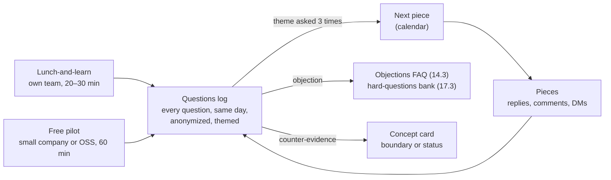

# 18.4 · Lunch-and-learn, free pilot, and questions into content

## Why it matters

Posts and videos go out; questions come back. The trainer this course studied answers questions live at the end of every piece, even when three people show up, and says the Q&A is what taught him what to build next. That is the loop this lesson closes: two small live reps, a lunch-and-learn and a free pilot, whose main output is not applause but a log of real questions, and a habit of answering each recurring question once, in public, so that it keeps working for you.

The two reps are chosen for their stakes. Your own team is audience number one: if an idea does not land with colleagues who share your codebase's pain, it will not land with strangers, and fixing it there is cheap. A free pilot with a small company or an open-source project is the first time the method meets people who owe you nothing. Treated like a paid engagement, it produces the evidence every later offer needs: a plan, measured learning, a follow-up, and a write-up the host agreed to.

> [!WARNING]
> A pilot puts you inside someone else's organization. Get written agreement on scope and on what you may publish before you start. Never ask for, look at or copy their code, tickets or data; learners work on their own machines, you demo on `brownfield-demo`. Run it on your own time and equipment, and check your employment contract and your employer's rules on side activities first (lesson 14.4). Anonymize everyone in your notes.

## How it works



### The lunch-and-learn

Twenty to thirty minutes, over lunch, for your own team or a neighbouring one. It is a compressed version of the mini-workshop from Module 16, not a talk:

- **One or two concepts**, shown on `brownfield-demo`, never on your team's code, even internally. It keeps the habit and keeps the deck publishable.
- **At least one moment of doing**: pairs judging a diff for thirty seconds, a prediction question while the agent runs ([16.3](../module-16/lesson-03.md)).
- **One live step with a fallback** from your run sheet ([15.4](../module-15/lesson-04.md)).
- **Ten minutes of questions**, planned into the slot, and the questions log open before the first one.
- **A three-question form** filled before people leave: "What will you try on a ticket this week?", relevance on a 1–5 scale, and the muddiest point.
- **A two-week follow-up** to everyone who named an action: "Did you try it? Link or one sentence." Report it as k of n with a Wilson interval, and count a "yes" without a link as no ([16.5](../module-16/lesson-05.md)).

Kirkpatrick's levels from Module 16 tell you what each instrument measures: the relevance rating is reaction (level 1), the named action is intent, the follow-up with a link is behaviour (level 3). A lunch-and-learn is too short for a pre/post test; do not pretend it measured learning.

### The free pilot

One 60-minute workshop for a small company or an open-source project you have a real connection to. Free, and run exactly like a paid engagement:

| Step | What you produce |
|---|---|
| Written agreement | scope, date, "free, nothing further promised", what you may publish and after whose review |
| Prep call (30 min) | three prior-knowledge notes, asked about the past ([01.4](../module-01/lesson-04.md)) |
| Plan | the Module 16 session stretched to 60 minutes, with objectives and parallel forms |
| Measures | level 1 form, level 2 pre/post with normalized gain, level 3 follow-up at two weeks |
| Feedback read the same day | results page and "what I change" |
| Consent for the write-up | the host's written approval of the draft, with a date; approval for each quote |

The write-up is a case-study piece (18.3): Before, Intervention, After, What this does not show. The FTC's endorsement guidance applies to how you use what the host says. A testimonial must reflect the person's real experience, and an exceptional result must not be presented as what everyone gets. "Nine people, one session, one team" in the limits section is how you meet that.

### The questions log

A question is the most valuable thing your content produces, and it evaporates within a day unless written down. Log every one, in the asker's words, with:

- **channel** (post, article, video, lunch-and-learn, pilot, meetup, DM, email),
- **network**: `inside` if the person knew you before, `outside` if not,
- **prompted**: `yes` if you asked for questions, `no` if it arrived on its own,
- **asker** as an anonymous ID or a role, never a name or an address,
- **theme**, a short slug you reuse, because the wording varies and the theme repeats,
- **answered in**: a piece (`P-06`), your FAQ (`FAQ-02`), a link, or `dm` / `email` / `verbal`.

Two rules turn the log into content:

1. **Three asks, one piece.** When a theme has been asked three times and answered only in private, the next piece in the calendar answers it. By participation inequality, most readers never ask anything; for every person who asked, assume several more had the same question and stayed silent ([Nielsen, 2006](https://www.nngroup.com/articles/participation-inequality/)).
2. **Answer once in public, then link.** A DM answer helps one person once. A public answer keeps answering, and the next time the question comes you reply with a link.

The log also feeds the rest of your method. Objections go into your objections FAQ ([14.3](../module-14/lesson-03.md)) and your workshop's hard-questions bank ([17.3](../module-17/lesson-03.md)). And sometimes a question is counter-evidence: "we added the reuse row and the agent still duplicated the rule" belongs on the concept card, and may change its boundary or its status.

### The exit signal

The module's exit test is the first row with `network = outside` and `prompted = no`: someone who did not know you used an idea from a piece and came back with a follow-up on their own. It tells you the funnel from 18.1 works end to end, for at least one person. It usually takes months, and it is worth more than any reach number you will collect on the way.

## Show me

The reference student's log [`questions.csv`](../../labs/module-18/solution/talks/questions.csv) has fifteen questions from the lunch-and-learn, the pilot and six published pieces:

```bash
cd labs/module-18
dotnet run --project tools/PostCheck -- questions solution/talks/questions.csv --pieces solution/talks/content-calendar.md
```

```text
questions.csv: 15 questions
  outside your network: 9 of 15; unprompted: 11 of 15
  theme                         asks  outside  answered in public
  model-improves                    3        2  P-06
  no-test-suite                     3        2  planned: P-08
WARN  'no-test-suite' asked 3 times; the answer is planned in P-08, not out yet
  agent-tests                       2        0  P-03
  ...
Answered only in private or not yet: 6 of 15
Question to piece: median 20 days over 2 piece(s)
Exit signal: SEEN on 2026-08-12 via article: "Time to PR went up 35%. Did reviewers push back on getting PRs later?"
0 error(s), 1 warning(s)
```

Three things to read. `model-improves` was asked by a manager in a DM, a stranger at a meetup and again under a post; P-06 answered it publicly 26 days after the first ask, and it became the piece with the most outside questions. `no-test-suite` came from a QA analyst at the lunch-and-learn, an e-mail and the pilot's tech lead; the answer is drafted as P-08, so the tool warns rather than fails. The exit signal came on 2026-08-12 from the article, a month after the first post.

The lunch-and-learn's [feedback](../../labs/module-18/solution/talks/lunch-and-learn/feedback.md) reports relevance 4.1 of 5, six of nine naming a concrete action, and a follow-up of 3 of 6 with a link (Wilson 95% CI 19% to 81%). The pilot's [results](../../labs/module-18/solution/talks/pilot/feedback.md) show a normalized gain of 0.57 on parallel forms, with the tech lead's two-week report marked as unverified. The [write-up](../../labs/module-18/solution/talks/pieces/P-07-pilot-case-study.md) went out two days after the host approved it, without the company's name.

## Try it

Budget: about four hours over several weeks, most of it the two sessions.

1. **Lunch-and-learn (90 min incl. prep).** Book 30 minutes with your team or a neighbouring one. Adapt your mini-workshop to one or two concepts on `brownfield-demo`; put the speaker notes in `talks/lunch-and-learn/slides.md` with a piece header and run `format`. Bring the form. Open `talks/questions.csv` from the [template](../../templates/content-calendar.md) before you start.
2. **After it (30 min).** Enter every question the same day. Write `feedback.md`: results, muddiest points with their themes, what you change. Send the follow-up at two weeks.
3. **Pilot (2 h plus the session).** Find one small company or open-source project you have a real connection to. Agree scope and publication in writing. Prep call, plan, session, forms, results the same day, follow-up at two weeks.
4. **Write-up (45 min).** Draft the case-study piece, send it to the host, publish only after written approval. `format` and `claims` on it first.
5. **Monthly.** Run `questions --pieces`. Every theme with three asks and no public answer goes into the calendar as the next piece.

<details>
<summary>Hint: nobody asks anything at the end of my talk</summary>

Silence after "any questions?" is normal, not a verdict (wait time, [16.4](../module-16/lesson-04.md)). Count to seven, then ask a specific question yourself: "What would stop you trying the reuse row on a ticket this week?" Put the muddiest-point question on the form; people write what they would not say aloud. Those are prompted questions, so they do not count for the exit signal, but they fill the log.
</details>

## Break it

A student has been "teaching in public" for three months and cannot see what to write next:

```bash
dotnet run --project tools/PostCheck -- questions break/18.4-private-answers/questions.csv
dotnet run --project tools/PostCheck -- format break/18.4-private-answers/pilot-post.md
```

Read [the log](../../labs/module-18/break/18.4-private-answers/questions.csv) and [the pilot post](../../labs/module-18/break/18.4-private-answers/pilot-post.md) before you run the checks. What would the pilot's host say if they saw the post?

## Fix it

**Diagnose.** The log has five errors and two warnings:

- **Identifiable askers.** Two full names and an e-mail address. The log is private, but it gets shared, screenshotted and pasted into pieces; anonymize at the source.
- **Everything answered in private.** `no-test-suite` was asked four times, `model-improves` three times, all answered in DMs, e-mails and hallway conversations. Seven people got an answer once; nobody else ever will. These are the two next pieces.
- **Only inside, only prompted.** Nine of nine questions are from people who already knew the student, all asked when invited. Nothing shows that any piece reached a stranger; the exit signal is not seen.

The pilot post has two errors and a warning from `format`, and `claims` adds four more errors and two warnings:

- no written consent, and the host's company named (a deny-list term), so the student has published about someone else's organization without permission;
- a quote with no approval;
- "3x faster at finding existing rules" with no source and "guaranteed to stop shadow rules for good", neither supported by nine people in one hour;
- no limits section, no disclosure that the workshop was free.

**Modify.** Replace names with roles or IDs. Put `no-test-suite` and `model-improves` into the calendar as the next two pieces, then mark those rows `P-08` and `P-06` when they are published. Post where strangers can reply, and end each piece with a question (18.1). For the pilot: take the post down, ask the host for written consent on a rewritten draft without their name, remove the unsupported numbers, report the measured ones (gain, follow-up) with their limits, add the disclosure. The reference [P-07](../../labs/module-18/solution/talks/pieces/P-07-pilot-case-study.md) shows the shape.

**Rerun.** `questions` with `--pieces` pointing at the updated calendar: no errors; the two themes show their pieces. `format` and `claims` on the rewritten pilot piece: no errors. The exit signal will stay "not yet" until a stranger asks; that is the honest state, and the tool does not let you fake it.

## How do I know it works?

- [ ] You delivered a lunch-and-learn on `brownfield-demo`, with a form, and sent the two-week follow-up; `feedback.md` reports it as k of n with an interval.
- [ ] You ran a free pilot with a written agreement, a plan, level 1–3 measures and a results page.
- [ ] Nothing about the pilot is public without the host's written, dated consent.
- [ ] Every question since your first piece is in `questions.csv`, anonymized and themed.
- [ ] `questions` shows no theme asked three times and answered only in private.
- [ ] At least four pieces are published with links, and the calendar, the log and the pieces agree.

## Use / don't use

**Use** the lunch-and-learn as a rehearsal of your workshop's opening and of your hard-questions answers; it is the cheapest room you will ever have. **Use** the pilot to produce evidence, not revenue; treat it as a paid engagement precisely because it is not one. **Use** the questions log as the backlog for your calendar, your FAQ and your workshop.

**Don't** turn the lunch-and-learn into a pitch for your side business; in your own company it may break policy and it will spend trust you need. **Don't** run a pilot without written scope, or publish anything about it without consent. **Don't** answer the same question privately for the fourth time.

**Limitations.**

- A lunch-and-learn measures reaction and intent, and a two-week follow-up with six people has an interval from about 20% to 80%; neither is evidence that the method works.
- A pilot with a friendly host is a selected sample; they chose your topic because they already had the problem.
- The exit signal is a single event. It says the funnel can work, not how often it does; the calendar's outside-question share (18.1) is the ongoing measure.
- The FTC guidance is US-specific and aimed at advertising; the consent and typical-results practices here are stricter than many jurisdictions require, on purpose.

## Reflect

1. Which question from your lunch-and-learn did you not expect, and what does it say about your concept card?
2. What would you need to hear from a pilot host before you would publish anything about them?
3. Which theme in your log have you answered privately most often, and when will its piece go out?

## Sources

- [FTC — Endorsement Guides: What People Are Asking](https://www.ftc.gov/business-guidance/resources/ftcs-endorsement-guides-what-people-are-asking) — testimonials must reflect honest experience; exceptional results need the typical outcome or a clear statement; material connections disclosed in the post; 2023 revision.
- [Kirkpatrick Partners — The Kirkpatrick Model](https://www.kirkpatrickpartners.com/the-kirkpatrick-model/) — reaction, learning, behaviour and results as separate levels of a training's effect.
- [Nielsen (2006) — The 90-9-1 Rule for Participation Inequality](https://www.nngroup.com/articles/participation-inequality/) — most community members never contribute; the few who ask stand for many who do not.
