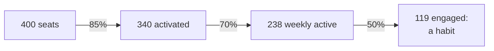

# 19.1 · Why rollouts fail

## Why it matters

At the end of Module 12, Fabrikam's platform passed security review: EU-hosted models behind a gateway, per-team keys, short-lived identities, an audit trail, seven ADRs. It was a good architecture. The CTO bought 400 seats, a previous consultant ran a kickoff webinar, and the draft plan's goal read "400 seats active by the end of Q4". Twelve weeks later 65% of developers used an agent at least once a week. Twenty-six weeks later it was 9%.

Nothing in the architecture broke. What broke was everything around it: a works council that had not been asked, team leads who gave nobody time to practise, office hours that stopped when the consultant left, a procurement deal that moved two teams to another tool. You will be hired for the technical part and judged on this one: a sponsor does not remember the gateway design, only whether people still use it six months later.

Adoption failure is not a mystery or a matter of "culture". It has mechanisms you can name, predict and plan for, and the first one is that every developer decides for themselves.

> [!NOTE]
> Content tags. **Concept** (stable): individual acceptance factors, the adoption funnel, rollout failure modes, stakeholder mapping, the objection answer shape. **Implementation** (as of 2026-09): the survey figures and DORA estimates, the legal specifics for Germany, `AdoptCheck stakeholders`.

## How it works

### Adoption is decided one person at a time

Forty years of research on why people do or do not use a new information system converge on a short list. Davis (1989) found that two beliefs predict use: **perceived usefulness** ("this will help me do my job") and **perceived ease of use** ("this will not cost me much effort"), with usefulness the stronger of the two. Venkatesh et al. (2003) compared eight competing models and unified them (UTAUT) into four determinants:

| UTAUT determinant | What it means for coding agents | Who controls it |
|---|---|---|
| Performance expectancy | "It makes my work better or faster" | your evidence (Module 13), the tasks you start on |
| Effort expectancy | "Learning it and fixing its output is not too costly" | training, the AI layer (rules, skills), a good default setup |
| Social influence | "People whose opinion I value use it and expect me to" | champions (19.2), leads, what seniors say in review |
| Facilitating conditions | "I have the time, access, policy and help to use it" | managers, security, legal, platform, enablement (19.3) |

So **seats decide nothing** (a licence is a facilitating condition), and three of the four determinants are controlled by people other than the developer, which is why the stakeholder map is the core of an adoption plan.

The developer's starting position is not neutral. In the Stack Overflow 2025 survey, 84% of respondents used or planned to use AI tools, but 46% distrusted the accuracy of their output and only 33% trusted it; 66% named "solutions that are almost right, but not quite" as their top frustration. Usage and trust are different things. DORA's research on trust points the same way: developers do not need to trust AI output blindly, they need review and testing processes they believe will catch its errors ([DORA, trust](https://dora.dev/insights/trust-in-ai/)).

### The adoption funnel

*Intuition.* A rollout is a sequence of stages, and each stage loses people. The number that reaches the end is the product of the stage rates, the same compounding you met with $p^k$ in Module 2.

*Equation.* With $N$ seats and stage conversion rates $r_1, r_2, \dots, r_k$:

$$\text{habitual users} = N \prod_{i=1}^{k} r_i$$

*Tiny example.* Fabrikam, 400 seats: 85% activate (at least one session), 70% of those use it in a typical week, 50% of weekly users have sessions on three or more days.

$$400 \times 0.85 \times 0.70 \times 0.50 = 119$$



A glossy "85% activation" headline becomes 119 people for whom the agent is a habit. Improving the weakest stage pays most: raising weekly use from 0.70 to 0.85 adds 25 habitual users; raising activation from 0.85 to 0.95 adds 14.

*Implementation.* The stages map to telemetry you will measure in [19.4](lesson-04.md): seats assigned, activated, weekly active, engaged.

*Interpretation.* Each stage has a different owner. Activation is platform and onboarding; weekly use is usefulness and time; engagement is whether the work actually improves. A plan that only manages the first stage is a licence rollout.

### How AI rollouts fail

Kotter (1995) studied more than 100 companies attempting large changes and listed eight errors; three of them describe most AI rollouts you will see: under-communicating the vision, declaring victory too soon, and not anchoring the change in how the organisation works. In AI rollouts they take specific forms:

| Failure mode | What it looks like | Stakeholder behind it |
|---|---|---|
| Licences as adoption | "400 seats by Q4" as the goal; success declared at activation | executive, finance |
| Mandate without enablement | usage made compulsory or put in performance reviews; no practice time | executive, managers |
| Trust gap | "almost right" output, no shared rules, no evidence on the team's own code | developers, senior engineers |
| Fear of replacement | silence in the kickoff, quiet non-use, "first the tool, then the headcount review" | developers |
| Manager skepticism | no time given, no protection for slower first weeks | team leads |
| Late veto | security, legal, privacy or the works council hear about it after the purchase | security, legal, DPO, works council |
| Consultant dependency | everything runs through one external person | sponsor, programme owner |

DORA's 2024 analysis of adoption points at the same levers from the other side. It estimated that a clear acceptable-use policy was associated with a 451% increase in adoption, dedicated time to learn with 131%, addressing developers' concerns about their jobs with 125%, and transparency about the plan with 11.4% ([DORA, adopt gen AI](https://dora.dev/insights/adopt-gen-ai/)). These are associations from survey models, not controlled experiments, so read them as "which levers matter" rather than "what you will get". Notice that none of them is "buy more licences" or "make it mandatory".

### The stakeholder map

A stakeholder map is a table with one row per group whose support, time or signature the rollout needs:

For each row: influence, current stance (champion, supporter, neutral, skeptic, blocker), the objection **in their words**, your answer, the evidence behind it, what changes in their week, and who owns the relationship. The owner matters most for high-influence skeptics and blockers: someone meets them before the rollout.

Some rows are not optional. Developers and managers, obviously. Security and legal or privacy, because Module 12 showed that data flows and training terms are decided by them. And where developers are employed in a country with employee representation, the works council: in Germany, the introduction and use of technical systems designed to monitor the behaviour or performance of employees is subject to the works council's co-determination (BetrVG § 87(1) no. 6). Adoption telemetry that can show who uses the agent how much falls squarely into that discussion, so the agreement comes before go-live, not after the first dashboard. Check the equivalent rules in every country where your developers are employed; this lesson is not legal advice.

### Answering an objection

You met the answer shape in [17.3](../module-17/lesson-03.md) for a workshop room: concede, evidence, boundary, not known, bridge. A stakeholder conversation uses the same shape, with one addition: say **what changes for them**.

- **Concede** what is true. "Almost right" output is real; the survey says two-thirds of developers see it.
- **Evidence** someone can open: your experiment (EXP-01 from Module 13), an ADR, a lesson, a requirement id, the security review.
- **Boundary**: what you will not claim. "No one can promise what headcount decisions will be in three years; this programme's data will not be used for them."
- **What changes for them**: two protected practice hours; a review-load metric with a stop rule; a seat in the works agreement.

What the answer must never contain is a promise nobody can keep: "guaranteed", "10x", "completely safe", "nobody will lose their job". Each one is falsifiable by a single event, and when it is falsified you lose the stakeholder and everyone they talk to.

## Show me

The previous consultant's stakeholder section is `labs/module-19/break/19.1-stakeholders/adoption-plan.md`. Before running anything, read it and predict which rows the CISO and the works council will object to.

```bash
cd labs/module-19
dotnet run --project tools/AdoptCheck -- stakeholders break/19.1-stakeholders/adoption-plan.md
```

Warnings (evidence that is not checkable, empty "changes for them") are left out here:

```text
ERROR no legal or privacy stakeholder: training terms, IP, personal data in prompts and telemetry
ERROR countries DE, NL, IL but no works council / employee representation in the map: usage telemetry can be a system able to monitor performance (DE: BetrVG §87(1) no. 6)
ERROR All developers: answer promises "Nobody will lose": a promise nobody can keep is the fastest way to lose this stakeholder
ERROR Later-wave developers: answer has no evidence reference (lesson, ADR, EXP, file or URL)
ERROR Later-wave developers: high-influence skeptic with no owner: someone must meet them before the rollout, not after
ERROR Team leads: answer promises "10x": a promise nobody can keep is the fastest way to lose this stakeholder
ERROR Director of engineering: answer has no evidence reference (lesson, ADR, EXP, file or URL)
ERROR Director of engineering: answer ties usage to individual performance ("every developer's review"): that buys logins, not habit, and needs the works council
ERROR CISO office: answer promises "completely safe": a promise nobody can keep is the fastest way to lose this stakeholder
ERROR CISO office: high-influence blocker with no owner: someone must meet them before the rollout, not after
ERROR Finance business partner: answer has no evidence reference (lesson, ADR, EXP, file or URL)
      6 stakeholders, 0 without errors

11 error(s), 8 warning(s)
```

Compare the CISO row with the reference plan (`solution/adoption-plan.md`):

| | Draft | Reference |
|---|---|---|
| Answer | "The tool is completely safe; the vendor is certified." | "Agreed, which is why the platform has per-team keys, a gateway, hooks and an attack suite that passed review. Class C changes need security sign-off." |
| Evidence | vendor trust page | ADR-0003, ADR-0007, 09.6, security-review.md |
| Owner | — | Eitan Shaked (platform owner) |

The reference concedes the CISO's point, because it is correct: Module 9 taught you exactly how an agent with those tools becomes an exfiltration path. The evidence is Fabrikam's own, and the security team already reviewed it. The rollout also gives security something: a sign-off on every class C change ([11.5](../module-11/lesson-05.md)).

## Try it

Budget: 60 minutes, for your own team or for Fabrikam (use `labs/module-19/fabrikam/brief.md` and its eleven quotes).

1. **Facts.** Copy the [adoption-plan template](../../templates/adoption-plan.md) and fill section 0: organisation, developers, countries, sponsor, handover date, and a one-sentence goal that names an outcome, not a seat count.
2. **Five conversations.** Talk to at least five people from different groups (a developer from a later wave, a senior engineer, a lead, someone from security, someone from legal, privacy or HR). Use the discovery-interview habits from [01.4](../module-01/lesson-04.md): ask about their last week, not about AI in general. Write each objection in their words.
3. **The map.** One row per group, with stance and influence. For each objection, write the answer in the concede–evidence–boundary shape, and "what changes for them".
4. **Check.** Run `AdoptCheck stakeholders` on your file until it is clean.
5. **Funnel.** With your own or Fabrikam's numbers, compute habitual users with $N \prod r_i$ and write which stage you expect to be weakest, and which stakeholder owns it.

<details>
<summary>Hint: I have no evidence for the "almost right" objection</summary>

Then the honest answer says so, and the plan creates the evidence. "We have not measured it on our code yet. The first four weeks start on task types where it is most likely to help (tests, well-specified tickets, migrations with the 11.5 rule), and we will show your team's own numbers at week 12." The evidence column then points at the experiment design ([13.3](../module-13/lesson-03.md)) you will run.
</details>

## Break it

Do what a busy sponsor would do the week before kickoff: (1) replace the developers' answer with "AI is a copilot, not a replacement: nobody will lose their job"; (2) add "adoption becomes an objective in every developer's review" to the director's row; (3) delete the works-council row "because the platform is already approved". Run the check, then write in two sentences each what happens when reality tests those three sentences.

## Fix it

**Diagnose.**

1. *Symptom:* the checker flags promises, a performance tie-in and a missing group; in real life, the symptom is silence at kickoff and non-use afterwards.
2. *Mechanism:* promises and mandates act on the wrong determinant. They try to produce usage directly instead of changing usefulness, effort, social influence or facilitating conditions, and they cost trust the first time they are contradicted.
3. *Root cause:* the map was written to reassure the sponsor, not to answer the stakeholders.

**Modify.** Rewrite each flagged answer with concede–evidence–boundary: the replacement answer becomes a written statement from the sponsor about what the programme's data will and will not be used for (the boundary you *can* keep); the mandate becomes a practice-time budget; the works council row returns with a draft agreement (team-level data only, stated purpose, no performance use) and an owner from HR.

**Rerun.** `stakeholders` is clean; you can read each answer aloud to the person in that row without wincing.

<details>
<summary>Solution: the three rewritten rows</summary>

| Stakeholder | Answer | Evidence | Changes for them |
|---|---|---|---|
| All developers | The sponsor states in writing what this programme is for and what its data will not be used for; no individual metrics exist. | sponsor-memo.md, 19.4 | memo read at every wave kickoff |
| Director of engineering | Mandated use buys logins, not habit. The target is weekly use with outcomes, reported per team. | 19.1, 13.1 | quarterly sponsor review |
| Works council (DE) | Correct, so the works agreement comes before go-live in Germany: team-level data only, stated purpose, no performance use, council sees the dashboard. | BetrVG §87(1) no. 6, works-agreement-draft.md | co-signs section 4 |
</details>

## How do I know it works?

- [ ] `AdoptCheck stakeholders` is clean, and every row came from a conversation or a quote, not from your imagination.
- [ ] Every high-influence skeptic or blocker has a named owner and a meeting date before kickoff.
- [ ] Every evidence cell opens: a lesson, ADR, experiment, requirement, file or URL.
- [ ] You can name the weakest stage of your funnel and the stakeholder who owns it.
- [ ] Security, legal or privacy, and employee representation (where it exists) have seen the plan before go-live.

## Use / don't use

**Use** the map before any rollout of more than one team, and revisit it at every wave. **Use** the funnel to argue for spending on the weakest stage instead of the most visible one.

**Don't** treat stance as fixed: skeptics with good objections often become the best champions once the objection is taken seriously (19.2). **Don't** use the map as a list of people to "handle"; it is a list of people whose conditions the plan must change. **Don't** make legal statements about employee representation from this lesson; involve HR and counsel.

**Limitations.**

- TAM and UTAUT come from earlier workplace systems; use them as a checklist of levers, not as coefficients for coding agents.
- The DORA estimates are associations from surveys, and the Stack Overflow figures describe survey respondents, not your organisation. Your own conversations beat both.
- A checker can find a missing row or the word "guaranteed"; it cannot tell whether your answer is true. The stakeholder can.

## Reflect

1. Which objection in your map did you first want to answer with a promise, and what boundary did you write instead?
2. Which of the four UTAUT determinants is weakest in your organisation, and who controls it?
3. Who in your map could stop the rollout in its last week, and have they seen it yet?

## Sources

- [Davis (1989), MIS Quarterly](https://doi.org/10.2307/249008) — perceived usefulness and perceived ease of use as determinants of user acceptance; usefulness the stronger predictor.
- [Venkatesh, Morris, Davis and Davis (2003), MIS Quarterly](https://misq.umn.edu/misq/article/27/3/425/1340/User-Acceptance-of-Information-Technology-Toward-A) — UTAUT: eight acceptance models compared and unified into performance expectancy, effort expectancy, social influence and facilitating conditions.
- [Kotter (1995), Harvard Business Review](https://hbr.org/1995/05/leading-change-why-transformation-efforts-fail-2) — eight errors in transformation efforts, from more than 100 companies, including under-communicating, declaring victory too soon and not anchoring the change.
- [DORA — Helping developers adopt generative AI](https://dora.dev/insights/adopt-gen-ai/) — estimated associations of acceptable-use policies (451%), learning time (131%), addressing concerns (125%) and transparency (11.4%) with adoption.
- [DORA — Fostering developers' trust in generative AI](https://dora.dev/insights/trust-in-ai/) — 39% of developers trust gen AI output only a little or not at all; policies, feedback mechanisms and hands-on exposure as trust levers.
- [Stack Overflow 2025 Developer Survey — AI](https://survey.stackoverflow.co/2025/ai) — 84% use or plan to use AI tools; 46% distrust and 33% trust accuracy; 66% cite "almost right" solutions.
- [BetrVG § 87](https://www.gesetze-im-internet.de/betrvg/__87.html) — works council co-determination over technical systems designed to monitor employees' behaviour or performance (Abs. 1 Nr. 6).
