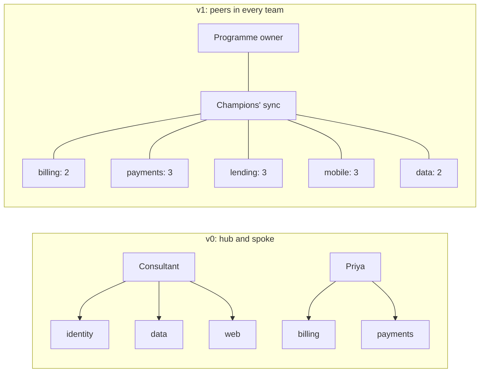

# 19.2 · Champions and tool fragmentation

## Why it matters

Fabrikam's pilot was a success: 30 developers from billing, payments and platform, three months, a positive survey. The first rollout plan drew the obvious conclusion. The three most enthusiastic pilot volunteers became "the champion network" for all eight teams, the consultant covered the teams nobody volunteered for, and each team kept whichever agent tool it already liked, because standardising "could wait".

By week 16 the network had failed in three ways at once. Priya, the billing champion, was also covering payments, 112 developers, in time nobody had agreed with her lead; she stopped answering the channel in week 9 when her sprint slipped. The consultant, champion for identity, data and web, left in week 12. And the four tools meant four rules-file formats, four security reviews and a procurement bundle that silently moved mobile and lending to a tool outside the gateway.

The pilot measured the people who wanted it. Rolling out means reaching the people who did not volunteer, through peers they trust, on as few tools as you can justify. This lesson is about both.

> [!NOTE]
> Content tags. **Concept** (stable): adopter categories, opinion leaders and homophily, champion role and sanction, team-level adoption, fragmentation costs, concentration and effective number. **Implementation** (as of 2026-09): AGENTS.md support across tools, DORA's AI capabilities, `AdoptCheck champions`.

## How it works

### Who adopts when

Diffusion research describes how a new practice spreads through a social system over time. Rogers (2002) summarises the model: adoption follows an S-curve, and adopters fall into five categories by when they adopt, from **innovators** (the first 2.5%) through early adopters, early majority and late majority to **laggards**. The categories differ in what they need:

| Category (Rogers) | Share | What moves them | At Fabrikam |
|---|---|---|---|
| Innovators | 2.5% | novelty, the tool itself | already using agents before the pilot |
| Early adopters | 13.5% | advantage, status as the person who knows | the pilot volunteers |
| Early majority | 34% | proof from peers that it works on work like theirs | most of billing, payments, web |
| Late majority | 34% | it has become the norm; the risk is gone; help is close | most of lending and mobile |
| Laggards | 16% | it is simply how the team works now | a few in every team |

Two consequences for a rollout. First, **pilot results do not transfer automatically**. Thirty volunteers are, by construction, innovators and early adopters: they tolerate rough edges, find their own use cases and enjoy the tool. This is the selection bias from [13.4](../module-13/lesson-04.md) in another form. Field evidence points the same way: in the three field experiments of Cui et al. (4,867 developers at Microsoft, Accenture and a Fortune 100 company), developers who were given access did not all adopt at the same rate: less experienced developers had higher adoption rates than senior ones, so a pilot's makeup shapes its numbers. Second, **the majority moves through people, not announcements**. Rogers' model routes change through *opinion leaders*: people whose informal influence over peers' decisions comes from being competent, accessible and similar to them. Communication works best between people who are alike in background and role (homophily), which is why a senior engineer's remark in a code review outweighs a vendor webinar.

### Champions: a role, not an enthusiasm

A champion is a peer inside one team whose job, for a defined number of hours, is to make the agent useful for that team. The role has five parts:

1. **First responder**: the person you ask before you give up on a stuck task.
2. **Local examples**: collects the team's own before/after cases (on your code, not the demo's).
3. **Rules owner**: maintains the team's layer on top of the shared core, as a code owner ([11.5](../module-11/lesson-05.md)).
4. **Feedback conduit**: sends what breaks to feedback triage (19.3), with the ticket or PR.
5. **Practice host**: runs the team's weekly practice block during the first weeks of a wave.

Selection matters more than numbers. Pick people the team already asks for help, with a mix of seniority. A former skeptic whose objection was taken seriously and answered (19.1) is often the most credible champion in the room; the loudest enthusiast often is not, because the early majority discounts enthusiasm. Never make the consultant a champion: champions are how the change survives the consultant.

Three conditions make the role real:

- **Sanctioned time**, agreed with the champion's manager and visible in sprint planning. The Fabrikam reference plan uses 3 hours a week during the waves.
- **Coverage**: at least one champion per team, and a planning heuristic of about one per 25 developers, so that every team has a co-champion who takes over when the first one moves on.
- **A network**: a fortnightly champions' sync and a monthly session with the programme owner, so fixes found in one team reach the others.



### From individual use to team practice

Adoption is only stable when it becomes how the team works. The signals are team-level: a working agreement on which task types start with the agent, a rule that agent-authored PRs are labelled and reviewed like any other, the team's rules file maintained in the repository, and the lead using it visibly. Social influence in UTAUT (19.1) is mostly this: what the people around you expect and do.

### Tool fragmentation

Every tool you support multiplies work that does not scale with the number of users: a gateway route and telemetry path ([12.2](../module-12/lesson-02.md)), a security review and threat-model update, a rules-file format, a training path, a set of FAQ answers, a licence contract. Worse, each team's rules drift into a different format, and the shared conventions stop being shared.

*Intuition.* Four tools with equal shares is more fragmented than one dominant tool with a small exception, even though both are "more than one tool". You want a single number for how many tools you are effectively supporting.

*Equation.* With $s_i$ the share of developers on tool $i$, the concentration (the Herfindahl–Hirschman index used for market concentration, here on a 0–1 scale) and its reciprocal:

$$H = \sum_i s_i^2 \qquad N_{\text{eff}} = \frac{1}{H}$$

$N_{\text{eff}}$ is 1 for a single tool and $k$ for $k$ tools with equal shares.

*Tiny example.* Fabrikam's v0 plan: Tool A 146 developers, Tool B 128, Tool C 76, Tool D 50.

$$H = 0.365^2 + 0.32^2 + 0.19^2 + 0.125^2 = 0.133 + 0.102 + 0.036 + 0.016 = 0.29 \qquad N_{\text{eff}} = 3.5$$

The reference plan: Tool A for 344 developers, Tool B for mobile's 56 under an ADR. $H = 0.86^2 + 0.14^2 = 0.76$, $N_{\text{eff}} = 1.3$.

*Implementation.* `AdoptCheck champions` computes both from the champions table and warns above 2.

*Interpretation.* $N_{\text{eff}}$ is the multiplier on your per-tool overhead. At 3.5, every security review, training path and gateway change is done three to four times, and each done less well.

### One default, exceptions by decision, portable rules

DORA's 2025 AI Capabilities Model lists a *clear and communicated AI stance* first among seven capabilities that amplify AI's benefits, including clarity on which tools are permitted; ambiguity about what is acceptable, DORA notes, stifles adoption and creates risk. A tool strategy makes the stance concrete:

- **One supported default**, chosen with the criteria from Module 12 (hard constraints first, then fit), not by popularity in the pilot.
- **Exceptions by ADR** ([12.5](../module-12/lesson-05.md)): a team may use another tool when there is a reason (mobile's native UI work at Fabrikam), and the ADR records that the tool routes through the gateway, emits the same telemetry and passed security review. Seats of the replaced tool are revoked.
- **A portable rules core.** Keep the shared conventions in `AGENTS.md`, an open format that many coding agents read ([agents.md](https://agents.md/)), and let tool-specific files import it, as in [03.2](../module-03/lesson-02.md). Then an exception costs a thin adapter, not a fork of your conventions.

## Show me

`labs/module-19/break/19.2-champions/adoption-plan.md` is the v0 network. Predict before running: how many distinct champions cover 400 developers, and what is $N_{\text{eff}}$?

```bash
cd labs/module-19
dotnet run --project tools/AdoptCheck -- champions break/19.2-champions/adoption-plan.md
```

```text
ERROR no 'Default tool:' line: without one supported default, every team picks its own and enablement splits
ERROR billing: no champion hours per week: unsanctioned champion work is the first thing dropped in a busy sprint
ERROR billing: champion time not agreed with a manager
...
ERROR identity: the champion is the consultant, who leaves; champions must be members of the team
...
ERROR lending: no champion
ERROR mobile: no champion
ERROR Priya Nair is champion for 2 teams (billing, payments): a champion is a peer inside one team
ERROR Sam Carter is champion for 3 teams (identity, data, web): a champion is a peer inside one team
      tools by developers: Tool A 36%, Tool B 32%, Tool C 19%, Tool D 12%
      concentration H = sum of squared shares = 0.29; effective number of tools 1/H = 3.5
WARN  effective number of tools 3.5 > 2: each extra tool multiplies security reviews, gateway work, rules formats and training paths
WARN  3 rules-file formats in use (CLAUDE.md, .cursorrules, .github/copilot-instructions.md)
      8 teams, 400 developers, 3 distinct champions

20 error(s), 16 warning(s)
```

Three people cover 400 developers, one of whom leaves in week 12, and nobody's time is agreed with a manager. The reference (`solution/adoption-plan.md`) has 19 champions, two or three per team, 3 hours a week each agreed with the team lead, one default tool and one ADR-backed exception, and every rules file built on `AGENTS.md`: `champions` is clean with $N_{\text{eff}} = 1.3$.

## Try it

Budget: 60 minutes.

1. **List candidates.** For each team, ask the lead and two developers: "Who do people ask when they're stuck?" Write the names that come up twice. Add one former skeptic from your stakeholder map if their objection was answered.
2. **Sanction.** For each champion, agree hours per week with their manager, in writing, for the duration of the wave. Record who agreed.
3. **Section 2.** Fill the champions table: team, developers, champions (co-champion included), hours, agreed with, tool, rules file.
4. **Tool strategy.** Write the default tool and why (link your Module 12 criteria or ADR). For every other tool in use, either write the ADR that justifies it (gateway path, telemetry, security review) or plan its retirement and seat revocation.
5. **Check.** Run `AdoptCheck champions` until clean and note $N_{\text{eff}}$.

<details>
<summary>Hint: a team lead refuses to give any hours</summary>

Do not paper over it with a volunteer working evenings. Put the lead's objection in the stakeholder map (19.1) with its owner, and offer a time box: three hours a week for the four weeks of the wave, reviewed at the week-4 metrics review. A team with no sanctioned champion is a team you should schedule in a later wave.
</details>

## Break it

Copy your clean plan and simulate two ordinary events: (1) one champion moves to another team and you replace them with the same person who already champions their new team; (2) procurement adds "Tool E, free for one year" for the data team without an ADR, with a `.toolerules` file. Rerun `champions`. What does $N_{\text{eff}}$ become, and which errors appear? Then look at your anti-regression plan (you will write it in 19.4): which mechanism should have caught each event?

## Fix it

**Diagnose.**

1. *Symptom:* two teams without a champion, three champions carrying eight teams, $N_{\text{eff}} = 3.5$, three rules formats.
2. *Mechanism:* champion work without sanctioned time loses to sprint work; a network centred on the consultant disappears with the consultant; each extra tool multiplies overhead and splits the shared conventions.
3. *Root cause:* the network was built from enthusiasm (who volunteered in the pilot) instead of from structure (who the team trusts, with agreed time, in every team), and tool choice was left to habit.

**Modify.** Two or three champions per team chosen by the "who do people ask" question; hours agreed with each lead; the consultant removed from every champion cell; a default tool; mobile's Tool B kept only with ADR-0011 (gateway, telemetry, review) and the other tools' seats revoked; `AGENTS.md` as the core in every team.

**Rerun.** `champions` is clean; $N_{\text{eff}} \le 2$; every team can name its champion and co-champion.

## How do I know it works?

- [ ] Every team has at least one champion who is a member of the team, and a co-champion.
- [ ] Every champion's hours are agreed, in writing, with their manager.
- [ ] There is one default tool; every other tool has an ADR or a retirement date.
- [ ] Every team's rules file builds on the shared `AGENTS.md` core.
- [ ] $N_{\text{eff}} \le 2$, and you can name what each extra tool costs you.

## Use / don't use

**Use** champions for any rollout beyond one team, and a co-champion from the start. **Use** $N_{\text{eff}}$ when someone proposes "just one more tool" to make the cost visible.

**Don't** turn champions into an unpaid helpdesk or a usage-quota enforcer; the first kills the role, the second kills their credibility. **Don't** force a single tool where a team has a real, documented need; an ADR-backed exception is cheaper than a shadow tool outside the gateway. **Don't** assume pilot numbers predict the majority's.

**Limitations.**

- Rogers' category percentages come from a normal-curve idealisation; real organisations have their own mix. Use the categories to plan messages and help, not to count people.
- The one-per-25 ratio is a planning heuristic, not a research finding. Adjust to your teams' size, seniority and distance from the default workflow.
- $N_{\text{eff}}$ ignores that some tools cost more to support than others. Weigh it with the actual per-tool overhead.

## Reflect

1. Who in your team do people ask when they are stuck, and are they on your champion list?
2. Which tool in your organisation exists only because nobody decided against it?
3. If your best champion left tomorrow, who would take over, and do they know it?

## Sources

- [Rogers (2002), Addictive Behaviors](https://pubmed.ncbi.nlm.nih.gov/12369480/) — diffusion of innovations: S-curve, adopter categories (innovators the first 2.5%), opinion leaders, strategies for speeding diffusion.
- [Cui et al. — three field experiments with software developers](https://www.microsoft.com/en-us/research/publication/the-effects-of-generative-ai-on-high-skilled-work-evidence-from-three-field-experiments-with-software-developers/) — 4,867 developers at three companies; less experienced developers had higher adoption rates and larger gains.
- [DORA — AI Capabilities Model](https://cloud.google.com/blog/products/ai-machine-learning/introducing-doras-inaugural-ai-capabilities-model) — seven capabilities; a clear and communicated AI stance, including which tools are permitted, amplifies AI's benefits.
- [AGENTS.md](https://agents.md/) — an open format for agent instructions read by many coding agents; basis of a portable rules core.
- [U.S. DOJ — Herfindahl-Hirschman Index](https://www.justice.gov/atr/herfindahl-hirschman-index) — concentration as the sum of squared shares.
