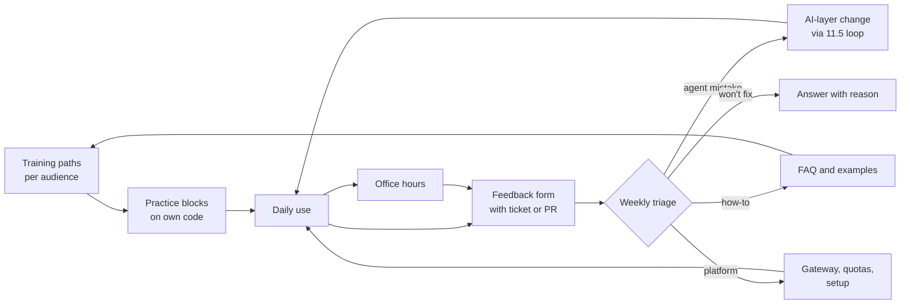

# 19.3 · Enablement mechanics

## Why it matters

The first Fabrikam rollout had enablement. It had a two-hour kickoff webinar, recorded "for people who miss it", a set of vendor videos, an `#ai-agents` channel and office hours "as needed", run by the consultant. Attendance was 81% and the satisfaction score 4.4 out of 5. Every number the plan measured was good.

Underneath, the channel collected about fourteen complaints a week ("it keeps editing the generated DbContext", "it ignores our migration convention", "the gateway times out at 9:00"), and the consultant resolved about five. After a quarter, more than a hundred reports sat unanswered. Developers drew the reasonable conclusion: reporting does nothing, and the agent does not work on our code. When the consultant left in week 12, office hours stopped the same week, because nobody else owned them.

Enablement is not an event. It is a small set of recurring mechanisms (training paths, practice time, office hours, a feedback loop, ownership), each with an owner, a cadence and an output, that together keep effort expectancy low and facilitating conditions in place (19.1). You designed a workshop in Module 17; this lesson places it in the system that makes it matter.

> [!NOTE]
> Content tags. **Concept** (stable): role-based paths, practice time, measuring beyond reaction, office hours, the feedback loop and its queue, ownership that survives the handover. **Implementation** (as of 2026-09): the AI Act's literacy obligation and its enforcement dates, DORA's estimates, managed settings, `AdoptCheck enablement`.

## How it works

### The enablement system



Every arrow needs an owner. The loop's job is to make each week's use a little easier than the last; if the arrows out of triage are missing, the system only collects complaints.

### Training paths per audience

One webinar for everyone fails for the reason 16.1 gave: people learn what they do, and different roles need to do different things.

| Audience | What they must be able to do | Format | Measured by |
|---|---|---|---|
| Developers | run the loop on a real ticket in their own repository | the 2-hour workshop from [17.1](../module-17/lesson-01.md), then four weekly practice blocks with the champion | pre/post items and a two-week follow-up with a PR link ([16.5](../module-16/lesson-05.md)) |
| Team leads | read the team metrics, protect practice time, watch review load | 45 minutes, one week before their wave | practice blocks actually held |
| Security | review class C changes, run the attack suite, read the audit trail | 90 minutes, before wave 1 | triage exercise on injected tickets |
| New hires | set up and use the agent in week one | onboarding path + pairing with the champion | first agent-assisted PR within three weeks |
| Champions | spread fixes and patterns between teams | monthly session | team questions resolved, observed at office hours |

Two design points carry most of the weight. **Practice time** is part of the path, not homework: DORA's 2024 analysis estimated that giving developers dedicated time to learn was associated with a 131% increase in adoption, far more than transparency alone ([DORA](https://dora.dev/insights/adopt-gen-ai/)). And **effort expectancy starts with setup**: a new developer should reach a first useful session in minutes, with the organisation's defaults already in place. Most agent tools support centrally managed configuration; in Claude Code, managed settings deployed by the organisation take precedence over project and user settings ([settings](https://code.claude.com/docs/en/settings)), so the gateway, permissions and hooks from Modules 8, 9 and 12 arrive with the tool rather than as a setup guide.

### Policy and literacy are part of enablement

The single largest lever in DORA's estimates was a clear **acceptable-use policy** (451%): what the agent may be used for, what data may go into it, what must be reviewed, who to ask. Write it with legal, security and the works council (19.1), keep it to two pages, and teach it inside the paths above rather than as a separate compliance module.

For deployers in the EU there is also a legal floor. Article 4 of the AI Act requires providers and deployers of AI systems to take measures to support the AI literacy of their staff and others operating AI systems on their behalf, taking into account their knowledge, experience and the context of use. The Commission's Q&A states that the obligation has applied since 2 February 2025, with national enforcement from 2 August 2026 ([Commission Q&A](https://digital-strategy.ec.europa.eu/en/faqs/ai-literacy-questions-answers)). A role-based path with records of who completed what is also your evidence for that obligation; NIST's AI RMF asks for the same thing as GOVERN 2.2, AI risk training for personnel. This is orientation, not legal advice: the client's counsel decides what their obligation requires.

### Office hours

Office hours are the cheapest place to bring a stuck task. The format that works: 30 minutes, weekly per wave while the wave is new, then fortnightly; bring a real task, share the screen, the champion of the week drives. Every question is logged verbatim. Repeated questions become FAQ entries and examples, and, in public form without client details, the content pieces you learned to write in [18.4](../module-18/lesson-04.md).

### The feedback loop and its queue

A feedback item is a report with a pointer: the ticket or PR, what the agent did, what the developer expected. Triage sorts each one into an outcome: an **agent mistake** goes into the system-evolution loop ([11.5](../module-11/lesson-05.md)) as a regression task and a fix; a **how-to** becomes an FAQ entry; a **platform** problem goes to the gateway or setup owner; a **won't fix** gets an answer with the reason. NIST's MEASURE 3.3 asks for exactly this: feedback processes for end users that are integrated into the system's evaluation.

The loop is a queue, and queues follow a law you can compute on a napkin.

*Intuition.* If items arrive faster than they are resolved, the pile grows forever. If they are resolved just barely faster, the pile is large and each item waits long. The number of open items, the arrival rate and the waiting time are tied together.

*Equation.* Little's law (Little, 1961): in a stable system, the average number of items in the system equals the arrival rate times the average time an item spends in it.

$$L = \lambda W$$

The system is stable only if the resolution rate $\mu$ exceeds the arrival rate; the utilisation $\rho = \lambda / \mu$ must stay below 1.

*Tiny example.* Fabrikam expects $\lambda = 14$ items a week. With a target of $W = 2$ weeks from report to answer, the loop will hold $L = 14 \times 2 = 28$ open items on average. The first rollout resolved $\mu = 5$ a week: $\rho = 2.8$, and the backlog grew by 9 items a week, 108 after a quarter. The reference plan budgets $\mu = 18$: $\rho = 0.78$.

*Implementation.* Put the three numbers in section 0 of the plan; `AdoptCheck enablement` computes $\rho$, the growth when $\rho > 1$ and $L$. Then turn $\mu$ into hours: at about 15 minutes of triage per item, 18 items is 4.5 hours a week, which must be in someone's role, not their evenings.

*Interpretation.* Utilisation near 1 is fragile: one bad week (a gateway incident, a new wave) creates a backlog that does not drain. Waves raise $\lambda$, so raise $\mu$ before a wave, not after the complaints.

### Owners who stay

The consultant can run the first sessions. Nothing recurring can depend on them after the handover date. Every mechanism gets an employee owner, recorded in the plan and in the owners section of `governance.md` from 11.5:

| Mechanism | Owner at Fabrikam | Also in |
|---|---|---|
| Training paths, office hours, metrics review | enablement lead (programme owner) | plan §3, §5 |
| Feedback triage, AI-layer review | platform owner | `governance.md` cadence |
| Security path, class C sign-off | CISO delegate | `governance.md` change classes |
| Team rules, practice blocks | champions | CODEOWNERS |

## Show me

`labs/module-19/break/19.3-enablement/adoption-plan.md` is the first rollout's enablement section.

```bash
cd labs/module-19
dotnet run --project tools/AdoptCheck -- enablement break/19.3-enablement/adoption-plan.md
```

```text
ERROR no training path for leads or managers
ERROR no training path for security
ERROR no training path for new hires (onboarding)
WARN  Everyone: measured by "attendance, satisfaction score" only: that is reaction (Kirkpatrick level 1), not learning or behaviour (16.5)
WARN  Everyone: kickoff webinar, recorded for people who miss it with no hands-on part (16.3: people learn what they do)
WARN  Everyone: training owned by the consultant: fine for delivery, name who runs it after the handover
...
ERROR no training path is measured beyond attendance or satisfaction
ERROR office hours: owned by the consultant, who leaves: it stops the week after the handover
WARN  office hours: cadence "as needed" is not a date anyone can miss
ERROR no feedback triage: complaints that go nowhere teach people to stop reporting
ERROR no AI-layer review: the 11.5 loop: incidents become regression tasks and fixes
ERROR no metrics review: someone looks at the numbers on a date, not when it is too late
      feedback: arrivals 14/week, resolved 5/week, utilisation 280%
ERROR feedback backlog grows by 9 items a week (108 after a quarter): people stop reporting when nothing comes back

9 error(s), 7 warning(s)
```

The reference passes with five training paths, six rhythms owned by employees, and:

```text
      feedback: arrivals 14/week, resolved 18/week, utilisation 78%
      Little's law: target time in system 2 weeks x 14 arrivals/week = 28 open items on average (L = lambda W)
```

## Try it

Budget: 60 minutes.

1. **Paths.** Fill the training table for developers, leads, security, new hires and champions. For developers, reuse your Module 17 workshop; add the practice blocks and their hours. For each path, write what the person must be able to *do* afterwards and how you will see it.
2. **Setup.** Write down every step a new developer takes from "seat assigned" to "first useful session". Move each step you can into centrally managed configuration or the joiner checklist, and time the rest.
3. **Rhythms.** Fill the rhythms table: office hours, feedback triage, AI-layer review, metrics review, champions' sync. Every owner is an employee; every cadence is a day, not "as needed".
4. **Queue.** Estimate $\lambda$ from the pilot (reports per active developer per week × expected weekly active developers) and choose $W$. Compute $L$ and the $\mu$ you need for $\rho \le 0.8$, then convert $\mu$ to hours and get them agreed.
5. **Check.** Run `AdoptCheck enablement` until clean.

<details>
<summary>Hint: I have no pilot data for the arrival rate</summary>

Use a range and plan for the high end. Fabrikam's 14 a week is about 0.055 items per weekly active developer; early waves report more because everything is new. Measure $\lambda$ from the first two weeks of the first wave and resize $\mu$ at the week-4 metrics review.
</details>

## Break it

In a copy of your plan, make three changes that look like cost savings: (1) replace the developer workshop with "recorded webinar, self-paced"; (2) move office hours to "as needed" and give them to yourself because you are "already there"; (3) cut the triage owner's time so that $\mu$ is 10 while $\lambda$ stays 14. Run the check, then compute what the backlog will be at the week-12 handover.

## Fix it

**Diagnose.**

1. *Symptom:* attendance and satisfaction look good, reports pile up, office hours stop at the handover.
2. *Mechanism:* the plan measured reaction, not learning or behaviour; nothing turned reports into changes, so effort expectancy never fell; every recurring mechanism depended on one external person.
3. *Root cause:* enablement was designed as an event with a presenter, not as a system with owners and capacity.

**Modify.** Role-based paths with hands-on practice and a behaviour measure; office hours with a weekly day and an employee owner; a triage owner with $\mu$ above $\lambda$ and the hours agreed; the AI-layer review and metrics review on the calendar; owners copied into `governance.md`.

**Rerun.** `enablement` is clean; $\rho \le 0.8$; you can name who runs each mechanism the week after you leave.

<details>
<summary>Solution: the reference rhythms (excerpt)</summary>

| Mechanism | Cadence | Owner | Input | Output |
|---|---|---|---|---|
| Office hours | weekly, Tuesday 30 min per wave; fortnightly from W16 | Dana Weiss + rotating champion | stuck tasks, questions | answers, FAQ entries, feedback items |
| Feedback triage | weekly, Thursday | Eitan Shaked | feedback form, channel threads, office-hours items | each item fixed in the AI layer or docs, answered, or declined with a reason, within 2 weeks |
| AI-layer review | monthly | Eitan Shaked | incidents, overrides, changelog (11.5) | rules retired or promoted to checks |
| Metrics review | monthly; quarterly with the sponsor | Dana Weiss | usage.csv, outcome metrics, survey | an action for every team below its control limit |
</details>

## How do I know it works?

- [ ] Five audiences have a path, and at least the developer path is measured by learning or behaviour, not attendance.
- [ ] A new developer reaches a first useful session in a time you have measured, not guessed.
- [ ] Every rhythm has an employee owner and a calendar slot; none is owned by you after the handover.
- [ ] $\mu > \lambda$ with $\rho \le 0.8$, and the triage hours are in someone's agreed role.
- [ ] Each triage outcome has a destination: 11.5 loop, FAQ, platform, or answered decline.

## Use / don't use

**Use** the queue arithmetic whenever someone says "we'll handle feedback in the channel". **Use** the developer workshop you already built; its pre/post and follow-up are your training evidence.

**Don't** measure enablement by attendance or satisfaction alone (16.5). **Don't** run office hours as a presentation; they are for real stuck tasks. **Don't** let a channel stand in for triage: a channel is a place, not a mechanism with an owner and a date.

**Limitations.**

- Little's law gives averages for a stable system; it says nothing about the worst week. Keep slack for waves and incidents.
- The DORA figures are survey-model associations and can shift between report years; use them to argue for levers, not to forecast.
- Legal obligations differ by jurisdiction and change; the AI Act's application and enforcement details here are as of 2026-09.

## Reflect

1. Which enablement mechanism in your plan would stop first if you disappeared tomorrow?
2. What is your $\rho$ for feedback, and who spends the hours behind $\mu$?
3. What does a new developer in your organisation do in their first hour with the agent, and how long does it take?

## Sources

- [European Commission — AI literacy Q&A](https://digital-strategy.ec.europa.eu/en/faqs/ai-literacy-questions-answers) — Article 4 requires providers and deployers to take measures to support staff AI literacy; applies since 2 February 2025; national enforcement from 2 August 2026.
- [Little (1961), Operations Research](https://pubsonline.informs.org/doi/10.1287/opre.9.3.383) — proof that $L = \lambda W$ for stationary queueing processes.
- [DORA — Helping developers adopt generative AI](https://dora.dev/insights/adopt-gen-ai/) — estimated associations of acceptable-use policies (451%) and dedicated learning time (131%) with adoption.
- [NIST AI RMF 1.0 — Core](https://airc.nist.gov/airmf-resources/airmf/5-sec-core/) — GOVERN 2.2 (AI risk management training for personnel), MEASURE 3.3 (end-user feedback processes integrated into evaluation).
- [Claude Code docs — Settings](https://code.claude.com/docs/en/settings) — managed settings deployed by the organisation take precedence over command-line, project and user settings.
