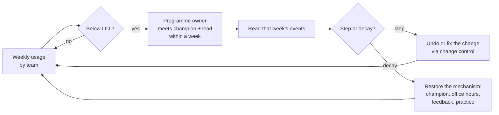

# 19.4 · Measuring adoption and preventing regression

## Why it matters

Fabrikam's CTO calls you in week 26: "Three months after the engagement, usage is back to 10% of developers. What happened, and what do we do?" The first rollout's plan measured seats assigned, prompts per developer on a leaderboard, and lines of code accepted. Its only anti-regression mechanism was a monthly e-mail from the consultant, who had left.

The tempting answers are all wrong in the same way. "Retrain everyone" assumes the cause before looking. "Send a survey" takes three weeks and measures opinions. "Make it mandatory" was already rejected in 19.1. The right first move is to look at the curve by team and cohort, next to what happened in each week, because an organisation-wide 10% is an average of very different stories.

This lesson gives you the measurement to tell those stories apart, the statistics to tell a real drop from noise, and the mechanisms that make a drop visible in a week instead of a quarter, owned by people who are still there.

> [!NOTE]
> Content tags. **Concept** (stable): reach–habit–outcome metrics, aggregation and privacy, control limits, step vs decay, cohorts, the diagnosis order, anti-regression mechanisms, handover criteria. **Implementation** (as of 2026-09): vendor metric definitions and OpenTelemetry attribute names, `AdoptCheck plan` and `usage`.

## How it works

### Three levels of adoption metrics

| Level | Question | Fabrikam metric | Source |
|---|---|---|---|
| Reach | Who can use it? | seats assigned; activated (at least one session) | licence records, gateway |
| Habit | Who keeps using it? | weekly active (a session in the week); engaged (sessions on 3+ days); new-hire activation | gateway, agent telemetry |
| Outcome | What changed in delivery? | lead time for changes, change failure rate, review load ([13.1](../module-13/lesson-01.md)) | CI/CD, incidents, GitHub |
| Experience | How does it feel? | a short quarterly survey on usefulness and trust | survey |

Reach tells you whether the rollout happened; habit whether it stuck; outcome whether it mattered. A plan with only reach metrics declares victory at activation, Kotter's "declaring victory too soon" in dashboard form.

Definitions must be exact, because vendors differ. GitHub, for example, defines weekly active users over a rolling 7-day window and describes a WAU-to-licence ratio above 60% as healthy; it also notes that sharp declines may indicate configuration issues or reduced interest, and recommends combining dashboards with surveys or retrospectives ([GitHub Docs](https://docs.github.com/en/copilot/reference/copilot-usage-metrics/interpret-copilot-metrics)). Treat the 60% as the vendor's heuristic, not a law; the point is to fix one definition and keep it.

**Volume counts are diagnostics, not targets.** Prompts, tokens, sessions and lines accepted are easy to raise without any benefit, and a target on them invites exactly that (Goodhart's law, and the activity-metric warning from 13.1).

**Aggregate at the collector, by team.** Agent telemetry is often per person. Claude Code's OpenTelemetry metrics, for example, include session counts, active time, commits and pull requests, and carry attributes such as an account identifier and, when available, the user's e-mail ([monitoring](https://code.claude.com/docs/en/monitoring-usage)). Drop those attributes in the collector and store team counts with at least five people per group. Per-person views turn adoption measurement into performance monitoring, which the works council agreement from 19.1 excludes, and which teaches people to game the number.

### Is it a real drop? Control limits per team

*Intuition.* A team's weekly share bounces around even when nothing changes: 48 developers, each with a 70% chance of using the agent in a given week, will not produce 70% every week. You want a line below which the share is too low to be that bounce.

*Equation.* The p-chart from statistical process control. From baseline weeks when the team was stable, estimate $\bar p$ = total active / total seats. For a week with $n$ seats:

$$\text{LCL} = \bar p - 3\sqrt{\frac{\bar p(1-\bar p)}{n}}$$

A share below the LCL is very unlikely to be ordinary week-to-week variation ([NIST/SEMATECH](https://www.itl.nist.gov/div898/handbook/pmc/section3/pmc332.htm)).

*Tiny example.* Fabrikam billing, baseline W09–W12: 135 active of 192 seat-weeks, $\bar p = 0.70$. With $n = 48$:

$$\text{LCL} = 0.70 - 3\sqrt{\frac{0.70 \times 0.30}{48}} = 0.70 - 3 \times 0.066 = 0.50$$

Billing was at 58% in W14 (inside the limits: could be noise) and 50% in W15 (below: a real drop). For the whole organisation ($\bar p = 0.63$, $n = 428$) the limit is 55.5%: large groups have tight limits, small teams wide ones.

*Implementation.* `AdoptCheck usage` computes $\bar p$ and the LCL for each team from the baseline weeks (`--baseline W09-W12` by default), reports the first week below it, and prints the events of that week from `events.csv`.

*Interpretation.* Watch teams, not only the organisation. In the reference data, the data team fell below its limit in W18 when its champion left, while the organisation stayed at 60%: the average hid it. For a survey or a spot check with few people, use the Wilson interval from [07.4](../module-07/lesson-04.md) instead: if 12 of 20 lending developers say they now use Tool B weekly, that is 60%, and anything from about 39% to 78% is plausible.

### Step, decay, gap

The shape of a drop points at its cause:

| Shape | Looks like | Usual causes | First check |
|---|---|---|---|
| **Step** | a team falls by more than half its baseline in one week | tool or licence change, access or quota change, a broken setup, a telemetry change | what changed that week (events, ADRs, change requests) |
| **Decay** | a slow slide over many weeks | habit not formed, support gone, champion left, feedback unanswered | ownership, office hours, feedback queue, champions |
| **Gap** | usage near zero but seats still paid and no complaints | usage moved to a place telemetry cannot see | ask the team; check other tools and routes |
| **Cohort** | people who joined after the rollout never start | onboarding without the agent | the joiner checklist |

### Why usage regresses

Habits take longer than engagements. Lally et al. (2010) followed 96 people adopting a simple daily behaviour: the median time to reach 95% of their automaticity plateau was 66 days, with a range from 18 to 254 days. Using an agent well on a real ticket is not a simple daily behaviour. A 12-week engagement ends at about the point where the habit is still forming for most people, which is exactly when the consultant's support disappears. Kotter's other late error applies too: the change was never anchored in how the organisation works, so it depended on the person who brought it.

### Anti-regression mechanisms



Each mechanism answers one way the first rollout regressed:

| Mechanism | Stops | Owner |
|---|---|---|
| Programme ownership handover, rehearsed before the date | everything stopping when the consultant leaves | programme owner, sponsor |
| Champion succession (co-champions from day one) | a team losing its champion and its support | team leads |
| Onboarding in the joiner checklist | every new hire starting at zero | HR + champion |
| Usage alert on each team's LCL | a slide noticed after a quarter | programme owner |
| Tool, licence and quota change control (ADR, class D in 11.5) | a procurement or finance decision silently breaking a team | platform owner |
| Dated follow-ups at 30, 60, 90 days after handover | nobody checking whether the handover worked | consultant + programme owner |

**Handover criteria.** Leave when the owner has run the mechanisms without you, not when the calendar says so: the programme owner has chaired two metrics reviews and one office-hours cycle while you observed; every rhythm in section 3 has run at least once with its employee owner; the alert has been tested on historical data; the sponsor has signed the handover checklist. Then the follow-ups are yours, and nothing else is.

## Show me

The first rollout's metrics and handover sections fail `plan` (a per-person prompt leaderboard, volume targets, no handover date, no owner, succession, onboarding or alert). Now its data. Before running: which team would you look at first, and why?

```bash
cd labs/module-19
dotnet run --project tools/AdoptCheck -- usage break/19.4-regression/usage.csv --events break/19.4-regression/events.csv
```

```text
  W12   258/400    65% active    34% engaged  ###################  <- Engagement ends; the consultant leaves; no handover meeting
  W13   230/402    57% active    28% engaged  #################  <- New hires start without agent onboarding (not in the joiner checklist)
  W14   208/404    51% active    25% engaged  ###############  <- Weekly office hours cancelled: the consultant ran them and nobody owns them
  W15   189/406    47% active    22% engaged  ##############
  W16   123/408    30% active    15% engaged  #########  <- Procurement moves mobile and lending to the Tool B bundle; ...
  ...
  W26    40/428     9% active     4% engaged  ###
      baseline W09-W12: p = 62.6%; W26: 9.3% of 428; lower control limit p - 3*sqrt(p(1-p)/n) = 55.5%

By team (baseline W09-W12; LCL computed with each week's seats)
  team        base   LCL  last first<LCL  pattern
  billing      70%   51%   12%       W15  decay (habit and support fading)
  payments     69%   52%   14%       W15  decay (habit and support fading)
  platform     68%   44%   15%       W17  decay (habit and support fading)
  identity     62%   38%   11%       W17  decay (habit and support fading)
  data         59%   36%   12%       W17  decay (habit and support fading)
  web          60%   40%   12%       W16  decay (habit and support fading)
  lending      57%   39%    3%       W16  STEP (something changed that week: tool, access, quota, measurement)
  mobile       57%   37%    4%       W16  STEP (something changed that week: tool, access, quota, measurement)
...
New-hire cohort W26: 1/28 active (4%) vs rollout baseline 63%
```

Three stories, not one:

1. **Mobile and lending (128 developers): a step in W16.** Procurement moved them to Tool B, which does not route through the gateway, and nobody revoked the Tool A seats. Part of this drop may not be abandonment at all but usage the telemetry cannot see. First action: ask the teams, then decide by ADR (route Tool B through the gateway with telemetry, or return to the default) and stop paying for unused seats.
2. **Six teams: a decay from W15–W17.** It starts two to five weeks after the handover, as office hours stop, champions move without successors and a quota cut in W21 adds throttling. The mechanisms of 19.2 and 19.3 were missing.
3. **New hires: never started.** 1 of 28 active; onboarding does not mention the agent.

So the answer to "what do you look at first" is this table: the weekly curve per team and cohort, next to the events, before any survey or retraining.

## Try it

Budget: 60 minutes.

1. **Metrics.** Fill section 4 of your plan: at least one reach, two habit (including new-hire activation) and two outcome metrics, each with a definition, target, source and team-level aggregation.
2. **Anti-regression.** Fill section 5 with the six mechanisms, owners and triggers, and write your handover criteria.
3. **Check the plan.** Run `AdoptCheck plan` on the whole file until it is clean.
4. **Read the data.** Run `usage` on both the break and the solution data. Write a half-page memo to Fabrikam's CTO for the break data: real or noise, where, when, why, and three actions with owners, in that order.
5. **Your own data (optional).** If you have team-level weekly counts from a gateway or vendor export, convert them to `usage.csv`, choose your baseline weeks and run `usage`.

<details>
<summary>Hint: my rollout has no stable baseline weeks yet</summary>

Then you cannot compute meaningful control limits. Use the last four weeks of the final wave once it has been live for at least four weeks, and write in the memo that limits are provisional until eight weeks of stable data exist. Until then, watch direction and step changes, and read shares with Wilson intervals.
</details>

## Break it

> [!CAUTION]
> Use the illustrative Fabrikam data or team-level counts only. Do not build per-person exports to "test" the alert.

Take the solution data and simulate a quiet failure: in a copy of `solution/usage.csv` and `solution/events.csv`, change the `web` rows from W20 onward so that active falls by 2 each week, and add an events line `W20,web office hours moved to "as needed"`. Rerun `usage`. In which week does the alert fire, and how far has web fallen by then? Then keep only the W13 and W14 rows of `new-hires` (2 and 4 seats) and see how the tool treats a cohort too small to show.

## Fix it

**Diagnose** the break data in the order the lesson gives.

1. *Real?* Yes: the organisation is 46 points below its 55.5% limit, and every team is below its own.
2. *Where?* Two teams stepped (mobile, lending), six decayed, one cohort never started.
3. *When?* The decay begins two to five weeks after W12; the step is W16; the cohort from W13.
4. *Why?* No ownership after the handover, no succession, no onboarding, a tool change outside change control, no alert; the plan measured seats and prompts, which could not show any of it.

**Modify.** Adopt the reference sections 4 and 5: reach–habit–outcome metrics at team level; the six mechanisms with employee owners; handover criteria rehearsed at W10; Tool B only via ADR-0011 with gateway routing; onboarding item 7 in the joiner checklist; the alert on each team's LCL.

**Rerun.** `plan` is clean on the reference, and `usage` on its data shows one dip (data, W18) that the alert caught and the successor champion fixed by W21.

<details>
<summary>Solution: the memo's first paragraph</summary>

"Usage fell from 63% of developers in W12 to 9% in W26; every team is below its control limit, so this is not noise. It is three problems. Mobile and lending dropped in one week (W16) when they were moved to Tool B, which our telemetry cannot see; we do not yet know whether they stopped using agents or moved. The other six teams declined gradually from W15, after office hours stopped and two champions left without successors. New hires since W13 were never onboarded (1 of 28 active). Each has a different owner and fix; retraining everyone would address none of them."
</details>

## How do I know it works?

- [ ] Section 4 has reach, habit and outcome metrics, each defined, targeted, sourced and aggregated by team with at least five people.
- [ ] No metric is per person, and no volume count is a target.
- [ ] Section 5 has the six mechanisms with employee owners, and handover criteria you have rehearsed.
- [ ] `AdoptCheck plan` is clean on your full plan.
- [ ] Your memo on the break data diagnoses in the order real, where, when, why, and names three actions with owners.

## Use / don't use

**Use** per-team control limits once you have four or more stable weeks; **use** events next to every chart. **Use** the follow-ups to check the handover, not to keep running the programme.

**Don't** start a regression investigation with a survey or a retraining plan. **Don't** publish per-person usage, even "just for champions". **Don't** extend the engagement to cover missing mechanisms; build the mechanism and hand it over.

**Limitations.**

- A 3-sigma limit on a team of 50 is slow to catch a gradual slide: in the break above, web loses two people a week for six weeks before the alert fires. Add a simple run rule (for example, six consecutive weekly declines) and read the engaged share next to the active share.
- Control limits assume weeks are roughly independent and the baseline was stable. Holidays, waves and releases violate both; mark them as events and rebaseline after major changes.
- Usage is a habit metric, not a value metric. A team can use the agent every day and deliver no better; the outcome metrics, with the validity threats of Module 13, decide that.
- Lally et al. studied simple health behaviours in volunteers; the 66-day median is an order of magnitude for planning, not a prediction for coding agents.

## Reflect

1. If usage in your organisation halved next month, how many weeks would pass before someone noticed, and who?
2. Which of the six mechanisms would be hardest to hand over, and why?
3. What would you want to see in the week-12 data to feel comfortable leaving?

## Sources

- [GitHub Docs — Interpreting Copilot usage and adoption metrics](https://docs.github.com/en/copilot/reference/copilot-usage-metrics/interpret-copilot-metrics) — daily and weekly active users (rolling 7 days); WAU-to-licence above 60% described as healthy; sharp declines may indicate configuration issues; combine with surveys or retrospectives.
- [Claude Code docs — Monitoring](https://code.claude.com/docs/en/monitoring-usage) — OpenTelemetry metrics (sessions, active time, commits, pull requests, cost, tokens) and their user and organisation attributes.
- [NIST/SEMATECH e-Handbook — Proportions control charts](https://www.itl.nist.gov/div898/handbook/pmc/section3/pmc332.htm) — p-chart centre line and $\bar p \pm 3\sqrt{\bar p(1-\bar p)/n}$ limits.
- [Lally et al. (2010), European Journal of Social Psychology](https://onlinelibrary.wiley.com/doi/abs/10.1002/ejsp.674) — 96 participants; median 66 days to 95% of the automaticity plateau, range 18–254 days.
- [Kotter (1995), Harvard Business Review](https://hbr.org/1995/05/leading-change-why-transformation-efforts-fail-2) — declaring victory too soon; not anchoring changes in the organisation.
- [DORA — software delivery performance metrics](https://dora.dev/guides/dora-metrics/) — delivery metrics used as the outcome level of adoption.
