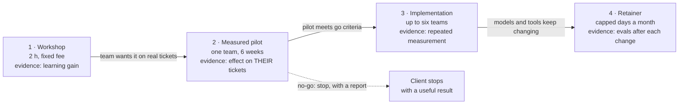

# 20.1 · Positioning and the offer ladder

## Why it matters

Up to now you have built evidence: an AI layer, an experiment with an interval (Module 13), a named method (Module 14), a rehearsed workshop (Module 17), and a way to make it stick (Module 19). None of that tells a buyer what they can buy from you, for how much, and what happens next. Engineers who try to sell usually fail in one of two ways. Either they offer "AI transformation" to anyone, which no budget owner can say yes to, or they offer one thing, a workshop, and have nothing to say when the client asks "and then?".

This lesson fixes both. Positioning narrows who you are for and which problem you solve, in words the buyer already uses. The offer ladder gives every buyer a small, safe first step and a clear next one, where each rung produces the evidence the next rung needs. The trainer whose business this course studied sells private workshops gated by an application form and capped per month; the cap is part of the offer, and it is only honest if it is real.

> [!NOTE]
> Content tags. **Concept** (stable): jobs to be done, positioning, the evidence-producing ladder, honest scarcity, decoys. **Implementation**: the `OfferCheck ladder` rules and the example prices (USD, as of 2026-09), which are placeholders, not market advice.

## How it works

### Start from the job, not the method

Christensen and colleagues' "jobs to be done" frames a purchase as hiring something to make progress in a particular circumstance. Nobody hires you for Ground-Bound-Build-Prove. A legacy .NET engineering manager hires you because, in her words, "the agent's PRs re-implement rules that already live in our stored procedures", and because last sprint one of them caused a refund. The job is *get agent PRs that pass review without re-creating rules we already have, and know whether the tool is worth renewing*. Your method is how you do the job; it is not the job.

That is why Module 1's discovery interviews ([01.4](../module-01/lesson-04.md)) asked about past events. The problem statements you collected there, and the questions your workshop rooms asked (Module 17's hard-questions bank, [17.3](../module-17/lesson-03.md)), are the raw material for positioning.

### The positioning sentence

One sentence, five slots:

> For **[one audience]** who **[one problem, in their words]**, unlike **[what they do today]**, I **[what you do]**, and **[how they will know it worked]**.

The reference student's:

> For engineering leads of legacy .NET and SQL Server teams whose coding-agent PRs keep failing review, unlike generic AI-tool training, I help the team ground the agent in the rules their code already has, and measure on their own tickets whether it helped.

Test it three ways. Could a competitor with a different method say it word for word? Then the audience or problem is too broad. Would your wedge audience (01.3) recognize the problem without explanation? And does the last slot promise a *measurement*, not an outcome? "Measure whether it helped" is something you control. "Make your team 30% faster" is not.

### The offer ladder



Four rules make it a ladder rather than a price list:

1. **Each rung produces the evidence the next one needs.** The workshop measures learning with a pre/post gain (Module 16). The pilot measures delivery on the client's own tickets, with a pre-registered go/no-go rule (Module 13). The implementation repeats that measurement across teams and adds the adoption plan (Module 19, [19.4](../module-19/lesson-04.md)). The retainer re-runs the evals when models change (Module 7).
2. **A client can stop after any rung with something useful.** A no-go pilot is a delivered result: the client just saved a rollout. Design for it.
3. **Entry criteria are evidence from the rung below**, not a sales gate. Rung 3 requires the pilot's go criteria, not a bigger budget.
4. **Every rung has a fixed price or a narrow range** and a currency. "Contact us" and "TBD" push the pricing conversation into a call where you will improvise under pressure.

Three to five rungs. With more, buyers compare options instead of taking the next step; a keynote and a "fractional AI officer" are different businesses.

### Honest scarcity, and the tactics that are not

Scarcity is honest when it is a fact you state once and keep: "8 working days a month; one pilot at a time." It protects your delivery quality and your employer's time (20.5). It becomes manipulation when it is invented or exaggerated. The FTC's 2022 dark-patterns report names countdown timers that suggest an offer is time-limited when it is not; "only 2 spots left" with no real cap is the same move in a sales email.

The decoy effect is subtler. Huber, Payne and Puto showed in 1982 that adding an option that is clearly worse than one alternative but not the other increases the share choosing the option it makes look good. A "Premium" rung priced to make the "Standard" rung look like a bargain is a decoy. The test: would you be happy if a client bought each rung? If a rung exists only to be rejected, remove it.

Outcome guarantees are the third tactic. They feel like confidence; they are claims your evidence cannot support. EXP-01 is one team, with an interval from 5% to 25%, and a failed quality guardrail ([13.6](../module-13/lesson-06.md)). A guarantee of 30% for someone else's team climbs three rungs of the claims ladder at once.

## Show me

The reference ladder, [`offer-ladder.md`](../../labs/module-20/solution/workshop-kit/offer-ladder.md):

| Rung | Offer | Evidence | Entry | Price (USD, as of 2026-09) |
|---|---|---|---|---|
| 1 | Workshop: *Ground before you generate* | P-07 pilot, normalized gain 0.57; rehearsal R3 | application form; agent used weekly | 6,500 fixed |
| 2 | Measured pilot, one team, 6 weeks | EXP-01: −16% (95% CI −25% to −5%), defect guardrail failed | named sponsor; 30+ tickets a month; exportable baseline | 18,000 fixed |
| 3 | Implementation, up to six teams, 8–10 weeks | the client's own pilot report (EXP-F1) | pilot met its go criteria | 55,000–75,000 fixed per SOW |
| 4 | Retainer: method upkeep, 2 days a month | client's EXP-F2 and adoption metrics | rung 3 delivered | 4,000 per month, 3-month minimum |

```bash
cd labs/module-20
dotnet run --project tools/OfferCheck -- ladder solution/workshop-kit/offer-ladder.md
```

```text
offer-ladder.md: offer ladder
  positioning: For engineering leads of legacy .NET and SQL Server teams whose coding-agent PRs keep failing review, unlik...
  capacity: 8 working days a month; at most one pilot or implementation at a time, two workshops a month, two retainers. The application form states this cap.

  rung offer                             price                       next
  1    Workshop: Ground before you g...  USD 6,500 fixed             2
  2    Measured pilot, one team          USD 18,000 fixed            3
  3    Implementation, up to six teams   USD 55,000–75,000 fixed...  4
  4    Retainer: method upkeep           USD 4,000 per month

0 error(s), 0 warning(s)
```

Two things to notice. The pilot's evidence column shows the failed guardrail; hiding it would make the ladder read better and the first client's defect report worse. And "What is not on the ladder" in the same file lists what the student will never sell: a productivity figure at any price, production access, work for the employer's customers.

## Try it

Budget: about an hour.

1. **Collect the words (15 min).** From your Module 1 interview log, your questions log (Module 18) and your hard-questions bank, copy five problem statements verbatim. Circle the one your evidence addresses best.
2. **Positioning (10 min).** Fill the five slots. Read it to someone in your wedge audience and ask them to repeat the problem back in their words.
3. **Ladder (25 min).** Copy the ladder format from the [pricing worksheet template](../../templates/pricing-worksheet.md). For each rung write the problem in the buyer's words, deliverables, duration, evidence ID, entry criteria and next step. Put in placeholder prices; 20.2 will replace them with worksheet-backed ones.
4. **Capacity (5 min).** How many days a month can you really sell, given your job (20.5)? Write the cap.
5. **Check (5 min).** Run `ladder` until it is clean.

<details>
<summary>Hint: my evidence only supports a workshop so far</summary>

Then the ladder has a workshop and a free or discounted pilot as its second rung, clearly labelled as your first measurement on someone else's team, and rung 3 says "after two pilots". A short honest ladder is better than a long one whose top rungs rest on evidence you do not have. The course's principle is evidence before price.
</details>

## Break it

A student's first attempt, [`break/20.1-everything-ladder/offer-ladder.md`](../../labs/module-20/break/20.1-everything-ladder/offer-ladder.md): "AI transformation for any team, any stack, end-to-end", seven rungs from a free strategy session to a keynote, prices of "Contact us" and "TBD", a "guaranteed 40% faster delivery", a "10x ROI guarantee", and at the top: "Only 2 spots left this quarter — prices go up in January!"

```bash
dotnet run --project tools/OfferCheck -- ladder break/20.1-everything-ladder/offer-ladder.md
```

Before you run it, mark every line a skeptical CTO would stop reading at.

## Fix it

**Diagnose.** `ladder` reports 11 errors and 26 warnings. Grouped:

- **Positioning**: six generic phrases, no audience, no alternative. Anyone could say it; nobody recognizes their problem in it.
- **Prices**: "Free", "Contact us", "TBD". Three rungs a buyer cannot put in a budget request.
- **Promises**: two guarantees and a multiplier. None traces to a measurement.
- **Pressure**: a scarcity claim and a price-rise threat with no capacity line behind them.
- **Structure**: seven rungs, no entry criteria, no next steps, evidence like "Clients love it" and "Studies show 55% faster", and a keynote cheaper than the rung below it. Rung 5 is a decoy: "Same as 4 with a 10x ROI guarantee" exists to make rung 4 look reasonable.

**Modify.** Rewrite the positioning with the five slots. Cut to four rungs, each with evidence and a next step. Replace every guarantee with the measurement you will run. Delete the scarcity line and write a real `Capacity:` instead. Drop the free strategy session from the ladder (a discovery call is part of selling, not a product) and the keynote (a different business).

**Rerun.** `ladder` clean. Then read the ladder aloud as the buyer: at each rung, can you say what you would get, what it costs, and what you would know afterwards?

## How do I know it works?

- [ ] Your positioning sentence names one audience, one problem in their words, today's alternative, and a measurement rather than an outcome.
- [ ] Someone from your wedge audience repeated the problem back correctly.
- [ ] The ladder has three to five rungs; each has a price with a currency, evidence with an ID, entry criteria and a next step.
- [ ] A no-go at the pilot rung is described as a useful result, not a failure.
- [ ] The capacity line is true for your calendar, and nothing on the ladder claims scarcity beyond it.
- [ ] `OfferCheck ladder` is clean.

## Use / don't use

**Use** the ladder as the only source of prices in calls and proposals; it stops you improvising a discount when someone hesitates. **Use** the pilot rung as the default next step for anyone who asks "will it work for us?"; it answers the question instead of arguing about it.

**Don't** add rungs to look bigger, or a premium rung to make another look cheap. **Don't** position on the method's name; position on the problem. **Don't** sell a rung whose evidence you do not have yet; label it "after N pilots" or leave it off.

**Limitations.**

- Positioning is a hypothesis. Your first five calls will change the problem wording; update the ladder when they do.
- Placeholder prices here are illustrative; markets, currencies and what buyers expect vary widely by country and company size. 20.2 prices from your own numbers.
- The decoy and dark-pattern research is about consumer choices; business buyers are more deliberate, but the ethics do not change with the audience.

## Reflect

1. Which of your prospects' own sentences did you use in the positioning, and which of your words did you have to give up?
2. Which rung of your ladder rests on the weakest evidence, and what would strengthen it?
3. What is your real capacity per month, and what would you do if someone offered to pay for more?

## Sources

- [Christensen et al. (2016) — Know Your Customers' Jobs to Be Done](https://hbr.org/2016/09/know-your-customers-jobs-to-be-done) — customers hire a product to make progress in a specific circumstance; understand the job, not the demographics or the features.
- [Huber, Payne and Puto (1982) — Adding Asymmetrically Dominated Alternatives](https://academic.oup.com/jcr/article-lookup/doi/10.1086/208899) — adding an option dominated by one alternative increases the choice share of that alternative (the decoy effect).
- [FTC (2022) — Dark patterns report press release](https://www.ftc.gov/news-events/news/press-releases/2022/09/ftc-report-shows-rise-sophisticated-dark-patterns-designed-trick-trap-consumers) — countdown timers suggesting a time limit that does not exist are among the deceptive designs named.
