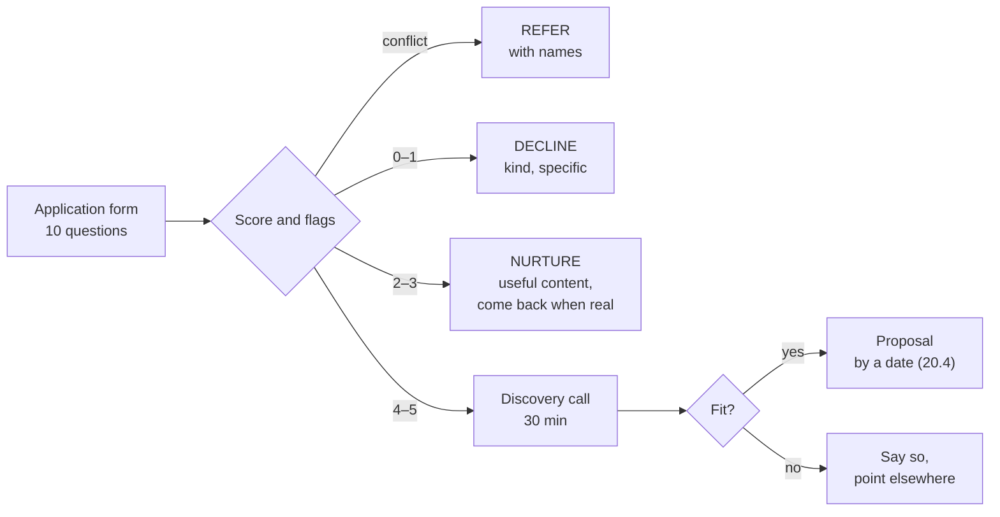

# 20.3 · Qualification and discovery calls

## Why it matters

Most engineers who start selling make the same two mistakes. They say yes to everyone who shows interest, and they talk for most of the first call. The result is a calendar full of calls with people who cannot buy, and proposals written for problems the buyer does not have. The opposite reflex, a pushy close, is worse: it wins the occasional contract and loses the trust that referrals come from.

Qualification is the honest middle. An application form asks, before anyone spends an hour, whether there is a real problem, someone who can decide, money that can move, a reason to act now, and no conflict with your employer. A discovery call then does, for a buyer, what Module 1's customer interviews did for your wedge ([01.4](../module-01/lesson-04.md)): it asks about past events, listens, and ends with a decision both sides understand, including "not me". The course calls this professional qualification, and it has no manipulative tactics in it, because the moment you use one you have stopped finding out whether you can help.

> [!NOTE]
> Content tags. **Concept** (stable): qualification criteria, data minimization, past-event questions, expectation resets, the ethics of pressure. **Implementation**: `OfferCheck qualify` and `call` rules and thresholds; the GDPR as one example of a data-protection law (orientation only, jurisdiction-dependent).

## How it works



### The application form

The [application form template](../../templates/application-form.md) has ten questions. Each maps to one criterion:

| Criterion | Question | Point if |
|---|---|---|
| Problem | "Tell me about the last time it happened: what happened, and what did it cost?" | a specific past event |
| Sponsor | "Who would sponsor this, and who decides?" (roles) | a role is named |
| Budget | approved / we know the process / none yet / don't know | approved or process known |
| Timing | "When would you want to start, in weeks?" | within 12 weeks |
| Fit | "Does the team use a coding agent today?" | daily or weekly |

Two more questions are flags, not points. **Expectation** ("What would a good result look like?") surfaces a guarantee request or a headcount goal before the call, so you can address it in the invitation. **Conflict** ("Are you a customer, competitor or supplier of my employer?") routes to REFER, because selling to your employer's customers without permission is the fastest way to lose your job and your reputation at once (20.5).

**Data minimization.** Ask only what the decision uses. Name and work email are needed to reply; phone, home address, date of birth, salary or ID numbers are not. Under the GDPR, personal data must be "limited to what is necessary" for the purpose (Article 5(1)(c)); other jurisdictions have similar rules. Treat this as orientation, and as good practice everywhere: data you never collect cannot leak.

**Say the cap on the form, not in a countdown.** "I take at most one pilot at a time" on the form is information. "Only 2 spots left!" in an email is the urgency and scarcity pattern that Mathur and colleagues found on hundreds of shopping sites and the FTC calls deceptive when false.

### Scoring and answering

`OfferCheck qualify` scores 0–5 and decides: **CALL** (4–5), **NURTURE** (2–3: send something useful, invite them back when timing or budget is real), **DECLINE** (0–1: a kind, specific no with a pointer) or **REFER** (conflict). Every applicant gets an answer within the time the form promised. A form that sends everyone to a call is not qualifying anyone.

### The discovery call

The [discovery-call script](../../templates/discovery-call-script.md) keeps Module 1's rules (past events, not opinions; listen) and adds the questions a purchase needs:

| Minutes | Find out | Example question |
|---|---|---|
| 2–10 | The last incident and its cost | "Tell me about the last time that happened." |
| 10–13 | What they tried | "What happened to the rules file?" |
| 13–15 | How they would know | "If this were solved, what number would move?" |
| 15–20 | Decision, budget, timing, constraints | "Who decides, and who signs?" · "Is there a budget line?" · "By when do you need to know?" · "What would make it impossible?" |
| 20–26 | Fit, limits, price | which rung, what it will and will not show, the price from the ladder |
| 26–30 | A dated next step | "I send the proposal by Friday; we review it Tuesday." |

Three habits distinguish an honest call from a sales pitch:

1. **You speak less than half the words.** The tool warns above 45%. Every minute you talk is a minute you are not learning whether you can help.
2. **You say a limit out loud.** What you cannot promise, what you do not do, or that they do not need you. It is the sentence that makes the rest believable, and it disqualifies clients who would have become difficult (20.5).
3. **You reset expectations early and once.** A guarantee request gets your measured result with its interval and population, and the offer to measure theirs. Not a counter-promise and not a lecture.

### What pressure looks like, so you can hear yourself

| Tactic | Sounds like | Why it is out |
|---|---|---|
| Invented scarcity | "Only 2 spots left this quarter" | false, or true only because you made it so |
| Exploding deadline | "The price goes up in January; sign this week" | pushes a decision the buyer's process cannot make honestly |
| Bandwagon | "Everyone in your space is already doing this" | an unsupported claim about other companies |
| Leading question | "Don't you think your reviews are too slow?" | puts your answer in their mouth |
| Hypothetical close | "How much would you pay to fix this for good?" | a future opinion, not a fact |
| Bypassing the decider | "Wouldn't it be easier to just decide yourself?" | undermines their process, and their trust in you |

## Show me

The reference student's six applications, [`applications.csv`](../../labs/module-20/solution/workshop-kit/applications.csv):

```bash
cd labs/module-20
dotnet run --project tools/OfferCheck -- qualify solution/workshop-kit/applications.csv
```

```text
  id    score  decision  reasons
  A01   5/5    CALL      expectation needs resetting: VP wants a guaranteed 30% productivit...
  A02   2/5    NURTURE   no specific past incident; budget none; team does not use an agent yet
  A03   5/5    REFER     conflict of interest: yes - they are a current customer of ...
  A04   4/5    CALL      no start within 12 weeks
  A05   4/5    CALL      no specific past incident; expectation needs resetting: Cut headcount by five developers
  A06   1/5    DECLINE   no specific past incident; no sponsor; budget unknown; team does not use an agent yet
```

A03 is the best-qualified lead on paper and the one the student must not take: a current customer of their employer. A05 gets a call, but the invitation says in its first line that the student does not help with headcount reduction; if that is the only goal, the call ends there.

A01's call with Fabrikam's engineering manager, [`discovery/A01-call.md`](../../labs/module-20/solution/workshop-kit/discovery/A01-call.md), checked:

```text
A01-call.md: 40 turns, 29:10 long, you spoke 43% of the words
  first mention of your offer or price: 24:45
  asked about a specific past event at 02:10
  asked about who decides and signs at 15:30
  asked about budget or how money gets spent at 17:00
  asked about timing at 18:30
  asked about how success would be measured at 09:40
  honest limit said at 12:15: "I can't promise 30%, and I'd be wary of anyone who does. My one mea..."
  next step at 27:30: "Next step: I send the proposal by Friday 2026-09-18, and we go thro..."
```

The call found the incident (a duplicated credit-hold rule caused a refund and two days of work), a measure the EM already tracks (review time up from about one day to one and a half), the decision path (VP decides, procurement over 10,000 takes two weeks), the budget line (tooling), the deadline (evidence by mid-December for a January renewal) and a constraint that shapes the SOW (no production data; read-only code access under NDA). The 30% guarantee was declined at minute 12 with the student's own interval, and the EM's response, "I would rather know after six weeks", became the proposal's opening quote.

## Try it

Budget: about 90 minutes plus the call.

> [!WARNING]
> Before you invite anyone outside your employer, complete rows E1–E5 of the admin register (20.5). If your first pitch is internal, check who owns the budget and whether the work is already part of your job.

1. **Form (25 min).** Adapt the [application form](../../templates/application-form.md): your problem sentence, your real cap, your conflict question. Remove any field the decision does not use.
2. **Test it (15 min).** Fill it in yourself as three imagined applicants (a fit, a nurture, a conflict) and run `qualify`.
3. **Call (30 min + prep).** Hold one discovery call with a real prospect or your internal sponsor, using the [discovery-call script](../../templates/discovery-call-script.md). Take notes with timestamps and consent.
4. **Check (20 min).** Write the notes as `[mm:ss] Me:` / `[mm:ss] Them:` lines and run `call`. Read every warning. Send what you promised by the date you promised.

<details>
<summary>Hint: the prospect asks for the price in minute three</summary>

Give it, in one sentence, from your ladder: "The pilot is a fixed 18,000; whether it's the right thing depends on what you tell me in the next twenty minutes. Can I ask about the last time…". Refusing to name a price is its own pressure tactic. Improvising a lower one because they asked early is worse.
</details>

## Break it

The student's first attempt at both, in [`break/20.3-hard-close/`](../../labs/module-20/break/20.3-hard-close/): a form that collects full name, phone, home address, date of birth and salary but no incident, expectation or conflict question, and a 15-minute call that opens with a three-minute pitch.

```bash
dotnet run --project tools/OfferCheck -- qualify break/20.3-hard-close/applications.csv
dotnet run --project tools/OfferCheck -- call break/20.3-hard-close/call.md
```

Read [the call](../../labs/module-20/break/20.3-hard-close/call.md) first. At which minute did the prospect stop telling the student anything useful?

## Fix it

**Diagnose.** The form has seven errors: three missing qualification columns and four personal-data fields that no decision uses (a salary field on a sales form is both intrusive and a liability). Because it asks nothing about a past incident, every applicant scores "no specific past incident", yet three would still be booked for calls.

The call has five errors and ten warnings: the student spoke 86% of the words; pitched at 00:00; asked no question about a past event, budget or timing; asked two leading questions and one hypothetical; promised "30% faster delivery, guaranteed", misquoting their own experiment; claimed that everyone in the prospect's space was already adopting it; threatened a price rise with invented scarcity; tried to bypass the VP; said no limit; and ended with "I'll send over the contract anyway" instead of a dated next step. The prospect's only real information, "it's more that the agent duplicates rules", arrived at 05:30 and was talked over.

**Modify.** Replace the form's fields with the template's ten questions and a privacy note. Rewrite the call from the script: open with their team, ask about the last duplicated rule, ask how they would know it was fixed, ask who decides and by when, state the measured result with its interval when the guarantee comes up, and close with a date.

**Rerun.** `qualify` without errors; `call` on your rewrite without errors, talk share under 45%, a limit and a dated next step found. Compare with the reference A01 call.

## How do I know it works?

- [ ] Every field on your form maps to a criterion or a flag; the only personal data is name and work email.
- [ ] The form states your real cap, what you do not do, and when applicants will hear back.
- [ ] Every applicant so far got an answer by the promised date, including the declines.
- [ ] Your call notes show a past incident with its cost, a success measure, the decision path, budget, timing and constraints.
- [ ] `OfferCheck call` on your notes: no errors, talk share under 45%, an honest limit, a dated next step.

## Use / don't use

**Use** the form for every inbound request, including from people you know; it is fairer to them than a favour you cannot deliver. **Use** the discovery call's notes as the first page of the proposal: their words, not yours.

**Don't** use pressure tactics, even the ones "everyone uses". **Don't** hide a disqualifier to keep a deal alive; the conflict, the unrealistic expectation or the missing sponsor will surface later, at a higher cost. **Don't** record calls you will not re-listen to, or without explicit consent.

**Limitations.**

- A five-point score is a triage, not a truth. A thoughtful founder with no budget yet may be your best reference in a year; nurture is not rejection.
- A transcript checker can count words and match phrases; it cannot tell whether you understood the problem. Read your notes as the buyer would.
- Data-protection and marketing rules differ by jurisdiction and by whether you sell to businesses or consumers; this lesson gives orientation, not legal advice.

## Reflect

1. Which question on your form would you have been tempted to leave out because the answer might disqualify a paying client?
2. In your discovery call, what did you learn after minute 20 that you would not have learned if you had pitched at minute 5?
3. Which limit did you say out loud, and how did the prospect react?

## Sources

- [Rob Fitzpatrick — The Mom Test](https://www.momtestbook.com/) — ask about specifics in the past, not opinions about the future; talk less; commitments over compliments.
- [GDPR, Article 5](https://eur-lex.europa.eu/eli/reg/2016/679/oj) — personal data must be adequate, relevant and limited to what is necessary for the purpose (data minimization); one example of a data-protection law.
- [Mathur et al. (2019) — Dark Patterns at Scale](https://arxiv.org/abs/1907.07032) — about 53,000 product pages on about 11,000 shopping sites: 1,818 dark-pattern instances in 15 types and 7 categories, including urgency and scarcity.
- [FTC (2022) — Dark patterns report press release](https://www.ftc.gov/news-events/news/press-releases/2022/09/ftc-report-shows-rise-sophisticated-dark-patterns-designed-trick-trap-consumers) — countdown timers implying a time limit that does not exist are named as deceptive.
