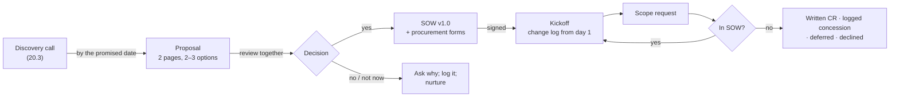

# 20.4 · Proposals, SOWs and scope control

## Why it matters

The sample question for this module is the moment it all comes together: *a prospect asks you to guarantee a 30% productivity improvement. How do you respond, and what do you put in the SOW instead?* The answer is not a clever sentence on a call. It is a document: a proposal that says in writing what you measured, what it would be worth, and what you do not promise, and a statement of work that turns "30% faster" into a measurement the client and you agreed on before the first ticket.

Most consulting disputes are not about quality. They are about scope: what was included, what "done" meant, who was supposed to provide access, and whether the extra team, the weekend and the MCP server someone asked for on a call were part of the fixed fee. A good SOW makes those questions boring, because the answers are written down. Scope control then becomes a habit: every request that is not in the SOW goes into a log and ends as a change request, a logged concession, a deferral or a no.

> [!NOTE]
> Content tags. **Concept** (stable): proposal structure, results-based deliverables, acceptance criteria, exclusions, change control, measurement instead of a guarantee. **Implementation**: `OfferCheck proposal`, `sow` and `changes`, the reference documents and their example terms. Legal clauses in a SOW are orientation only (20.5).

## How it works

### From call to signature



### The proposal

The [proposal template](../../templates/proposal.md) has seven sections. Three carry the honesty:

- **What we heard**, in the client's words, with quotes from the call. If the section could be sent to any client, it is not finished.
- **Evidence**, by ID. EXP-01 with its interval and its failed guardrail; the pilot workshop's learning gain; the pricing worksheet's range and probability of loss (20.2).
- **What we do not promise**, as a section: any productivity figure for their teams, that defects will not rise, results for teams outside the scope, anything touching production.

Options: two or three real ones, each with a fixed price, including the smallest useful one. A **validity date** with its real reason is fine ("my calendar for December fills after that; the price does not change"). "This offer expires in 48 hours" is pressure. Claims in a proposal are claims to a buyer; the substantiation principle from Module 18 applies: have the basis before you write the sentence.

### The SOW: results, acceptance, exclusions

The US federal acquisition rules describe a good performance work statement as one that states the work "in terms of the required results rather than either 'how' the work is to be accomplished or the number of hours", with measurable performance standards (FAR 37.602). You do not need to sell to a government to use the idea. For each deliverable, the [SOW template](../../templates/sow.md) asks for one acceptance criterion a third person could check:

| Weak | Strong |
|---|---|
| "AI layer — to the client's satisfaction" | "Merged via PR reviewed by a client developer; the pre-merge check runs in CI and fails on the two seeded cases" |
| "Training" | "Delivered to the pilot team; pre/post results and normalized gain reported in writing within 5 working days" |
| "Productivity improvement — guaranteed 30%" | "Report states every pre-registered outcome with an interval, the ticket flow per arm, deviations and what it does not show" |

Then the sections that prevent the usual disputes:

- **Out of scope**: at least three things the client is likely to assume are included (other teams, product features, licence administration, production access).
- **Assumptions** and **client responsibilities**: access by a date, people's time, data exports, decision turnaround, and "delays move the schedule day for day".
- **Measurement**: outcomes fixed before start, baseline, intervals, a stop rule; "a null or negative result is a valid, delivered result".
- **Change control**: written requests stating their effect on fee and schedule, approved before work starts; every request logged.
- **Fees**: fixed amount, schedule, payment terms, taxes; the schedule must add up to the total.
- **Acceptance**, **IP** (your pre-existing method, templates and tools stay yours), **confidentiality and data**, **term and termination**. These are the clauses to have a lawyer write or check (20.5).

### The answer to the guarantee

Put together, the response to "guarantee 30%" is:

1. On the call: your measured result, with its interval and population, and the offer to measure theirs (20.3).
2. In the proposal: the value range and the chance of loss, and "any productivity figure for your teams" under *What we do not promise*.
3. In the SOW: a **Measurement** section with pre-registered outcomes, a baseline, intervals and a stop rule, and a deliverable (the report) whose acceptance is that it states those outcomes honestly, not that they reach a number.

### Fixed fees and contingency

A fixed fee moves the overrun risk to you. Estimates overrun systematically; Flyvbjerg's summary of large projects is "over budget, over time, over and over again", and a six-week pilot is not immune. Estimate in days, add contingency for the parts you do not control (access, data exports, review turnaround), and make client-caused delays move the schedule rather than eat your margin.

### Procurement

Anything above a threshold goes through procurement. Ask on the discovery call; Fabrikam's EM said "anything over ten thousand" and "about two weeks". Expect a supplier form, bank details, tax and company registration, insurance certificates, a data-processing questionnaire, sometimes a security review and the client's own contract paper. Start it in parallel with the proposal review, and put the procurement time into the schedule you promise.

## Show me

The reference [`proposal-fabrikam.md`](../../labs/module-20/solution/workshop-kit/proposal-fabrikam.md) opens with "What we heard", quoting "the agent never looked at the database" and "I would rather know after six weeks". It offers A, the measured pilot (USD 18,000, 6 weeks), and B, the workshop only (USD 6,500), and says what B cannot tell them. Its evidence section includes the sentence the break would never contain: "On its own, one team's saving may not repay the pilot. The pilot's value is the decision."

The SOW that followed, [`sow-fabrikam-pilot.md`](../../labs/module-20/solution/workshop-kit/sow-fabrikam-pilot.md):

```bash
cd labs/module-20
dotnet run --project tools/OfferCheck -- sow solution/workshop-kit/sow-fabrikam-pilot.md
```

```text
sow-fabrikam-pilot.md: 14 sections
  sections present: 14 of 14
  deliverables: 5
  exclusions: 6
  payment terms: 30 days
  payment schedule sums to 18,000; stated total 18,000

0 error(s), 0 warning(s)
```

During the pilot, the student logged five scope requests in [`change-log.md`](../../labs/module-20/solution/workshop-kit/change-log.md): one already in scope, a second team deferred to the implementation proposal, a repeat workshop for the DBA team as CR-01 (+USD 3,000), two PR reviews a week absorbed at no charge but capped and confirmed by email as CR-02, and write access to the staging database declined pending a security review.

## Try it

Budget: about 90 minutes.

1. **Proposal (40 min).** From your discovery notes and worksheet, fill the [proposal template](../../templates/proposal.md) for your pitch. Quote them at least twice. Run `proposal` until clean. Send it by the date you promised.
2. **SOW (40 min).** Draft the SOW from the [template](../../templates/sow.md) for the option you expect them to choose. For each deliverable, ask: could a stranger check this? Run `sow` until clean. Mark sections 12–14 "for legal review".
3. **Change log (10 min).** Create `change-log.md` with the header row now, before anyone asks for anything.

<details>
<summary>Hint: the client wants to use their own contract paper</summary>

That is common, and fine. Keep your SOW as the schedule attached to their master agreement, and read their contract for the clauses that matter most to you: IP (does it claim your pre-existing material?), liability (is it capped?), payment terms, termination, and non-solicitation. If any of them conflicts with your SOW, ask which document prevails, and get the answer in writing. Have a lawyer read it if the amounts or the IP matter to you (20.5).
</details>

## Break it

The student's first proposal and SOW, [`break/20.4-open-sow/`](../../labs/module-20/break/20.4-open-sow/), for a 45,000 "AI Accelerator":

```bash
dotnet run --project tools/OfferCheck -- proposal break/20.4-open-sow/proposal.md
dotnet run --project tools/OfferCheck -- sow break/20.4-open-sow/sow.md
dotnet run --project tools/OfferCheck -- changes break/20.4-open-sow/change-log.md
```

Before running them, read the SOW's scope paragraph and count the words that could mean anything.

## Fix it

**Diagnose.** The proposal has 13 errors: six missing sections (no client words, no options, no evidence, no limits, no next steps), a borrowed "55% faster", a single-number "ROI of 20x", a guarantee, a 48-hour expiry and invented scarcity.

The SOW has 17 errors and 8 warnings:

- Ten of fourteen sections missing, including out of scope, change control, measurement and acceptance.
- Acceptance criteria that cannot be checked ("to the client's satisfaction", "Works") or are empty.
- A deliverable that *is* a guarantee ("Guaranteed 30% faster delivery"), and one that gives an agent production access.
- Open-ended scope: "including but not limited to", "etc.", "ongoing support as needed", "unlimited revisions".
- Fees: no payment terms, and a schedule that sums to 50,000 against a stated total of 45,000.
- IP: "all intellectual property created or used" goes to the client, which would include the student's method and templates.

The change log shows what that SOW produced: four of five requests done silently or agreed only on a call, one change request with its impact "tbd".

**Modify.** Rebuild the proposal from the template with two options and an evidence section. Rebuild the SOW: results-based deliverables with checkable acceptance, a measurement section in place of the guarantee, six exclusions (including "no access to production"), change control, payment terms and a schedule that adds up, and an IP clause that keeps pre-existing material. For the change log, write to the client now: list the four silent items, say which you will keep doing at no charge (logged), which need a change request with a price, and which stop.

**Rerun.** All three commands clean. Then read the SOW as the client's procurement officer: is there any sentence you could interpret in your favour that the student would read the other way?

## How do I know it works?

- [ ] Your proposal quotes the client, offers 2–3 priced options, cites evidence by ID and lists what is not promised; `proposal` clean.
- [ ] Every SOW deliverable has an acceptance criterion a third person could check; `sow` clean.
- [ ] The SOW's measurement section replaces any outcome promise, with a baseline, intervals and a stop rule.
- [ ] The out-of-scope list includes the three things this client is most likely to assume.
- [ ] You know the client's procurement threshold and timeline, and your schedule includes it.
- [ ] `change-log.md` exists, and every "not in SOW" request has a decision and, where work is done, a written record.

## Use / don't use

**Use** the proposal's "What we do not promise" and the SOW's measurement section as a pair; one without the other invites the guarantee back in. **Use** the change log to be generous on purpose: a logged free concession builds goodwill; an unlogged one builds an expectation.

**Don't** start work before signature (20.5). **Don't** accept a deliverable whose acceptance depends on the client's mood. **Don't** let "just one more team" into a fixed fee without a change request, however small it looks on the call.

**Limitations.**

- `OfferCheck` checks structure and wording. It cannot tell whether your exclusions are the right ones for this client, or whether a clause is enforceable where you work.
- FAR 37.602 governs US federal acquisitions; it is used here only as a well-written statement of results-based scope.
- Some clients will insist on their own paper, time-and-materials billing or payment terms you would not choose. Decide in advance which of your terms are negotiable and which are walk-away.

## Reflect

1. Which acceptance criterion in your SOW would be hardest for a stranger to check, and how could you rewrite it?
2. What will you say, on the call, when the client asks for "just one more team" in week three?
3. Which item in your out-of-scope list surprised the client, and what does that tell you about your proposal?

## Sources

- [FAR 37.602 — Performance work statement](https://www.acquisition.gov/far/37.602) — describe work in terms of required results rather than how it is done or the hours provided; enable assessment against measurable performance standards.
- [Flyvbjerg (2014) — What You Should Know About Megaprojects, and Why](https://arxiv.org/abs/1409.0003) — cost and schedule overruns are systematic ("over budget, over time, over and over again"); the reason fixed fees need contingency.
- [FTC — Policy Statement Regarding Advertising Substantiation](https://www.ftc.gov/legal-library/browse/ftc-policy-statement-regarding-advertising-substantiation) — objective claims need a reasonable basis before they are made.
