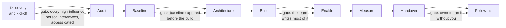

# 21.1 · Discovery, kickoff and stakeholder mapping

## Why it matters

The SOW is signed ([20.4](../module-20/lesson-04.md)). It names a sponsor, six deliverables and a measurement. It does not tell you who can stop the engagement in week 5, when you will actually get access to the code, or who signs "accepted" on the AI layer. Those are the questions that decide whether week 1 is spent building or waiting.

Engagements rarely fail on technology. They fail on a person nobody talked to. In the dry run for this module, Contoso's finance controller never commits code and does not appear in the SOW. She can also stop any change to the monthly revenue report, the exact file on the Billing team's critical path. The security lead needs three weeks to review any change in what data goes to a provider, and nobody has asked him yet. A kickoff held with only the sponsor and the tech lead finds out both things in week 4.

This lesson is the first gate of the engagement: **discovery and kickoff**. You interview the people who matter before the kickoff meeting, map them, turn the SOW into a working agreement with named acceptors and dated access, and run a premortem so the risks have owners before they become excuses.

> [!NOTE]
> Content tags. **Concept** (stable): the engagement phases, stakeholder mapping, past-event interviews, acceptance by named client roles, the working agreement, the premortem, measurement instead of targets. **Implementation**: the `EngageCheck kickoff` rules and the Contoso dry run, which is fictional.

## How it works

### The engagement as phases with gates



Every phase ends in a gate: a condition you check before you start the next one. The [engagement playbook template](../../templates/engagement-playbook.md) lists them all; this module teaches them in order. The record of each engagement, `engagement-record.md`, is filled phase by phase and stays private.

### Discovery happens before the kickoff

Discovery in Module 20 ([20.3](../module-20/lesson-03.md)) qualified the client. Discovery here maps the people who will make the engagement work or fail. The tool is the same one you used in Module 1 ([01.4](../module-01/lesson-04.md)): short interviews that ask about **past events**, not opinions. "Would you support this?" produces politeness. "What happened the last time a tool like this was introduced?" produces the 2024 static-analysis rollout that was switched off after four months, and with it the tech lead's real worry: being left with something he cannot change.

Four questions, 20 minutes, one person at a time:

1. What is your part in the work this engagement touches?
2. Tell me about the last time something like this was tried. What happened?
3. What would you see in three months that would tell you it worked, in your words?
4. What could this engagement do that would cause you a problem?

Question 4 is the one that finds the veto. Ask it of people outside engineering too.

### The stakeholder map

Mendelow's stakeholder model (1981) sorted stakeholders by their power over the organization and how dynamic their position is; the familiar "power/interest grid" grew from it. For an engagement, two columns are enough: **influence** (can they stop, slow or accept the work?) and **interest** (does their week change?). The map needs five groups, each for a reason:

| Group | Why the engagement needs them | Contoso dry run |
|---|---|---|
| Sponsor | Owns the outcome, signs acceptance, removes obstacles | Head of Engineering |
| Technical owner | Will own the AI layer after you leave | Billing tech lead |
| Developers | Their daily work changes; skeptics and enthusiasts both | Two billing developers |
| Security or IT | Access, data handling, agent permissions; a late veto stops the build | IT and security lead |
| Business user of the output | Lives with what the software produces; can veto a change engineers think is safe | Finance controller, Collections lead |

The fifth row is the one engineers leave out, because those people do not appear in the repository. The map is built from the Module 19 stakeholder analysis ([19.1](../module-19/lesson-01.md)); the difference is scale and time. Module 19 planned a rollout for hundreds of people over months; here you have twelve weeks and nine people, and every one of them can cost you a week.

For each high-influence person, record a **plan**: how and when you involve them. A skeptic with influence and no plan is the most common single point of failure in an engagement.

### From SOW to working agreement

The SOW says what will be delivered. The working agreement says how you will work together to deliver it. Five items, each with a date or a name:

- **Acceptance.** For every deliverable, one named client role who signs it off against its criterion. Not you, and not "the client": a deliverable accepted by "the team" is accepted by nobody, and your invoice waits.
- **Access.** What you get, on which machine, from which date. "TBD" is the most common reason week 1 is lost.
- **Data handling.** Where client code, tickets and exports may live, that names are replaced by codes, and when exports are deleted, as the SOW's confidentiality clause says.
- **Cadence and channel.** A short weekly check-in with the sponsor and the owner, pairing blocks, demos; one channel, with decisions copied into the record.
- **Escalation.** What happens when a client responsibility slips. The SOW already says "delays move the schedule day for day"; the working agreement says who you tell and when.

### The premortem

Klein's premortem inverts the usual risk meeting: the team assumes the project has already failed and writes down why. It gives the people with reservations permission to say them in the planning phase, where they are cheap. Run it in the kickoff: "It is the 90-day follow-up. The engagement failed. What happened?" Keep the risks that have an **early signal** (what you would notice in week 2) and give each a **client owner**. Your own name on every risk means nobody at the client is watching.

### Success is a measurement, not a target

The kickoff is where a sponsor tries, one last time, to turn the SOW's measurement into a promise: "So we'll be 30% faster by December?" Module 20 already put measurement instead of a guarantee into the contract ([20.4](../module-20/lesson-04.md)). Restate it in the kickoff in words the sponsor can repeat to her CFO, and add the one number that sets expectations honestly: the **detectable effect**, the smallest change this engagement's data could reliably show (computed in 21.2). Developers' own forecasts are not a substitute. In a 2025 randomized trial with experienced open-source developers, participants forecast that AI tools would cut completion time by 24%; measured, their tasks took 19% longer ([Becker et al.](https://arxiv.org/abs/2507.09089)). Expectations set by feel are the ones the results disappoint.

## Show me

Contoso, dry run. The first draft of the kickoff section was written after one call with the sponsor and the tech lead ([`break/21.1-thin-kickoff`](../../labs/module-21/break/21.1-thin-kickoff/engagement-record.md)). Before running the checker: which stakeholder would have stopped this engagement first, and when?

```bash
cd labs/module-21
dotnet run --project tools/EngageCheck -- kickoff break/21.1-thin-kickoff/engagement-record.md
```

```text
ERROR no security or IT in the stakeholder map: access, data handling and agent permissions; a late veto stops the build
ERROR no business user of the output in the stakeholder map: people who live with the software's output: ...
ERROR Tamar Golan: success written as a promise ("at least 30% faster"); write what they would see, ...
ERROR Avi Ben-David: high influence and no engagement plan
ERROR D1 Audit and baseline: accepted by the consultant; acceptance belongs to the client
ERROR D2 Pre-registration: accepted by "client"; name one role
ERROR 'Access:' has no date: undated access is the most common reason week 1 is lost
ERROR no 'Data handling:' line: where client code, tickets and exports may live, and when they are deleted
ERROR premortem has 1 risks; imagine the engagement failed and write at least three reasons
ERROR success measure is a promise ("at least 30% faster"): the SOW measures, it does not guarantee
...
16 error(s), 4 warning(s)
```

The answer to the question: the security lead, in week 1. Access is "TBD, Eli will sort it out"; Eli's review of any change in what data reaches a provider takes three weeks, and the existing agent licence was reviewed for chat use only. Without the interview, access arrives in week 4 and the six-week build becomes three. The second veto comes in November: the finance controller, who is not on the map, stops the revenue-report change during the month-end freeze.

The interviews in [`client/brief.md`](../../labs/module-21/client/brief.md) change the plan in three concrete ways. The security review is requested on 2026-09-29, before kickoff. BILL-97 is scheduled for 10 November, away from the freeze, with the controller reviewing the before/after comparison of her report. And the tech lead's worry ("if I cannot change the rules file myself on a Tuesday, it is dead by March") becomes the design principle of the whole build: he merges the first layer PR himself in week 3.

The reference kickoff in [`solution/engagement-record.md`](../../labs/module-21/solution/engagement-record.md) has nine stakeholders, six named acceptors, access from 2026-10-05, five premortem risks with client owners, and this success measure:

> The D2 outcomes (cycle time, escaped defects) estimated with 95% intervals on Billing's randomized tickets, plus eval pass rate before and after the layer; any result, including none, is reported. With about 27 tickets, only a cycle-time change of about 38% or more is likely to be detected.

`EngageCheck kickoff` on it: 0 errors, 0 warnings.

## Try it

Budget: 120 minutes.

1. **Interviews (60 min).** Ask a peer to play three of the stakeholders in [`client/brief.md`](../../labs/module-21/client/brief.md), at least one outside engineering, 20 minutes each, using only the notes. (Or instruct an agent to play them in character from the notes; treat everything it says as interview data.) Ask the four questions. Write down one thing per person you would not have known from the SOW.
2. **Map (20 min).** Copy the facts and section 1 of the [playbook template](../../templates/engagement-playbook.md) into `case-studies/C-00-dryrun/engagement-record.md`. Fill the stakeholder table for all nine people.
3. **Working agreement and premortem (30 min).** One acceptor per SOW deliverable; dated access; data handling from SOW section 13; cadence; escalation. Premortem with a peer: five minutes of silent writing, then read out, keep at least three with early signals and owners.
4. **Check (10 min).** `EngageCheck kickoff` until clean.

<details>
<summary>Hint: who accepts D3, the AI layer?</summary>

The person who will own it: the Billing tech lead. The sponsor accepts deliverables that are decisions or reports (D2, D4, D5). If the owner cannot accept the layer, he will not maintain it either.
</details>

## Break it

> [!CAUTION]
> In a real engagement, stakeholder notes are personal data about named colleagues at your client. Keep them in the private record, write what people said about the work rather than about each other, and never share them with other stakeholders.

Take your clean record and remove the security lead and the finance controller from the map. Change the access line to "TBD". Run `kickoff`. Then play the engagement forward: in which week does each missing person first affect the schedule, and what does it cost against the SOW's schedule clause ("delays move the schedule day for day")?

## Fix it

**Diagnose.** Every error in the thin kickoff comes from the same mistake: the kickoff was a meeting with the people who bought the engagement, not a map of the people who can stop it.

**Modify.** Interview before kickoff, with past-event questions, including the two groups engineers skip (security or IT, and the business users of the output). Give each high-influence person a plan. Name one acceptor per deliverable. Date the access. Write the premortem with owners who work at the client. Replace every target with the measurement and the detectable effect.

**Rerun.** `kickoff` is clean on the reference; on your record, count the errors that remain and fix them.

<details>
<summary>Solution: the escalation line</summary>

"A missed client responsibility is raised at the next Monday check-in, then with the sponsor in writing; the schedule moves day for day (SOW section 6)." It names when, who, and the contract clause, so nobody is surprised when the date moves.
</details>

## How do I know it works?

- [ ] Every high-influence stakeholder was interviewed before the kickoff date, and the map includes security or IT and at least one business user of the output.
- [ ] Every SOW deliverable has one named client acceptor who is not you.
- [ ] Access has a date; data handling matches the SOW's confidentiality clause.
- [ ] The premortem has at least three risks with early signals and client owners.
- [ ] The success measure contains no target and states the detectable effect.
- [ ] `EngageCheck kickoff` is clean.

## Use / don't use

**Use** past-event interviews with every high-influence person, including the ones who do not code. **Use** the premortem to let the skeptics speak while it is cheap.

**Don't** run the kickoff as a slide deck of your method; the client already bought it. **Don't** accept "the team" or "the client" as an acceptor. **Don't** start the audit before access is dated.

**Limitations.**

- The map is a snapshot: people change roles mid-engagement (Contoso's Platform champion moves in January). Review it at every check-in.
- Interviews reveal what people are willing to say to an outsider; the premortem helps, but some vetoes only appear when something ships.
- Influence ratings are your judgment. Check them with the sponsor, privately, before you rely on them.
- In a small client, one person may hold three roles; the groups still need an answer, even if it is the same name.

## Reflect

1. Who in your own organization would stop an AI engagement without ever appearing in its repository?
2. Which of your past projects would a premortem have saved, and which risk would it have named?
3. How would you say "we measure, we do not promise" to a sponsor who asks for a number?

## Sources

- [Mendelow (1981), ICIS Proceedings](https://aisel.aisnet.org/icis1981/20/) — stakeholders mapped by their power relative to the organization and the dynamism of their position; the origin of the power/interest grid.
- [Klein (2007), Harvard Business Review](https://hbr.org/2007/09/performing-a-project-premortem) — the premortem: assume the project failed, generate the reasons; gives reluctant team members a way to voice reservations during planning.
- [Becker et al. (2025)](https://arxiv.org/abs/2507.09089) — randomized trial, 16 experienced open-source developers, 246 tasks: forecast −24% completion time, measured +19%.
