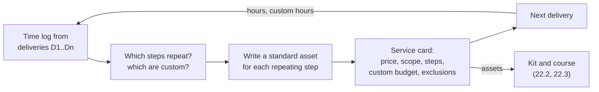

# 22.1 · From hours to repeatable service

## Why it matters

By the end of Module 21 you can sell a rung of your ladder and deliver it ([21.1](../module-21/lesson-01.md) to [21.4](../module-21/lesson-04.md)). After three or four deliveries, a pattern shows up in the time log. The first pilot took 132 hours, which at an 18,000 fee paid you less per day than your own floor (20.2). The second took 109. Each one started with a blank kickoff document, a blank audit and a blank report, and every client got a slightly different thing because you improvised under pressure.

The source career path this course studies puts it bluntly: private workshops "don't scale past a handful a month", and that cap is "a feature, not a bug", but it caps revenue to your calendar. The first step out of that trap is not a course or a community. It is making the thing you already sell **repeatable**: the same scope, the same price, the same assets, fewer hours each time, and a clear line where the custom part starts and stops. Everything later in this module (courses, kits, retainers, the plan) is built from the assets this step creates.

The failure this lesson targets is the most common one: calling consulting a "package". A price that starts "from", a scope that is "tailored to you", and hours that rise with every delivery is consulting with a nicer page. It carries all the risk of a fixed fee and none of the leverage.

> [!NOTE]
> Content tags. **Concept** (stable): consulting vs productized service vs product, scope risk, standard assets, the custom step, effective day rate, learning curves and delivery variability. **Implementation**: the `ScaleCheck service` rules and thresholds, and the example prices (USD, as of 2026-09), which are placeholders.

## How it works

### Three ways to sell what you know

| | Consulting | Productized service | Product |
|---|---|---|---|
| What is sold | your time and judgement on their problem | one defined outcome, one price, one scope | a thing: course, kit, licence |
| Scope risk | client (day rate) or you (fixed fee on a vague scope) | you, but bounded by the card | you, once, when you build it |
| Your hours per sale | grow with the problem | fall with repetitions, then flatten | close to zero, plus upkeep |
| Evidence | case by case | the same measurement each time | reviews, completion, gains |

A productized service sits in the middle. It still needs you in the room, but most of what happens there is standard: a kickoff agenda, an audit checklist, a skills pack, a report template. The engineering analogy is a service with a stable API. Callers know exactly what they send and get back; the internals can improve without changing the contract.

### The service card

A service card is the stable API of your service. It has:

- **One price** for **one scope**, with a currency. No "from", no day rate, no "contact us".
- **Duration** and **entry criteria**: which clients this is for (your qualification rules from 20.3).
- **Steps**, each with an owner (me, client, tool) and a **standard asset** that makes it repeatable. A standard step without an asset lives in your head; it will take a different number of hours each time and cannot be handed to anyone else.
- **One or two custom steps**, named and budgeted. Every client is different somewhere. The honest move is to put that difference in one place with an hour budget, instead of letting it leak into every step.
- **Not included**: at least three explicit exclusions. They are the SOW's exclusions (20.4) written once.
- **A version**, because the card will change after the next delivery. Semantic Versioning's rule works here: a change a client would notice in what they get (scope, deliverables, duration) is MAJOR; an internal improvement is MINOR or PATCH.



### Effective day rate

*Intuition.* A fixed fee hides your real rate until you divide it by the hours you actually spent.

*Equation.* With fee $P$, hours $h$ and $d$ hours in a working day,

$$\text{effective day rate} = \frac{P}{h/d}.$$

*Tiny example.* The reference pilot's fee is 18,000. The first delivery took 132 hours: $18{,}000 / (132/8) = 1{,}091$ a day, below the 1,500 floor from 20.2. The plan of 80 hours gives $18{,}000/10 = 1{,}800$.

*Interpretation.* A fixed fee only works if the hours come down. The card's plan is a target; the time log says whether you are hitting it.

### The learning curve

*Intuition.* In 1936, T. P. Wright reported that in airplane manufacturing the labour per plane fell by a roughly constant percentage each time cumulative production doubled. The same shape appears in any repeated work in which you reuse what you learned. It does not appear in work that is new each time.

*Equation.* Hours for the $n$-th delivery:

$$T_n = T_1 \, n^{-b}, \qquad \text{learning rate} = 2^{-b}.$$

A learning rate of 80% means each doubling of deliveries takes 80% of the hours. Fit $b$ by least squares on $\ln T_n$ against $\ln n$.

*Tiny example.* Deliveries of 132, 109 and 97 hours give $b \approx 0.28$ and a learning rate of about 82%. Check by hand: $132 \times 2^{-0.28} = 108.6$, close to the second delivery's 109. The fitted curve predicts about 90 hours for delivery 4.

*Implementation.* `ScaleCheck service` fits the curve, prints the prediction and warns if the plan is more than 15% below it (you are pricing on hope) or if $b \le 0$ (hours are not falling: the work is not repeating).

*Interpretation.* Two readings matter. The **learning rate** tells you whether productizing is working. The **coefficient of variation** of delivery hours (standard deviation over mean) tells you whether one price can cover one scope; above about 0.3, some deliveries will lose money at any single price. Three points make a very rough curve; treat the prediction as a sanity check, not a forecast, and update it after every delivery.

## Show me

The reference card is [`service-pilot.md`](../../labs/module-22/solution/service-pilot.md): the rung-2 pilot from the [Module 20 ladder](../../labs/module-20/solution/workshop-kit/offer-ladder.md), rewritten after three deliveries to fictional clients. Its step table has eight steps; six have standard assets (kickoff agenda v2, baseline export queries, the practitioner kit, the workshop kit, the experiment design template, the report template), and two are named custom steps with 16 hours between them.

```bash
cd labs/module-22
dotnet run --project tools/ScaleCheck -- service solution/service-pilot.md
```

```text
  planned: 80 h (10 days), custom share 20%
  effective day rate at plan: 1,800 (floor 1,500)

  delivery  hours  custom  effective day rate
  D1          132      58  1,091  below floor
  D2          109      36  1,321  below floor
  D3           97      24  1,485  below floor

  learning curve: b = 0.280, learning rate 82% per doubling of deliveries
  predicted delivery 4: 90 h (plan 80 h)
  variability of the last 3 deliveries: CV 0.16

0 error(s), 0 warning(s)
```

Read it as a buyer and as the seller. The buyer sees one price, eight weeks, a clear entry test and five exclusions, including "any productivity target". The seller sees that every past delivery paid less than the floor, that the custom hours fell from 58 to 24, and that the curve predicts about 90 hours next time: still above plan, but an effective 1,600 a day, above the floor. The card's "What changed from v1" section says where the saving came from: the AI layer now starts from the practitioner kit (22.3) instead of from scratch.

Notice what the student did **not** do. They did not raise the price to cover D1's hours; D1 was the cost of learning. They did not cut the measurement step to save hours; it is the evidence the next rung needs (20.1).

## Try it

Budget: about an hour. You need the time log from at least one real or dry-run delivery ([21.4](../module-21/lesson-04.md)).

1. **Time log (15 min).** For each delivery, split the hours by step. Mark which hours were custom: work you would not do for the next client.
2. **Assets (20 min).** For each step that repeats, name the asset that makes it repeatable. Where there is none, write the smallest one that would help (often a checklist or a filled example), and note its version.
3. **Card (15 min).** Copy the [service card template](../../templates/service-card.md). One price, one duration, entry criteria, steps with hours, one custom step with a budget, at least three exclusions, a version.
4. **Check (10 min).** Run `service`. Fix errors. Read the learning curve and the effective day rate aloud; if the plan's rate is under your floor, decide: raise the price, cut the scope, or keep delivering it as a beta until the hours fall.

<details>
<summary>Hint: I have only one delivery</summary>

Then the card is a beta: the tool warns that fewer than three deliveries cannot show a curve. Use the one delivery to find the custom hours and the missing assets. Price the next two deliveries at the card's price, log hours carefully, and do not call the service "standard" in public until three deliveries agree.
</details>

## Break it

[`break/22.1-bespoke-service/service.md`](../../labs/module-22/break/22.1-bespoke-service/service.md) is a student's first "package" after four engagements: "AI-native enablement, tailored to your team, your stack and your goals", priced "from USD 12,000, or 1,400 per day for larger teams", with "unlimited revisions", a step called "Build whatever the team asks for", "Training sessions, as many as needed", and a "Not included" section that says "Nothing is off the table." Its four deliveries took 64, 131, 88 and 142 hours.

```bash
dotnet run --project tools/ScaleCheck -- service break/22.1-bespoke-service/service.md
```

Before you run it: which single sentence in the card makes every other number meaningless?

## Fix it

**Diagnose.** `service` reports 13 errors and 5 warnings:

- **Price**: "from" and a day-rate alternative. There is no one price for one scope.
- **Scope**: "tailored", "bespoke", "whatever you need", "unlimited", "as many as needed". Each is a promise to absorb any amount of work.
- **Assets**: two standard steps with no asset, and "Measure results" with no owner.
- **Custom share 69%**: this is consulting with a fixed price on top.
- **Exclusions**: one line that excludes nothing.
- **Hours**: the curve's slope is negative (hours *rose* with repetition, a "learning rate" of 137%), CV 0.34, and the predicted fifth delivery at 147 hours would pay 654 a day.
- **Claim**: "30% faster delivery within a month", without an interval or a source (20.2).

The sentence that voids the rest is "we do whatever you need, with unlimited revisions": with it, no price, plan or exclusion can hold.

**Modify.** Pick the one outcome that three of the four engagements had in common, and make that the service. Write the exclusions from what went wrong: the Java stack, the extra repositories, the strategy deck. Give every standard step an asset or merge it into one that has one. Put the client-specific work in one custom step with a budget. Replace the productivity claim with the measurement you run. Start the curve again at delivery 1 of the new card; the old deliveries were a different service.

**Rerun.** `service` without errors. Then ask the question the tool cannot: would the last client have bought this card?

## How do I know it works?

- [ ] The card has one price with a currency, a duration, entry criteria and a version.
- [ ] Every standard step names a standard asset that exists and has a version; custom work is in named steps whose hours are 25% or less of the plan.
- [ ] "Not included" lists at least three exclusions that a client actually asked for in a past delivery.
- [ ] The plan's effective day rate is above your floor, and you can say what the learning curve predicts for the next delivery.
- [ ] `ScaleCheck service` shows no errors.

## Use / don't use

**Use** a service card for the rung you sell most often, usually the pilot or the workshop. **Use** the time log from the first delivery to design it; it is the only honest source of steps and hours. **Use** the custom step as a pressure valve: when a client asks for something extra, check whether it fits the custom budget, and if not, it is a change request (20.4).

**Don't** productize before you have delivered the thing at least once; you will standardize guesses. **Don't** hide custom work inside standard steps to make the card look cleaner; the curve will show it anyway. **Don't** drop the measurement to hit the hours; a cheaper pilot that proves nothing is not the same product.

**Limitations.**

- Wright's curve describes averages over many units; three or four deliveries give a rough slope with wide uncertainty. Use it to spot "not repeating", not to forecast to the hour.
- Some clients genuinely need consulting, not a service. Keep a day-rate option for advisory work outside the ladder, and say which it is.
- Hours saved by assets can be eaten by more selling time per sale. The plan in 22.4 counts both.

## Reflect

1. Which step of your delivery took the most custom hours, and what asset would have cut them?
2. What does your time log say your real day rate was on your first delivery, and how did that make you feel about your price?
3. Which client request would you now answer with "that is outside this service", and what would you offer instead?

## Sources

- [Wright (1936) — Factors Affecting the Cost of Airplanes](https://arc.aiaa.org/doi/10.2514/8.155) — labour per unit falls by a roughly constant percentage with each doubling of cumulative production; the origin of the learning-curve model $T_n = T_1 n^{-b}$.
- [Semantic Versioning 2.0.0](https://semver.org/) — MAJOR.MINOR.PATCH for incompatible changes, backward-compatible additions and fixes; applied here to what a client receives from a service.
