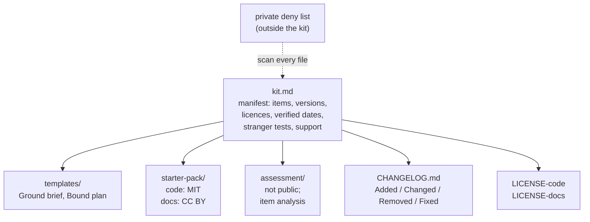

# 22.3 · Templates, kits and assessments as products

## Why it matters

By now you own a pile of useful files: a Ground brief and a Bound plan you fill for every ticket, a starter pack learners clone before the workshop (17.2), a pre/post assessment (16.5), an audit checklist, a report template. The service card in 22.1 depends on them; so do the course and the team licence in 22.2. The moment someone else relies on them, they stop being your files and become a product, with the same obligations as any library you publish: a version, a licence that travels with every copy, a changelog, a support promise, and tests that it still works.

Two things make this harder for AI-native material than for ordinary templates. The tools change every quarter: a starter pack whose setup check passed in February may fail in September because the agent's command-line tool or the SDK changed. And a kit assembled "from what was on the laptop" is the most common way employer and client material leaks into public, as a template copied from a team wiki with the company name still in it. Assessments add a third problem: a ten-question quiz sold as "certification" makes a claim about people that the quiz cannot support.

> [!NOTE]
> Content tags. **Concept** (stable): a kit as a versioned product, stranger tests as evidence, item difficulty and discrimination, what a score may claim. **Implementation** (hence the lesson's volatility): the `ScaleCheck kit` and `items` rules, the Keep a Changelog format, and the tool versions a kit is verified against.

## How it works

### The kit as a package



Five parts, each borrowed from software packaging:

- **Manifest** (`kit.md`): every item with its type, path, version, licence, last-verified date and stranger-test result, plus the kit's version, the method version it teaches (14.3) and the support policy.
- **Versions** by Semantic Versioning. For a kit, the "public API" is what buyers have already filled in or checked out: a template's sections, the starter pack's tags. Changing those incompatibly is MAJOR; a new item or section is MINOR; a fix is PATCH.
- **Changelog**, following Keep a Changelog: written for humans, newest first, with an `Unreleased` section and the change types Added, Changed, Deprecated, Removed, Fixed and Security. It is how a buyer of version 1.2 decides whether 1.3 matters to them.
- **LICENSE files** in the kit, not only a line in the manifest. A licence named in a web page does not travel with a copy of a folder.
- **Support policy**: how questions arrive, how fast they are answered, which versions receive fixes. "Only the latest MINOR is supported" is an honest, common answer.

### Stranger tests as evidence

A kit item works if someone who has never met you can use it alone (15.3). Report it as $k$ successes out of $n$ strangers, with the Wilson interval from 07.4, because small $n$ hides a lot.

*Tiny example.* The reference starter pack: 9 of 10 buyers reached `SETUP OK` and the first exercise alone. Point estimate 90%; Wilson 95% interval about 60% to 98%. The Bound plan template: 5 of 6, interval 44% to 97%. The honest reading of the second is "not yet known to work for most strangers"; four more tests would narrow it.

Add a date. A test run against last spring's tools says little about this autumn's; `kit` warns after 90 days and errors after 180.

### Assessments as products

An assessment sold with a course is a measuring instrument. Two classical statistics tell you whether each item is doing its job; both need nothing but a 0/1 answer matrix.

*Intuition.* A good item is answered correctly by some learners and not others (**difficulty**), and the ones who get it right are mostly the ones who do well on the whole test (**discrimination**). An item that everyone gets right measures nothing; an item that the strongest learners get wrong more often than the weakest is probably miskeyed or misleading.

*Equation.* Difficulty $p$ is the share who answer correctly. Rank learners by total score; take the top 27% as the upper group $U$ and the bottom 27% as the lower group $L$ (Kelley, 1939, showed 27% tails are a good trade-off between group size and contrast). Then

$$D = p_U - p_L.$$

*Tiny example.* With 24 learners, each group has $\text{round}(0.27 \times 24) = 6$. In the break's answer file, item q4 was answered correctly by 12 of 24 ($p = 0.50$), but by only 1 of the top 6 and 4 of the bottom 6: $D = 1/6 - 4/6 = -0.50$. In the reference file, item q7 was answered correctly by 8 of 24 ($p = 0.33$), by all top 6 and none of the bottom 6: $D = 1.00$.

*Implementation.* `ScaleCheck items responses.csv` prints $p$ and $D$ per item and flags $D < 0$ (error), $p \ge 0.95$ (too easy), $p \le 0.20$ (check the key) and $D < 0.20$ (weak). Common rules of thumb treat $D \ge 0.30$ as good and below $0.20$ as poor.

*Interpretation.* Read a flag as a reason to look, not a verdict. A negative $D$ usually means one of the distractors is right under a reading you did not intend, and stronger learners find that reading. Fix the wording, re-key, or remove the item, and record which in the changelog. With fewer than about 20 learners the statistics jump around; treat them as hints.

### What a score may claim

The *Standards for Educational and Psychological Testing* start from one principle: every intended interpretation of a score, for a stated use, needs validity evidence behind it. "Passed a 10-item quiz after a 2-hour workshop" supports "could spot a shadow rule in a diff on the day". It does not support "is a certified AI-native engineer", which claims competence on the job, stable over time, judged against a defended cut score. Credentials need a job analysis, a cut-score study, security, retakes policy and appeals. A **certificate of completion** says what happened: the learner attended, did the exercises and took the quiz. Sell that, and say what the score means and does not mean in one paragraph next to it.

And keep the assessment itself private. A published test stops measuring anything; license it to buyers for use with their own learners.

## Show me

The reference kit is [`solution/practitioner-kit/`](../../labs/module-22/solution/practitioner-kit/kit.md): two templates, the starter pack, the pre/post assessment, a [`CHANGELOG.md`](../../labs/module-22/solution/practitioner-kit/CHANGELOG.md) back to 1.0.0, and two LICENSE files. The deny list lives outside the kit, as in 15.1.

```bash
cd labs/module-22
dotnet run --project tools/ScaleCheck -- kit solution/practitioner-kit solution/deny-terms.example.txt
```

```text
  item                         type        version  verified    stranger test (Wilson 95%)
  Ground brief                 template    1.1.0    2026-09-12  6/6 (61% to 100%)
WARN  Bound plan: stranger test lower bound 44%: many buyers may fail without you
  Bound plan                   template    1.0.2    2026-09-12  5/6 (44% to 97%)
  Starter pack                 starter     1.3.0    2026-09-18  9/10 (60% to 98%)
  Pre/post assessment          assessment  1.1.0    2026-09-01  5/5 (57% to 100%)

  changelog: 4 release(s), latest 1.3.0
  deny list: 6 term(s), 0 hit(s)

0 error(s), 1 warning(s)
```

The one warning is kept on purpose: the productization plan (22.4) lists "more strangers for the Bound plan" as work, and the plan's "what I will not do" section uses this number as the reason not to subcontract delivery yet. Then the assessment:

```bash
dotnet run --project tools/ScaleCheck -- items solution/practitioner-kit/assessment/responses.csv
```

All ten items fall between $p = 0.29$ and $0.79$ with $D \ge 0.50$. The changelog records that item 4 of version 1.0.0 was removed in 1.2.0 for negative discrimination, which is exactly the break below.

## Try it

Budget: about 70 minutes.

1. **Inventory (10 min).** List every file a client, learner or buyer receives from you. Mark each: template, starter, assessment, other.
2. **Manifest (20 min).** Create `kit.md` from the format in the [productization plan template](../../templates/productization-plan.md): versions, licences, last-verified dates, a support line.
3. **Stranger tests (on your calendar).** For each item without a $k/n$, book two or three people who have never seen it. Record the result and the date.
4. **Changelog and licences (15 min).** Write `CHANGELOG.md` from memory of what changed since the first delivery; add LICENSE files.
5. **Item analysis (15 min).** Export your post-test answers from Module 16 or your workshops as `learner,q1..qn` with 0/1. Run `items`. Decide for each flagged item: reword, re-key or remove.
6. **Check (10 min).** Run `kit` with your private deny list. Fix every hit before anything else.

<details>
<summary>Hint: I have answers from only nine learners</summary>

Run `items` anyway and read it as hints: a negative $D$ or $p = 1.0$ is still worth looking at. Do not remove items on nine learners alone unless you also find the wording problem. Collect answers from the next two deliveries into the same file, with the form version as a column in your own notes, and rerun at 20.
</details>

## Break it

[`break/22.3-stale-kit/`](../../labs/module-22/break/22.3-stale-kit/kit.md) is the kit a student sells with a course, assembled from a laptop: version "1.3", items last verified in February and March, a stranger test that says "worked for me", a starter pack licensed CC BY-NC, no changelog and no LICENSE file, a Ground brief "copied from the team wiki at Northwind", a review checklist crediting a named colleague, and an "AI-Native Certified exam" with no cut score. Its answer file has 24 learners.

```bash
dotnet run --project tools/ScaleCheck -- kit break/22.3-stale-kit solution/deny-terms.example.txt
dotnet run --project tools/ScaleCheck -- items break/22.3-stale-kit/assessment/responses.csv
```

Before running: which file would you pull from sale first, and why that one?

## Fix it

**Diagnose.** `kit` reports 17 errors and 6 warnings; `items` 1 error and 2 warnings.

- **Leaks (5 errors)**: the employer's name and its repository name, a client's name and a colleague's name in two templates. These come first: pull the kit, tell whoever needs to know (20.5), rewrite the templates from `brownfield-demo`.
- **Not a product**: no semantic versions, no support line, no changelog, no LICENSE file, code under a CC licence.
- **Stale and untested**: two templates verified over 180 days ago; stranger tests missing or 2 of 2 and 3 of 5 (Wilson lower bounds 34% and 23%).
- **Overclaiming**: "certified" with no cut score and no statement of what a pass means.
- **Items**: q2 answered correctly by everyone ($p = 1.00$), q7 with $D = 0.00$, and q4 with $D = -0.50$: stronger learners chose a wrong answer more often.

**Modify.** Rewrite the leaking templates from fictional material and check them with the deny list. Give every item a MAJOR.MINOR.PATCH version, a licence (MIT for the starter code) and a fresh verification against current tools. Run stranger tests. Write the changelog, starting with this release's Removed and Fixed. Rename the exam to a pre/post assessment with a certificate of completion, and write the "what a score means" paragraph. Rewrite or remove q4 and q7, replace q2 with an item that separates, and record it.

**Rerun.** `kit` and `items` clean, except warnings you can explain in the plan.

## How do I know it works?

- [ ] `kit.md` lists every item with a semantic version, a licence, a verification date under 90 days old and a stranger test as $k/n$.
- [ ] `CHANGELOG.md` has an entry for the current version; LICENSE files are inside the kit.
- [ ] The private deny-list scan finds nothing.
- [ ] `items` shows no negative discrimination, and every flagged item has a decision recorded in the changelog.
- [ ] The assessment page says what a score means and does not mean, and nothing is called a certification.

## Use / don't use

**Use** one kit behind every format: the pilot, the workshop and the course should ship the same versioned templates, so a fix reaches all of them. **Use** stranger tests as your release gate for any MINOR or MAJOR change. **Use** item analysis after every batch of 20 or more learners.

**Don't** sell templates you have not used on a real (or fictional but realistic) ticket yourself. **Don't** publish your assessment. **Don't** call anything a certification unless you are prepared to defend the cut score, secure the test and handle appeals.

**Limitations.**

- $p$ and $D$ depend on who took the test: an item that is easy for senior engineers may discriminate well for juniors. Report the group.
- The 27% rule and the $D$ thresholds are classical test theory rules of thumb; larger programmes use item response models.
- A stranger test measures whether a file works for a stranger, not whether it improves their work; that is the pilot's measurement (Module 13).

## Reflect

1. Which of your files would embarrass you if a client found it in a public repository, and why?
2. Which assessment item surprised you most in the item analysis, and what did it teach you about how you teach?
3. What will you promise buyers about support, and can you keep it in your monthly days?

## Sources

- [Keep a Changelog 1.1.0](https://keepachangelog.com/en/1.1.0/) — changelogs are for humans; newest first; an Unreleased section; change types Added, Changed, Deprecated, Removed, Fixed, Security.
- [Semantic Versioning 2.0.0](https://semver.org/) — MAJOR.MINOR.PATCH for incompatible changes, backward-compatible additions and fixes.
- [Kelley (1939) — The selection of upper and lower groups for the validation of test items](https://psycnet.apa.org/record/1939-03313-001) — upper and lower groups of 27% of the score distribution are optimal for studying test items.
- [AERA, APA and NCME (2014) — Standards for Educational and Psychological Testing](https://www.testingstandards.net/open-access-files.html) — each intended interpretation of test scores for a specified use needs appropriate validity evidence; credentialing tests have additional standards.
- [Wilson (1927) — Probable inference, the law of succession, and statistical inference](https://doi.org/10.1080/01621459.1927.10502953) — the score interval used for $k$ of $n$ stranger-test results (as in 07.4).
