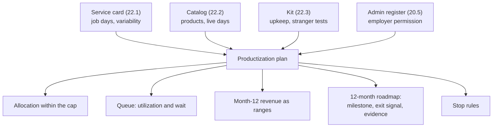

# 22.4 · Capacity-limited consulting and the productization plan

## Why it matters

This is the module's artifact and, for most students, the last document before the capstone: a plan for the next twelve months that says how many days you sell, what fills them, what earns money without them, and when you will stop something that is not working.

The source career path is explicit that the cap is the point. Private work "caps your revenue to your calendar", and the answer is not to remove the cap but to make it explicit, "a fixed number per month, gated by the application form", so that scarcity is "real, not performed" (20.1). The failure this lesson targets looks like success at first: a second and third retainer, a course launch, a waitlist. Then the calendar fills with retainer days that roll over, "quick questions" on call, a course that needs support, and a pilot that should have started two months ago. The job, which you still have, gets your evenings; the quality of the thing you are known for drops first.

You need three tools for that: an allocation that fits the cap with a buffer, retainers that are capped and expire, and a way to see how long a new client will wait at the utilization you are planning. The third is where a little queueing theory pays for itself.

> [!NOTE]
> Content tags. **Concept** (stable): capacity caps, allocation, capped retainers, utilization and waiting, revenue mix as ranges, exit signals and stop rules. **Implementation**: `ScaleCheck plan` and the example numbers (USD, as of 2026-09). Worker-status and employment points are **orientation only** (20.5).

## How it works

### The cap and the allocation

The cap is the number of days a month you can sell after your job, your family and your health, stated in the application form and kept (20.1). The allocation splits it:

| Activity | Why it needs days |
|---|---|
| Delivery | pilots and implementations from the service card (22.1) |
| Retainers | capped monthly upkeep for past clients |
| Workshops and kickoffs | live product days (22.2) |
| Products | course and kit upkeep, community office hours and moderation (22.2, 22.3) |
| Selling and content | discovery calls, proposals, public teaching (Modules 18, 20) |
| Admin | invoices, tax, contracts (20.5) |
| Buffer | overruns, sick days, the client whose data export is two weeks late |

The buffer is not waste. Without it, every overrun lands on your job or your evenings, and you are forced into the worst decision under pressure: cutting the measurement to save hours.

### Retainers that do not become debts

A retainer sells a slice of your month to one client. Four lines make it safe:

- **Day cap**: "1 day a month", never "as needed" or "on call".
- **Expiry**: unused days expire at month end, or roll over up to a stated maximum for a stated time. Days that roll over forever are a debt you owe: after six quiet months a client can ask for six days in one week.
- **Notice**: 30 days either way, so neither of you is trapped.
- **Scope**: what the days are for (eval reruns after model changes, rules and skills review, office hours), not "anything AI".

Price it at or above your floor per **capped** day, not per day used; the client is paying for your availability. One more orientation point: fixed hours a month, under a client's direction, for one client, starts to look like employment to tax authorities. The UK's off-payroll rules (IR35), for example, put that status question on the client for medium and large companies. A retainer defined by outcomes and your own tools is on firmer ground; ask your accountant (20.5).

### Why utilization matters more than it looks

*Intuition.* Treat your delivery days as a single server. Clients arrive at random; each pilot takes a chunk of your delivery days. When the server is busy, new clients wait. The wait does not grow in proportion to how busy you are; it explodes as you approach full.

*Equation.* Kingman's approximation for a single-server queue gives the expected wait before service starts:

$$W_q \approx \frac{\rho}{1-\rho}\cdot\frac{c_a^2 + c_s^2}{2}\cdot \tau$$

where $\rho$ is utilization (demand divided by capacity), $\tau$ the mean job length, $c_a$ the coefficient of variation of the time between arrivals (about 1 when clients arrive at random) and $c_s$ the coefficient of variation of job length.

*Tiny example.* The reference plan gives pilots 3.5 days a month; a pilot needs 10 of your days, so you can finish $3.5/10 = 0.35$ pilots a month and each takes $\tau = 2.9$ months of delivery allocation. At the high demand estimate of 0.25 pilots a month, $\rho = 0.25/0.35 = 0.71$ and $\rho/(1-\rho) = 2.5$. The productized service's $c_s$ is 0.16 (the CV of delivery hours from 22.1), so the variability factor is $(1 + 0.026)/2 = 0.51$ and

$$W_q \approx 2.5 \times 0.51 \times 2.9 \approx 3.7 \text{ months}.$$

Now the same demand with a bespoke service whose job lengths vary as much as arrivals ($c_s = 1$): the factor becomes 1 and the wait about 7.1 months. And at $\rho = 0.9$, $\rho/(1-\rho) = 9$: even the productized service would make clients wait over a year.

*Implementation.* `ScaleCheck plan` reads `Demand`, `Job days`, `Job variability` and `Arrival variability` from the plan and the Delivery row of the allocation, and prints utilization and the expected wait at low and high demand. At utilization of 100% or more there is no steady state: the queue grows until you decline work.

*Interpretation.* Two levers shorten waits: **lower utilization** (the cap plus the buffer, and declining or referring work when full) and **lower variability** (productizing: the same scope, the same steps, the same hours). The formula is an approximation for a steady stream of independent arrivals; your real numbers are small and lumpy. Use it for the shape, not the decimal: planning delivery at 90% busy is planning to make clients wait for months, which usually means planning to lose them.

### The plan



Month-12 revenue is a range per stream (low and high units times price), with the live days each needs, so you can see whether the high case even fits your cap. Every roadmap milestone has an **exit signal** with a number or a check ("4 or more seats sold in the first 30 days", "kit check clean"), not "grow the audience". And **stop rules** say, in advance, when a product that is not working stops, before sunk cost decides for you.

## Show me

The reference plan, [`productization-plan.md`](../../labs/module-22/solution/productization-plan.md), is the illustrative student's year 2: a full-time job, 8 days a month, one retainer, pilots, workshops, the course and the community from 22.2.

```bash
cd labs/module-22
dotnet run --project tools/ScaleCheck -- plan solution/productization-plan.md
```

```text
  delivery: 3.5 days a month, jobs of 10 days -> 0.35 jobs a month, 2.9 months each
  demand low 0.15/month: utilization 43%, expected wait to start 1.1 months (Kingman, cA 1.00, cS 0.16)
  demand high 0.25/month: utilization 71%, expected wait to start 3.7 months (Kingman, cA 1.00, cS 0.16)

  month 12 revenue: 4,845 to 23,920 a month; live days needed 1.5 to 5.25
  not tied to live days: 2,145 to 7,020 (44% to 29%)

  roadmap: 12 rows, up to month 12

0 error(s), 0 warning(s)
```

Read the plan's own lines against the output. The high-demand wait of 3.7 months is longer than the "When full" rule's 3 months, so at high demand some applicants will be referred to peers, and the plan says so. The month-12 range is wide (4,845 to 23,920 a month) because each stream is a range; the low case is mostly course seats and community. Scalable revenue is 29% to 44%: real, and not yet a reason to leave the job, which the plan's "What I will not do" section states along with no subcontracting (the Bound plan's stranger test is 5 of 6, 22.3) and no credential. The retainer is 1 day a month at 2,000, above the 1,500 floor, and unused days expire.

## Try it

Budget: about 90 minutes. This is the module's artifact.

1. **Cap (10 min).** Write your real capacity in days a month and the "When full" rule. Check it against your employer permission (20.5).
2. **Allocation (15 min).** Split the cap, including a buffer and product upkeep. Sum it.
3. **Retainers (15 min).** For each existing or planned retainer: cap, expiry, notice, scope, fee per capped day.
4. **Queue (10 min).** Estimate demand as a range from your applications, job days and job variability from your service card. Run the check and read the waits.
5. **Revenue and roadmap (30 min).** Month-12 streams as ranges; twelve months of milestones with exit signals and evidence files; at least three stop rules with numbers. Use the [productization plan template](../../templates/productization-plan.md).
6. **Check (10 min).** `plan` clean. Then read the "What I will not do" section to someone who will hold you to it.

<details>
<summary>Hint: I do not have enough applications to estimate demand</summary>

Use your funnel from Module 18 (how many readers became calls, how many calls became applications) and write a wide range. The point of the queue check is not the exact wait but whether your allocation can absorb the high case. If the high case gives utilization over 85%, change the allocation or the "When full" rule now, not when the third client is waiting.
</details>

## Break it

[`break/22.4-unlimited-retainers/productization-plan.md`](../../labs/module-22/break/22.4-unlimited-retainers/productization-plan.md): "The retainers are the backbone: clients get me on call, with same-day answers, and the course is passive income from month 3." Two retainers at 2 days a month for 2,000 with "unused days roll over indefinitely", a third "on call, same-day response" with no cap, an allocation of 9.5 days in an 8-day month with no buffer, demand of 0.4 to 0.6 pilots a month, 100 course seats as both the low and the high case, and a roadmap that ends at month 6 with "Quit the job".

```bash
dotnet run --project tools/ScaleCheck -- plan break/22.4-unlimited-retainers/productization-plan.md
```

Before running it: in which month does this plan break, and what breaks first?

## Fix it

**Diagnose.** `plan` reports 16 errors and 13 warnings:

- **Capacity**: 9.5 days allocated of 8, no buffer, no product days, no "When full" rule.
- **Retainers**: rollover forever on two, no notice on any, an uncapped on-call retainer, 4 committed days against 3 allocated, 1,000 per capped day against a 1,500 floor.
- **Queue**: utilization 120% even at low demand. There is no steady state: the queue of waiting clients grows every month.
- **Revenue**: point forecasts (low equals high) and a high case needing 12 live days in an 8-day month.
- **Roadmap**: six months, no exit signals with numbers, no evidence, no stop rules, and "passive income" with no upkeep days.

It breaks in month 1: the allocation does not fit the cap before the first client arrives. What breaks first in practice is the buffer that is not there, and then the measurement in the pilots.

**Modify.** Cut the retainers to one or two at 1 day a month each, with expiry, notice and a scope, priced above the floor. Replace on-call with office hours inside the cap. Add a buffer and product days; lower pilot demand to what the delivery allocation can hold, or plan to refer. Turn every forecast into a range, extend the roadmap to month 12 with measurable exit signals, and write stop rules. Delete "passive income" and "quit the job"; replace the latter with the review at month 12.

**Rerun.** `plan` clean. Then compute the wait at high demand yourself from the output and check it against your "When full" rule.

## How do I know it works?

- [ ] The allocation sums to no more than your cap and includes a buffer and product upkeep.
- [ ] Every retainer has a day cap, an expiry rule, a notice period, a scope and a fee at or above your floor per capped day.
- [ ] At your low demand estimate, delivery utilization is under about 85%, and you can state the expected wait at the high estimate and what the "When full" rule does then.
- [ ] Month-12 revenue is a range for every stream, and the high case fits your cap.
- [ ] The roadmap covers 12 months, each milestone with a measurable exit signal and an evidence file; the stop rules have numbers.
- [ ] `ScaleCheck plan` is clean.

## Use / don't use

**Use** the plan monthly: compare days used with the allocation, and apply the stop rules on the dates they name. **Use** the queue check before accepting a second retainer or a larger engagement; it shows what that commitment does to the next client's wait. **Use** the cap in public, in the application form, exactly as the source path suggests.

**Don't** sell on-call availability; it is uncapped work at a capped price. **Don't** let retainer days roll over without a limit. **Don't** plan delivery at 90% utilization, and **don't** count product revenue as "passive"; courses and communities have support, updates and moderation.

**Limitations.**

- Kingman's formula approximates a steady queue with independent arrivals and many jobs; a solo practice has few, lumpy ones. It is right about the shape (waits grow sharply near full utilization and with variability), not about the exact month.
- Twelve-month forecasts for new products are mostly guesses; the stop rules and exit signals are what make them safe.
- Employment and tax status of retainers depends on jurisdiction and facts; the IR35 note is one example, not a rule for you.

## Reflect

1. What is your real cap, and what did you give up to arrive at that number?
2. Which of your current commitments behaves like an uncapped retainer, and what would a capped version look like?
3. Which stop rule will be hardest to keep, and who will remind you on the date?

## Sources

- [Kingman (1961) — The single server queue in heavy traffic](https://doi.org/10.1017/S0305004100036094) — the heavy-traffic approximation for waiting time in a single-server queue, growing with $\rho/(1-\rho)$ and with the variability of arrivals and service.
- [GOV.UK — Understanding off-payroll working (IR35)](https://www.gov.uk/guidance/understanding-off-payroll-working-ir35) — medium and large clients decide the worker's employment status for tax; an example of why a retainer's shape matters beyond price.
